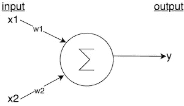
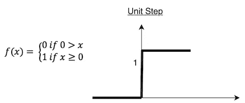
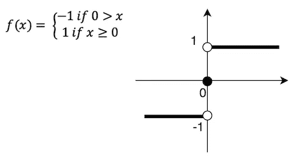
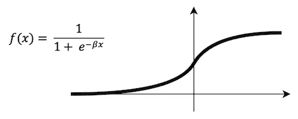
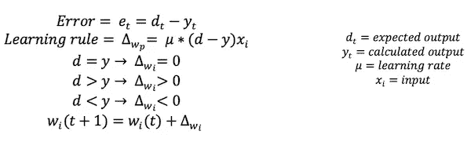
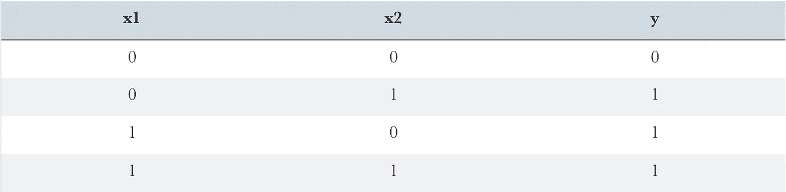
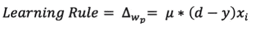
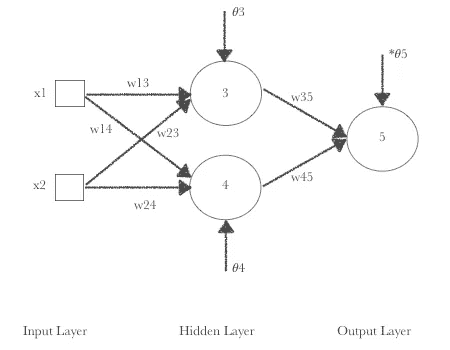
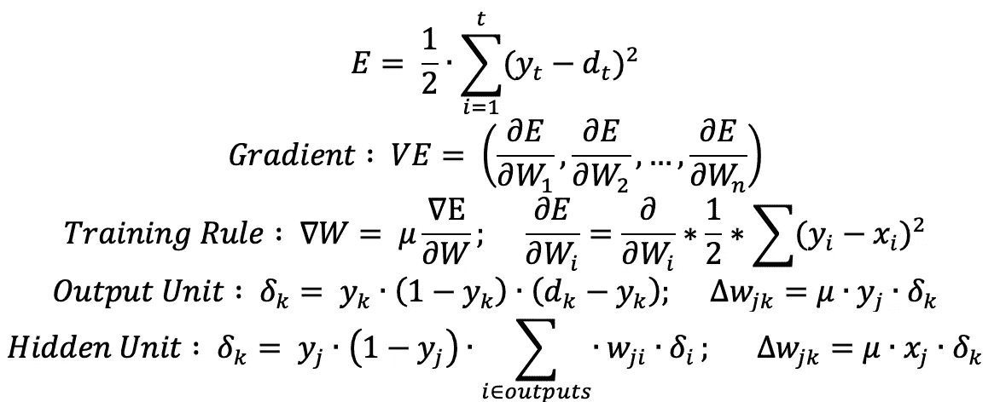
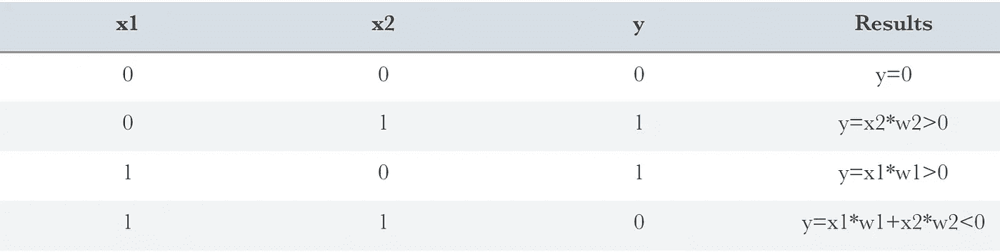

# 机器学习 101 —人工神经网络

> 原文：<https://towardsdatascience.com/machine-learning-101-artificial-neural-networks-3-46ccb04cba30?source=collection_archive---------20----------------------->

## 这篇文章旨在解释一般的人工神经网络，尤其是计算。

[https://pixabay.com/images/id-1343877/](https://pixabay.com/images/id-1343877/)

# 人工神经网络

关于人工神经网络(ANN ),你首先要了解的是，它来自于对大脑建模的想法。因此，我们在人工神经网络中使用的术语与神经网络密切相关，只是略有变化。

*   神经元在人工智能中也被称为神经元，
*   但是树突被称为输入，
*   轴突被称为输出，
*   最后，突触被称为重量

一开始，学习这些术语就足够了。

# 单层感知器

单层感知器是人工神经网络的原始版本。人工神经网络的灵感来自生物神经回路的功能[ [1](https://www.tutorialspoint.com/tensorflow/tensorflow_single_layer_perceptron.htm) ]，所以单层感知器自然是神经回路的代表。这个神经回路是一个神经元，其输入具有相应的权重，并作为计算的输出输出。

**图 1** 具有两个输入和一个输出的单层感知器的表示

图 2 单层感知器的一般方程

在单层感知器中，x 代表输入，w 代表权重，θ代表阈值。

**图 3** 根据图 1 表示的计算

我试图尽可能基本地解释单层感知器的方程。过了这一点就更复杂了。y 的输出值是根据函数类型构造的。就功能而言，有许多类型，但在开始时，3 种就足够了。

## 1.阶跃函数

根据输入的值，输出将是 0 或 1。

## 2.符号函数

## 3.Sigmoid 函数

在这种方法中，感知器的作用就像一个线性回归模型。sigmoid 函数将这些值归一化到[0，1]的范围内，以便负值在 0 附近缩放，正值在 1 附近缩放。因此，您不需要处理可能导致计算错误的负值或非常大的数字。

## 单层感知器训练

1.  输入和相关的输出值被提供给模型。丁:
2.  所有的权重值都是以一定的方式定义的，在这一点上我们说随机在[-0.5，0.5]的范围内。
3.  根据这些值计算输出，并计算误差以进行比较。学习率(0

**图 4** 训练单层感知器的方程式

4.通过改变权重值，根据阈值来校正误差。

5.从步骤 3 继续到下一个纪元。

**例 1:** 我们用阶跃函数把 OR 运算映射到单层感知器。

下表列出了可能的输入和输出:

**可接受的默认值:**𝜃= 0.02；𝜇=0.1 ;w1 = 0.3w2=-0.1

***第一纪元:***

y = x1*w1 + x2*w2-𝜃

y1 = 0.3 * 0+(-0.1)* 0–0.02 =-0.02-0.02<0 → y1 = 0

y2 = 0.3*0 + (-0.1)*1–0.02 = -0.12 -0.12<0 → y2 = 0

y3 = 0.3*1 + (-0.1)*0–0.02 = 0.28 0.28>0→y3 = 1

y4 = 0.3 * 1+(-0.1)* 1–0.02 = 0.18 0.18 > 0→y4 = 1

y3 和 y4 的计算输出和预期输出不同。所以我们需要相应地计算学习率和新的权重。

δw11 = 0.1 *(0–0)* 0 = 0

δw21 = 0.1 *(0–0)* 0 = 0

δw13 = 0；δw23 = 0；δw14 = 0；w24 = 0

δw13 = 0.1 *(1–0)* 0 = 0；δw23 = 0.1 *(1–0)* 1 = 0.1

最新的重量值计算如下:

w13 ' = w13+δw13

w13' = 0.3 + 0 = 0.3

w23 ' = w23+δw23

w23' =(-0.1) + 0.1 = 0

***第二纪元:***

再次计算输出；

y1 = 0.3 * 0+0 * 0-0.02 =-0.02<0 → y1 = 0

y2 = 0.3*0 + 0*1 -0.02 = -0.02 <0 → y2 = 0

y3 = 0.3*1 + 0*0 -0.02 = 0.28 >0→y3 = 1

y4 = 0.3*1 + 0*1 -0.02 = 0.28 > 0 → y4 = 1

δw11 = 0；δw21 = 0；δw13 = 0；δw23 = 0；δw14 = 0；w24 = 0

δw13 = 0.1 *(1–0)* 0 = 0→w13 ' = 0+0.3 = 0.3

δw23 = 0.1 *(1–0)* 1 = 0.1→w24 ' = 0.1+0 = 0.1

仍然无法达到正确的重量值。所以我们仍然需要调整。

***第三纪元:***

y1 = 0.3 * 0+0.1 * 0-0.02 =-0.02<0 → y1 = 0

y2 = 0.3*0 + 0.1*1 -0.02 = 0.08 >0→y2 = 1

y3 = 0.3 * 1+0.1 * 0-0.02 = 0.28 > 0→y3 = 1

y4 = 0.3 * 1+0.1 * 1-0.02 =-0.38 > 0→y4 = 1

δw11 = 0；δw21 = 0；δw12 = 0；δw22 = 0；

δw13 = 0；δw23 = 0；δw14 = 0；w24 = 0

似乎我们找到了正确的重量值。这就是单层感知器的工作原理。理解模型是非常必要的，因为更复杂的模型是基于单层感知器的。

# 多层感知器

用单层感知器解决 OR 运算就足够了，但是当涉及到 XOR 运算时，事情已经开始发生变化，因为单层感知器本身不足以解决问题。因此，多层感知器(MLP)的想法刚刚出现。如图 5 所示，多层感知器由三层组成:输入层、隐藏层和输出层。

**图 5** 多层感知器的示意图

此外，MLP 是深度学习的一个良好开端。它被称为深度人工神经网络，但当然没有卷积神经网络那么深。

## 反向传播

在 MLP，属于一个层的每个计算都被接受为下一层的输出。反向传播看起来非常复杂，但其实不然。计算误差时，通过反向计算重新排列权重。

> 在反向传递中，使用反向传播和微积分的链式法则，误差函数的偏导数通过 MLP 反向传播各种权重和偏差。这种微分行为给了我们一个梯度，或者说一幅误差图，沿着这个梯度，当 MLP 向误差最小值靠近一步时，参数可以被调整。这可以通过任何基于梯度的优化算法来实现，例如随机梯度下降。网络继续打网球，直到错误不能再低。这种状态被称为收敛[ [2](https://pathmind.com/wiki/multilayer-perceptron) ]。

**图 6** E 表示 y 和 d 之间的欧氏距离，y_t 表示样本 t 的误差

**示例 2:** 让我们通过使用阶跃函数来映射具有多层感知器的 XOR 运算。

下表列出了可能的输入和输出:

当您检查*结果列*时，您将意识到这两个等式都是 y = x2*w2 和 y=x1*w1 **大于 0，但这是不可能的，因为 x1 和 x2 是输入，对于 XOR 运算，它们中的任何一个都应该等于**0。此外，根据*结果栏*中的等式，y=x1*w1 + x2*w2 **小于 0**，但这也是不可能的。因此，在这种情况下，单层感知器不能作为方程的解，建议使用多层感知器来寻找解。****

w13 = 0.5

w23 = 0.4

w35 = -1.2

w14 = 0.9

w24 = 1 w45 = 1.1

𝜃3 = 0.8 𝜃4 = -0.1 𝜃5 = 0.3

𝜇 = 0.1

让我们接受上述值作为开始。在 XOR 运算中，当 x1=x2=0 时，y 将等于 y=0。由于这些值是连续的，我们可以使用 sigmoid 函数。

y3 = sigmoid(x1*w13+x2*w23-𝜃3)

= 1/(1+e-(0.5 * 1+1 * 0.4-1 * 0.8))=**0.525**

y4 =sigmoid(x1*w14+x2*w24-𝜃4)=**0.881**

y5 = sigmoid(y3*w35+y4*w45-𝜃3)

= 1/(1+e-(0.525 *(1.2)+0.88 * 1.1–0.3))=**0.51**->**实际输出**

误差=ɛ=(0–0.51)=-0.51

**输出层:**

𝜍5 = y5 *(1-y5)*ɛ= 0.5097 *(1–0.5097)*(-0.5097)≠**-0.13**

δw35 =𝜍5*y3*𝜇=-0.12 * 0.525 * 0.1 =**-0.0068；**

δw45 =𝜍5*y4*𝜇=-0.12 * 0.88 * 0.1 =**-0.012**

w35 ' =-0.0068+(-0.12)=**-1，2068**

w45' = (-0，12)+1.1 = **1.088**

**隐藏层:**

𝜍3 = y3 *(1-y3)* 𝜍5*w35 = > δw23=𝜇*x2*𝜍3；δw13=𝜇*x1*𝜍3

𝜍3 = 0.53 *(1–0.53)*-0.13 *(1.2)=**0.0389**

δw23 = 0.039 * 1 * 0.1 =**0.0039**；δw13 = 0.039 * 1 * 0，1 = **0.0039**

w23 ' = 0.0039+0.4 =**0.4039**；w13'=0.0039+0.5= **0.5039**

𝜍4 = y4 *(1-y4)* 𝜍5*w45 = > δw24=𝜇*x2*𝜍4；δw14=𝜇*x1*𝜍4

𝜍4 = 0.0881 *(1–0.0881)*(-0.13)* 1.1 =**-0.015**

δw24 =-0.015 * 1 * 0.1 =**-0.0015；**δw14 =-0.015 * 1 * 0.1 =**-0.0015**

w24 ' =-0.0015+1 =**0.985**；w14 ' =-0.0015+0.9 =**0.8985**

***新更新权重:***

w14 =-0.0015；w24 = 0.8985w13 = 0.5039w23 = 0.4039w45 = 1.088w35=1.2068

我们正在计算每一个权重，直到找到正确的结果。隐层应该有多少个神经元，网络应该有多少个隐层，这是一个应该由这个网络的设计师来回答的问题。最大值经典人工神经网络的隐含层数为 3。

## 重量更新

***1。增量模式***

每次训练后计算新的重量

***2。批处理模式***

**动量:**该项连接 t 和(t-1)时刻之间的变化。它主要用于敏感。

# 结论

人工神经网络(ANN)是深度学习的良好开端。在这篇文章中，我打算解释人工神经网络的类型和基本计算，以调整它们的核心权重值。

## 参考资料:

1.  Tensorflow 单层感知器，[https://www . tutorialspoint . com/tensor flow/tensor flow _ Single _ Layer _ Perceptron . htm](https://www.tutorialspoint.com/tensorflow/tensorflow_single_layer_perceptron.htm)
2.  多层感知器，[https://pathmind.com/wiki/multilayer-perceptron](https://pathmind.com/wiki/multilayer-perceptron)