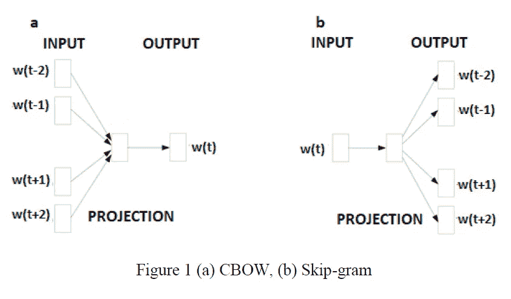
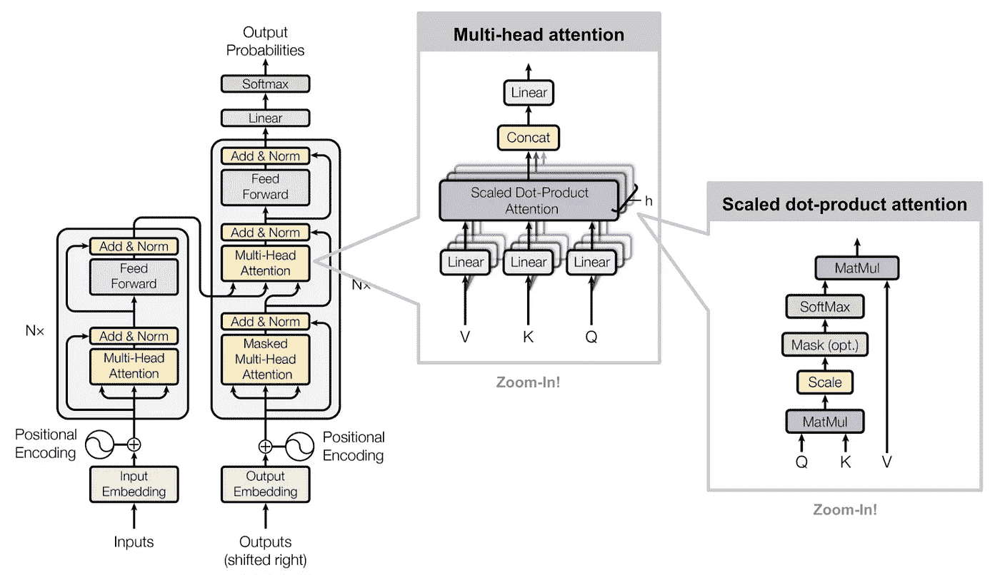

# 阿拉伯语自然语言处理中的机器学习进展

> 原文：<https://towardsdatascience.com/machine-learning-advancements-in-arabic-nlp-c6982b2f602b?source=collection_archive---------18----------------------->

## 讨论社交媒体文本的阿拉伯语自然语言处理(NLP ),包括代码示例和对推动最新发展的尖端技术的深入分析。

来自关于贝鲁特爆炸(2020 年 8 月)的推文的多语言单词云。图片作者。

自然语言处理(NLP)不是一门新学科；它的起源可以追溯到 17 世纪，当时笛卡尔和莱布尼茨等哲学家提出了语言的理论代码。在过去的十年里，这一漫长历史的结果导致了 NLP 以 Siri 和 Alexa 这样的数字助理的形式融入到我们自己的家中。尽管机器学习极大地促进了英语自然语言处理技术的发展，但其他语言的自然语言处理研究却一直滞后。

# 为什么要学习阿拉伯语社交媒体？

作为遍布中东北非地区 22 个国家的官方语言，[阿拉伯语是互联网上第四大常用语言](https://www.sciencedirect.com/science/article/pii/S1319157818310553#b0155)。【2018 年的统计数据显示，中东有 1.64 亿互联网用户，北非有 1.21 亿互联网用户。

中东北非地区地图。【researchgate.net 图片来源于

阿拉伯语作为一种语言，形态复杂，方言多样。当考虑到社交媒体文本的非正式性质以及现代标准阿拉伯语(MSA)和辩证阿拉伯语(DA)之间的区别时，复杂性显著增加。MSA 用于正式写作，DA 用于非正式的日常交流；然而，这两种形式都出现在社交媒体上，后者是最常见的形式。

更复杂的是，埃及有许多方言，例如埃及方言不同于巴勒斯坦、约旦、叙利亚、黎巴嫩和以色列使用的黎凡特方言。这两种方言也不同于科威特、巴林、卡塔尔和阿拉伯联合酋长国使用的海湾方言。[在 2019 年 5 月的一篇论文中](https://dl.acm.org/doi/10.1145/3314941)研究人员评论说，阿拉伯语的屈折和衍生性质使得对阿拉伯语的单音分析更加困难。简单地说，由于英语和阿拉伯语之间的差异，英语 NLP 的进步不容易转移到阿拉伯语 NLP 资源的开发。此外，在应用复杂的英语 NLP 方法之前，不能依赖粗糙的阿拉伯语到英语的翻译作为充分的预处理；翻译中损失了很多。

尽管有这些挑战，过去的四年是富有成效的，在情感分析和机器翻译等领域的阿拉伯语 NLP 研究已经产生了非常有用的资源。我的重点是阿拉伯语社交媒体，因为这些平台在中东和北非地区的民主发展中发挥了重要作用。此外，在我看来，社交媒体文本是最容易获得的数据形式，可以用来研究这个通常难以理解的领域。

这将是关于阿拉伯语 NLP 的三部分系列的第一部分。在这篇文章中，我将重点介绍我在研究中使用的两个最有效和最容易使用的工具: [**【阿拉维】**](https://github.com/bakrianoo/aravec) 和 [**阿拉伯特**](https://github.com/aub-mind/arabert) 。熟悉当前英语自然语言处理研究趋势的人会注意到这些名字和流行的英语自然语言处理工具 Word2Vec 和 BERT 之间的相似之处。对于英语自然语言处理资源的初学者友好概述，请查看我之前关于使用 Python 进行*情感分析的帖子*，在那里我详细讨论了 Word2Vec 和 BERT。

 [## 基于 Python 的社交媒体情感分析

### Python 工具的初学者友好概述，可用于对社交媒体文本中的情感进行分类。我讨论我的…

towardsdatascience.com](/sentiment-analysis-of-social-media-with-python-45268dc8f23f) 

# 阿拉伯语单词嵌入

当托马斯·米科洛夫(Tomas Mikolov)领导的谷歌团队在 2013 年发布具有影响力的 Word2Vec 时，单词嵌入的使用在各种各样的自然语言处理任务中变得流行，实现了最先进的准确度分数，从而彻底改变了该领域。使用单词嵌入，单词被表示为连续空间中的向量。嵌入捕捉单词之间的句法和语义关系。我推荐 Jay Alammar 的这本图文并茂的单词嵌入指南，它很好地介绍了这种方法背后的理论。

2017 年，单词嵌入被改编为阿拉伯语 as AraVec，这是一个预训练的分布式单词表示(单词嵌入)开源项目，由[索利曼等人在 2017 年的一篇论文中介绍。](https://www.sciencedirect.com/science/article/pii/S1877050917321749)目前，AraVec 的第三个版本提供了 16 个不同的单词嵌入模型，构建在两个不同的阿拉伯语内容域之上；Twitter 和维基百科的阿拉伯文文章。在当前版本中，有两种不同类型的模型，一元模型和多元模型。嵌入可以在浅层神经网络中训练，或者用作深度学习模型架构中的嵌入层。尽管训练时间较长，但我通常倾向于后者，因为它通常会导致更高的准确性。

在原始论文中，陈述了用于构建第一迭代模型的令牌总数总计超过 3，300，000，000 个令牌。对于最初的 Twitter 嵌入，研究人员收集了 2008 年至 2016 年间发布的超过 77，600，000 条阿拉伯语推文，这些推文是从不同的随机地理位置获得的(以考虑各种方言)。阿拉伯字符的预处理包括去除音调符号，音调符号是字母上方、下方、中间或上面的标记，目的是为了标准化。例如，将字母“ **ة** ”替换为“ **ه** ”，将字母“ **أ** ”、“ **إ** ”、“ **آ** ”替换为“ **ا** ”。

AraVec 模型是使用由 Radim Rehurek 开发的 Python 库 [Gensim 构建的，该库还包含原始 Word2Vec 模型的实现。在最初的 Word2Vec 论文中，Mikolov 和他的团队提出了两种不同的模型架构，用于在多维向量空间中表示单词:连续词袋(CBOW)模型和 skip-gram 模型。CBOW 模型通过预测序列中的中心词来学习嵌入，给定该序列中的其他词，而不考虑它们在句子中的顺序。skip-gram 模型与 CBOW 模型相反，因为它的目标是在给定中心单词的情况下预测周围的上下文单词。下图显示了这两种模型架构之间的差异。](https://radimrehurek.com/gensim/index.html)

CBOW 和 Skip-gram 模型架构。图片来自: [**AraVec:一套阿拉伯语单词嵌入模型，用于阿拉伯语 NLP**](https://www.sciencedirect.com/science/article/pii/S1877050917321749)

与 skip-gram 模型相比，CBOW 模型的优点是速度更快，并且对于频繁出现的单词具有更高的准确性。但是，当训练数据集较小时，skip-gram 模型体系结构提供了更高的准确性，此外还能更好地处理罕见的单词。我试验了两个 AraVec n-gram 模型，Twitter-CBOW 和 Twitter-SkipGram，两个模型都与 Gensim 和 Python NLP 库 spaCy 和 NLTK 结合使用。

首先，我需要用前面提到的标准化预处理步骤清理我的阿拉伯文本。下面的代码片段显示了我使用的函数，改编自 AraVec 项目的存储库。

接下来，我加载 AraVec，将其导出为 Word2Vec 格式，然后使用 AraVec 向量初始化 spaCy 模型。下面的代码片段概述了这个过程。

最后，我使用 spaCy 模型创建了一个围绕预处理步骤的标记器，将原始的阿拉伯语社交媒体文本转换为单词嵌入。

我用各种深度学习模型测试了 AraVec 嵌入，根据当前的研究趋势，我最成功的模型是双向长短期记忆网络[(双 LSTM](https://medium.com/@raghavaggarwal0089/bi-lstm-bc3d68da8bd0) )。

AraVec 和其他单词嵌入的主要缺点是，它们为单词提供了单一的表示，无论上下文如何，该表示都是相同的。因此，诸如“bank”之类的单词根据上下文可能具有不同的含义(例如，“river bank”或“investment bank”)，具有表示不同上下文的平均值的合成向量，从而不能准确地表示单词“bank”的任一含义。这个问题在阿拉伯语中也是一个令人关切的问题，特别是当非正式的阿拉伯俚语根据上下文或地区可能有不同的含义时。这个缺陷导致我发现了 AraBERT 模型，这是 2020 年 2 月发布的 transformer 架构的一个实现。

# 变形金刚(电影名)

我认为，过去几年中最有影响力的 NLP 论文是 2017 年的论文“*注意力是你所需要的”*，作者[瓦斯瓦尼等人](https://arxiv.org/abs/1706.03762)，该论文介绍了变压器架构。我推荐哈佛大学 NLP 研究小组的[注释转换器，以获得对这篇重要论文的全面解释，其中包括以笔记本格式呈现的代码注释。](https://nlp.seas.harvard.edu/2018/04/03/attention.html)

在 Transformer 模型创建之前，最先进的 NLP 方法涉及使用单词嵌入和卷积或递归神经网络，这些网络与注意力机制一起使用，如 [LSTM 或 GRU](/illustrated-guide-to-lstms-and-gru-s-a-step-by-step-explanation-44e9eb85bf21) 。注意机制作为一种缓解消失梯度问题的方法是很重要的，它通过关注输入序列中与每个输出序列最相关的部分来实现。这是通过保持自回归特性来实现的，以便预测未来的能力得到过去位置环境的知识的帮助。

为了捕获位置信息，递归模型生成一系列隐藏状态，这些隐藏状态是作为前一个隐藏状态的函数结合特定位置的输入来计算的，从而形成一个循环。这种循环顺序的性质使得并行化变得困难，这个问题可以通过卷积网络来解决，卷积网络可以并行计算所有输入和输出位置的所有隐藏状态。然而，卷积使得学习长距离依赖性更加困难，困难由最大路径长度决定。重要的是,《变形金刚》引入了一种使用注意力机制的方法，这种方法不会出现重复或回旋。这允许并行化，大大加快了培训时间。

如下图所示，转换器架构包括一个编码器和解码器堆栈，每个堆栈都有多个层，每个层又有子层(每个编码器层 2 个，每个解码器层 3 个)，其中一个是前馈网络(非循环)。由于转换器模型不包含考虑位置的递归或卷积，所以位置编码被添加到输入嵌入中。编码表示序列中标记的相对或绝对位置。这是通过对应于正弦函数的位置编码的每个维度来实现的，该正弦函数允许模型容易地关注相对位置。此外，为了求和，位置编码的维数与输入和输出嵌入相同。

*[*李连翁*](https://lilianweng.github.io/lil-log/2018/06/24/attention-attention.html) *放大的变压器架构图；归功于* [*瓦斯瓦尼等人 2017*](http://papers.nips.cc/paper/7181-attention-is-all-you-need.pdf) *。**

*为了解决路径长度的问题，转换器还利用对编码器堆栈输出的多头关注来更好地学习长距离依赖性。具体而言，多头关注允许模型通过对查询、键和值矩阵进行线性投影来并行执行关注，然后对其进行连接和线性投影以获得最终关注值。多头注意力的重要性在于允许模型在不同位置共同注意来自不同子空间的信息。作为一个完全依赖自我注意力来计算输入和输出序列的表示(嵌入)的转导模型，transformer 证明了，正如标题所述，注意力是你所需要的全部。*

*如上所述，单词嵌入的主要缺点是缺少由表示捕获的上下文信息。谷歌人工智能语言团队的研究人员在 2019 年开发了 [BERT，进一步推进了 transformer 架构。BERT 代表来自变压器的双向编码器表示。BERT 的主要概念是通过联合调节所有层中的左右上下文来预训练来自未标记文本的双向表示。这意味着，预训练的 BERT 模型可以用下游任务的标记数据进行微调，以获得最先进的准确度分数。预训练包括两个无监督的学习任务。第一个是受](https://arxiv.org/abs/1810.04805)[完形填空](https://en.wikipedia.org/wiki/Cloze_test)启发的掩蔽语言模型(MLM)目标，第二个是下一个句子预测(NSP)任务，允许模型学习句子关系。重要的是要注意这些模型的大小，基本的 BERT 模型是 1.1 亿个参数，大模型是 3.4 亿个参数。这意味着使用阿拉伯语 NLP 的 transformer 架构需要构建一个类似的大型语言模型；这在计算和金钱上都是昂贵的。*

# *阿拉伯特:阿拉伯变压器*

*阿拉伯特于今年早些时候发布，由阿尔的[安托恩在一篇论文中介绍。2020.](https://arxiv.org/abs/2003.00104v3)这个预先训练的阿拉伯语模型是使用 BERT 开发的，拥有 1.1 亿个参数，反映了基本的 BERT 模型。按照伯特论文中概述的程序，阿拉伯特的预训练设置包括 MLM 和 NSP 的两项无人监督的任务。预训练数据达到 24GB(大约 7 亿个句子)，标记化产生了 64K 个单词的词汇量，这些单词来自于诸如[15 亿个单词的阿拉伯语语料库](https://arxiv.org/abs/1611.04033)和 [OSIAN:包含 350 万篇文章的开源国际阿拉伯语新闻语料库](https://www.aclweb.org/anthology/W19-4619/)之类的来源。*

*针对 AraBERT 的 Github 存储库包含了如何使用该模型的示例；有 Tensorflow 和 Pytorch 这两个最流行的 Python 机器学习框架的 Colab 笔记本，也有 Python 库拥抱人脸变形金刚的笔记本。我更喜欢使用 Python 库 Hugging Face transformers 来测试新的预训练模型，因为它简单且易于实现。这些例子展示了针对情感分类对[阿拉伯语约旦语通用推文(AJGT)语料库](https://github.com/komari6/Arabic-twitter-corpus-AJGT)的微调。AJGT 数据集由 1800 条 MSA 或约旦方言的推文组成，标注为正面或负面。*

*为了更好地适应阿拉伯语，作者在模型的预训练之前引入了额外的预处理步骤。在论文中，他们指出，阿拉伯语以词汇稀疏著称，这意味着单词可以有不同的形式，但意义相同，这主要是由于该语言复杂的连接系统。为了解决这个问题，他们利用 Farasa，“*一个快速和激烈的阿拉伯语切分器*”，将单词分为词干、前缀和后缀。使用包含 Fararsa 分割器的 AraBERT 版本，在 AJGT 上的微调实现了 93.8%的二进制分类精度。*

*在下面列出所需导入的代码片段中，我导入了 Farasa 分段器来预处理阿拉伯文本。*

*预处理和准备用于训练的数据集只需要几行就可以创建分割器、应用预处理并分割用于训练的数据集。*

*下一步是设置用拥抱脸变形金刚训练器训练模型所需的组件。首先，需要初始化配置、标记器和模型。然后将用于单句分类的拥抱人脸数据处理器应用于训练和测试数据集。最后，使用最大序列长度设置为 128 的记号化器创建要素。*

*为了在训练期间访问所有定制选项，Hugging Face 建议在实例化训练器之前创建[训练参数](https://huggingface.co/transformers/main_classes/trainer.html#transformers.TrainingArguments)。我使用了 AraBERT 的创建者定义的训练参数。*

*实例化之前的最后一部分是创建一个定制函数，使用 Python 库 SciKit-Learn 来计算指标，这个库是在前面用必要的子模块导入的。*

*剩下的工作就是实例化训练器并开始训练，只需下面两行代码就可以完成。*

*下表摘自 AraBERT 论文，显示了他们的模型在各种阿拉伯语 NLP 基准数据集上的卓越性能，并与多语言 BERT (mBERT)的性能和之前的一流记录进行了比较。*

**

*表格来自: [**AraBERT:基于变压器的阿拉伯语理解模型**](https://arxiv.org/abs/2003.00104v3)*

# *研究潜力*

*讨论的两个阿拉伯语 NLP 工具 AraVec 和 AraBERT 是研究阿拉伯语社交媒体的极好起点。特别是，AraBERT 在广泛的 NLP 任务中有许多可能的用途，只受到用于微调的标记数据集的可用性的限制。应用可以包括创造性地使用文本分类或命名实体识别、情感分析、主题标记或检测工具。另一种选择是使用多任务学习(MTL)来同时学习多个 NLP 任务。*

# *文本分类*

*例如，对识别社交媒体上的医疗错误信息的任务模型进行微调将是有趣的，特别是因为新冠肺炎疫情继续在中东和北非地区产生破坏性影响。通过同样的措施，可以利用一般的谣言检测分类器来调查谣言的发展，为打击有害的假新闻提供机会。跟踪工具是另一种可能性；可以过滤社交媒体文本，以跟踪与政治动荡、抗议或不满有关的趋势。另一个潜在用途是训练一个分类器，通过实时跟踪 Twitter 并标记可能的侵权行为进行调查，来检测侵犯人权行为。*

# *命名实体识别*

*命名实体识别(NER)是一个 NLP 子任务，用于通过提取符合预定义类别(如名称、组织、位置、货币价值或其他实体)的信息来定位和分类非结构化文本中提到的命名实体。目前，还没有出于研究目的将 NER 应用于阿拉伯文本的详细研究。然而，将 NER 应用于阿拉伯媒体，如博客帖子或新闻文章，通过确定可用文本中的主题和主题来展现内容并洞察趋势，将是一项值得努力的工作。*

*事实证明，AraBERT 擅长 NER，它在[阿拉伯语 NER 语料库(ANERcorp)](https://link.springer.com/chapter/10.1007/978-3-540-70939-8_13) 上的得分高于之前以宏观 F1 分数衡量的最先进记录。截至 2020 年 9 月，当前更新版本的 AraBERT 在 ANERcorp 数据集上的宏观 F1 分数比最初公布的分数提高了 4.5%。这是通过进一步预处理 ANERcorp 训练数据集实现的，这是一种用于提高准确性的技术，可以应用于其他任务。*

# *多任务学习*

*作为一种学习范式，MTL 依赖于[归纳知识转移](https://link.springer.com/article/10.1023/A:1007379606734)，假设学习任务之间存在共性。受人类在相关任务之间传递重要学习信息的能力的启发，用 MTL 开发的模型具有需要较少标记数据的优势。更重要的是，他们能够利用来自相关任务的共享信息。这意味着有可能通过将两个独立但相关的任务(例如情感分析和谣言检测)耦合来提高它们的分类准确度。在过去的三年里，由于在深度学习领域取得的成绩， [MTL 迅速走红](https://arxiv.org/abs/1706.05098)；然而，很少有研究将这种方法应用于具体的研究问题。*

# *最后的想法*

*目前，我对阿拉伯语 NLP 的主要兴趣是应用数据科学；如何利用这些非凡的工具，并将它们应用于实际的研究问题。为此，我将继续开发我目前使用的工具，在搜索这项技术的创造性应用的同时，与当前的文献保持同步。在这个由三部分组成的系列的下一部分中，我将详细介绍我将 Apache Spark 等大数据工具集成到我的阿拉伯语 NLP 工作流中的实验。在最后一篇教程中，我将详细演示我自己在阿拉伯语自然语言处理中实现 MTL 的方法。*