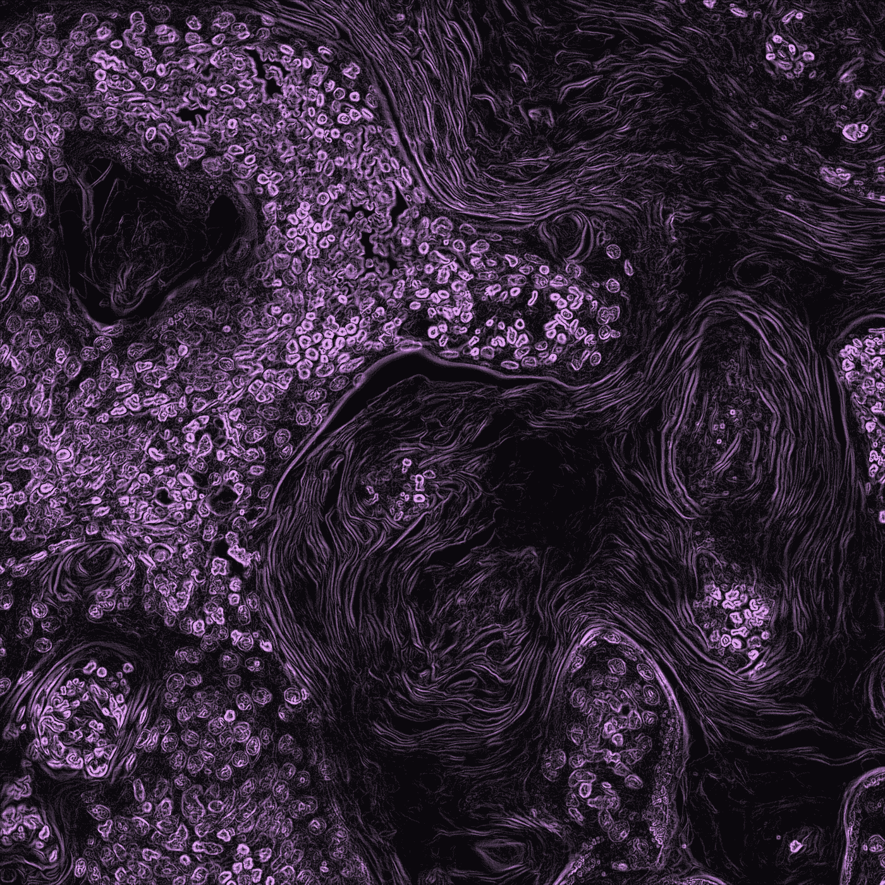
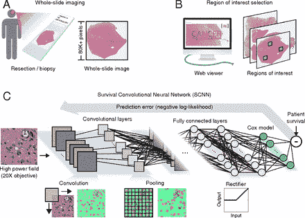

# 肿瘤学中的机器学习导论

> 原文：<https://towardsdatascience.com/machine-learning-ai-applications-in-oncology-73a8963c4735?source=collection_archive---------44----------------------->

## [内部 AI](https://towardsdatascience.com/tagged/inside-ai)

## 人工智能在癌症治疗和研究中的前景

肿瘤学的最新进展为癌症治疗和长期缓解带来了令人兴奋的选择。然而，高效和有效的诊断仍然是大多数癌症及时治疗的障碍。良好的预后取决于早期发现，但在许多情况下，患者直到出现相关症状时才意识到自己的癌症。病理学家需要更强大的工具来增强他们快速正确识别可能的癌症的能力。

[国立癌症研究所](https://unsplash.com/@nci)在 [Unsplash](https://unsplash.com/photos/zoFbfT0M_BU) 上拍摄的照片

## 人工智能模型的潜力和挑战

人工智能的发展有可能彻底改变数据收集、图像处理和后续诊断的过程。机器学习(ML)和深度学习是人工智能的分支，专注于识别数据中的模式，并开发模型来准确预测新信息的结果。医疗领域对 ML 模型提出了独特的挑战。由于医院过时的系统或不愿意共享数据，许多数据，尤其是来自电子健康记录(EHR)的数据未分类、稀疏或不可用。此外，表现不佳的模型的影响是深远的，对患者来说可能是灾难性的。最后，癌症及其可能的治疗方法的极端复杂性，使其本身成为高度特异和孤立的 ML 模型。例如，使用循环 miRNAs 的谱来检测癌症的模型灵敏度低，并且不能区分良性和恶性肿瘤(2)。这表明在组织和癌症类型之间共享模型和见解可能是困难的。

机器学习模型可以使用三种风格之一来理解输入的数据。监督学习是最直接的方式。已标注的输入被输入到模型中，该模型使用隐藏的要素和权重图层来了解输入的哪些变换正确地映射到标注。因为输入是预先标记的，所以可以测量模型的准确性并改进模型。一旦训练完成，模型就可以接触新数据进行预测。无监督学习没有这些用户定义的标签，模型必须发现输入的特征才能映射到输出。这种方法需要较少的人为干预，无论是正面的还是负面的，因为模型可能很难识别模式，或者它可以使用几乎没有真正预测能力的任意特征。半监督学习利用预先标记和未标记数据的子集。这是最接近人类病理学家如何决定诊断的方法，因为他们可以访问标记的数据，如肿瘤宽度或密度，以及未标记的数据，如以前的记录。特征选择和提取是开发成功模型的一个关键的、人力劳动密集型的部分，将在后面的文章中讨论。

来自[【5】](https://www.pnas.org/content/115/13/E2970):用于从组织学数据预测癌症存活的示意性 CNN 模型。根据 [CC BY-NC-ND 4.0](https://creativecommons.org/licenses/by-nc-nd/4.0/) 许可

## 人工智能在生物医学领域的应用

下一代测序(NGS)和高通量技术(HTTs)的进步带来了多 OMIC 数据的爆炸，使得研究人员和临床医生更容易获得基因组和蛋白质组数据(2)。例如，分子生物标记已被证明对预测癌症非常有效，因为某些标记，如 PD-L1 和 CTLA-4，在癌细胞中过度表达。这些数据还可以帮助临床医生区分相同癌症的亚组，并实现个体化治疗。如果 CNN 模型可以被训练来从染色的组织样本中识别这些标记，它可以导致常规、廉价和有效的筛查，而无需临床医生的特别护理。

临床数据，例如笔记、医学成像和活体生理监测，非常适合通过 ML 模型进行分析和预测。这种类型的数据需要大量的功能工程才能成功，因为患者数据是高度异构的，不容易应用到新的环境中。正如王和 Preininger 猜测的那样，深度学习模型(DL)可能会通过创建自己的特征来提供解决方案。这将有助于开发更可靠、更准确的预测和更个性化的治疗(3)。例如，德法乌等人开发的框架要求结合使用两个模型，其中第一个 DL 模型分析并选择特征，然后馈送到第二个卷积神经网络(CNN)，该网络实际预测可能的诊断(4)。

患者结果模型在估计存活率和癌症缓解方面也取得了一些成功。一个这样的人工神经网络模型在预测非小细胞肺癌(NSCLC)的癌症存活率方面达到了 83%的准确度。然而，正如许多这些模型的情况一样，它不适用于其他癌症类型。这是因为几个 NSCLC 特异性基因及其表达被用作模型中的特征。由于癌症载体的多样性和特定基因在预测不同癌症中的有用性，开发通用的预测模型可能很困难。

## 关键要点和后续步骤

人工智能在医学研究和治疗方面的前景是光明的。而目前的模型是高度特定的；不应忽视它们在这些领域的成功。随着越来越多的数据可供研究人员和临床医生使用，以及他们对人工智能可能应用的熟悉和理解不断增长，我们应该预计它们的使用会大幅增加。

也就是说，我们必须小心这些模型的耸人听闻的未来。虽然它们功能强大，但它们的范围也有限，应被视为临床医生为患者提供更有效、个性化治疗的另一种工具。人工智能模型擅长从同质选择中识别异常，这种能力应该被预防性地利用，以指导病理学家发现潜在的问题。

## 来源

[1] M.S. Copur，[全球癌症研究状况](https://cdn.sanity.io/files/0vv8moc6/cancernetwork/72dd4b1af666679ca97ee08c08f29f5afd3223c0.pdf) (2019)，肿瘤学 33(5):181–185。

[2] K. Kourou，T.P. Exarchos，K.P. Exarchos 等人，[机器学习在癌症预后和预测中的应用](https://www.sciencedirect.com/science/article/pii/S2001037014000464) (2015)，计算和结构生物技术杂志 13:8–17。

[3] F. Wang 和 A. Preininger，[AI in Health:the State of the Art，Challenges，and Future Directions](https://www.ncbi.nlm.nih.gov/pmc/articles/PMC6697503/) (2019)，国际医学信息学协会:医学信息学年鉴，16–26。

[4] J .德法乌，J.R .莱德萨姆，b .罗梅拉-帕雷德斯等，[用于视网膜疾病诊断和转诊的临床适用深度学习](https://www.nature.com/articles/s41591-018-0107-6) (2018)，Nature Medicine 24(9):1342–1350。

[5] P .莫达德尔萨尼，s .优塞菲，m .阿姆加德等，[利用卷积网络从组织学和基因组学预测癌症结局](https://www.pnas.org/content/115/13/E2970) (2018)，PNAS 115(13):2970–2979。