# 预测股票价格的 ML 算法

> 原文：<https://towardsdatascience.com/machine-learning-algorithm-to-predict-nasdaq-composite-index-price-27b4e3e1339?source=collection_archive---------22----------------------->

## 具有技术特征的回归分析

## 基础特征工程和监督 ML

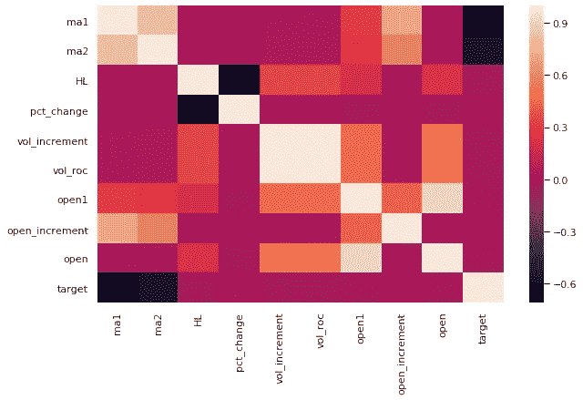

作者图片

[https://sarit-maitra.medium.com/membership](https://sarit-maitra.medium.com/membership)

A **算法**交易期望遵循规则，此外，它们可以形成客观、无偏见的风险估计，代表着金融艺术和理论的一场革命。

在这里，我们将看到机器学习如何解决预测的难题，即预测今天的价格和明天的价格(未知)之间的差异。

数据可以通过世界贸易数据提供的开放 API 加载。从 ML 的角度来看，金融时间序列问题是相当复杂的。我们需要更多地考虑金融数据结构，而不是像开盘价、最高价、最低价和收盘价这样的特定事件。

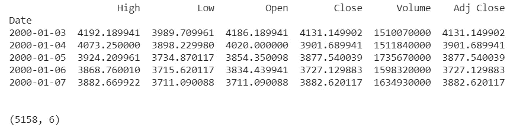

```
# Plot the Opening prices
dataset['Open'].plot(grid=True, figsize=(10, 6))
plt.title('Nasdaq Composite open price')
plt.ylabel('price ($)')
# Show the plot
plt.show()
```

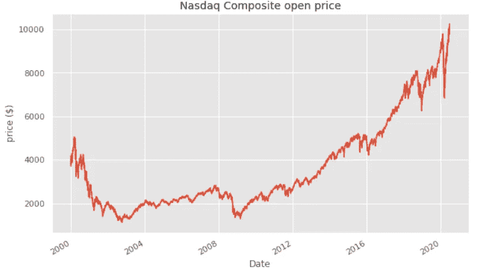

让我们开始为分析准备数据。我将基于短窗口简单移动平均线创建一些特征。

*   高/低百分比在市场中提供了一些百分比的波动性。
*   百分比变化反映每日的百分比变化
*   1 天窗口开放价格。
*   当前日体积增量。
*   当日成交量变化率。
*   当日开盘价增量。
*   公开价格。

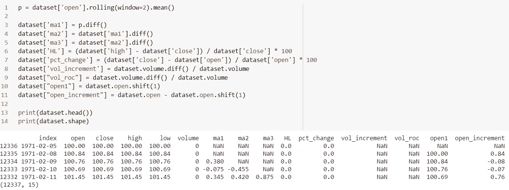

现在，我们将相关属性保存在数据框中，这些属性在这里是预测变量。

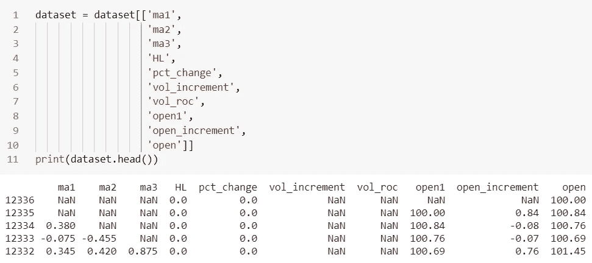

我们没有丢弃所有的 NaN 值，而是用一些在数据集中被视为异常值的数字来代替 NaN。我们将尝试梯度增强树，它通常对异常值很健壮。

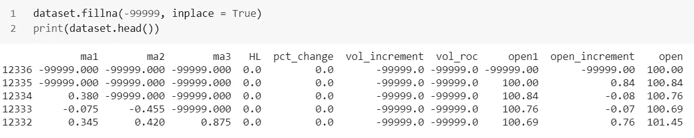

让我们定义我们的目标变量。我们将有一个分类变量，因为平均价格将在第二天上涨或下跌。因此，我们的目标是预测今天的价格和明天的价格之间的差异。

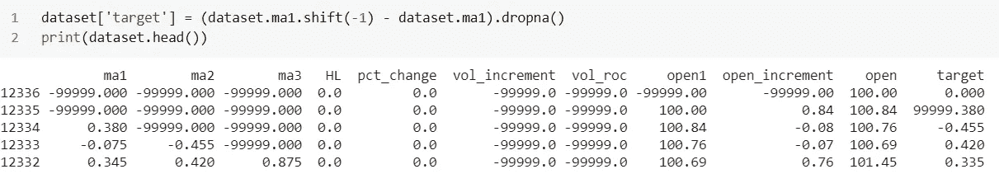

从下面的关联图中，我们可以看出，有些属性是相互关联的，可能不是模型所必需的。但是，我们将在稍后从梯度增强特征重要性图中识别这一点。

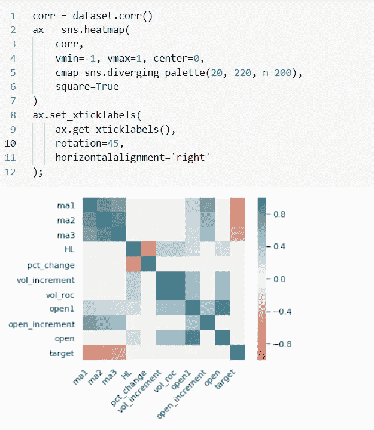

```
# Checking Correlation for easy understanding
sns.set(style='darkgrid', context='talk', palette='Dark2')
plt.figure(figsize=(14,5))
dataset.corr()['Open'].sort_values(ascending = False).plot(kind='bar')
plt.show()
```

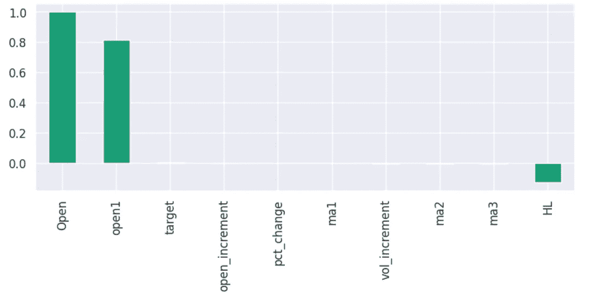

我们的数据集总共有 5158 个样本和 10 个特征。我们使用了时序交叉验证器，它提供了训练/测试指数来分割以固定时间间隔观察的时序数据样本。在每次分割中，测试指数必须比以前高，因此在交叉验证器中进行洗牌是不合适的。

```
print('Total dataset has {} samples, and {} features.'.format(dataset.shape[0], dataset.shape[1]))X = (dataset.drop(['target'], 1))
y = (dataset['target'])
print(len(X), len(y))X = np.array(dataset.drop(['target', 'open1'], 1)) # dropping open
y = np.array(dataset['target'])#timeseries split
tscv = TimeSeriesSplit(max_train_size=None, n_splits=5)
for train_samples, test_samples in tscv.split(X):
  #print("TRAIN:", train_samples, "TEST:", test_samples)
  X_train, X_test = X[train_samples], X[test_samples]
  y_train, y_test = y[train_samples], y[test_samples]#separating features names
feature_names = ['ma1','ma2','ma3','HL','pct_change','vol_increment','open_increment','Open']X_train = pd.DataFrame(data=X_train, columns=feature_names)
X_test = pd.DataFrame(data=X_test, columns=feature_names)
print(X_train.shape, y_train.shape, X_test.shape, y_test.shape)
```

让我们将目标变量转换为二进制分类。价格值的正变化将被分类为 1，非正变化将被分类为 0。

```
y_train = pd.DataFrame(y_train) # converting to data frame
y_train.rename(columns = {0: 'target'}, inplace=True)
y_test = pd.DataFrame(y_test)
y_test.rename(columns = {0: 'target'}, inplace=True)
def getBinary(val):
  if val>0:
    return 1
  else:
    return 0
y_test_binary = pd.DataFrame(y_test["target"].apply(getBinary))
```

# 梯度推进回归:

我们将启动 XGB 回归器来测试模型。适应训练集

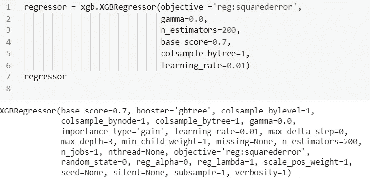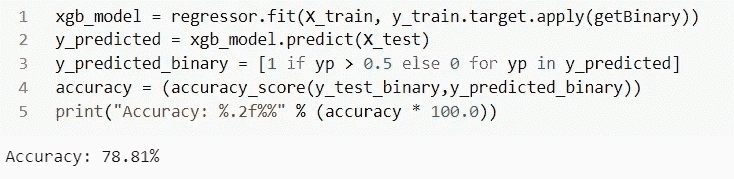

我们的模型准确率为 78.81%，可以预测未来 8 个交易日的每日价格变化(平均值)。

一旦构建了提升树，检索每个特征的重要性分数就变得相对容易和直接。这种重要性是为数据集中的每个属性明确计算的，允许对属性进行排序和相互比较。

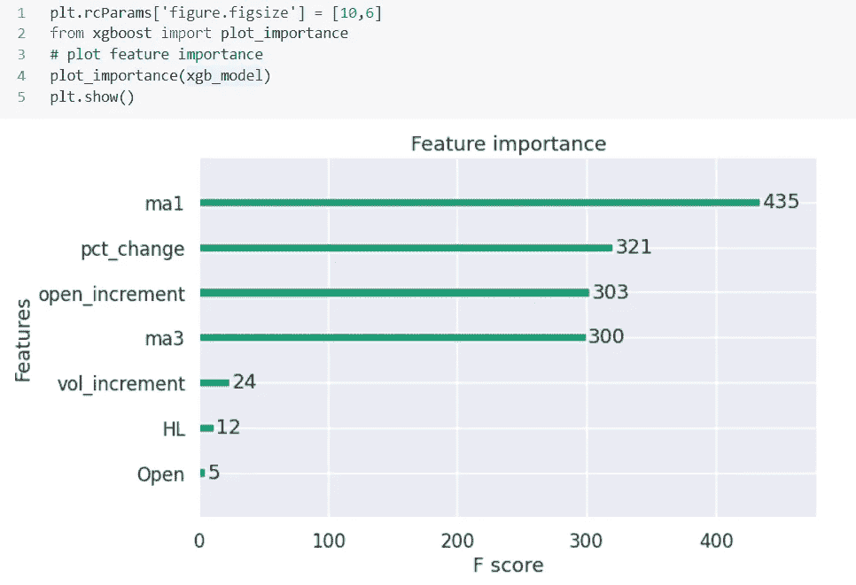

## 形状特征重要性:

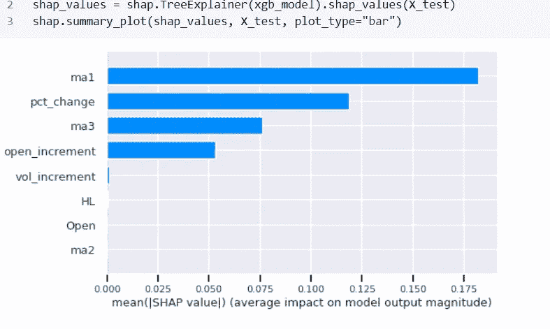

从特征重要性图中我们可以看出，并不是所有的特征对于算法的执行都是重要的；因此，我们可以仅用 4 个特征来运行算法，以获得相同的准确度分数。该模型可以被进一步训练，丢弃不相关的属性。

这是一个简单的模型，没有很大的复杂性，并且模型获得了相当不错的准确度。因此，我们可以看到，我们不再需要依赖人类产出的描述性统计，作为一种推理的松散证明。

**我这里可以到达**[](https://www.linkedin.com/in/saritmaitra/)****。****