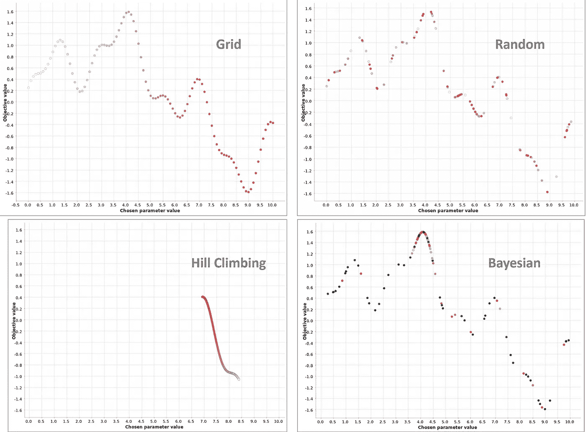
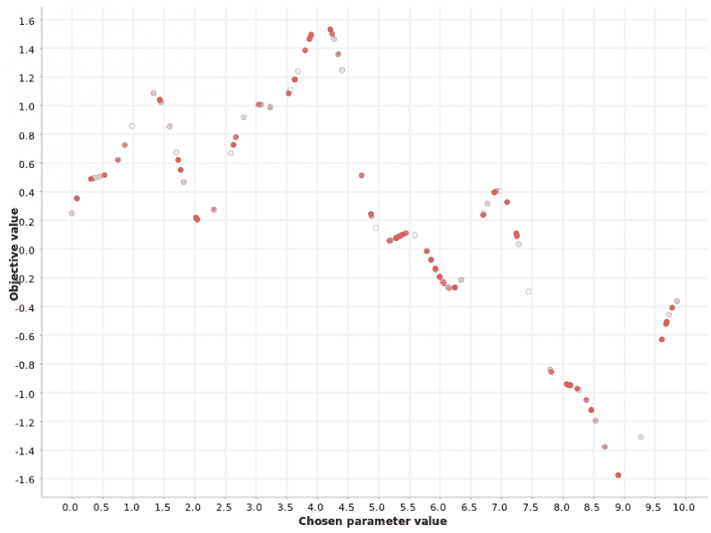
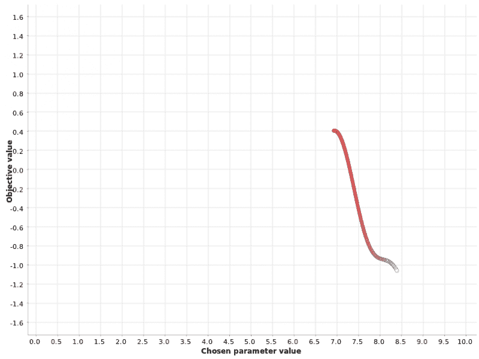
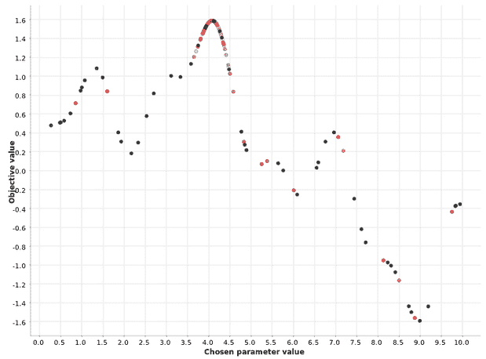

# 机器学习算法和超参数选择的艺术

> 原文：<https://towardsdatascience.com/machine-learning-algorithms-and-the-art-of-hyperparameter-selection-279d3b04c281?source=collection_archive---------13----------------------->

**回顾四种优化策略**

网格搜索、随机搜索、爬山和贝叶斯优化的超参数搜索

从智能手机到航天器，机器学习算法无处不在。他们告诉你明天的天气预报，从一种语言翻译成另一种语言，并建议你可能喜欢网飞的下一部电视剧。

这些算法根据数据自动调整(学习)它们的内部参数。然而，有一个参数子集是不知道的，必须由专家来配置。这样的参数通常被称为“超参数”——随着人工智能的使用增加，它们对我们的生活产生了很大的影响。

例如，决策树模型中的树深度和人工神经网络中的层数就是典型的超参数。模型的性能很大程度上取决于超参数的选择。对于中等深度的树，决策树可以产生良好的结果，而对于非常深的树，决策树的性能非常差。

如果我们想要手动运行，最佳超参数的选择更像是艺术而不是科学。事实上，超参数值的最佳选择取决于手头的问题。

由于算法、目标、数据类型和数据量从一个项目到另一个项目都有很大的变化，因此不存在适合所有模型和所有问题的单一最佳超参数值选择。相反，超参数必须在每个机器学习项目的上下文中进行优化。

在本文中，我们将首先回顾优化策略的威力，然后概述四种常用的优化策略:

*   网格搜索
*   随机搜索
*   爬山
*   贝叶斯优化

**优化策略**

即使专家具有深入的领域知识，手动优化模型超参数的任务也可能非常耗时。另一种方法是将专家放在一边，采用自动方法。根据一些性能度量来检测给定项目中给定模型的最优超参数集的自动过程被称为优化策略。

一个典型的优化过程定义了可能的超参数集和对于特定问题要最大化或最小化的度量。因此，在实践中，任何优化程序都遵循这些经典步骤:

1)将手头的数据分成训练和测试子集

2)重复优化循环固定次数或直到满足条件:

a)选择一组新的模型超参数

b)使用所选择的一组超参数在训练子集上训练模型

c)将模型应用于测试子集并生成相应的预测

d)使用适当的评分标准评估测试预测，如准确性或平均绝对误差。存储对应于所选超参数集的度量值

3)比较所有度量值，并选择产生最佳度量值的超参数集

问题是如何从步骤 2d 回到步骤 2a 进行下一次迭代；也就是说，如何选择下一组超参数，确保它确实比前一组好。我们希望我们的优化循环朝着一个合理的好的解决方案前进，即使它可能不是最优的。换句话说，我们希望合理地确定下一组超参数是对前一组的改进。

典型的优化过程将机器学习模型视为黑盒。这意味着在每一次迭代中，对于每一组选定的超参数，我们感兴趣的只是由选定的度量所度量的模型性能。我们不需要(想)知道黑盒里发生了什么样的魔法。我们只需要移动到下一个迭代，迭代下一个性能评估，等等。

所有不同优化策略中的关键因素是如何在步骤 2a 中选择下一组超参数值，这取决于步骤 2d 中先前的度量输出。因此，对于一个简化的实验，我们省略了黑盒的训练和测试，我们专注于度量计算(一个数学函数)和选择下一组超参数的策略。此外，我们用任意数学函数代替了度量计算，用函数参数代替了模型超参数集。

这样，优化循环运行得更快，并尽可能保持通用性。进一步的简化是使用只有一个超参数的函数，以便于可视化。下面是我们用来演示四种优化策略的函数。我们想强调的是，任何其他的数学函数也可以。

f(x)= sin(x/2)+0.5⋅sin(2⋅x)+0.25⋅cos(4.5⋅x)

这种简化的设置允许我们在简单的 x-y 图上可视化一个超参数的实验值和相应的函数值。x 轴是超参数值，y 轴是函数输出。然后，根据描述超参数序列生成中的点位置的白-红梯度，对(x，y)点着色。

白色点对应于过程中较早生成的超参数值；较红的点对应于随后在该过程中产生的超参数值。这种渐变着色将有助于稍后说明优化策略之间的差异。

在这个简化用例中，优化过程的目标是找到一个使函数值最大化的超参数。

让我们开始回顾四种常见的优化策略，这些策略用于为优化循环的下一次迭代确定新的超参数值集。

**网格搜索**

这是一个基本的[蛮力策略](https://en.wikipedia.org/wiki/Hyperparameter_optimization#Grid_search)。如果你不知道要尝试哪些价值观，你可以尝试所有的价值观。具有固定步长的范围内的所有可能值都用于函数评估。

例如，如果范围是[0，10]并且步长是 0.1，那么我们将得到超参数值序列(0，0.1，0.2，0.3，… 9.5，9.6，9.7，9.8，9.9，10)。在网格搜索策略中，我们计算每个超参数值的函数输出。因此，网格越细，我们就越接近最优，但也需要更多的计算资源。

图 1:使用步长 0.1 在[0，10]范围内对超参数值进行网格搜索。颜色梯度反映了生成的候选超参数序列中的位置。白色点对应于过程中早期生成的超参数值；红点对应于稍后生成的超参数值。

如图 1 所示，超参数的范围是从小到大扫描的。

网格搜索策略在单个参数的情况下可以很好地工作，但是当必须同时优化多个参数时，它变得非常低效。

**随机搜索**

对于[随机搜索](https://en.wikipedia.org/wiki/Random_search)策略，顾名思义，超参数的值是随机选择的。在多个超参数的情况下，这种策略通常是优选的，并且当一些超参数比其他超参数对最终度量的影响更大时，这种策略特别有效。

同样，超参数值在范围[0，10]内生成。然后，随机生成固定数量 N 的超参数。要试验的预定义超参数的固定数量 N 允许您控制这种优化策略的持续时间和速度。N 越大，达到最优的概率越高，但所需的计算资源也越高。

图 2:在[0，10]范围内随机搜索超参数值。颜色梯度反映了生成的候选超参数序列中的位置。白色点对应于过程中早期生成的超参数值；红点对应于稍后生成的超参数值。

正如所料，来自生成序列的超参数值以不递减或递增的顺序使用:白点和红点在图中随机混合(图 2)。

**爬山**

每次迭代的[爬山](https://en.wikipedia.org/wiki/Hill_climbing)方法选择超参数空间中的最佳方向，以选择下一个超参数值。如果没有邻居改进最终度量，则优化循环停止。

注意，这个过程在一个重要方面不同于网格和随机搜索:下一个超参数值的选择考虑了先前迭代的结果。

图 3:在[0，10]范围内对超参数值的爬山搜索。颜色梯度反映了生成的候选超参数序列中的位置。白色点对应于过程中早期生成的超参数值；红点对应于稍后生成的超参数值。

图 3 显示了应用于我们函数的爬山策略从随机超参数值 x=8.4 开始，然后在 x=6.9 时向函数最大值 y=0.4 移动。一旦达到最大值，在下一个邻居中没有观察到度量的进一步增加，并且搜索过程停止。

这个例子说明了与这个策略相关的一个警告:它可能会陷入第二个最大值。从其他图中，我们可以看到全局最大值位于 x=4.0，对应的度量值为 1.6。这种策略不会找到全局最大值，而是陷入局部最大值。这种方法的一个好的经验法则是用不同的初始值运行多次，并检查算法是否收敛到相同的最大值。

**贝叶斯优化**

[贝叶斯优化](https://en.wikipedia.org/wiki/Bayesian_optimization)策略基于先前迭代中的函数输出选择下一个超参数值，类似于爬山策略。与爬山不同，贝叶斯优化着眼于过去的全局迭代，而不仅仅是最后一次迭代。

该程序通常有两个阶段:

*   在称为预热的第一阶段，随机生成超参数值。在用户定义数量 N 的这种随机生成的超参数之后，第二阶段开始。
*   在第二阶段，在每次迭代中，估计 P(输出|过去的超参数)类型的“替代”模型，以描述来自过去迭代的超参数值的输出值的条件概率。这个代理模型比原始函数更容易优化。因此，该算法优化了代理，并且建议代理模型的最大值处的超参数值也作为原始函数的最优值。第二阶段中的一部分迭代也用于探测最佳区域之外的区域。这是为了避免局部极大值的问题。

图 4:超参数值在[0，10]范围内的贝叶斯优化。颜色梯度反映了生成的候选超参数序列中的位置。白色点对应于过程中早期生成的超参数值；红点对应于稍后生成的超参数值。灰点是在策略的第一个随机阶段生成的。

图 4 展示了贝叶斯优化策略使用预热阶段来定义最有希望的区域，然后为该区域中的超参数选择下一个值。

你还可以看到，强烈的红色点聚集在最接近最大值的地方，而淡红色和白色的点分散在各处。这表明最佳区域的定义随着第二阶段的每次迭代而提高。

**总结**

我们都知道在训练机器学习模型时超参数优化的重要性。由于手动优化耗时且需要专业知识，我们探索了四种常见的超参数优化自动程序。

通常，自动优化程序遵循迭代程序，其中在每次迭代中，模型在一组新的超参数上被训练，并在测试集上被评估。最后，对应于最佳度量分数的超参数集合被选为最优集合。问题是如何选择下一组超参数，确保这实际上比前一组更好。

我们概述了四种常用的优化策略:网格搜索、随机搜索、爬山和贝叶斯优化。它们都有优点和缺点，我们通过在一个简单的玩具用例中说明它们是如何工作的来简要解释它们的区别。现在，您已经准备好在现实世界的机器学习问题中尝试它们了。

由[米莎·利索夫伊](https://www.linkedin.com/in/misha-lisovyi/)和[罗莎丽娅·西里波](https://www.linkedin.com/in/rosaria/)克尼梅

*首发于* [*下期网页。*](https://thenextweb.com/podium/2019/11/11/machine-learning-algorithms-and-the-art-of-hyperparameter-selection/)