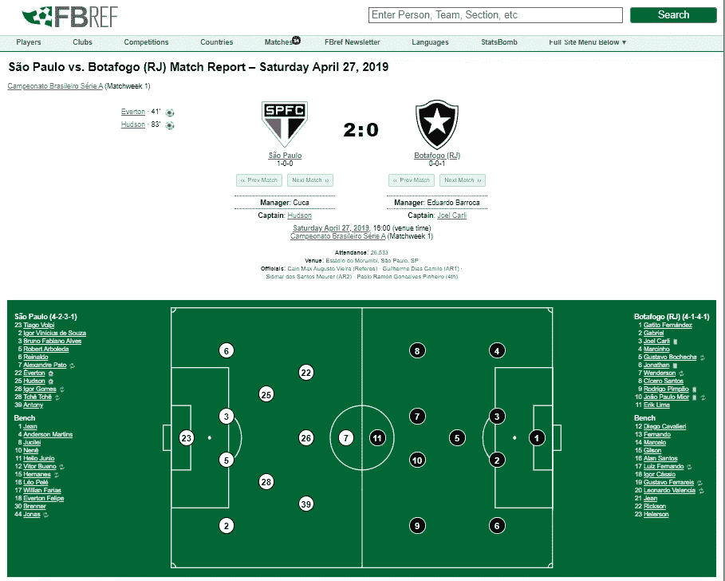
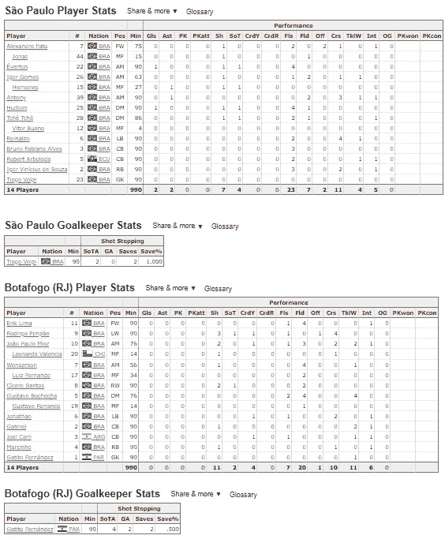
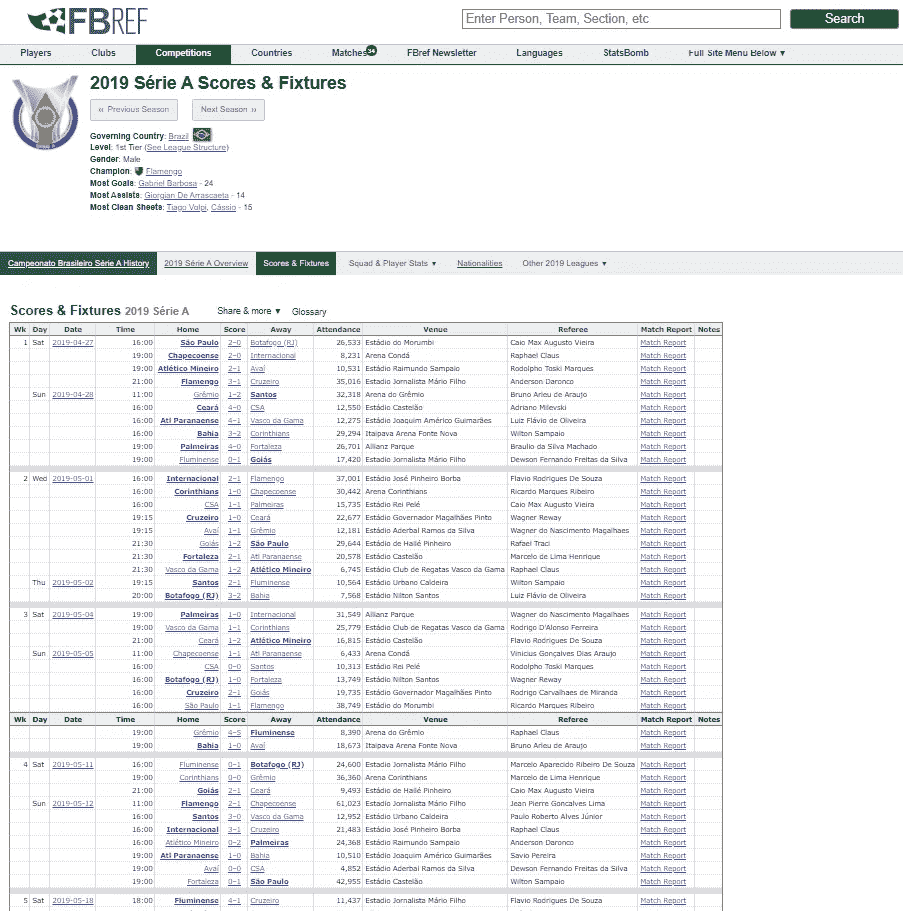
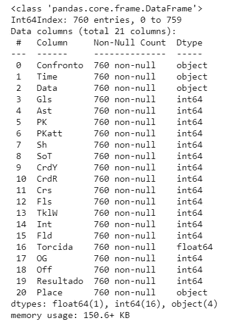
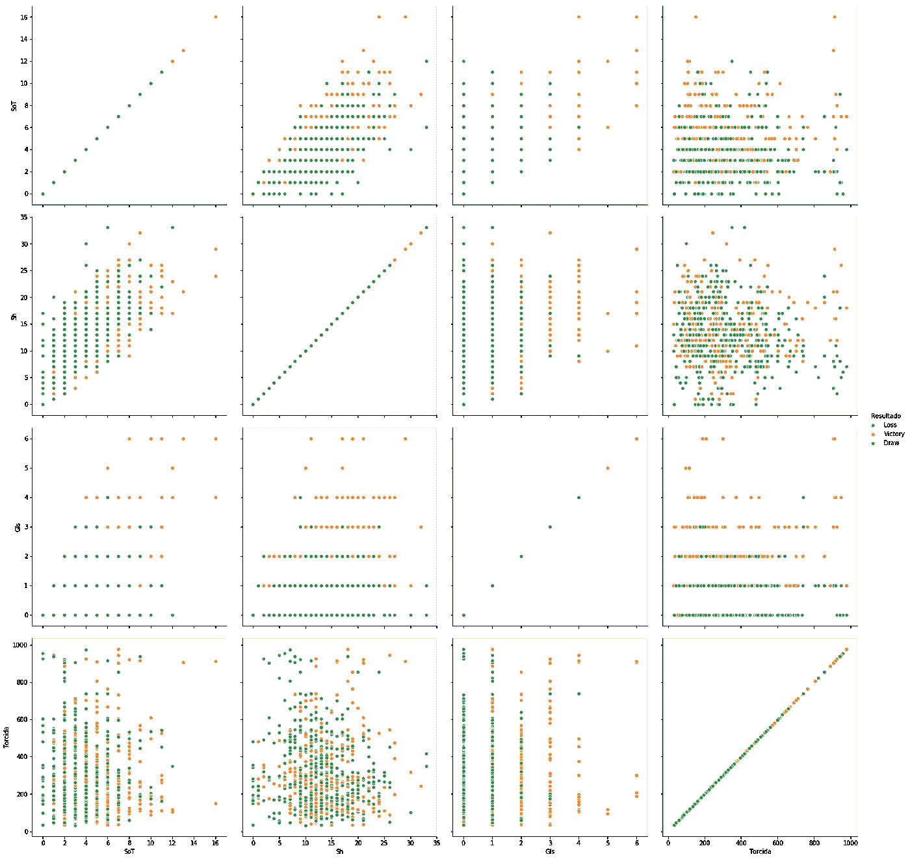
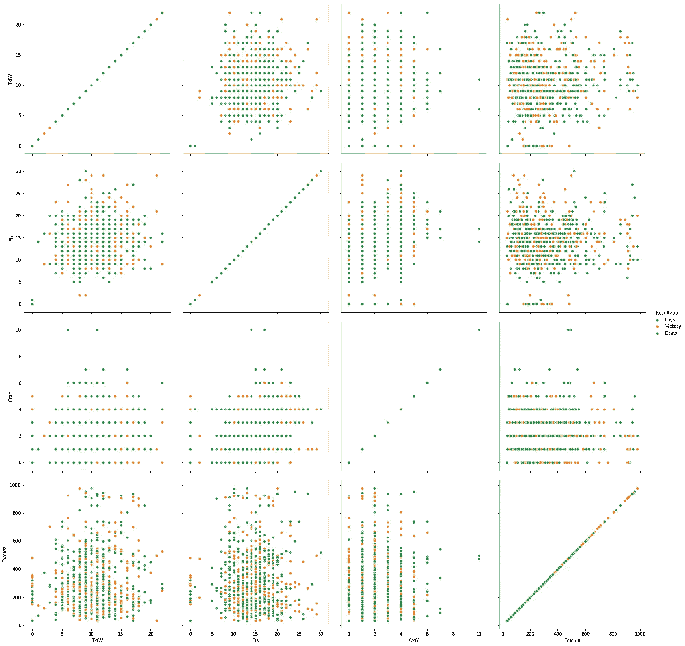
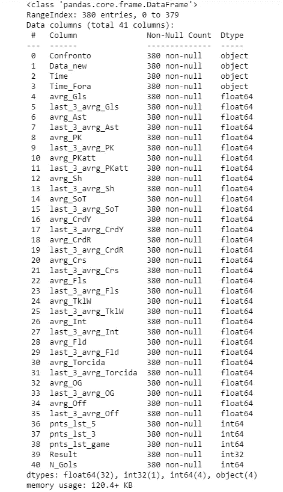
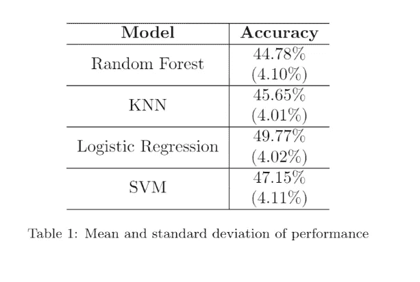
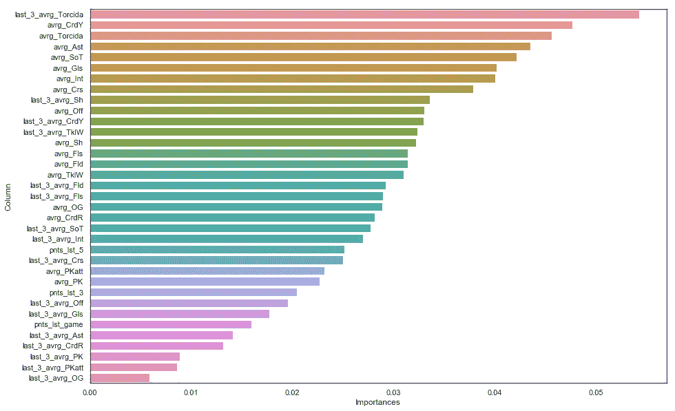

# 足球预测的机器学习算法

> 原文：<https://towardsdatascience.com/machine-learning-algorithms-for-football-prediction-using-statistics-from-brazilian-championship-51b7d4ea0bc8?source=collection_archive---------3----------------------->

## 使用来自巴西锦标赛数据的统计数据

威利安·贾斯登·德·瓦斯康塞洛斯在 [Unsplash](https://unsplash.com?utm_source=medium&utm_medium=referral) 上拍摄的照片

# 摘要

本文基于真实比赛的真实数据，使用各种机器学习模型评估了巴西足球锦标赛中足球/英式足球结果(胜利、平局、失败)的预测。对模型进行递归测试，并比较平均预测结果。结果表明，逻辑回归和支持向量机产生了最好的结果，与其他分类器(KNN 和随机森林)相比，表现出优越的平均精度性能，具有 49.77%的精度(逻辑回归)，比随机决策(基准)的 33%的成功机会好近 17%。此外，还对这些特征的相对重要性进行了排序，以指导数据的使用。

# 项目概述

足球/英式足球是一项在人们生活中非常普遍的运动，人们用来观看、玩耍和打赌。想想赌博，我们可以清楚地看到足球是一项非常不可预测的运动，它没有获得认真的研究来证明这一点。在英超 2015/2016 赛季，我们有一个非常意外的冠军，他们在赛季初争夺冠军的[概率是一比五千](https://www.dn.pt/desporto/leicester-campeao-a-aposta-mais-improvavel-da-historia-britanica-5152206.html#:~:text=Segundo%20Joe%20Crilly%2C%20da%20William,paga%20mais%20alta%20na%20hist%C3%B3ria)。

因此，这个项目的首要目标是创建一个有监督的机器学习算法，根据比赛的统计数据预测足球比赛的结果。这样就有可能评估预测的难易程度。

# 问题陈述

该项目旨在:

*   网络刮痧机器人采集比赛的所有信息
*   将所有赛季比赛的网页报废流程自动化
*   创建一个受监督的机器学习模型来预测比赛结果
*   评估模型

# 韵律学

在分类问题中，通常使用准确度作为评估标准。由于我们的结果预测是一个多类问题，因此没有必要使用其他指标。

准确度公式。来源:我在 [github](https://github.com/Matheuskempa/My_Udacity_Capstone) 上的代码

其中 TP 是真阳性，FP 是假阳性，TN 是真阴性，FN 是假阴性。

# ETL 和数据探索

## 网络报废

然而，在探索收集的数据之前，了解这些信息是如何收集的是至关重要的。所以，这一部分将对整个数据库进行最后的分析处理。下面的第一个和第二个图像显示了如何显示收集数据的页面。所以步骤号**一**是 ***Web-scrap 主页，挑选足球数据，并创建一个包含所有信息的数据框。***

[网页报废匹配页面](https://fbref.com/en/matches/e1867e7b/Sao-Paulo-Botafogo-RJ-April-27-2019-Serie-A)。来源: [FBREF](https://www.sports-reference.com/sharing.html)

现在我们已经有了从比赛中挑选数据的代码，有必要创建另一个代码来收集所有赛季比赛的 URL，这样它将是一个自动化的机器人来完成这项任务。

[赛季比赛](https://fbref.com/en/comps/24/3320/schedule/2019-Serie-A-Scores-and-Fixtures):来源: [FBREF](https://www.sports-reference.com/sharing.html)

所有代码都将被附加到 [Git 库](https://github.com/Matheuskempa/My_Udacity_Capstone)。

在数据清理干净并准备好用于分析之前，需要完成以下步骤:

*   选择列:没有很多空值的选定列。
*   问题:数据收集伴随着一些“问题”,因为所有玩家团队的统计数据的总和，所以需要将这些线从数据中排除。
*   按比赛和球队分组:因为收集的数据来自比赛的球员，所以有必要将球员所在球队的所有统计数据按比赛和球队分组。
*   追加结果:因为收集的数据来自玩家的表，它没有带来比赛的结果，所以需要创建一个代码将这个结果追加到数据框中。
*   位置:有必要创建一个代码来显示哪个队在主场和客场比赛。

## 数据

现在是时候对收集的数据进行评估了，这样就有可能为结果创建一个预测模型。这些是我们清理过的数据的列:

列信息。来源:我在 [github](https://github.com/Matheuskempa/My_Udacity_Capstone) 上的代码

所有变量的含义:

*   会议:匹配
*   时间:团队
*   数据:比赛日期
*   Gls:比赛中的进球数
*   Ast:助攻
*   PK:罚点球
*   PKatt:试图罚点球
*   上海:镜头总数
*   击中目标
*   黄牌
*   红色卡片
*   Crs:十字
*   犯规次数
*   TklW:铲球获胜
*   Int:截取
*   Fld:犯规
*   OG:自己的目标
*   关:越位
*   比赛结果(胜利、失败、平局)
*   地点:主场/客场
*   火炬报:人群

观察:每场比赛都要为主队排一个队，为客队排一个队。

检查这些变量之间的相互关系是很好的，这样就创建了方法:攻击和防御。在代码中，它还提供了一个函数，该函数通过球队和比赛地点(主场/客场)来实现这种方法。

一般攻击数据。来源:我在 [github](https://github.com/Matheuskempa/My_Udacity_Capstone) 上的代码

对于攻击方法，选择了 4 个变量:“SoT”、“Sh”、“Gls”、“Torcida”。从数据中可以看出解决这个问题有多困难，因为我们找不到解决这个问题的模式。但它可能会猜测一些不同于通常的假设:

*   高 Torcida(足球观众)可能与更大数量的进球无关。
*   低 Torcida(足球观众)可能与高 SoT(击中目标)数量相关。

一般国防数据。来源:我在 [github](https://github.com/Matheuskempa/My_Udacity_Capstone) 上的代码

通过这些图表，可以看出我们的数据是如何关联的，各列是如何相互关联的，因此同时查看 3 个变量可以看出分离这些数据的难度。对于防御方法，选择了 4 个变量:“TklW”、“Fls”、“CrdY”、“Torcida”。在攻击分析中，也不可能在防御数据中找到任何模式。

然而，查看信息图中的列，可以得到的变量比图表中显示的要多。很明显，至少 17 个收集的变量可以影响比赛结果，因此也影响预测的性能。但是因为足球要复杂得多，需要更多的变量来预测比赛结果，所以在接下来的部分，会产生一些其他的变量。

# 方法学

## 数据预处理

因为在比赛结果出来之前不可能有比赛的统计数据，所以有必要在比赛之前创造一些新的变量。因此，为了解决这一困境，有必要为所有变量生成一个平均值，该平均值将包含相应游戏之前的所有游戏，通过这种方式，当一支球队在 9 月 18 日比赛时，代码将提供该游戏之前所有游戏可用的所有变量的平均值。

它将创建一些变量，试图向计算机显示每支球队在过去 5 场比赛、3 场比赛以及最后一场比赛中的得分顺序。对于每一场胜利，团队代码加 3 分，平局加 1 分，失败加 0 分。这样，就有可能看到团队是来自胜利、平局还是失败。

由于这些处理已经完成，人们找到了一种方法来通知机器比赛的“地点”。因为这个变量(地点)和由于锦标赛有 2 轮，第一轮可能是在一个球队的主场，如果第一轮锦标赛的第一场比赛是在他们的主场，第二场比赛必然是在他们的主场，或者换句话说，不是在他们的球场。在足球比赛中，这是一个非常重要的变量。因此，考虑这一变量的方法是:获取每场比赛主队(主场=主场)的所有数据和所有变量，然后用相同的数据集(相同的变量)减去客队(主场=客场)的数据。通过这种方式，有可能生成一个数据库，该数据库的数据基本上会说:

*   **If Variables =负值**:客队在过去的比赛中在该变量上的表现比客队/对手更好。这是有可能知道的，因为，例如:选择变量“平均射门数”，如果主队的值为 P，那么客队的值为 X，如果 P 高于 X，两者相减的输出值(主客场)将为正，否则如果 P 低于 X，该值将为负，表明该队在过去的比赛中在该变量上没有更好的表现。

概述:

1.  **问题:**变量仅在比赛后可用，为了执行我们的模型，有必要在相应的比赛前获得所有数据特征数据，以便为该赛季的每个变量创建一个赛季平均值，并且为数据集的每个变量创建一些移动平均值。
2.  **问题:**插入序列变量:这个问题是通过将球队在过去 3、5 场比赛以及最后一场比赛中的所有积分相加而解决的。每赢一场，球队加 3 分，平 1 分，输 0 分。
3.  **问题:**向机器显示谁是主队，谁是客场队。为了解决这个问题，我们用每场比赛的客队变量结果减去主队变量结果。以这种方式显示主场球队是否在任何方面优于或劣于客队。

最终的数据库有 41 列 380 行，如下所示:

最终数据。来源:我在 [github](https://github.com/Matheuskempa/My_Udacity_Capstone) 上的代码

至此，我们的数据库终于得到了处理，现在可以运行一些模型并检查它们的性能了

## 履行

为了运行，我们删除了前四个变量,“Gls”变量也用于所有特性变量的 MinMaxScalar。正如在 [Sklearn](https://scikit-learn.org/) 上可以看到的，该估计器单独缩放和转换每个特征，使得它在训练集的给定范围内，例如在 0 和 1 之间。此外，使用了所有这 4 种模型:

*   **支持向量机:**是一种监督学习模型，它总是旨在增加点之间的距离，以便可以对类进行分类，因此，SVM 分离数据，最大化类之间的间隔。
*   **Random Forest:** 顾名思义，Random Forest 创建了几个决策树，并将它们分组到一个树的“森林”中，在对树的每个节点进行分区时，对代表解释变量的列进行大小为 m 的 bootstrap 采样。最终决策投票将由分类问题的多数票(以及回归问题中的平均值)给出。
*   **KNN:** 是一个简单的模型，它基于距离度量的 k 个最近点的类别来执行分类。
*   **Logistic 回归:**基本上，Logistic 回归是一种多元线性回归，其结果使用 sigmoid 函数被“挤压”在区间[0，1]内。

为了运行所有这些模型，我们使用 scikit-learn 的库“训练测试分割”随机分割数据库。对于**测试，使用了 30%的数据**。**此外，对于所有四种型号**，该算法被随机播放了 1000 次、**。通过这种方式，可以检查所有模型的标准偏差和准确性。所有模型都使用了缺省值，没有探究每个特定模型的参数。**

# 结果

## 模型评估和验证

从下表中可以看出，结果并不明显。该算法实现了几乎 50%的准确性，但是，考虑到成功的随机预测概率为 33%(胜利/平局/失败)，这是一个好信号，表明该算法毕竟能够识别一些模式。

平均值和标准偏差。来源:我在 [github](https://github.com/Matheuskempa/My_Udacity_Capstone) 上的代码

经过 1000 次后， ***Logistic 回归的结果最好，*** 在所有四个模型中标准差率最低，准确率最高。SVM 比其他人表现得更好，但具有最高的标准差，这可能表明该模型往往比其他模型变化更大。还使用随机森林特征重要性创建了特征排名。从下图中可以看出，最近 3 场比赛的足球比赛观众、黄牌号码以及整个赛季的足球比赛观众对预测结果的影响更大。

功能排名。来源:我在 [github](https://github.com/Matheuskempa/My_Udacity_Capstone) 上的代码

## 正当理由；辩解

看到逻辑回归比其他模型表现得更好很奇怪，主要是因为正如我们所见，数据显然没有模式，这是一个复杂的问题，令人惊讶的是，一个非常复杂的问题通过“线性”方法解决了，这可能是最简单的方法。其中一个原因可能是因为每个模型的参数，而这些参数在这种方法中没有被研究。因为 SVM 有很多内核，尝试不同的内核可能是一个解决方案，以达到这个模型更好的性能。另一个奇怪的地方是“点数序列”是干扰预测的最后变量之一。就我而言，这个变量不应该被忽略，也许有更多的方式向机器显示这些模式。

# 结论

## 反射

本文证明了足球预测仍然是一项非常艰巨的任务，它仍然需要更多的变量来帮助预测结果。然而，通过这篇文章我们可以看到，机器学习算法已经可以“思考”哪支球队下注，并且仍然可以比不知道比赛的人更准确，当与随机预测的概率相比时，在预测中具有近 17%的优势。

## 改进

对于未来，我建议调查并找到更多有用的变量，例如伤病，或每支球队球员的更多细节，也许国际足联或职业进化游戏数据可以帮助带来更多的信息。未来可以做的另一件事是预测每支球队的进球数，这更复杂，因为这取决于预测的结果，他们必须与之协调，例如，如果结果被预测为主队的胜利，主队不可能有两个进球，客场队也不可能有两个进球。因此，也许这篇文章可以成为未来创建更好更复杂模型的灵感来源。