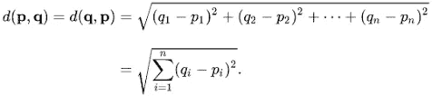

# 用 Python 从头到尾的机器学习算法:KNN

> 原文：<https://towardsdatascience.com/machine-learning-algorithms-from-start-to-finish-in-python-knn-7a92cce47986?source=collection_archive---------42----------------------->


布莱克·惠勒在 [Unsplash](https://unsplash.com/s/photos/neighborhood?utm_source=unsplash&utm_medium=referral&utm_content=creditCopyText) 上拍摄的照片

机器学习从业者工具箱中的一个基本算法必须是 K 个最近邻(或简称为 KNN)。虽然它可能是最简单的算法之一，但它也是一种非常强大的算法，并在许多现实应用中使用。在本教程中，我将执行以下操作:

*   解释 KNN 算法及其工作原理
*   使用 Python 从头开始实现它

所以，事不宜迟，让我们开始这场机器学习派对吧！

# k 最近的邻居解释说

这是一种常见的机器学习算法，可用于分类和回归。该算法采取的步骤如下:


图片来自[维基百科](https://en.wikipedia.org/wiki/File:KnnClassification.svg)

1.  首先，它将一组特征和标签作为输入，使其成为一种**监督学习算法。**
2.  除了特性和标签，它还接受一个**n _ neighbors**参数。
3.  为了预测新样本的类别，它执行以下操作:

*   测量新样本和第 **N** 个最近样本之间的距离(由**N _ neighbors**参数指定)
*   基于其最近的邻居，它将基于多数投票对样本进行分类。具体地，如果有 3 个邻居，其中 2 个邻居属于 A 类，1 个邻居属于 B 类，那么它将把新样本分类为 A 类

为了填补你的知识空白，让我们来看一个具体的例子。


照片由[乌韦·桑切斯](https://unsplash.com/@uvesanchez?utm_source=unsplash&utm_medium=referral&utm_content=creditCopyText)在 [Unsplash](https://unsplash.com/s/photos/concrete?utm_source=unsplash&utm_medium=referral&utm_content=creditCopyText) 上拍摄

让我们假设以下情况:

*   你试图根据血型、身体质量指数等来预测一个病人是否患有心脏病。
*   您已经为训练和验证分离了数据集
*   你已经**缩放了**你的特征(我稍后会讨论这一点)
*   你已经有了 fir KNN 算法，并且已经将**n _ neighbors**参数设置为 3

如果您要向实例提供验证集，将会发生以下情况:

1.  该算法将使用**距离度量**来测量新实例和其他训练集实例之间的距离(我稍后也会讨论这一点！)
2.  基于**n _ neighbors**参数(在本例中，该参数被设置为 3)，它将使用与新样本最接近的三个例子来对新点进行分类
3.  然后它将进行投票，哪个类拥有最多的票数就是新样本所属的类。具体来说:

*   如果两个最接近的类别被标记为 1(患有心脏病)，一个被标记为 0(没有心脏病)，则新样本将被预测为在类别 1 中

4.对测试集中的所有实例重复这个过程

# 清理一些 KNN 行话


[梁杰森](https://unsplash.com/@ninjason?utm_source=unsplash&utm_medium=referral&utm_content=creditCopyText)在 [Unsplash](https://unsplash.com/s/photos/language?utm_source=unsplash&utm_medium=referral&utm_content=creditCopyText) 上拍照

## 距离度量

这是用于计算两点之间距离的度量。它通常是欧几里德距离，由以下公式给出:



图片来自[维基百科](https://en.wikipedia.org/wiki/Euclidean_distance)

## **特征缩放**

这是许多机器学习算法的重要预处理步骤，尤其是那些使用距离度量和计算的算法(如我们的朋友 KNN)。它基本上缩放了我们的特征，使它们在相似的范围内。把它想象成一栋房子，一栋房子的比例模型。两者的**形状**相同(都是房子)，但是**大小**不同(5m！= 500m)。我们这样做的原因如下:

1.  它加速了算法
2.  有些算法对规模很敏感。换句话说，如果特征具有不同的比例，则具有较高量值的特征有可能被赋予较高的权重。这将影响机器学习算法的性能，显然，我们不希望我们的算法偏向一个特征。

为了证明这一点，让我们假设我们有三个特性，分别命名为 A、B 和 C:

*   缩放前 AB 的距离= >


照片由[分析公司 Vidhya 拍摄](https://www.analyticsvidhya.com/blog/2020/04/feature-scaling-machine-learning-normalization-standardization/)

*   缩放前 BC 的距离= >


照片由[分析公司 Vidhya 拍摄](https://www.analyticsvidhya.com/blog/2020/04/feature-scaling-machine-learning-normalization-standardization/)

*   缩放后 AB 的距离= >


照片由[分析公司 Vidhya](https://www.analyticsvidhya.com/blog/2020/04/feature-scaling-machine-learning-normalization-standardization/) 拍摄

*   缩放后 BC 的距离= >


照片由[分析公司 Vidhya](https://www.analyticsvidhya.com/blog/2020/04/feature-scaling-machine-learning-normalization-standardization/) 拍摄

我们可以清楚地看到，这些特性比缩放之前更具可比性，也更公正。如果你想要一个关于功能缩放的很棒的教程，请查看这个由分析 Vidhya 撰写的[博客](http://Photo by Analytics Vidhya)。

## 选择 n_neighbors 参数

虽然没有预先确定的方法来选择最佳数量的邻居，但确实存在一些方法。一种流行的方法叫做*肘方法，*运行一个循环，将数据拟合到一系列相邻值。如果您要根据邻居的数量绘制误差图，您的图将如下所示:


作者照片

通常，最佳点将是弯头快速减少其误差的点(因此在我们的例子中，可能是 5 或 6)。这种方法的问题如下:

*   过度适应测试集是可能的，所以要确保交叉验证。
*   有时，K 的最佳数量可能不是很清楚，因此可能很难判断什么是真正的最佳数量

在实现 KNN 时，一个很好的技巧是将 K 设置为奇数。这样，就不需要处理票数相等的情况。

# 从技术角度了解代码

知道如何使用像 scikit 这样的 ML 库是很好的——学习编码算法，但是真正能提升你的 ML 技能的是学习如何从头开始构建算法。因此，我们将这样做；从头开始创建 KNNClassifier！


照片由 [redcharlie](https://unsplash.com/@redcharlie?utm_source=unsplash&utm_medium=referral&utm_content=creditCopyText) 在 [Unsplash](https://unsplash.com/s/photos/neighbours?utm_source=unsplash&utm_medium=referral&utm_content=creditCopyText) 上拍摄

> 注意:代码的链接可以在[这里](https://github.com/Vagif12/ML-Algorithms-From-Scratch/blob/main/KNN%20From%20Scratch.ipynb)找到，但是我建议你在检查代码之前浏览一下博客文章，以完全理解正在发生的事情。

首先，让我们导入我们的库:

```
import numpy as np
from sklearn.datasets import load_iris
from sklearn.model_selection import train_test_split
from collections import Counteriris = load_iris()
X, y = iris.data, iris.target
```

是的，我们导入 scikit-learn 的唯一原因是使用 iris 数据集并分割数据。除此之外，我们使用普通的数字和集合！

接下来，让我们创建我们的训练和测试集:

```
X_train,X_test,y_train,y_test = train_test_split(X,y,random_state=1810)
```

这里没什么不寻常的，所以让我们快速前进。

现在，我提到特征缩放是 KNN 的一个重要的预处理步骤。然而，我们的数据已经在一个相似的范围内，所以我们可以跳过这一步。然而，在现实世界的数据中，我们很少能如此幸运。

## 使用面向对象的方法编码算法

干净和可重用的代码对任何数据科学家或机器学习工程师来说都是关键。因此，为了遵循软件工程原则，我将创建一个 KNN 类，使代码可重用且保持原样。

首先，我们定义类名，并传入一些参数。即，

*   x(特性)
*   y(标签向量)
*   n_neighbors(我们希望的邻居数量)

```
class KNN:
    def __init__(self,X,y,n_neighbors=3):
        self.X = X
        self.y = y
        self.n_neighbors = n_neighbors
```

接下来，我们将上面的欧几里德距离公式转换成代码，并使其成为类的方法:

```
def euclidean(self,x1,x2):
        return np.sqrt(np.sum((x1 - x2) ** 2))
```

现在是举重。我将首先向您展示代码，然后解释发生了什么:

```
def fit_knn(self,X_test):
        distances = [self.euclidean(X_test,x) for x in X_train]
        k_nearest = np.argsort(distances)[:self.n_neighbors]
        k_nearest_labels = [y_train[i] for i in k_nearest]

        most_common = Counter(k_nearest_labels).most_common(1)[0][0]
        return most_common
```

我们首先创建一个名为 fit_knn 的方法，该方法可以将 knn 拟合到数据中！更具体地说，正在开展以下工作:

1.  测量测试集中的每个数据点到训练集中的数据点之间的距离
2.  我们得到 K 个最近的点(K 是我们的邻居数量的参数，在我们的例子中是 3)
3.  之后，代码返回我们发现最接近新测试集实例的最近邻居的标签。
4.  最常见的类由方法计数并返回

最后，最重要的是，我们做出预测:

```
knn = KNN(X_train,y_train)preds = knn.predict(X_test)
```

现在，让我们评估我们的模型，看看它对新样本的分类效果如何:

```
accuracy = (preds == y_test).mean()OUT: 1.0
```

所以，完整的代码如下:

```
import numpy as np
from collections import Counter
from sklearn.datasets import load_irisiris = load_iris()
X, y = iris.data, iris.targetX_train,X_test,y_train,y_test = train_test_split(X,y,random_state=1810)class KNN:
    def __init__(self,X,y,n_neighbors=3):
        self.X = X
        self.y = y
        self.n_neighbors = n_neighbors

    def euclidean(self,x1,x2):
        return np.sqrt(np.sum((x1 - x2) ** 2))

    def fit_knn(self,X_test):
        distances = [self.euclidean(X_test,x) for x in X_train]
        k_nearest = np.argsort(distances)[:self.n_neighbors]
        k_nearest_labels = [y_train[i] for i in k_nearest]

        most_common = Counter(k_nearest_labels).most_common(1)[0][0]
        return most_common

    def predict(self,X_test):
        preds = [self.fit_knn(x) for x in X_test]
        return predsknn = KNN(X_train,y_train)
preds = knn.predict(X_test)accuracy = (preds == y_test).mean()
```

# 要做的其他任务:

1.  尝试使用 n_neighbors 参数。什么变化？
2.  尝试缩放您的要素，看看结果是否不同。好点了吗？或者更糟？
3.  尝试将模型拟合到不同的数据集。看看改变 K 如何改变结果
4.  看看您是否可以自己实现肘方法来确定最佳邻居数量

非常感谢您阅读本文。我希望你学到了新的东西，或者至少刷新了你的记忆。现在，那是很久了！所以，我对你的最后一个愿望是，休息一下，休息一下，享受生活！


简·廷伯格在 [Unsplash](https://unsplash.com/s/photos/goodbye?utm_source=unsplash&utm_medium=referral&utm_content=creditCopyText) 上拍摄的照片