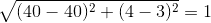
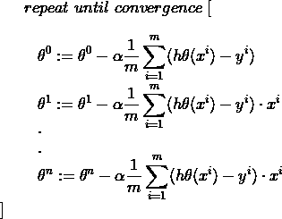

# Python 中从头到尾的机器学习算法:线性回归

> 原文：<https://towardsdatascience.com/machine-learning-algorithms-from-start-to-finish-in-python-linear-regression-aa8c1d6b1169?source=collection_archive---------21----------------------->

## 学习、理解和实现所有数据科学和机器学习中最重要和最基本的算法。


朱利安·埃伯特在 [Unsplash](https://unsplash.com/s/photos/diagonal?utm_source=unsplash&utm_medium=referral&utm_content=creditCopyText) 上拍摄的照片

线性回归可能是最常见的算法之一，是机器学习从业者必须知道的。这通常是初学者第一次接触真正的机器学习算法，了解它在更深层次上的运行方式对于更好地理解它至关重要。

所以，简单来说，我们把真题分解一下；什么*真的*是**线性** **回归**？

# 线性回归定义

线性回归是一种监督学习算法，旨在采用线性方法对因变量和自变量之间的关系进行建模。换句话说，它旨在拟合一条线性*趋势线*，该趋势线能够最好地捕捉数据的*关系*，并且，根据这条线，它可以预测目标值可能是多少。


图片来自[维基百科](https://en.wikipedia.org/wiki/Linear_regression)

太好了，我知道这个定义，但是它到底是如何工作的呢？很棒的问题！为了回答这个问题，让我们一步一步地看看线性回归是如何运作的:

1.  趋势线符合数据(如上图所示)。
2.  计算点之间的距离(图上的红点是点，绿线是距离)，然后平方，然后求和(值被平方以确保负值不会产生不正确的值并妨碍计算)。这是算法的错误，或者更好地称为*残差*
3.  存储迭代的残差
4.  基于*优化算法，**线被轻微“移位”，以便该线可以更好地拟合数据。*
5.  *重复步骤 2-4，直到达到期望的结果，或者残余误差已经减小到零。*

*这种拟合直线的方法被称为*最小二乘法。**

# *线性回归背后的数学*

> *注意:请随意跳过这一部分，因为不幸的是，它确实含有一些看起来很奇怪的乳胶。但是，如果你想真正明白是怎么回事，我建议冒险来一块饼干，继续看下去！*

**

*安托万·道特里在 [Unsplash](https://unsplash.com/s/photos/math?utm_source=unsplash&utm_medium=referral&utm_content=creditCopyText) 上拍摄的照片*

*线性回归算法如下:*

**

*作者照片*

*可以简称为:*

**

*作者照片*

*下面的算法将基本上完成以下工作:*

1.  *取一个 Y 向量(你的数据的标签，(房价，股票价格，等等..))*

**

*作者照片*

*这是你的目标向量，稍后**会用它来评估**你的数据(稍后会详细介绍)。*

*2.取一个矩阵 X(数据的特征):*

**

*作者照片*

*这是你的数据的特征，即年龄，性别，性别，身高等。这是算法将实际用来进行预测的数据。请注意特征 x0 是如何出现的。这被称为你的*截距项*，并且总是等于 1。*

*3.取*权重*的向量，并转置它们:*

**

*作者照片*

**

*作者照片*

*这是算法的神奇之处。所有的特征向量都会乘以这些权重。这被称为**点积。**本质上，您将试图为给定的数据集找到这些值的最佳组合。这就是所谓的**优化。***

*4.得到一个输出向量:*

**

*作者照片*

*这是从数据中输出的预测向量。然后，您可以通过使用**成本函数来评估模型的性能。***

*这基本上是数学上表示的整个算法。现在，您应该对线性回归的工作原理有了很好的理解。但问题是，什么是一个 ***优化*** ***算法*** *？而我们如何挑选* ***最优权重*** *？而我们如何评价***的表现呢？***

# **成本函数**

**成本函数本质上是一个衡量损失的公式，或模型的“成本”。如果你曾经参加过任何 Kaggle 比赛，你可能会遇到一些。一些常见的包括:**

*   **均方误差**
*   **均方根误差**
*   **绝对平均误差**

**这些函数对于模型训练和开发是必不可少的，因为它们回答了“*我的模型预测新实例的能力如何？*”。请记住这一点，因为这与我们的下一个主题有关。**

# **优化算法**

**优化通常被定义为改进某样东西的过程，以使其发挥最大潜力。这也适用于机器学习。在 ML 的世界中，优化本质上是试图为某个数据集找到最佳的参数组合。这本质上是机器学习的“学习”部分。**

**虽然存在许多优化算法，但我将讨论其中最常见的两种:梯度下降和正规方程。**

# **梯度下降**

**梯度下降是一种优化算法，旨在找到一个函数的最小值。它通过在斜率的负方向迭代地采取步骤来实现这个目标。在我们的例子中，梯度下降通过移动函数切线的斜率来不断更新权重。好极了，听起来很棒。请说英语。:)**

## **梯度下降的一个具体例子**

****

**卢卡斯·克拉拉在 [Unsplash](https://unsplash.com/s/photos/mountain?utm_source=unsplash&utm_medium=referral&utm_content=creditCopyText) 上的照片**

**为了更好地说明梯度下降，让我们通过一个简单的例子。想象一个人在山顶，他/她想到达山下。他们可以做的是环顾四周，看看他们应该朝哪个*方向*迈步，以便更快地下来。然后，他们可能会朝那个方向迈出第*步*，现在他们离目标更近了。然而，他们下来时必须小心，因为他们可能会在某个点卡住，所以我们必须确保相应地选择步长。**

**类似地，梯度下降的目标是最小化一个函数。在我们的案例中，是为了最小化我们模型的成本。这是通过找到函数的切线并向那个方向移动来实现的。算法的“*步骤*的大小由所谓的*学习率来定义。这基本上控制了我们向下移动的距离。有了这个参数，我们必须小心两种情况:***

1.  **学习率太大，算法可能不收敛(达到最小值)并在最小值附近跳动，但永远不会收敛**
2.  **学习率太小，算法将花费太长时间达到最小值，还可能“卡”在次优点。**

**我们还有一个参数来控制算法在数据集上迭代的次数。**

**从视觉上看，该算法会做这样的事情:**

****

**图片来自[维基百科](https://en.wikipedia.org/wiki/Gradient_descent)**

**因为这种算法对机器学习来说非常重要，所以让我们来回顾一下它的作用:**

1.  **随机初始化权重。这叫做(你猜对了)*随机初始化***
2.  **然后，该模型使用这些随机权重进行预测。**
3.  **模型的预测通过成本函数进行评估。**
4.  **然后，模型运行梯度下降，通过找到函数的切线，然后在切线的斜率中采取一个步骤**
5.  **该过程重复 N 次迭代，或者如果满足标准。**

# **梯度下降的优点和缺点**

## ****优势:****

1.  **很可能将成本函数降低到全局最小值(非常接近或= 0)**
2.  **最有效的优化算法之一**

## **缺点:**

1.  **在大型数据集上可能会很慢，因为它使用整个数据集来计算函数切线的梯度**
2.  **容易陷入次优点(或局部最小值)**
3.  **用户必须手动选择学习速率和迭代次数，这可能很耗时**

**既然已经介绍了梯度下降，那就来介绍法线方程吧。**

# **正态方程**

**如果我们回到我们的例子，而不是采取步骤反复下山，我们将能够立即到达底部。法线方程就是这种情况。它利用线性代数来产生权重，可以在很短的时间内产生与梯度下降一样好的结果。**

# **法线方程的优点和缺点**

## **优势**

1.  **不需要选择学习率或迭代次数**
2.  **极快**

## **不足之处**

1.  **无法很好地扩展到大型数据集**
2.  **倾向于产生良好的权重，但不是最佳的权重**

***咻，好多东西要消化！我建议你在继续前进之前休息一下，喝杯咖啡***

****

**照片由[海伦娜·洛佩斯](https://unsplash.com/@wildlittlethingsphoto?utm_source=unsplash&utm_medium=referral&utm_content=creditCopyText)在 [Unsplash](https://unsplash.com/s/photos/break?utm_source=unsplash&utm_medium=referral&utm_content=creditCopyText) 上拍摄**

# **特征缩放**

**这是许多机器学习算法的重要预处理步骤，尤其是那些使用距离度量和计算的算法(如线性回归和梯度下降)。它基本上缩放了我们的特征，使它们在相似的范围内。把它想象成一栋房子，一栋房子的比例模型。两者的**形状**相同(都是房子)，但是**大小**不同(5m！= 500m)。我们这样做的原因如下:**

1.  **它加速了算法**
2.  **有些算法对规模很敏感。换句话说，如果特征具有不同的比例，则具有较高量值的特征有可能被赋予较高的权重。这将影响机器学习算法的性能，显然，我们不希望我们的算法偏向一个特征。**

**为了证明这一点，让我们假设我们有三个特性，分别命名为 A、B 和 C:**

*   **缩放前 AB 的距离= >**

********

**照片由[分析公司 Vidhya](https://www.analyticsvidhya.com/blog/2020/04/feature-scaling-machine-learning-normalization-standardization/) 拍摄**

**缩放前 BC 的距离= >**

********

**照片由[分析公司 Vidhya](https://www.analyticsvidhya.com/blog/2020/04/feature-scaling-machine-learning-normalization-standardization/) 拍摄**

**缩放后 AB 的距离= >**

********

**照片由[分析公司 Vidhya](https://www.analyticsvidhya.com/blog/2020/04/feature-scaling-machine-learning-normalization-standardization/) 拍摄**

**缩放后 BC 的距离= >**

********

**照片由[分析公司 Vidhya](https://www.analyticsvidhya.com/blog/2020/04/feature-scaling-machine-learning-normalization-standardization/) 拍摄**

**我们可以清楚地看到，这些特性比缩放之前更具可比性，也更公正。如果你想要一个关于功能扩展的很棒的教程，请查看这篇由 Analytics Vidhya 撰写的[博客文章](http://photo%20by%20analytics%20vidhya/)。**

**咻！这需要吸收大量的信息。所以，我建议你休息一下，喝杯咖啡，享受生活，当你觉得，准备好了，你就可以从头开始编写这个算法了。**

# **从头开始编码线性回归**

****

**克里斯·里德在 [Unsplash](https://unsplash.com/s/photos/code?utm_source=unsplash&utm_medium=referral&utm_content=creditCopyText) 上拍摄的照片**

**好了，现在是你一直在等待的时刻；实施！事不宜迟，我们开始吧！**

> ****注意**:所有代码都可以从[这个](https://github.com/Vagif12/ML-Algorithms-From-Scratch/blob/main/Linear%20Regression%20from%20Scratch.py) Github repo 下载。但是，我建议您在这样做之前先跟随教程，因为这样您会对您实际编码的内容有更好的理解！**

**首先，让我们做一些基本的导入:**

```
**import numpy as np
import matplotlib.pyplot as plt
from sklearn.datasets import load_boston**
```

**是的，那是所有的进口货！我们使用 numpy 进行数学实现，使用 matplotlib 绘制图形，使用来自 scikit-learn 的波士顿数据集。**

**接下来，让我们加载数据并定义我们的特征和标签:**

```
**# Load and split data
data = load_boston()
X,y = data['data'],data['target']**
```

**接下来，让我们创建一个自定义的 train_test_split 函数，将我们的数据分成一个训练集和测试集:**

```
**# Custom train test split
def train_test_divide(X,y,test_size=0.3,random_state=42):
    np.random.seed(random_state)
    train_size = 1 - test_size
    arr_rand = np.random.rand(X.shape[0])
    split = arr_rand < np.percentile(arr_rand,(100*train_size))

    X_train = X[split]
    y_train = y[split]
    X_test =  X[~split]
    y_test = y[~split]

    return X_train, X_test, y_train, y_testX_train,X_test,y_train,y_test = train_test_divide(X,y,test_size=0.3,random_state=42)**
```

**基本上，我们只是**

1.  **进入测试尺寸。**
2.  **设置随机种子以确保我们的结果是可重复的。**
3.  **基于测试集大小获得训练集大小**
4.  **从我们的特征中随机选取样本**
5.  **将随机选择的实例分成训练集和测试集**

## **我们的成本函数**

**我们将实现 MSE 或均方误差，这是一种用于回归任务的常见成本函数:**

****

**作者照片**

```
**def mse(preds,y):
        m = len(y)
        return 1/(m) * np.sum(np.square((y - preds)))**
```

*   **我指的是训练样本的数量**
*   ***易*引用我们标签向量中的单个实例**
*   **preds 指的是我们的预测**

**为了制作干净、可重复和高效的代码，以及遵守软件开发惯例，我们将制作创建一个线性回归类:**

```
**class LinReg:
    def __init__(self,X,y):
        self.X = X
        self.y = y
        self.m = len(y)
        self.bgd = False**
```

*   **bgd 布尔值是一个参数，它定义了我们是否应该使用批量梯度下降。**

**我们现在将创建一个添加截取项的方法:**

```
**def add_intercept_term(self,X):
        X = np.insert(X,1,np.ones(X.shape[0:1]),axis=1).copy()
        return X**
```

*   **这基本上是在我们的特性的开头插入一个列。**
*   **如果我们不加上这一点，那么我们将迫使超平面通过原点，导致它倾斜相当大，因此不能正确拟合数据。**

**我们现在将扩展我们的功能:**

****

**作者照片**

```
**def feature_scale(self,X):
        X = (X - X.mean()) / (X.std())
        return X**
```

**接下来，我们将随机初始化权重:**

```
**def initialise_thetas(self):
        np.random.seed(42)
        self.thetas = np.random.rand(self.X.shape[1])**
```

**我们现在将使用以下公式从头开始编写法线方程:**

****

**作者照片**

```
**def normal_equation(self):
        A = np.linalg.inv(np.dot(self.X.T,self.X))
        B = np.dot(self.X.T,self.y)
        thetas = np.dot(A,B)
        return thetas**
```

**本质上，我们将算法分为 3 个部分:**

1.  **我们得到 X 转置和 X 的点积的倒数**
2.  **我们得到重量和标签的点积**
3.  **我们得到两个计算值的点积**

**所以，这就是正规方程！不算太差！现在，我们将使用以下公式实现批量梯度下降:**

****

**作者照片**

```
**def batch_gradient_descent(self,alpha,n_iterations):
        self.cost_history = [0] * (n_iterations)
        self.n_iterations = n_iterations

        for i in range(n_iterations):
            h = np.dot(self.X,self.thetas.T)
            gradient = alpha * (1/self.m) * ((h - self.y)).dot(self.X)

            self.thetas = self.thetas - gradient
            self.cost_history[i] = mse(np.dot(self.X,self.thetas.T),self.y)

        return self.thetas**
```

**在这里，我们执行以下操作:**

1.  **我们接受 alpha，或者学习率，和迭代次数**
2.  **我们创建一个列表来存储我们的成本函数历史，以便稍后绘制成线图**
3.  **我们遍历数据集 n 次迭代，**
4.  **我们获得预测，并计算梯度(函数切线的斜率)。这被称为 h(x)**
5.  **我们通过从实际值中减去我们的预测值并乘以每个特征来更新权重，以沿梯度向下移动**
6.  **我们使用自定义的 MSE 函数记录这些值**
7.  **重复，完成后，返回我们的结果**

**让我们定义一个拟合函数来拟合我们的数据:**

```
**def fit(self,bgd=False,alpha=0.158,n_iterations=4000):
        self.X = self.add_intercept_term(self.X)
        self.X = self.feature_scale(self.X)
        if bgd == False:

            self.thetas = self.normal_equation()
        else:
            self.bgd = True
            self.initialise_thetas()
            self.thetas = self.batch_gradient_descent(alpha,n_iterations)**
```

**这里，我们只是检查用户是否想要梯度下降，并相应地执行我们的步骤。**

**让我们构建一个函数来绘制成本函数:**

```
**def plot_cost_function(self):

        if self.bgd == True:
            plt.plot(range((self.n_iterations)),self.cost_history)
            plt.xlabel('No. of iterations')
            plt.ylabel('Cost Function')
            plt.title('Gradient Descent Cost Function Line Plot')
            plt.show()
        else:
            print('Batch Gradient Descent was not used!')**
```

**最后是预测未标记实例的方法:**

```
**def predict(self,X_test):
        self.X_test = X_test.copy()
        self.X_test = self.add_intercept_term(self.X_test)
        self.X_test = self.feature_scale(self.X_test)
        predictions = np.dot(self.X_test,self.thetas.T)
        return predictions**
```

**现在，让我们看看哪个优化产生了更好的结果。首先，让我们试试梯度下降:**

```
**lin_reg_bgd = LinReg(X_train,y_train)
lin_reg_bgd.fit(bgd=True)mse(y_test,lin_reg_bgd.predict(X_test))OUT:
28.824024414708344**
```

**让我们绘制我们的函数，看看成本函数如何降低，如果梯度下降收敛:**

****

**作者照片**

**因此，我们可以看到，在大约 1000 次迭代时，它开始收敛。**

**现在是正常方程:**

```
**lin_reg_normal = LinReg(X_train,y_train)
lin_reg_normal.fit()mse(y_test,lin_reg_normal.predict(X_test))OUT:
22.151417764247284**
```

**所以我们可以看到，正常方程略优于梯度下降。这可能是因为数据集很小，我们没有为学习率选择最佳参数。**

# **活动**

1.  **尽量大幅度提高学习率。会发生什么？**
2.  **不应用要素缩放。有区别吗？**
3.  **尝试研究，看看你是否能实现一个更好的优化算法。在测试集上评估您的模型**

**写这篇文章真的很有趣，虽然有点长，但我希望你今天学到了一些东西。敬请期待，继续阅读！**

****

**乔纳森·肯珀在 [Unsplash](https://unsplash.com/s/photos/bye?utm_source=unsplash&utm_medium=referral&utm_content=creditCopyText) 上拍摄的照片**