# Python 中从头到尾的机器学习算法:逻辑回归

> 原文：<https://towardsdatascience.com/machine-learning-algorithms-from-start-to-finish-in-python-logistic-regression-5a62e3495318?source=collection_archive---------31----------------------->

## 探索基本分类模型背后的真实情况，并使用 Python 从头构建一个分类器。


照片由[德鲁·比默](https://unsplash.com/@drew_beamer?utm_source=unsplash&utm_medium=referral&utm_content=creditCopyText)在 [Unsplash](https://unsplash.com/s/photos/split?utm_source=unsplash&utm_medium=referral&utm_content=creditCopyText) 上拍摄

对于任何即将到来的数据科学家或机器学习实践者来说，逻辑回归本质上是一个必须知道的知识。这很可能是人们遇到的第一个分类模型。但是，问题是， ***怎么*** *真的管用吗？***它有什么作用？* ***为什么*** *是用来分类的？*在这篇文章中，我希望能回答所有这些问题，当你读完这篇文章时，你将会:*

1.  *学习如何用简单的语言解释逻辑回归模型*
2.  *了解逻辑回归的数学形式*
3.  *使用 Python 从头实现逻辑回归*

*所以，准备好迎接前方的狂野冒险吧，伙伴！*

**

*塞巴斯蒂安·赫尔曼在 [Unsplash](https://unsplash.com/s/photos/handshake?utm_source=unsplash&utm_medium=referral&utm_content=creditCopyText) 上拍摄的照片*

# *逻辑回归模型解释了*

*逻辑回归是一种统计模型，它使用逻辑函数来预测某个实例属于某个特定类的概率。如果估计的概率大于 50%，则模型预测该实例属于正类(1)。如果不超过 50%，那么模型预测属于负类。逻辑回归用于以下情况*

*   *一个病人到底有没有乳腺癌？*
*   *学生能通过考试吗？*
*   *给定的图像是否合适？*
*   *这个信用卡交易是诈骗交易还是正常交易？*

*所有这些都是可以使用逻辑回归的例子。嗯，太好了！现在你知道如何定义什么是逻辑回归，并解释它做什么。但问题是，*如何运作，循序渐进*？为了解释这一点，我们将比较逻辑回归和线性回归！*

## *通过线性回归理解逻辑回归*

*在我的[上一篇文章](/machine-learning-algorithms-from-start-to-finish-in-python-linear-regression-aa8c1d6b1169)中，我解释了线性回归；它如何工作，做什么以及如何实现。在许多方面，逻辑回归与线性回归非常相似。因此，让我们简要总结一下线性回归的作用:*

1.  *线性趋势线或超平面适合数据*
2.  *计算点之间的距离(图上的红点是点，绿线是距离)，然后平方，然后求和(值被平方以确保负值不会产生不正确的值并妨碍计算)。这是算法的误差，或者更好地称为*残差。**

*3.然后，我们使用一种*优化算法*(稍后将详细介绍)来“改变”该算法，使其能够基于*成本函数*更好地拟合数据*

*4.重复步骤 2 + 3，直到我们达到理想的输出，或者我们的误差接近 0。*

**

*图片来自[维基百科](https://en.wikipedia.org/wiki/Linear_regression)*

*在逻辑回归中，情况非常相似，但也有一些不同:*

1.  *逻辑回归预测一个*离散值* (0 或 1)，而线性回归用于预测*连续值* (245.6，89.6 等..)*
2.  *它不是拟合数据的趋势线，而是拟合数据的 S 形曲线，称为*逻辑函数。*这条曲线的范围从 0 到 1，告诉你一个类为正(1)或负(0)的概率。*
3.  *该模型的残差计算不适用于逻辑回归，这一点我们将在以后研究逻辑回归的细节时发现。因此，它也不使用与线性回归相同的*成本函数*。*

*好了，现在你知道什么是逻辑回归了(用外行人的话来说)，这是对它的功能和操作步骤的高度概括。但我肯定你有一些问题，比如:*

*   *为什么 Logistic 回归*叫* Logistic *回归*，而不是 Logistic *分类？**
*   *什么是*成本函数？*为什么使用线性回归和逻辑回归时会有所不同？*
*   *什么是*优化算法*？*

*我向你保证，现在，你所寻求的一切都会得到满足！*

# *在我们继续之前，清理一些基本的统计数据*

> *注意:现在，这些概念可能看起来不相关，但请耐心听我说，因为这些概念构成了逻辑回归的基础，将有助于您更好地理解算法。*

**

*马库斯·斯皮斯克在 [Unsplash](https://unsplash.com/s/photos/basketball?utm_source=unsplash&utm_medium=referral&utm_content=creditCopyText) 上的照片*

*   ***几率:**某事发生与某事未发生的比率。例如，让我们假设洛杉矶湖人队打了 13 场比赛，赢了 5 场，输了 8 场。那么，湖人赢得下一场比赛的几率将是发生的事情(湖人赢)和没有发生的事情(湖人输)的比率。所以，在这个例子中，他们赢的几率是 5/8。*
*   *概率:某件事情发生与所有可能发生的事情的比率。回到我们湖人的例子，湖人赢得下一场比赛的概率是发生的事情(湖人获胜)与可能发生的事情(湖人输赢)的比率。所以，概率是 5/13。*

*我们已经看到了一种计算赔率的方法，但是我们也可以使用下面的公式根据概率计算赔率:*

*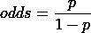*

*作者照片*

*其中 p =某事发生的概率。为了验证这一点，让我们试着用这个公式看看我们是否能得到湖人获胜的几率:*

*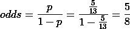*

*作者照片*

*果然，我们得到了同样的结果！*

# *赔率的问题*

*回到我们的例子，让我们假设湖人队经历了一个糟糕的赛季(显然不是这样)，在 20 场比赛中，他们只赢了 1 场。所以湖人获胜的几率是:*

*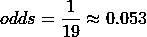*

*作者照片*

*如果他们在整个赛季中打得比 T8 更差，并且在 100 场比赛中赢了 2 场，那么他们获胜的几率将是:*

*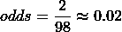*

*作者照片*

*我们可以做一个简单的观察:他们打得越差，他们的胜算就越接近于 0。具体来说，当他们赢的几率为*时，那么几率将在 0 和 1 之间。**

*现在我们来看反面。如果湖人打 20 场比赛，赢 19 场，那么他们的胜算是:*

*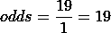*

*作者照片*

*如果他们玩 200 场游戏，赢了 194 场，那么他们赢的几率是:*

*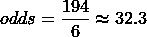*

*作者照片*

*换句话说，当湖人获胜的几率是 1 时，他们可以一直到无穷大。*

*显然，这里有一个问题。湖人获胜的几率从 0 到 1 不等，但是他们获胜的几率从 1 到无穷大不等。这种不对称使得很难比较湖人获胜的可能性。如果我们有一个函数能让一切都对称就好了…*

# *介绍 Logit 函数*

**

*Eduardo Flores 在 [Unsplash](https://unsplash.com/s/photos/symmetrical?utm_source=unsplash&utm_medium=referral&utm_content=creditCopyText) 上拍摄的照片*

*幸运的是，这个函数确实存在！它被称为概率的*对数函数、*或*对数。*本质上，它输出了赔率的…日志！*

*让我们再次用湖人队的例子来证明这一点(对不起！).如果湖人要打 7 场比赛，并且只赢一场，他们获胜的几率将会是:*

**

*作者照片*

*如果他们赢了 6 场比赛，只输了 1 场:*

*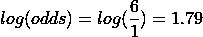*

*作者照片*

*使用对数(赔率)，离原点的距离等于 1 比 6，或 6 比 1。这个 logit 函数对于理解是至关重要的，因为它构成了逻辑回归的基础。如果你仍然不确定什么是赔率和日志(赔率)，看看 Statquest 的这个伟大的[视频](https://www.youtube.com/watch?v=ARfXDSkQf1Y&t=315s)。*

# *逻辑回归背后的“回归”*

*好了，伙计们，我正式向你们扔炸弹了:*

**

*由 [Jens Johnsson](https://unsplash.com/@jens_johnsson?utm_source=unsplash&utm_medium=referral&utm_content=creditCopyText) 在 [Unsplash](https://unsplash.com/s/photos/explosion?utm_source=unsplash&utm_medium=referral&utm_content=creditCopyText) 上拍摄的照片*

*逻辑回归(就其本身而言)不是一种分类算法。它实际上是一个*回归*模型(因此得名 Logistic *回归*)！怎么会？好了，事不宜迟，让我们深入研究一下逻辑回归模型。*

# *深入研究逻辑回归*

*逻辑回归实际上是广义线性模型(GLM)的一部分，该模型最初是由约翰·内尔德和罗伯特·威德伯恩创建的。线性回归的响应值来自[](https://en.wikipedia.org/wiki/Normal_distribution)*，而逻辑回归的响应值来自 [*二项分布*](https://en.wikipedia.org/wiki/Binomial_distribution) (值为 0 和 1)。**

**逻辑回归是一种特殊类型的 GLM，它可以通过使用*链接函数*使与响应变量相关联，并允许每个测量值的方差大小是其预测值的函数，从而推广线性回归。([来源](https://en.wikipedia.org/wiki/Generalized_linear_model))。**

**基本上，逻辑回归是一种 GLM，通过使用 logit 链接函数输出值 0 和 1，并可以使用特殊的*成本函数*来计算模型的方差。**

**现在，你一定对这一切是如何运作的感到难以置信，但是现在跟着我，它很快就会有意义。**

# **逻辑回归如何工作第 1 部分:理论**

**正如我们之前讨论的，理论上，线性回归的 y 轴值(或目标值)可以是从-无穷大到+无穷大范围内的任何数字。**

**但是，在逻辑回归中，y 轴值的范围仅在 0 和 1 之间。**

**所以，为了解决这个问题，y 轴值从 X 发生的概率转换成…某事发生的 log(odds)！现在，值的范围可以从无穷大到+无穷大，就像线性回归一样。我们使用之前讨论过的 logit 函数来完成这个转换。**

**所以，换句话说，我们把 S 形曲线转换成直线。这意味着，虽然我们仍然在逻辑回归中使用 S 形曲线，但系数是根据对数(赔率)计算的。**

**在这之后，算法本质上是线性模型；我们有了直线趋势线，然后我们使用*优化算法*以及用于逻辑回归的*修改成本函数*(稍后将详细介绍)*将其拟合到数据上。*一旦我们做出了预测，我们就使用一个链接函数将我们的预测“翻译”或反转，其中最常见的一个称为 *sigmoid 函数，*回到一个概率。**

**好了，现在你对逻辑回归的工作原理有了一点点的了解。让我们用一个数学例子来巩固你的知识。**

# **逻辑回归如何工作第一部分:数学**

**假设我们有一个具有两个特征的模型， **X** 1 + **X** 2，以及单二项式响应变量 **Y** ，我们将其表示为 p = **P** (Y=1):**

**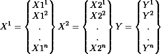**

**作者照片**

**Y=1 的事件概率的对数可以表示为:**

**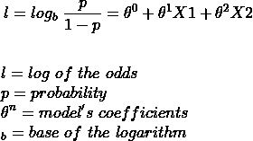**

**作者照片**

**我们可以通过对对数赔率求幂来恢复赔率:**

**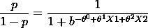**

**作者照片**

**通过简单的代数运算， **Y** =1 的概率为:**

**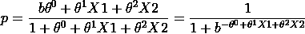**

**作者照片**

**这个公式本质上是将我们的对数优势预测转化为概率的链接函数。该函数也称为 *sigmoid 函数*，也可以表示为:**

**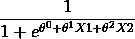**

**作者照片**

**这可以直观地看做一条 S 形曲线:**

****

**图片来自[维基百科](https://en.wikipedia.org/wiki/Activation_function)**

**在这里，我们可以清楚地看到如何计算给定实例的概率对数，或者给定权重的情况下 **Y** =0 的概率。使逻辑回归成为分类模型的部分是用于分割预测概率的阈值。没有这一点，逻辑回归是真正的回归模型。**

# **该算法如何工作的逐步指南**

1.  **随机初始化模型的参数(或系数)**
2.  **将 sigmoid 函数应用于线性模型的预测**
3.  **通过使用优化算法更新参数，以更好地拟合数据。**
4.  **计算误差。**
5.  **对任一 *n* 次迭代重复 2-4，直到达到期望的结果或模型的计算误差接近或等于 0。**

**所以现在你应该对逻辑回归的工作原理有了很好的理解。但我相信您可能仍有疑问，例如:**

1.  **嘿，你从没解释过什么是优化算法！**
2.  **伙计，什么是成本函数？**
3.  **等等，是线性模型吧？那么我们需要特征尺度吗？**

**好吧，你抓到我了。所以，在我们开始编码之前，让我用通俗的语言解释一下这些概念。**

# **成本函数**

**成本函数本质上是一个衡量损失的公式，或模型的“成本”。如果你曾经参加过任何 Kaggle 比赛，你可能会遇到一些。一些常见的包括:**

*   **均方误差**
*   **均方根误差**
*   **绝对平均误差**
*   **原木损失**

**现在，有必要强调一下线性回归和逻辑回归之间的一个重要区别:**

*   **线性回归基本上是通过计算*残差*(每个点离假设有多远)来计算成本。这可以在下图中看到，因为绿线从下图中的点分叉:**

****

**图片由[维基百科](https://en.wikipedia.org/wiki/Linear_regression)提供。**

**注意来自每个数据点的绿线。这是模型的*残差*，用于计算线性回归模型的成本。**

*   **当我先前说概率被转换成对数比值时，我没有提到一种情况；当 X 发生的概率为 1 时。在这种情况下，我们会得到以下输出:**

**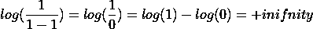**

**作者照片**

**现在，我们不能计算残差，因为点和假设之间的距离可能是无穷大。这就是为什么我们使用一个特殊的成本函数叫做*对数损失:***

**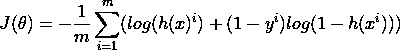**

**作者照片**

**这个函数是从所谓的*最大似然估计*中得到的。我知道这篇文章的长度，所以如果你想得到更多的信息，我推荐你看一下这个[视频](https://www.youtube.com/watch?v=BfKanl1aSG0&frags=pl%2Cwn)来获得更多关于这个功能的直觉。**

**这些函数对于模型训练和开发是必不可少的，因为它们回答了“*的基本问题:我的模型预测新实例有多好？*”。请记住这一点，因为这与我们的下一个主题有关。**

# **优化算法**

**优化通常被定义为改进某样东西的过程，以使其发挥最大潜力。这也适用于机器学习。在 ML 的世界中，优化本质上是试图为某个数据集找到最佳的参数组合。这本质上是机器学习的“学习”部分。**

**虽然存在许多优化算法，但我将讨论其中最常见的两种:梯度下降和正规方程。**

# **梯度下降**

**梯度下降是一种优化算法，旨在找到一个函数的最小值。它通过在斜率的负方向迭代地采取步骤来实现这个目标。在我们的例子中，梯度下降通过移动函数切线的斜率来不断更新权重。好极了，听起来很棒。请说英语。:)**

# **梯度下降的一个具体例子**

****

**卢卡斯·克拉拉在 [Unsplash](https://unsplash.com/s/photos/mountain?utm_source=unsplash&utm_medium=referral&utm_content=creditCopyText) 上的照片**

**为了更好地说明梯度下降，让我们通过一个简单的例子。想象一个人在山顶，他/她想到达山下。他们可以做的是环顾四周，看看他们应该朝哪个方向迈一步，以便更快地下来。然后，他们可能会朝那个方向迈出第*步*，现在他们离目标更近了。然而，他们下来时必须小心，因为他们可能会在某个点被*卡住*，所以我们必须确保*相应地选择我们的步长。***

**类似地，梯度下降的目标是最小化一个函数。在我们的案例中，是为了最小化我们模型的成本。这是通过找到函数的切线并向那个方向移动来实现的。算法的“*步骤*的大小由所谓的*学习率来定义。*这基本上控制了我们向下移动的距离。有了这个参数，我们必须小心两种情况:**

1.  **学习率太大，算法可能不收敛(达到最小值)并在最小值附近跳动，但永远不会收敛**
2.  **学习率太小，算法将花费太长时间达到最小值，还可能“卡”在次优点。**

**我们还有一个参数来控制算法在数据集上迭代的次数。**

**从视觉上看，该算法会做这样的事情:**

**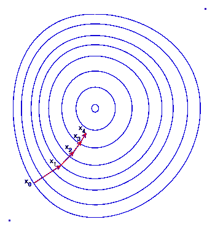**

**图片来自[维基百科](https://en.wikipedia.org/wiki/Gradient_descent)**

**因为这种算法对机器学习来说非常重要，所以让我们回顾一下它的作用:**

1.  **随机初始化权重。这被称为(你猜对了)*随机初始化***
2.  **然后，该模型使用这些随机权重进行预测。**
3.  **模型的预测通过成本函数进行评估。**
4.  **然后，模型运行梯度下降，通过找到函数的切线，然后在切线的斜率中采取一个步骤**
5.  **该过程重复 N 次迭代，或者如果满足标准。**

# **梯度下降的优点和缺点**

# **优势:**

1.  **很可能将成本函数降低到全局最小值(非常接近或= 0)**
2.  **最有效的优化算法之一**

# **缺点:**

1.  **在大型数据集上可能会很慢，因为它使用整个数据集来计算函数切线的梯度**
2.  **容易陷入次优点(或局部最小值)**
3.  **用户必须手动选择学习速率和迭代次数，这可能很耗时**

**既然已经介绍了梯度下降，那就来介绍法线方程吧。**

# **正态方程**

****

**照片由[萨夫](https://unsplash.com/@saffu?utm_source=unsplash&utm_medium=referral&utm_content=creditCopyText)在 [Unsplash](https://unsplash.com/s/photos/fast?utm_source=unsplash&utm_medium=referral&utm_content=creditCopyText) 拍摄**

**如果我们回到我们的例子，而不是采取步骤反复下山，我们将能够立即到达底部。法线方程就是这种情况。它利用线性代数来产生权重，可以在很短的时间内产生与梯度下降一样好的结果。**

# **法线方程的优点和缺点**

# **优势:**

1.  **不需要选择学习率或迭代次数**
2.  **极快**

# **缺点:**

1.  **无法很好地扩展到大型数据集**
2.  **倾向于产生良好的权重，但不是最佳的权重**

# **特征缩放**

****

**在 [Unsplash](https://unsplash.com/s/photos/scaling?utm_source=unsplash&utm_medium=referral&utm_content=creditCopyText) 上 [Calum MacAulay](https://unsplash.com/@calum_mac?utm_source=unsplash&utm_medium=referral&utm_content=creditCopyText) 拍摄的照片**

**这是许多机器学习算法的重要预处理步骤，尤其是那些使用距离度量和计算的算法(如线性回归、梯度下降，当然还有逻辑回归，因为它确实是一个回归模型！).它基本上缩放了我们的特征，使它们在相似的范围内。把它想象成一栋房子，一栋房子的比例模型。两者的**形状**相同(都是房子)，但是**大小**不同(5m！= 500m)。我们这样做的原因如下:**

1.  **它加速了算法**
2.  **有些算法对规模很敏感。换句话说，如果特征具有不同的比例，则具有较高量值的特征有可能被赋予较高的权重。这将影响机器学习算法的性能，显然，我们不希望我们的算法偏向一个特征。**

**为了证明这一点，让我们假设我们有三个特性，分别命名为 A、B 和 C:**

*   **缩放前 AB 的距离= >**

****

**照片由[分析公司 Vidhya](https://www.analyticsvidhya.com/blog/2020/04/feature-scaling-machine-learning-normalization-standardization/) 拍摄**

**缩放前 BC 的距离= >**

****

**照片由[分析公司 Vidhya 拍摄](https://www.analyticsvidhya.com/blog/2020/04/feature-scaling-machine-learning-normalization-standardization/)**

**缩放后 AB 的距离= >**

****

**照片由[分析公司 Vidhya 拍摄](https://www.analyticsvidhya.com/blog/2020/04/feature-scaling-machine-learning-normalization-standardization/)**

**缩放后 BC 的距离= >**

****

**照片由[分析公司 Vidhya 拍摄](https://www.analyticsvidhya.com/blog/2020/04/feature-scaling-machine-learning-normalization-standardization/)**

**我们可以清楚地看到，这些特性比缩放之前更具可比性，也更公正。如果你想要一个关于特性缩放的很棒的教程，请查看这篇由 Analytics Vidhya 撰写的[博客文章](http://photo%20by%20analytics%20vidhya/)。**

**哇！你的大脑一定充满了大量的信息！因此，我建议在我们从头开始实际编写算法之前，休息一下，四处逛逛，享受生活，做些伸展运动！**

# **从头开始编码逻辑回归**

****

**克里斯里德在 [Unsplash](https://unsplash.com/s/photos/code?utm_source=unsplash&utm_medium=referral&utm_content=creditCopyText) 上的照片**

**好了，现在是你一直在等待的时刻；实施！事不宜迟，我们开始吧！**

> *****注*** *:所有代码可以从* [*这个*](https://github.com/Vagif12/ML-Algorithms-From-Scratch/blob/main/Logistic%20Regression%20from%20Scratch.py) *Github repo 下载。但是，我建议您在这样做之前先跟随教程，因为这样您会对您实际编码的内容有更好的理解！***

**首先，让我们做一些基本的导入:**

```
**import numpy as np
import matplotlib.pyplot as plt
from sklearn.datasets import load_breast_cancer**
```

**我们使用 numpy 进行数学计算，使用 matplotlib 绘制图表，使用来自 scikit-learn 的乳腺癌数据集。**

**接下来，让我们加载数据并定义我们的特征和标签:**

```
**# Load and split data
data = load_boston()
X,y = data['data'],data['target']**
```

**接下来，让我们创建一个自定义的 train_test_split 函数，将我们的数据分成一个训练集和测试集:**

```
**# Custom train test split
def train_test_divide(X,y,test_size=0.3,random_state=42):
    np.random.seed(random_state)
    train_size = 1 - test_size
    arr_rand = np.random.rand(X.shape[0])
    split = arr_rand < np.percentile(arr_rand,(100*train_size))

    X_train = X[split]
    y_train = y[split]
    X_test =  X[~split]
    y_test = y[~split]

    return X_train, X_test, y_train, y_testX_train,X_test,y_train,y_test = train_test_divide(X,y,test_size=0.3,random_state=42)**
```

**基本上，我们只是**

1.  **进入测试尺寸。**
2.  **设置随机种子以确保我们的结果是可重复的。**
3.  **基于测试集大小获得训练集大小**
4.  **从我们的特征中随机选取样本**
5.  **将随机选择的实例分成训练集和测试集**

**为了制作干净、可重复和高效的代码，以及坚持软件开发实践，我们将创建一个逻辑回归类:**

```
**class LogReg:
    def __init__(self,X,y):
        self.X = X
        self.y = y
        self.m = len(y)
        self.bgd = False**
```

**让我们添加链接函数作为该类的方法:**

```
**def sigmoid(self,z):
        return 1/ (1 + np.exp(-z))**
```

**现在，让我们使用上述公式实现我们的成本函数:**

```
**def cost_function(self,X,y):
        h = self.sigmoid(X.dot(self.thetas.T))
        m = len(y)
        J = (1/m) * (-y.dot(h) - (1-y).dot(np.log(1-h)))
        return J**
```

*   **h =假设(我们的推断或预测)**
*   **m =训练集中的实例数量**
*   **J =我们的成本函数**

**我们还将添加一个插入截取项的方法:**

```
**def add_intercept_term(self,X):
        X = np.insert(X,0,np.ones(X.shape[0:1]),axis=1).copy()
        return X**
```

*   **这基本上是在我们的特性的开头插入一列 1。**
*   **如果我们不加上这一点，那么我们将迫使超平面通过原点，导致它倾斜相当大，因此不能正确拟合数据。**

**接下来，我们将扩展我们的功能:**

**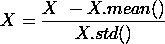**

**作者照片**

```
**def feature_scale(self,X):
        X = (X - X.mean()) / (X.std())
        return X**
```

**我们将添加一个随机初始化模型参数的方法:**

```
**def initialise_thetas(self):
        np.random.seed(42)
        self.thetas = np.random.rand(self.X.shape[1])**
```

**现在，我们将使用下面的公式实现法线方程:**

**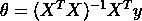**

**作者照片**

```
**def normal_equation(self):
        A = np.linalg.inv(np.dot(self.X.T,self.X))
        B = np.dot(self.X.T,self.y)
        thetas = np.dot(A,B)
        return thetas**
```

**本质上，我们将算法分为 3 个部分:**

1.  **我们得到 X 转置和 X 的点积的倒数**
2.  **我们得到重量和标签的点积**
3.  **我们得到两个计算值的点积**

**所以，这就是正规方程！不算太差！现在，我们将使用以下公式实现批量梯度下降:**

****

**作者照片**

```
**def batch_gradient_descent(self,alpha,n_iterations):
        self.cost_history = [0] * (n_iterations)
        self.n_iterations = n_iterations

        for i in range(n_iterations):
            h = self.sigmoid(np.dot(self.X,self.thetas.T))
            gradient = alpha * (1/self.m) * (h - self.y).dot(self.X)
            self.thetas = self.thetas - gradient
            self.cost_history[i] = self.cost_function(self.X,self.y)

        return self.thetas**
```

**在这里，我们执行以下操作:**

1.  **我们接受 alpha，或者学习率，和迭代次数**
2.  **我们创建一个列表来存储我们的成本函数历史，以便稍后绘制成线图**
3.  **我们遍历数据集 n 次迭代，**
4.  **我们获得预测，并计算梯度(函数切线的斜率)。这被称为 h(x)**
5.  **我们通过从实际值中减去我们的预测值并乘以每个特征来更新权重，以沿梯度向下移动**
6.  **我们使用自定义的日志损失函数记录这些值。**
7.  **重复，完成后，返回我们的最终优化参数。**

**让我们创建一个拟合函数来拟合我们的数据:**

```
**def fit(self,bgd=False,alpha=0.4,n_iterations=2000):
        self.X = self.feature_scale(self.X)
        if bgd == False:
            self.add_intercept_term(self.X)
            self.thetas = self.normal_equation()
        else:
            self.bgd = True
            self.add_intercept_term(self.X)
            self.initialise_thetas()

            self.thetas = self.batch_gradient_descent(alpha,n_iterations)**
```

**我们还将创建一个 plot_function 方法来显示成本函数在多个时期内的大小:**

```
**def plot_cost_function(self):

        if self.bgd == True:
            plt.plot(range((self.n_iterations)),self.cost_history)
            plt.xlabel('No. of iterations')
            plt.ylabel('Cost Function')
            plt.title('Gradient Descent Cost Function Line Plot')
            plt.show()
        else:
            print('Batch Gradient Descent was not used!')** 
```

**最后，我们将创建一个用于推理的预测函数，将阈值设置为 0.5:**

```
**def predict(self,X_test):
        self.X_test = X_test.copy()
        self.X_test = self.feature_scale(self.X_test)
        h = self.sigmoid(np.dot(self.X_test,self.thetas.T))
        predictions = (h >= 0.5).astype(int)
        return predictions**
```

**该类的完整代码如下所示:**

```
**class LogReg:
    def __init__(self,X,y):
        self.X = X
        self.y = y
        self.m = len(y)
        self.bgd = False

    def sigmoid(self,z):
        return 1/ (1 + np.exp(-z))

    def cost_function(self,X,y):
        h = self.sigmoid(X.dot(self.thetas.T))
        m = len(y)
        J = (1/m) * (-y.dot(h) - (1-y).dot(np.log(1-h)))
        return Jdef add_intercept_term(self,X):
        X = np.insert(X,0,np.ones(X.shape[0:1]),axis=1).copy()
        return X

    def feature_scale(self,X):
        X = (X - X.mean()) / (X.std())
        return X

    def initialise_thetas(self):
        np.random.seed(42)
        self.thetas = np.random.rand(self.X.shape[1])def normal_equation(self):
        A = np.linalg.inv(np.dot(self.X.T,self.X))
        B = np.dot(self.X.T,self.y)
        thetas = np.dot(A,B)
        return thetas

    def batch_gradient_descent(self,alpha,n_iterations):
        self.cost_history = [0] * (n_iterations)
        self.n_iterations = n_iterations

        for i in range(n_iterations):
            h = self.sigmoid(np.dot(self.X,self.thetas.T))
            gradient = alpha * (1/self.m) * (h - self.y).dot(self.X)
            self.thetas = self.thetas - gradient
            self.cost_history[i] = self.cost_function(self.X,self.y)

        return self.thetas

    def fit(self,bgd=False,alpha=0.4,n_iterations=2000):
        self.X = self.feature_scale(self.X)
        if bgd == False:
            self.add_intercept_term(self.X)
            self.thetas = self.normal_equation()
        else:
            self.bgd = True
            self.add_intercept_term(self.X)
            self.initialise_thetas()

            self.thetas = self.batch_gradient_descent(alpha,n_iterations)

    def plot_cost_function(self):

        if self.bgd == True:
            plt.plot(range((self.n_iterations)),self.cost_history)
            plt.xlabel('No. of iterations')
            plt.ylabel('Cost Function')
            plt.title('Gradient Descent Cost Function Line Plot')
            plt.show()
        else:
            print('Batch Gradient Descent was not used!')

    def predict(self,X_test):
        self.X_test = X_test.copy()
        self.X_test = self.feature_scale(self.X_test)
        h = self.sigmoid(np.dot(self.X_test,self.thetas.T))
        predictions = (h >= 0.5).astype(int)
        return predictions**
```

**现在，让我们使用正规方程调用新创建的类:**

```
**log_reg_norm = LogReg(X_train,y_train)
log_reg_norm.fit(bgd=False)**
```

**并评估:**

```
**accuracy = round((log_reg_norm.predict(X_test) == y_test).mean(),2)
accuracyOUT:
0.82**
```

**现在，通过梯度下降，我们还可以绘制成本函数:**

```
**log_reg_bgd = LogReg(X_train,y_train)
log_reg_bgd.fit(bgd=True)
log_reg_bgd.plot_cost_function()**
```

**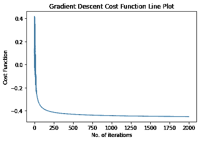**

**作者照片**

**现在我们来评估一下:**

```
**accuracy = round((log_reg_bgd.predict(X_test) == y_test).mean(),2)
accuracy**
```

**所以，现在你已经从零开始成功实现了逻辑回归！**

## **有些家庭作业要你做:**

*   **我们可以看到，在优化方面，批量梯度下降是明显的赢家。但是，您可以尝试用更少的迭代再次运行它，因为它似乎已经收敛了。有什么区别？**
*   **尝试跳过特征缩放。这对你的成绩有影响吗？**
*   **试着省去截距项。这有多大的影响？**

**在过去的几个月里，我真的很喜欢写博客，我很感激所有关注我的人，他们总是对我的工作表示赞赏。因此，我要感谢你在百忙之中抽出时间来阅读这篇文章，我希望继续写出更多有趣的文章来与世界分享。敬请期待，祝你玩得愉快！**

****

**蕾妮·费希尔在 [Unsplash](https://unsplash.com/s/photos/goodbye?utm_source=unsplash&utm_medium=referral&utm_content=creditCopyText) 上的照片**