# 用 Python 从头到尾的机器学习算法:SVM

> 原文：<https://towardsdatascience.com/machine-learning-algorithms-from-start-to-finish-in-python-svm-d9ff9b48fd1?source=collection_archive---------1----------------------->

## 学习、理解和实现最强大的通用机器学习算法之一。


迈克·洛索在 [Unsplash](https://unsplash.com/s/photos/street?utm_source=unsplash&utm_medium=referral&utm_content=creditCopyText) 上的照片

支持向量机是非常通用的机器学习算法。它们受欢迎的主要原因是它们能够使用所谓的*内核技巧执行线性和非线性分类和回归；如果你不知道那是什么，不要担心。完成本文后，您将能够:*

*   了解什么是 SVM 及其工作原理
*   区分*硬边际 SVM* 和*软边际 SVM*
*   用 Python 从头开始编写 SVM 代码

所以，事不宜迟，让我们开始吧！

# 什么是 SVM，我为什么需要它？


由 [Paolo Nicolello](https://unsplash.com/@paul_nic?utm_source=unsplash&utm_medium=referral&utm_content=creditCopyText) 在 [Unsplash](https://unsplash.com/s/photos/confused?utm_source=unsplash&utm_medium=referral&utm_content=creditCopyText) 上拍摄的照片

有了这么多其他算法(线性回归、逻辑回归、神经网络等..)你可能想知道为什么你的工具箱里还需要一个！也许这些问题可以借助图表来回答:

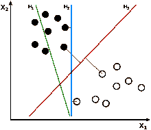

图片来自[维基百科](https://en.wikipedia.org/wiki/Support_vector_machine)

在这里，我们看到了对数据进行分类的三个潜在决策边界:H1、H2 和 H3。首先，H1 根本不区分阶级，所以它不是一个好的超平面。H2 确实分离了类别，但是请注意，点与点之间的差距(或*街道*)是如此之小，并且这个分类器不太可能在看不见的实例上表现良好。

第三个超平面，H3，代表 SVM 分类器的决策边界；这条线不仅将两个类别分开，而且在两个类别的最极端点之间保持最宽的距离。

你可以把 SVM 看作是两个阶层之间最大的差距。这就是所谓的*大幅度分类。*

# 大幅度分类


照片由[维基百科](https://en.wikipedia.org/wiki/Support_vector_machine)

如我所说，大间隔 SVM 分类器本质上试图在两个类之间拟合尽可能宽的街道(用平行虚线表示)。需要注意的是，添加更多“远离街道”(不在虚线上)的实例不会影响决策边界。

决策边界完全由类的最极端的实例确定(或由*支持*),或者换句话说，位于街道边缘的实例。这些被称为*支持向量(*它们在图*中用黑色圈出)。*

## 硬利润分类的限制


照片由 [Ludovic Charlet](https://unsplash.com/@ludo_photos?utm_source=unsplash&utm_medium=referral&utm_content=creditCopyText) 在 [Unsplash](https://unsplash.com/s/photos/limit?utm_source=unsplash&utm_medium=referral&utm_content=creditCopyText) 上拍摄

所以本质上，硬边界 SVM 基本上试图拟合一个决策边界，最大化两个类的支持向量之间的距离。但是，这种模式存在一些问题:

1.  它对异常值非常敏感
2.  它只对线性可分的数据有效

这两个概念可以在这个观想中清晰地突出出来:

## 问题 1:它对异常值非常敏感

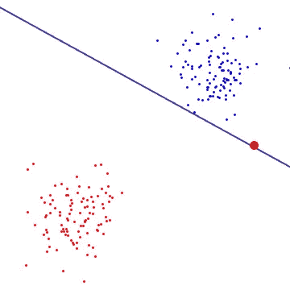

照片由 [StackOverflow](https://stackoverflow.com/questions/4629505/svm-hard-or-soft-margins/4630731) 拍摄

请注意红点是一个极端的异常值，因此 SVM 算法将它用作支持向量。因为硬边界分类器找到支持向量之间的最大距离，所以它使用红色异常值和蓝色支持向量来设置决策边界。

这导致很差的决策边界，很可能过度拟合，并且将不能很好地预测新的类。

## 问题 2:它只对线性可分的数据有效

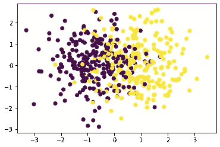

作者照片

在这个例子中，我们可以清楚地观察到，没有可能的线性分类器将类别分开。此外，还有一个主要的异常值。所以，问题是，SVM 如何分离非线性可分数据？

# 处理异常值和非线性数据

## 方法一:软利润 SVM

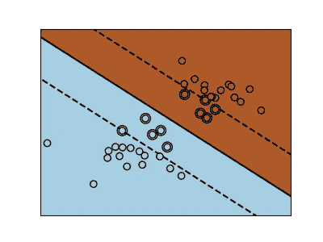

作者照片

一种方法是在保持街道尽可能宽(最大化裕量)和限制*裕量违规(*这些实例最终出现在街道中间，甚至出现在街道的错误一侧*)之间找到良好的平衡。*这叫做*软边际 SVM。*

本质上，您是在控制两个目标之间的权衡:

1.  **最大化**决策边界和支持向量之间的**距离**
2.  **最大化**被决策边界正确分类的**点数**

这种权衡通常由一个超参数控制，这个超参数可以用λ表示，或者更常见的(在 scikit-learn 中)是 **C** 参数。这实质上控制了错误分类成本。具体来说，

*   **C** 的小**值导致更宽的街道，但更多的边界违规(更高的偏差，更低的方差)**
*   a**C**的值越大，街道越窄，但边界违规越少(低偏差、高方差)。

尽管这种方法可行，但我们必须使用交叉验证技术找出最佳的 **C** 参数。这可能需要相当长的时间。此外，人们可能希望创建一个最佳模型，并且没有任何跨越边界违规的“松弛”变量。那么我们现在的解决方案是什么？

## 方法二:内核

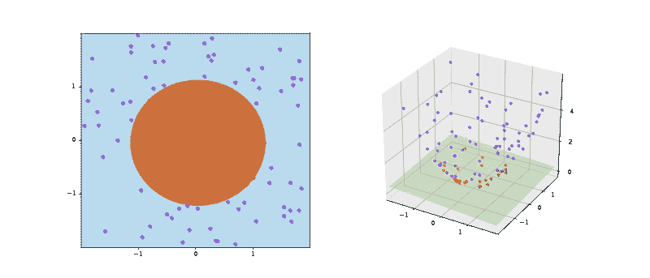

图片来自[维基百科](https://en.wikipedia.org/wiki/File:Kernel_trick_idea.svg)

虽然线性 SVM 在大多数情况下都很有效，但是很少有数据集是线性可分的。解决这个问题的一个方法是添加更多的特性，比如多项式特性(这些特性本质上是通过将值提升到一个 **N** 次多项式来改变你的特性(想想 X，X，等等..)).

例如，假设我们有以下数据:

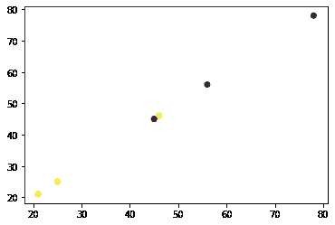

作者照片

显然，这个数据集不是线性可分的。

然而，当我们通过将根提升到 20 的幂来应用多项式变换时:


作者照片

我们得到一个线性可分的数据集。

然而，这对于大型数据集是不可行的；进行多项式变换所需的计算复杂度和时间太长，计算成本太高。

此外，使用高次多项式次数会创建大量的要素，从而使模型太慢。

这就是 SVM 的魅力所在。更确切地说，*内核的妙处在于*

# 内核技巧


照片由[朱利叶斯德罗斯特](https://unsplash.com/@juliusdrost?utm_source=unsplash&utm_medium=referral&utm_content=creditCopyText)在 [Unsplash](https://unsplash.com/s/photos/magic?utm_source=unsplash&utm_medium=referral&utm_content=creditCopyText) 上拍摄

本质上，核是计算非线性可分离数据点之间的关系并将它们映射到更高维度的不同函数。然后它适合一个标准的支持向量分类器。它有效地将特征从相对低的维度映射到相对高的维度。

然而，核函数仅计算数据点之间的高维度关系，就好像它们在更高维度中一样；它们实际上不做转换，这意味着内核函数不添加任何特性，但是我们得到的结果和我们做的一样。

这种技巧(计算数据点之间的高维关系，而不实际创建或转换它们)被称为**内核技巧**。

内核技巧通过避免将特征从低维转换到高维的数学运算，降低了 SVM 的计算复杂度！

让我们看看两个常见的内核函数:

1 .多项式核

2.高斯径向基函数

# 核函数 1:多项式核


由[克里斯·劳顿](https://unsplash.com/@chrislawton?utm_source=unsplash&utm_medium=referral&utm_content=creditCopyText)在 [Unsplash](https://unsplash.com/s/photos/transformation?utm_source=unsplash&utm_medium=referral&utm_content=creditCopyText) 上拍摄

本质上，这使用多项式核来计算数据点之间的高维关系，并将数据映射到更高维度，而不添加任何特征。

多项式核的公式如下(我很抱歉没有警告就用数学来打击你！):

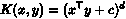

作者照片

*   这里的 *d* 是一个超参数，指的是函数应该使用的多项式的次数。

## 一个例子

举个具体的例子，假设我们有这样的数据:

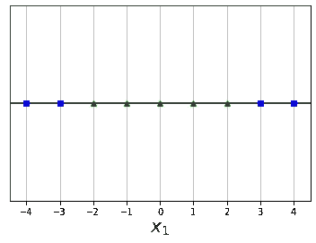

作者照片

显然，这个数据不是线性可分的。然而，如果我们使用具有多项式核的 SVM，我们将得到以下高维映射:

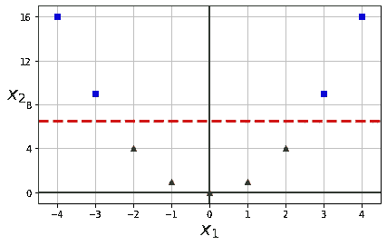

作者照片

同样，从中得出的重要思想是，核函数仅计算点之间的高维关系，就像它们在高维空间中一样，但不创建或变换新的要素。

以下代码使用 scikit-learn 中的 SVC 类实现了一个多项式内核:

```
from sklearn.svm importSVC svc = SVC(kernel="poly", degree=3, coef0=1, C=5))
svc.fit(X_train,y_train)
```

显然，如果你的模型过拟合，你可能需要降低多项式的次数。您可能已经注意到这里的一些参数。让我简单解释一下:

*   **内核:**定义要使用的内核(我们将在后面探索一些其他选项)
*   **次数:**定义多项式内核的次数
*   **C** :分类误差，主要控制具有最大可能裕度和最大化决策边界正确分类的点数之间的权衡。

# 核函数 2:高斯 RBF 核


苏珊·d·威廉姆斯在 [Unsplash](https://unsplash.com/s/photos/transformation?utm_source=unsplash&utm_medium=referral&utm_content=creditCopyText) 上的照片

另一个非常流行的 SVM 核是*高斯径向基函数(高斯 RBF)。*本质上，这是一个计算实例和一个*地标之间距离的相似度函数。*内核函数的公式如下:

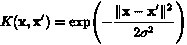

图片来自[维基百科](https://en.wikipedia.org/wiki/Radial_basis_function_kernel)

澄清一些符号(注意:任何不清楚的地方将很快解释清楚):

*   x:指一个实例
*   ' x ':指的是一个*地标*
*   σ:这是指*伽玛*

该函数本身遵循一条钟形曲线(因此它是*高斯*)，范围从 0(离地标非常远)到 1(在地标处)。

我确信这在你的脑海中仍然是模糊的，所以让我们用我所知道的唯一方法来澄清这种困惑；举个例子！

## **一个例子**

观察下面的 1D 数据图表:

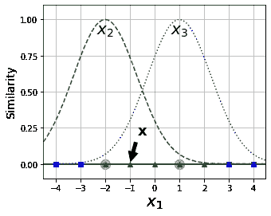

作者照片

*界标*本质上是数据集中的一个点，我们将使用它来获得。这里我们有两个地标， **X2** 和 **X3。**

我们现在准备计算新的特征。比如我们来看实例 **X，**等于-1。它位于距第一地标 1 的距离和距第二地标 2 的距离处。因此，其新的映射特征将是:

```
*x*2 = exp (–0.3 × 12) ≈ 0.74
```

**和**

```
*x*3 = exp (–0.3 × 22) ≈ 0.30
```

如下图所示:

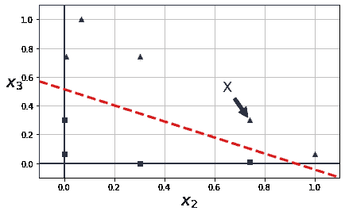

作者照片

现在我们简单地用一个普通的 SVC 来分类这些点！

你可能在想，酷！但是:

1.  你如何选择地标？
2.  你还没解释伽马到底是什么意思！

**选择地标**

如此真实。为了解决第一个问题，通常在数据集中每个实例的位置创建一个地标。这产生了许多维度，从而增加了变换后的训练集是线性可分的机会。

然而，再一次，就像多项式变换一样，这在计算上是昂贵的，并且需要添加许多功能，想象一下，如果您有一个具有 *m* 个实例和 *n* 个功能的训练集被变换成一个具有 *m* 个实例和 *m* 个功能的训练集(假设您删除了原始功能)。

换句话说，如果您有 20 个包含 20 个特征的实例，那么计算这些转换将得到 400 个特征！

幸运的是，内核技巧发挥了它的魔力；它使得计算这些更高维度的关系成为可能，而不需要实际转换或创建新的特征，并且仍然得到与你所得到的相同的结果！

**伽玛**

现在，伽马是一个特殊的超参数，它特定于 *rbf* 内核。回到我们上面的 rbf 函数图，gamma 控制每个钟形函数的宽度。

具体来说， *gamma* 的**大值**将缩短钟形曲线的宽度，并减小每个实例的影响范围，从而导致在各个数据点之间摆动的更不规则的决策边界。相反， *gamma* 的**小**值增加了每个数据点的影响范围，并导致更平滑的决策边界。

带有 rbf 内核的 SVC 的 scikit-learn 实现如下:

```
SVC(kernel="rbf", gamma=5, C=0.001)
```

> **注意**:在这篇文章中，我将只编码一个软硬边距的 SVM。但是在将来，我会写一些关于如何在 SVM 实现内核技巧的文章，所以请一定要继续关注

# 硬利润和软利润 SVM 的数学

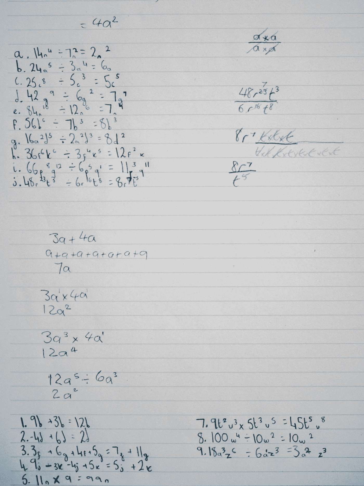

安妮·斯普拉特在 [Unsplash](https://unsplash.com/s/photos/maths?utm_source=unsplash&utm_medium=referral&utm_content=creditCopyText) 上的照片

是的，我很抱歉，但不幸的是，你需要理解数学，以编码它。如果你真的讨厌数学，请随意跳过这一部分，但我强烈建议至少尝试理解正在发生的事情，让你对手头的问题有更好的感觉。

在我真正开始计算之前，让我一步一步地指导您 SVM 是如何工作的:

1.  为数据拟合一个超平面，并尝试对这些点进行分类
2.  使用 ***优化算法****调整模型的参数，使其在支持向量之间保持最大可能的余量。*
3.  *重复 n 次迭代，或者直到 ***成本函数*** 最小化。*

*现在，在我们深入研究 SVM 数学之前，让我解释一些关键术语。*

# *成本函数*

**

*佩皮·斯托扬诺夫斯基在 [Unsplash](https://unsplash.com/s/photos/cost?utm_source=unsplash&utm_medium=referral&utm_content=creditCopyText) 拍摄的照片*

*成本函数本质上是一个衡量损失的公式，或模型的“成本”。如果你曾经参加过任何 Kaggle 比赛，你可能会遇到一些。一些常见的包括:*

*   *均方误差*
*   *均方根误差*
*   *绝对平均误差*
*   *原木损失*

*我们将使用的成本函数被称为*铰链损耗。*函数的公式如下:*

*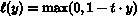*

*图片来自[维基百科](https://en.wikipedia.org/wiki/Hinge_loss)*

*从图形上看，铰链损耗如下所示:*

*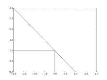*

*图片来自[维基百科](https://en.wikipedia.org/wiki/Hinge_loss)*

*在该图中，蓝色代表正确分类的损失，绿色代表错误分类的损失。*

*请注意，即使我们对数据点进行了正确的分类，铰链损失也会影响数据点在边缘内的预测。*

*本质上，我们将使用这一点来衡量我们的算法的性能，并确保我们达到我们的目标(最大限度地提高利润)*

# *优化算法*

*优化通常被定义为改进某样东西的过程，以使其发挥最大潜力。这也适用于机器学习。在 ML 的世界中，优化本质上是试图为某个数据集找到最佳的参数组合。这本质上是机器学习的“学习”部分。*

*虽然存在许多优化算法，但我将讨论其中最常见的两种:梯度下降和正规方程。*

# *梯度下降*

*梯度下降是一种优化算法，旨在找到一个函数的最小值。它通过在斜率的负方向迭代地采取步骤来实现这个目标。在我们的例子中，梯度下降通过移动函数切线的斜率来不断更新权重。好极了，听起来很棒。请说英语。:)*

# *梯度下降的一个具体例子*

**

*卢卡斯·克拉拉在 [Unsplash](https://unsplash.com/s/photos/mountain?utm_source=unsplash&utm_medium=referral&utm_content=creditCopyText) 上的照片*

*为了更好地说明梯度下降，让我们通过一个简单的例子。想象一个人在山顶，他/她想到达山下。他们可以做的是环顾四周，看看他们应该朝哪个方向迈一步，以便更快地下来。然后，他们可能会朝那个方向迈出*一步*，现在他们离目标更近了。然而，他们下来时必须小心，因为他们可能会让*卡在某个点上*，所以我们必须确保*相应地选择我们的步长。**

*类似地，梯度下降的目标是最小化一个函数。在我们的案例中，是为了最小化我们模型的成本。这是通过找到函数的切线并向那个方向移动来实现的。算法的“*步骤*的大小由所谓的*学习率来定义。*这基本上控制了我们向下移动的距离。有了这个参数，我们必须小心两种情况:*

1.  *学习率太大，算法可能不收敛(达到最小值)并在最小值附近跳动，但永远不会收敛*
2.  *学习率太小，算法将花费太长时间达到最小值，还可能“卡”在次优点。*

*我们还有一个参数来控制算法在数据集上迭代的次数。*

*从视觉上看，该算法会做这样的事情:*

*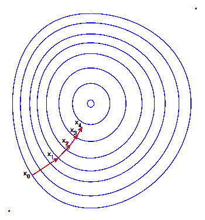*

*图片来自[维基百科](https://en.wikipedia.org/wiki/Gradient_descent)*

*因为这种算法在机器学习中非常重要，所以让我们回顾一下它的作用:*

1.  *随机初始化权重。这叫做(你猜对了)*随机初始化**
2.  *然后，该模型使用这些随机权重进行预测。*
3.  *模型的预测通过成本函数进行评估。*
4.  *然后，模型运行梯度下降，通过找到函数的切线，然后在切线的斜率中采取一个步骤*
5.  *该过程重复 N 次迭代，或者如果满足标准。*

*这个过程在数学上显示如下:*

**

*作者照片*

*这里需要注意的重要事项:*

**α:* 这是学习率的符号(记住:步长的大小)*

**m* :训练样本数*

**h(θx)* :我们的预测*

**θn:* 我们算法的第 n 个系数*

# *梯度下降的优点和缺点*

# *优势:*

1.  *梯度下降很可能将成本函数降低到全局最小值(非常接近或= 0)*
2.  *最有效的优化算法之一*

# *缺点:*

1.  *在大型数据集上可能会很慢，因为它使用整个数据集来计算函数切线的梯度*
2.  *容易陷入次优点(或局部最小值)*
3.  *用户必须手动选择学习速率和迭代次数，这可能很耗时*

*好的，我知道你真的想开始实际的编码，但是这最后一部分是 SVM 数学中最重要的部分，所以坚持住！*

# *SVM 的数学*

***对于预测**:*

*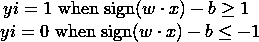*

*作者照片*

*我们主要做以下工作:*

*   *如果权重乘以特征减去偏差项的点积的符号大于或等于 1，则预测 **1***
*   *如果权重乘以特征减去偏差项的点积的符号小于或等于-1，则预测 **0***

***条件**:*

*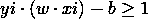*

*作者照片*

*这是正分类的铰链损失的条件。这由我们之前看到的铰链损耗图上的蓝线表示。基本上，这将检查给定实例的分类是正确的还是错误的。*

***正确分类:***

*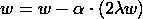*

*作者照片*

*这是我们正确分类的公式。澄清:*

**w* :算法的权重*

**α:* 我们之前谈到的梯度下降的学习率*

*λ:正则化参数(相当于 **C** 参数)*

***分类不正确:***

*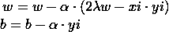*

*作者照片*

*这是不正确分类的公式。请注意我们是如何调整偏置项的。*

*好了，最后，女士们先生们，重头戏:SVM 从零开始！*

# *从头开始编写 SVM 代码*

**

*克里斯里德 T21 在 Unsplash 上的照片*

*让我们终于开始了！首先，让我们做一些基本的导入:*

```
*import numpy as np 
import matplotlib.pyplot as plt
from sklearn import datasets
from sklearn.model_selection import train_test_split*
```

*是的，没有 sklearn 型号！这将用简单的数字编码！*

*接下来，让我们创建一个基本数据集，并将数据分为训练和测试两部分:*

```
*X, y =  datasets.make_classification(n_samples=500, n_features=5, random_state=42, class_sep=0.7)
X_train,X_test,y_train,y_test = train_test_split(X,y,random_state=42, test_size=0.2)*
```

*我准备为这个教程制作一个合成数据集，将 *class_sep* 设置为 0.7，意思是 if 应该相对简单的对数据进行分类。*

*现在，为了遵守软件工程原则，我将创建一个 SVM 类，并构建它以使代码看起来更整洁，更易于共享:*

```
*class SVM:def __init__(self, learning_rate=0.001, C=0.001, n_iters=100):
        self.lr = learning_rate
        self.C = C
        self.n_iters = n_iters
        self.w = None
        self.b = None*
```

*因此，在这里，我们基本上初始化我们的学习率，正则化参数，迭代次数，我们设置权重和偏差等于零。*

*接下来，我们定义我们的*拟合*方法:*

```
*def fit(self, X, y):
        n_samples, n_features = X.shape

        # Convert 0 labels to be -1 to set threshold with hinge loss
        y_ = np.where(y <= 0, -1, 1)

        self.w = np.random.rand(n_features)
        self.b = 0*
```

*一旦给定了训练特征和目标向量，我们就可以随机地将我们的权重初始化为特征数量的向量。请注意我们如何将数据集中的 0 值转换为等于-1，这样我们就可以使用铰链损耗。*

*现在，我们继续这个方法的核心:*

```
*for _ in range(self.n_iters):
    for idx, x_i in enumerate(X):
        condition = y_[idx] * (np.dot(x_i, self.w) - self.b) >= 1*
```

*因此，我们主要做了以下工作:*

1.  *循环 n_iters 次(默认情况下 n_iters=100)*
2.  *对于选定的索引和值 X，我们设置我们的条件，检查我们选定的目标值乘以我们选定的实例和权重的点积减去偏差是否大于或等于 1。这实质上检验了我们根据铰链损耗分类是否正确。*

*接下来，我们将用于**正确分类**的公式翻译成代码:*

```
*if condition:
    self.w -= self.lr * (2 * self.C * self.w)*
```

*而我们对**的公式不正确的归类**成代码:*

```
*else:
    self.w -= self.lr * (2 * self.C * self.w - np.dot(x_i, y_[idx]))
    self.b -= self.lr * y_[idx]*
```

*最后，我们定义我们的*预测*函数:*

```
*def predict(self, X):
    preds = np.sign(np.dot(X, self.w) - self.b)
    return np.where(preds == -1,0,1)*
```

*我们确保将等于-1 的标签转换回零。*

*现在，我们只需调用我们的函数，并在测试集上获得我们的模型的准确性:*

```
*clf = SVM()
clf.fit(X_train, y_train)preds = clf.predict(X_test)(preds == y_test).mean()OUT:
0.82*
```

*我添加了一个 visualise_svm()函数来帮助可视化 svm，可以从我在本文末尾添加的 Github repo 中访问它。然而，运行该函数会输出以下内容:*

*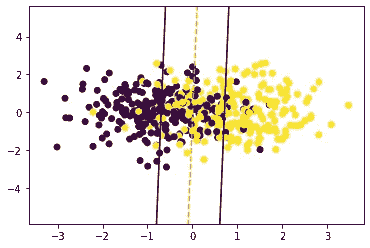*

*作者照片*

*现在，如果你还没有猜到，我们刚刚实施了软保证金 SVM。我们将 **C** 的值设置为 0.001，我们可以清楚地看到，决策边界允许一些点位于边缘和错误的一侧，但却产生了更好的超平面。*

*现在，当我们将 **C** 值更改为 0.9(非常小的正则化)时，我们会得到以下图形:*

*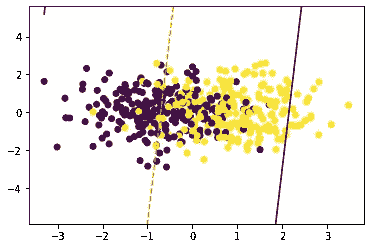*

*作者照片*

*我们的准确率从 0.82 降到了 0.7*

***锁定作业***

*我想让你尝试一些任务:*

1.  *试着把 C 调成一个很小很大的值？决策边界如何变化？*
2.  *调整梯度下降算法的学习率。你会得到更好的结果吗？*

*真的很感谢每一个激励我写出好文章的人。我感谢我的忠实追随者和所有决定阅读我作品的人。我向你保证，这不会被忽视。我希望总能为读者创作出有趣的、引人入胜的作品。*

*我希望你学到了新的东西，并可能刷新了一些旧的知识。一定要继续关注更多，祝你一切顺利！*

*PS:这里是 [Github 代码](https://github.com/Vagif12/ML-Algorithms-From-Scratch/blob/main/SVM%20from%20Scratch.py)的链接*

**

*由 [Kelly Sikkema](https://unsplash.com/@kellysikkema?utm_source=unsplash&utm_medium=referral&utm_content=creditCopyText) 在 [Unsplash](https://unsplash.com/s/photos/thank-you?utm_source=unsplash&utm_medium=referral&utm_content=creditCopyText) 上拍摄的照片*