# 处理机器学习中的类不平衡

> 原文：<https://towardsdatascience.com/machine-learning-and-class-imbalances-eacb296e776f?source=collection_archive---------19----------------------->

斯科特·凯利在 [Unsplash](https://unsplash.com/?utm_source=unsplash&utm_medium=referral&utm_content=creditCopyText) 上拍摄的照片

## 处理高度不平衡数据的策略

# 介绍

将机器学习应用于现实世界的问题非常罕见，你可能会在教程或数据科学课程中找到一些简单明了的东西。很多时候你会遇到分类问题，你试图预测一些不经常发生的事情。这在试图预测诸如转换、流失、欺诈之类的事情时很常见。在这篇文章中，我将谈论机器学习中的阶级不平衡。特别是，我想回顾一下不平衡数据的一些含义，并强调和解释一些解决方法。我的希望是，在这篇文章结束时，你将拥有处理你可能遇到的任何预测问题所需的工具。

## 什么是不平衡数据，为什么这是一个问题？

就像我上面说的，当我们试图预测的类的比例有显著差异时，不平衡的数据就会出现。例如，在许多行业中，客户在一段时间内的流失是相对罕见的(希望如此)。如果我们尝试制定一个机器学习模型来预测客户是否会流失，我们可能只有 5%的客户会流失，而 95%的客户不会流失。对于像转换或欺诈这样的事情，这可能会更低。

好了，这个问题有希望变得更清楚一点，但是我们为什么要关心这个呢？我们来训练一下模型，做一些预测。让我们以上段中的流失为例，估计一个逻辑回归。在对模型进行估计后，我们得到了 95%的正确预测。那很容易。但是，如果我们更深入地研究结果，并查看混淆矩阵，我们可能会发现类似下面的图 1。我们的模型预测，基本上没有人搅动。这不是很有帮助，我们可以自己做这个预测，省去写代码的麻烦。显然，这种模式是非常无用的，并没有真正增加任何价值。这是怎么回事？为什么我们的模式这么差？训练集是如此不平衡，以至于模型很难在少数类中找到有用的模式。这在逻辑回归等算法中更为明显，因为它假设类分布是相等的。幸运的是，有几种方法可以解决这个问题，这就是我在这篇文章中将要经历的。

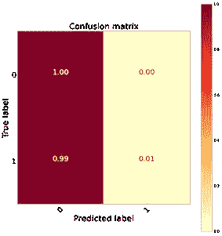

图 1:混乱矩阵:不平衡的数据

# 取样技术

我们可以尝试的第一个潜在解决方案是对数据进行重新采样，以平衡类别。我们可以尝试几种不同的采样方法，所有这些方法都可以在 ***imblearn*** python 库中轻松实现。

***要提到的一个关键点是，这些重采样技术应该只在训练数据上执行。测试集应该保持不平衡。***

为了开始我们的分析，让我们首先使用 sklearn 的一个方便的函数来创建一个数据集。***make _ classification***函数非常有用，允许我们创建一个数据集来演示这些技术和算法。请注意，我们已经将权重=[0.99，0.01]添加到参数中，以生成不平衡的数据集。这种不平衡程度非常类似于我最近参与的一个机器学习项目，在实践中看到这样的数据集并不罕见。

## 随机欠采样

首先，让我们看看欠采样。这种技术非常简单，包括从多数类中随机选择样本，并将这些样本与我们的少数类一起用于训练数据。结果是我们得到了相同数量的正面和反面的例子，可以避免上述问题。这种技术的优点是非常容易实现，而且非常有效。不利的一面是，你实际上是在丢弃数据。我可能不喜欢这种方法，除非我的训练数据非常大，并且我有能力扔掉这些数据。在下面的图 2 中，我们可以看到实现这一点的代码以及欠采样后的训练集。请注意我们删除了多少数据。

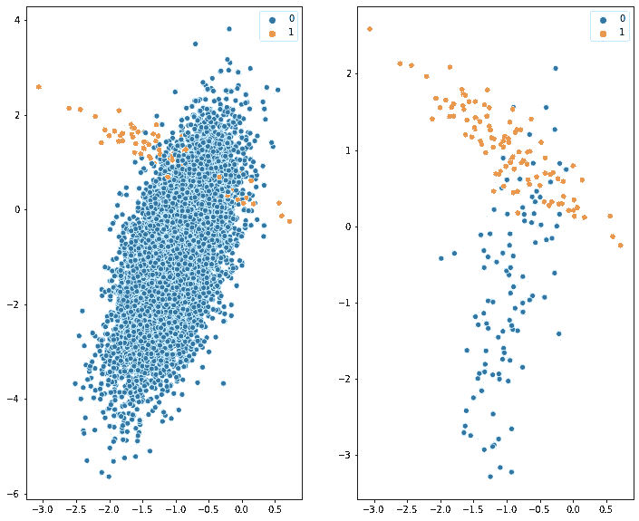

图 2:训练数据(左)，欠采样(右)

## 随机过采样

过采样与欠采样相反。使用这种方法，我们从少数类中随机抽取数据，并复制它以创建更多的样本。我们这样做，直到类分布相等。尽管这对于解决失衡很有用，但也有一些缺点。最主要的一点是我们正在复制已经存在的数据。这意味着我们实际上并没有给分类问题添加任何额外的信息，这可能会导致过度拟合，这是我们绝对希望避免的。

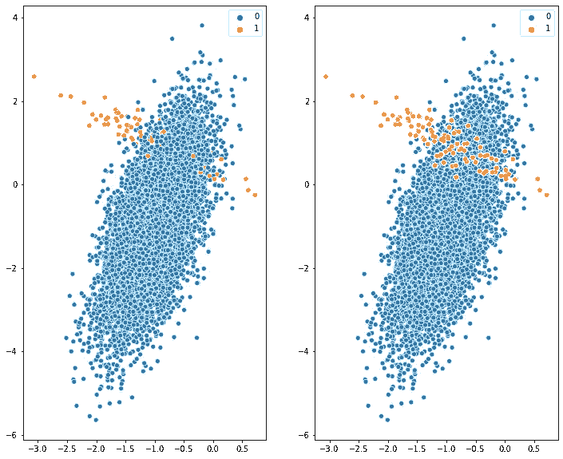

图 3:训练数据(左)，过采样数据(右)

## 合成少数过采样技术

顾名思义，SMOTE 是一种过采样方法，用于从我们已经拥有的数据中生成额外的数据。它类似于随机过采样，但我们不是复制现有数据，而是生成新的合成数据。最初的[论文](https://arxiv.org/pdf/1106.1813.pdf)对该技术描述如下:

*“通过获取每个少数类样本并沿着连接 k 个少数类的任何/所有最近邻居的线段引入合成样本，对少数类进行过采样”。*

那么这意味着什么呢？嗯，该算法首先使用 k-最近邻来决定我们将使用哪些数据点来产生新数据。为简单起见，假设我们选择 k = 1。该算法将在我们最近邻的数据点之间创建一条线段，并沿着这条线在某处产生一个新的数据点。假设我们正在生成数据的特性是自用户上次访问我们的网站以来的天数。为了生成新的合成数据，该算法计算两个新变量。 ***间隙*** 是介于 0 和 1 之间的随机数，假设我们得到 0.8，以及 ***diff，*** 是用户最后一次访问我们的第一个数据点(20)和它的最近邻居(15)的天数之差。该特征的合成数据值为:24 = 20+(20–15)* . 8。

好的，让我们看看如何用 python 实现它，并可视化算法产生的结果。你可能会认为图表看起来有点奇怪，我可能会同意，但这只是算法的人工产物，并强调数据是“合成的”而不是全新的，因为它直接取决于其他数据点(或至少是最接近的数据点)。

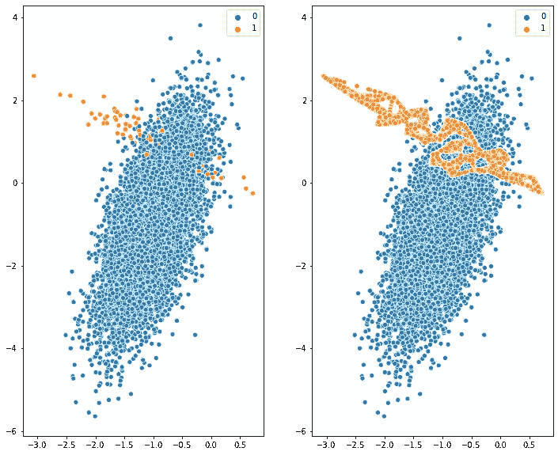

图 4:训练数据(左)，SMOTE(右)

这些技术各有利弊，但在实践中，我建议尝试所有这些技术，看看哪种效果最好，并让您的模型度量来指导您。

对于那些对细节更感兴趣的人，这里有一个全文链接:[https://arxiv.org/pdf/1106.1813.pdf](https://arxiv.org/pdf/1106.1813.pdf)

# 类别加权

正如我上面提到的，许多机器学习算法假设类分布是相等的，所以它们可能不能很好地开箱即用。逻辑回归就是这种情况。为了避免这个问题，在 sklearn 中有一个很好的参数叫做***class _ weights***，它让我们告诉模型什么是类分布。这是一个简单而有效的解决方案，过去我发现它非常成功。更具体地说，它将更多地惩罚在少数群体中犯错误的模型。这些错误将使最小化成本函数变得更加困难，因此模型学习更加强调正确地得到少数类。

下面的代码展示了我们如何用 python 实现这一点。我们可以选择 class_weight = 'balanced ',或者传递一个具有特定类权重的字典，例如 weights = {0:0.01，1:1.0}

在向您介绍和解释了各种技术之后，我想我也将分享我与一位同事在讨论不平衡数据时的一段有趣对话。他指出:

***使用逻辑回归等模型时，不平衡数据并不重要，只要它不影响系数估计值(仅截距)。***

截距将根据不平衡进行调整，系数将保持不变。经过思考，我意识到他是对的。然而，这有一个问题。如果你画出预测概率的分布，你可能会看到一个非常偏斜的分布。例如，当我这样做的时候，我的分布范围是从 0 到 0.2。这对我来说是一个问题，特别是当模型的输出需要被解释并向你公司的业务团队解释的时候。仅仅因为这个原因，我认为重新平衡数据要好得多，尽管原则上逻辑回归可以处理不平衡。

# 算法和度量

正如我前面提到的，在处理不平衡数据时，算法的选择也会极大地影响您的结果。选择合适的指标来评估模型的性能也是非常重要的。同样，在这种情况下，准确性不是一个特别有用的衡量标准。使用 ROC AUC、Precision 和 Recall 以及混淆矩阵等指标，我们可以更好地了解模型的表现。

在这里，我不会深入探讨这些指标是如何工作的，但这里有一些资源可以详细介绍这些指标。

*   [中华民国 AUC](https://medium.com/greyatom/lets-learn-about-auc-roc-curve-4a94b4d88152)
*   [精度和召回](/beyond-accuracy-precision-and-recall-3da06bea9f6c)

# 测试不同的方法

好了，这是足够的背景材料，让我们进入有趣的部分，看看这个例子的一些代码。我最近不得不在一个项目中应用这些技术，它们对我来说相当不错。不幸的是，由于数据是敏感的，我不能显示它，但我们可以通过生成一些数据来重新创建一个类似的场景。在任何情况下，我在这里展示的技术和代码应该可以很容易地转移到其他分类问题上。下面我们将评估几个不同的模型，看看它们在不平衡数据集上的表现。然后，我们将尝试上述技术，看看它们如何使用一些关键的分类性能指标来改善我们的结果。

## 生成建模数据

同样，我们可以使用 sklearn 中的 make_classification 函数来创建不平衡数据集。对于这个例子，我们将有 1%的正面例子和 99%的负面例子。

## Imblearn 管道

为了使用不同的采样技术来估计这些模型，我们将使用 imblearn 管道。我相信你们中的一些人听说过 sklearn 管道，这些管道本质上是相同的，但专门用于采样技术。据我所知，目前还不能在 sklearn 管道上使用这些采样技术。这是我第一次使用管道，我不得不说，它们让你的代码更干净，更容易阅读。它们非常方便，所以我一定会将它们融入到我的工作流程中。

要使用这些管道，我们需要做的就是创建一个采样类和算法的实例，然后将它们作为元组传递给管道类。我最初试图看看我是否可以将多个算法传递到管道中，即逻辑回归和随机森林，但这不起作用。然而，如果你用一个合适的变换方法传递算法，比如 PCA，它应该工作得很好。从 imblearn 文档中:

管道的中间步骤必须是转换器或重采样器，也就是说，它们必须实现 fit、transform 和 sample 方法。

## 逻辑回归管道代码

## 随机森林管道代码

# 结果

## 逻辑回归

## 不平衡数据

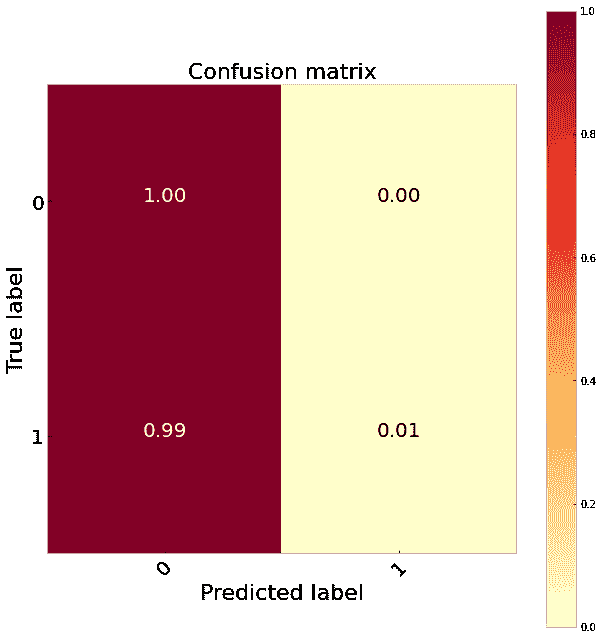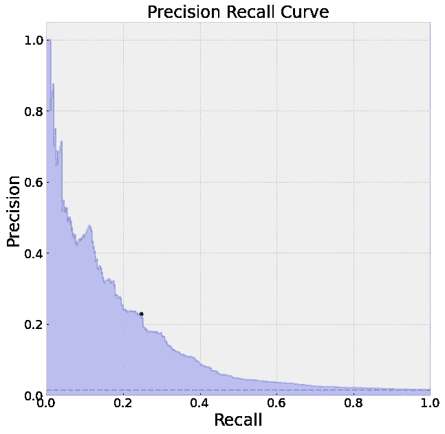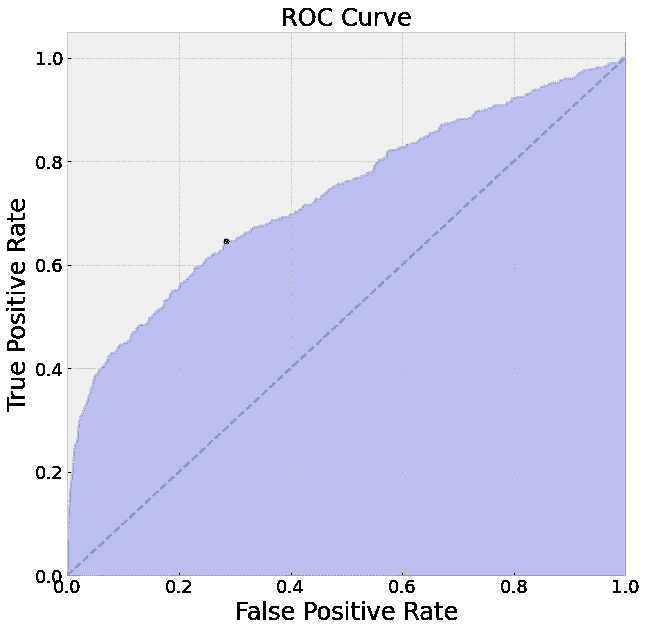

图 5:逻辑回归:不平衡

我们可以看到，不平衡数据集的结果并没有那么好。阈值为 0.5 的模型表现非常差，几乎没有识别出我们的正面例子。我们可以尝试适当地改变阈值，但这将再次给我们非常倾斜的概率输出。我们还可以从我们的 PR 曲线中看到，该模型很难在不犯很多错误的情况下识别积极的标签。有趣的是，中华民国实际上看起来很好。这突出表明，在处理不平衡数据时，ROC 可能是一个误导性的指标。要了解这里发生了什么，想想 ROC 正在绘制的图，真阳性率(TPR)对假阳性率(FPR)。以下是 TPR 和 FPR 的定义。

*   *召回/TPR = TP / (TP+FN)*
*   *FPR = FP / (FP + TN)*

因为我们的阶级不平衡，我们有更多的反面例子。本质上，我们的模型偏向于预测负面例子，所以我们有很多真正的负面(TN)。这使得我们的假阳性率(FPR)不会增加太多，因为我们的 TN 将在分母中增加。这就是为什么我们可以获得高 AUC，即使我们在对正面例子(我们最关心的例子)进行分类时做得不好。然而，如果我们使用精确和回忆，这个问题就被避免了，因为我们根本没有使用真正的否定(TN)。

*   *精度= TP/(TP+FP)*
*   *召回/TPR = TP/(TP+FN)*

在这种情况下，我倾向于使用混淆矩阵和 PR 曲线来衡量模型的性能。*注意，我使用了自己创建的几个助手函数来绘制这些指标。代码位于这篇文章的底部。*所有显示的数字都使用默认阈值 0.5。根据您的使用情况，这可以很容易地改变，以根据需要调整预测。

**我们的抽样方法怎么样？**

总的来说，不同取样方法的结果几乎完全相同。那么这种情况下我们应该怎么做呢？总的来说，这些结果不是很好，所以在这一点上，我建议尝试其他模型。但是，如果我们决定估计一个逻辑回归，我们有一个大的数据集，我们可以支持欠采样，因为它是三个选项中最不复杂的，并尝试优化我们的决策阈值，以提高我们的 TP 率。

## 欠采样

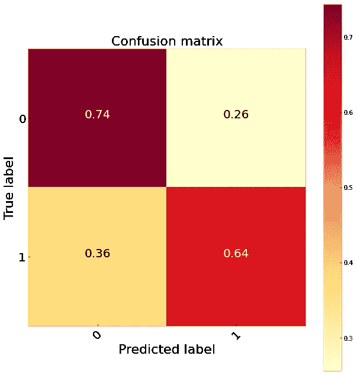

图 6:逻辑回归欠采样

## 过采样

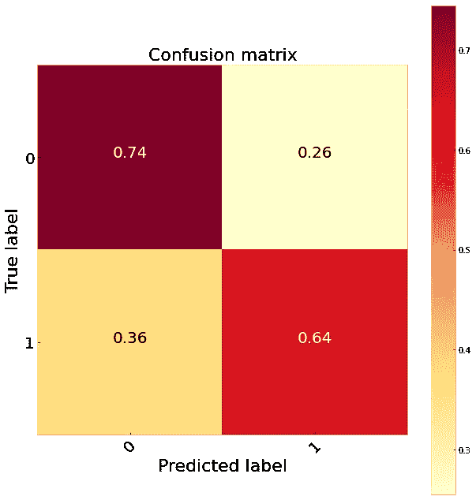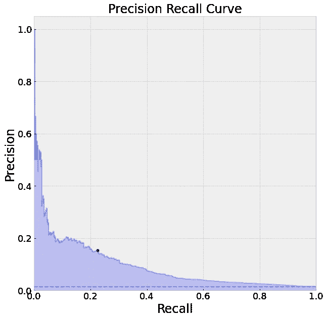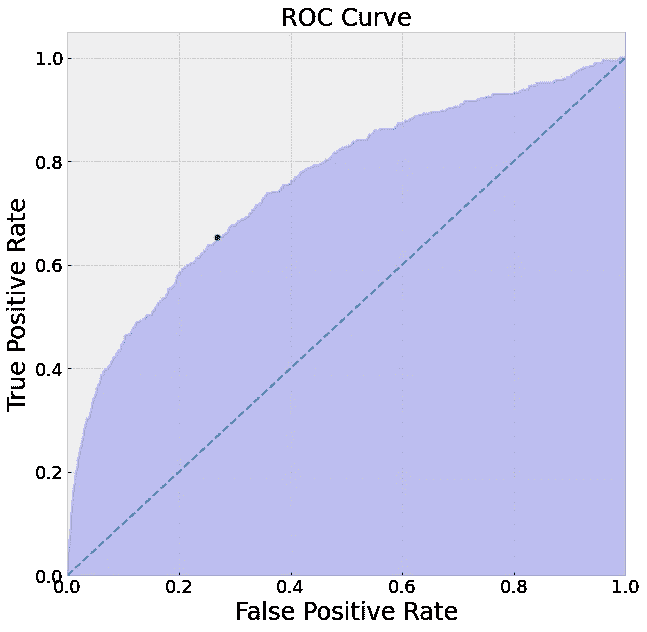

图 7:逻辑回归过采样

## 重击

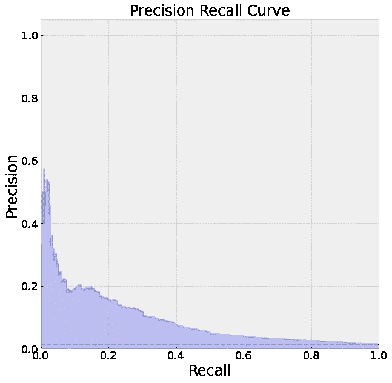

图 8:逻辑回归 SMOTE

# 随机森林

所以逻辑回归在这个问题上表现不太好，我们试试随机森林怎么样。这些模型往往在实践中表现良好，它们通常是我解决分类问题的首选模型。至于结果，该模型在识别 9% TP 的缺省阈值下对不平衡数据的表现略好于逻辑回归。显然，我们想要比这更好的东西，所以让我们再次尝试我们的采样技术。

比较这三种采样方法表明，欠采样对 65%的真阳性进行了最好的分类。它在识别真正的负面因素方面也比逻辑回归做得更好。然而，我们最好的结果来自于平衡类权重。因为这在 sk learn(class _ weights = ' balanced ')中很容易做到，而且我们不必丢弃任何数据，所以这是我的首选。这样做给了我们 70%的 TP 率。

**我们还能做些什么来提高模型得分？**

这里我们还可以尝试一些其他的事情来提高我们的模型性能，并确保我们的预测是稳健的。

1.  KFold 交叉验证:我在这里没有执行交叉验证，但是我建议这样做。使用 sklearn 使用[*cross _ val _ score*](https://scikit-learn.org/stable/modules/generated/sklearn.model_selection.cross_val_score.html)*真的很简单。*
2.  *其他车型:SVM、lightGBM、XGBoost 等等。*
3.  [*超参数优化*](https://scikit-learn.org/stable/modules/grid_search.html) *:这对于有许多超参数的模型特别有用。*

## 欠采样

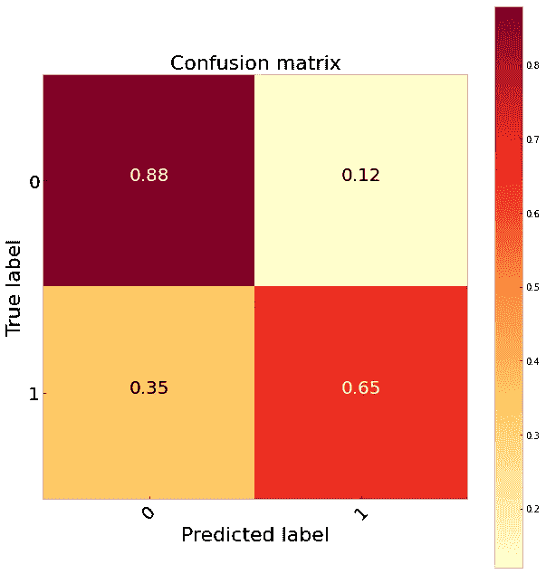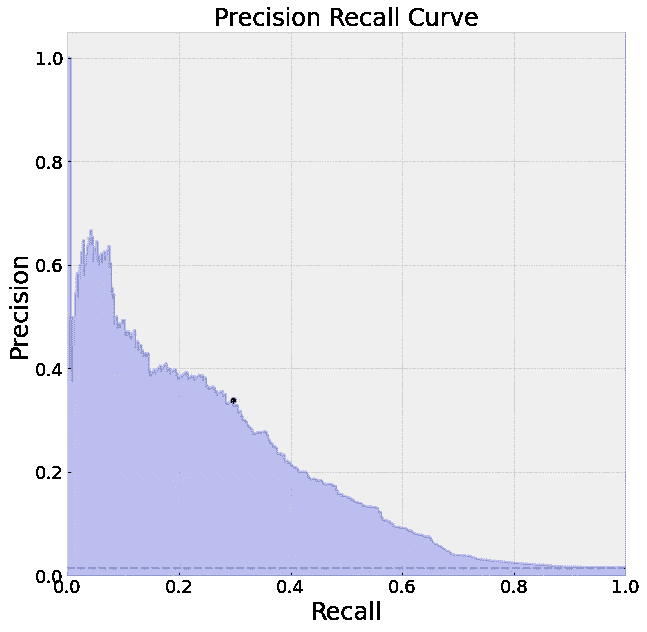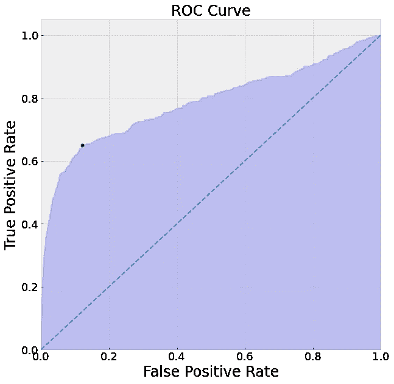

图 9:随机森林欠采样

## 过采样

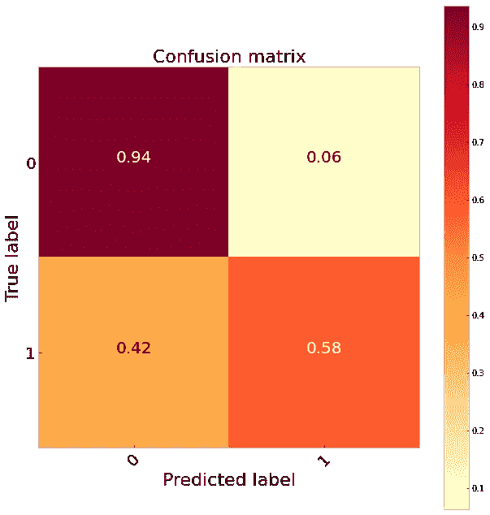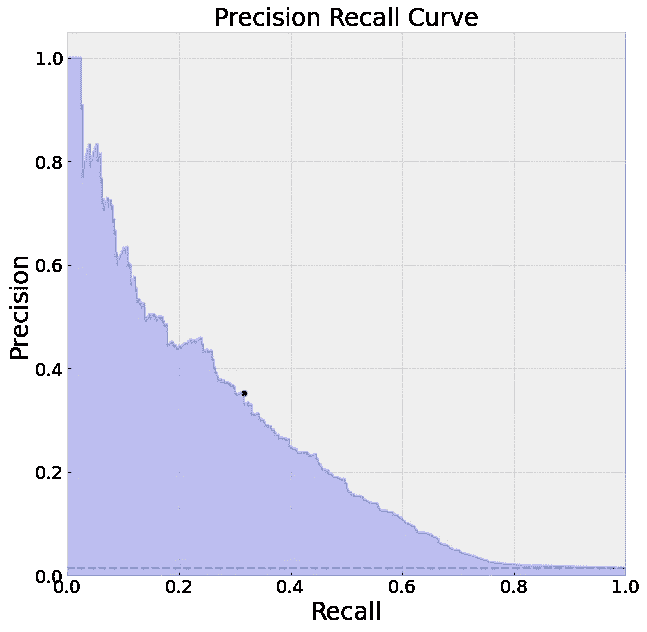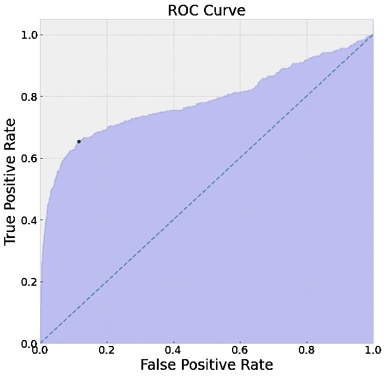

图 10:随机森林过采样

## 重击

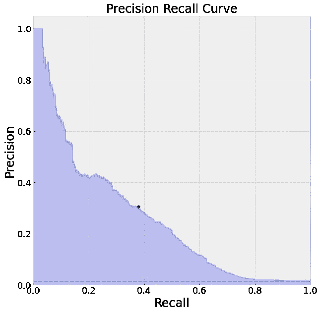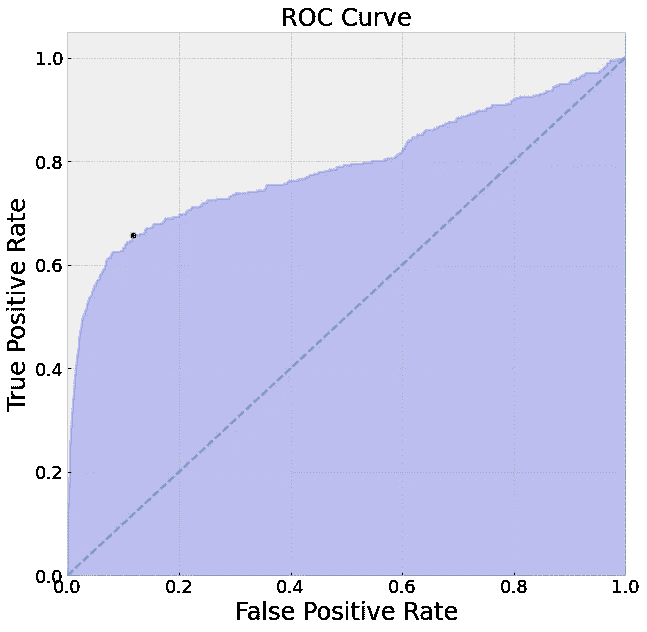

图 11:随机森林重击

## 类别权重

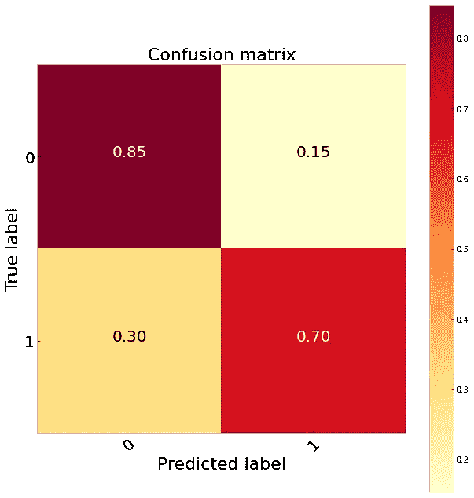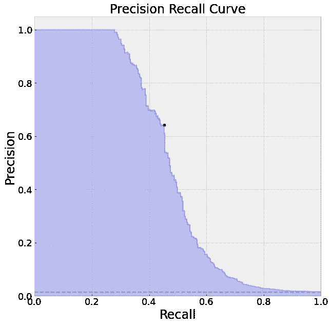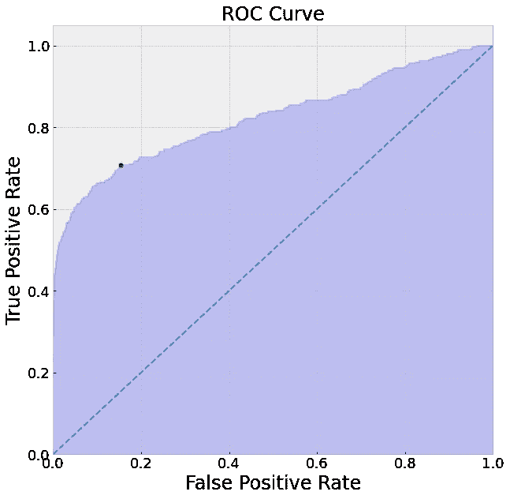

图 12:随机森林类权重

# 主要要点

那么我们能从这些例子中学到什么呢？

*   有许多方法可以解决不平衡数据的问题，每种方法的有效性很可能取决于您的问题和数据。
*   *为特定问题选择合适的指标很重要:我建议多看一个。没有一个指标是完美的。*
*   *尝试多种算法可以给出更好的结果:每种算法都有自己的优点和缺点:例如，随机森林通常表现更好，但可能比逻辑回归更难解释，它们在计算上也更复杂。*
*   *不重新平衡数据会导致输出概率非常不准确，难以解释和说明。*
*   改变阈值也是有效的:改变多少取决于你的模型犯错误的相对成本。

好了，伙计们，这篇文章到此为止，一如既往地感谢你的阅读，我希望你觉得这很有用。

## 帮助器函数的 Python 代码

下面是一些有用的函数来帮助我们评估我们的模型性能。

 [## 丹尼尔·福利-数据科学家-产品疯狂| LinkedIn

### 在全球最大的职业社区 LinkedIn 上查看丹尼尔·福利的个人资料。丹尼尔列出了 5 份工作…

www.linkedin.com](https://www.linkedin.com/in/daniel-foley-1ab904a2/) 

## **我的其他一些帖子你可能会感兴趣**

 [## 让我们建立一个流数据管道

### 用于实时数据管道的 Apache Beam 和数据流

towardsdatascience.com](/lets-build-a-streaming-data-pipeline-e873d671fc57)  [## 高斯混合模型(GMM)

### 使用无监督学习理解文本数据

towardsdatascience.com](/gaussian-mixture-modelling-gmm-833c88587c7f)  [## k 均值聚类

### 使用无监督学习理解文本数据

towardsdatascience.com](/k-means-clustering-8e1e64c1561c)