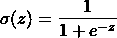
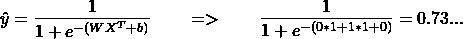
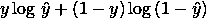

# 超越 CUDA: GPU 加速的 C++在跨厂商显卡上进行机器学习，使用 Kompute 变得简单

> 原文：<https://towardsdatascience.com/machine-learning-and-data-processing-in-the-gpu-with-vulkan-kompute-c9350e5e5d3a?source=collection_archive---------11----------------------->

## 通过使用 Kompute 框架和 Vulkan SDK 的实际机器学习示例介绍 GPU 计算

C++中 Vulkan SDK 和 Kompute 的视频概述

机器学习，以及许多其他高级数据处理范例，非常适合 GPU 计算提供的并行处理架构。

图片作者[作者](https://docs.google.com/presentation/d/1WBLcBmk7J04Zu8cD3ugagPkEpKkDuJpNr-HfroNe4X8/edit#slide=id.p)

在本文中，您将学习如何用 GPU 优化代码从头开始编写自己的 ML 算法，该算法将能够在几乎任何硬件上运行，包括您的手机。我们将介绍核心的 GPU & ML 概念，并展示如何使用 [**Kompute 框架**](https://github.com/axsaucedo/vulkan-kompute#vulkan-kompute) 只用几行代码就能实现它。

我们将首先构建一个简单的算法，将两个数组并行相乘，这将介绍 GPU 处理的基础知识。然后，我们将在 GPU 中从头开始编写一个逻辑回归算法。您可以在以下链接中找到回购协议的完整代码:

*   [Kompute 库](https://github.com/EthicalML/vulkan-kompute)
*   GPU 阵列乘法[库](https://github.com/axsaucedo/vulkan-kompute/tree/4e3802cb9dbf8742f9caf0374ef1612466c5ab1a/examples/array_multiplication#kompute-array-multiplication-example)和 [Kompute 代码](https://github.com/axsaucedo/vulkan-kompute/blob/4e3802cb9dbf8742f9caf0374ef1612466c5ab1a/examples/array_multiplication/src/Main.cpp#L15)
*   GPU 逻辑回归[库](https://github.com/axsaucedo/vulkan-kompute/tree/7906406dd1e8bbfb01c1c5d68be44f63587440aa/examples/logistic_regression#kompute-logistic-regression-example)、 [Kompute 代码](https://github.com/axsaucedo/vulkan-kompute/blob/7906406dd1e8bbfb01c1c5d68be44f63587440aa/examples/logistic_regression/src/Main.cpp#L15)和[着色器代码](https://github.com/axsaucedo/vulkan-kompute/blob/7906406dd1e8bbfb01c1c5d68be44f63587440aa/examples/logistic_regression/shaders/glsl/logistic_regression.comp#L7)

# 动机

近年来，GPU 计算的潜力和采用率一直呈爆炸式增长——从下图中的图表可以看出采用率的增长速度。在深度学习中，采用 GPU 进行处理的数量大幅增加，同时支持在越来越多的 GPU 节点上大规模并行分配计算任务的范例也大量增加。有许多令人兴奋的研究围绕着技术，这些技术提出了实现[模型并行性](https://mxnet.apache.org/versions/1.7/api/faq/model_parallel_lstm.html)和[数据并行性](https://en.wikipedia.org/wiki/Data_parallelism)的新方法——这两种方法都允许算法和数据分别细分为广泛的方法，以最大限度地提高处理效率。

**本农、塔尔和托尔斯滕·霍夫勒。“揭开并行和分布式深度学习的神秘面纱:深度并发分析。”美国计算机学会计算调查(CSUR)52.4(2019):1–43。**

在本文中，我们概述了理论，并实践了一些工具，这些工具将使初学者和经验丰富的 GPU 计算从业者能够利用这些迷人的高性能计算领域的当前开发和讨论，并为之做出贡献。

# Vulkan 框架

在开始之前，有必要介绍一下核心框架，它使得构建超优化、跨平台和可扩展的 GPU 算法成为可能，这就是 Vulkan 框架。

与 Khronos 成员一起玩“瓦尔多在哪里”(图片由 Vincent Hindriksen 通过 [StreamHPC](https://streamhpc.com/blog/2017-05-04/what-is-khronos-as-of-today/) 提供)

Vulkan 是由 Khronos Group 领导的一个开源项目，Khronos Group 是一个由大量技术公司组成的联盟，他们聚集在一起致力于定义和推进移动和桌面媒体(和计算)技术的开放标准。在左边，你可以看到范围广泛的 Khronos 成员。

您可能想知道，*为什么我们还需要另一个新的 GPU 框架，而这里已经有许多选项可用于编写可并行化的 GPU 代码？*主要原因是，与一些闭源的同类产品(如 NVIDIA 的 CUDA 或苹果的 Metal)不同，Vulkan 是完全开源的，并且与一些旧的选项(如 OpenGL)不同，Vulkan 是以现代 GPU 架构为基础构建的，提供了非常细粒度的 GPU 优化。最后，虽然一些替代产品为 GPU 提供了特定于供应商的支持，但 Vulkan 提供了**跨平台**和**跨供应商**支持，这意味着它打开了移动处理、边缘计算等领域的机会之门。

Vulkan SDK 提供对 GPU 的非常低级的访问，这允许非常专业的优化。这对 GPU 开发人员来说是一笔巨大的财富——主要缺点是冗长，需要 500–2000 多行代码才能获得编写应用程序逻辑所需的基本样板文件。这不仅会导致昂贵的开发周期，而且容易导致更大问题的小错误。

这实际上可以在许多新的和知名的机器学习和深度学习项目中看到，如 Pytorch、Tensorflow 和阿里巴巴 DNN 等，这些项目已经集成或正在寻求集成 Vulkan GPU SDK，以添加移动 GPU(和跨供应商 GPU)支持。所有这些框架都以非常相似和极其冗长的样板代码告终，这意味着它们会从使用统一的基线中受益(并且仍然会受益)。这是我们启动 **Kompute** 项目的主要动机之一。

# 输入 Kompute

[**Kompute**](https://github.com/axsaucedo/vulkan-kompute#vulkan-kompute) 是一个构建在 Vulkan SDK 之上的框架，专门用于扩展其计算能力，作为一个简单易用、高度优化、移动友好的通用 GPU 计算框架。

Kompute [文档](https://ethicalml.github.io/vulkan-kompute/)(图片由作者提供)

Kompute 不是为了隐藏任何核心的 Vulkan 概念而构建的 Vulkan API 设计得非常好——相反，它通过 BYOV(自带 Vulkan)设计增强了 Vulkan 的计算能力，通过减少所需的样板代码和自动化编写 Vulkan 应用程序中涉及的一些更常见的工作流来支持开发人员。

对于想了解更多信息的新开发人员来说，它为开始使用 GPU 计算提供了坚实的基础。对于更高级的 Vulkan 开发人员，Kompute 允许他们将其集成到现有的 Vulkan 应用程序中，并通过在需要时访问所有 Vulkan 内部来执行非常精细的优化。该项目是完全开源的，我们欢迎错误报告、文档扩展、新示例或建议——请随时在回购中[提出问题](https://github.com/axsaucedo/vulkan-kompute/issues)。

# 编写你的第一个计算机

为了使用 Kompute 构建我们的第一个简单的数组乘法 GPU 计算应用程序，我们将创建以下内容:

*   两个**康普顿张量**存储输入数据
*   一个**计算机张量**存储输出数据
*   一个**计算机操作**创建并复制张量到 GPU
*   带有 Kompute 算法的 **Kompute 操作**，该算法将保存要在 GPU 中执行的代码(称为“着色器”)
*   将 GPU 数据同步回本地张量的 **Kompute 操作**
*   一个 **Kompute 序列**记录操作，批量发送到 GPU(我们将使用 **Kompute 管理器**来简化工作流程)

Kompute [建筑设计](https://ethicalml.github.io/vulkan-kompute/overview/reference.html)(图片由作者提供)

Kompute 的核心是用于 GPU 操作的“Kompute 操作”，以及处理 GPU 数据和内存的“Kompute 张量”操作。更具体地说，这个图显示了 Kompute 组件之间的关系(包括显式内存所有权)。

当与 GPU 交互时，您必须将指令发送给 GPU 来执行，并且您需要确保 GPU 在 GPU 内存中有所有可用的相关数据来开始处理。使用 Vulkan，您可以通过队列将这些指令发送到 GPU，因此为了直观地简化事情，您可以将您的 GPU 视为远程服务器，其中数据序列化、资源创建和内存分配是昂贵的，并且指令是通过队列提交的——仍然有 GPU-CPU 共享内存，但您倾向于仅将它用于向 GPU 传输数据。

让我们直接进入代码。通常，在 Kompute 应用程序中，我们将遵循以下步骤:

1.  创建 Kompute 管理器来管理资源
2.  创建 Kompute 张量来保存数据
3.  使用 Kompute 操作初始化 GPU 中的 Kompute 张量
4.  将在 GPU 上运行的代码定义为“计算着色器”
5.  使用 Kompute 操作对 Kompute 张量运行着色器
6.  使用 Kompute 操作将 GPU 输出数据映射到本地张量
7.  打印您的结果

## 1.创建 Kompute 管理器来管理资源

首先，我们将创建 Kompute 管理器，它负责创建和管理所有底层 Vulkan 资源。

正如你所看到的，这里我们正在初始化我们的 Kompute 管理器，期望它在设备 0 上创建所有的基本 Vulkan 资源(在我的例子中，设备 0 是我的 NVIDIA 卡，设备 1 是我的集成显卡)。对于更高级的用例，也可以用自己的 Vulkan 资源(设备、队列等)初始化 Kompute 管理器，但这超出了本文的范围。

## 2.创建 Kompute 张量来保存数据

我们现在将创建用于输入和输出的 Kompute 张量。这些将保存所需的数据，这些数据将被映射到 GPU 来执行这个简单的乘法。

Kompute 设计使用`std::shared_ptr`的原因是为了避免通过值传递对象，而是使用[智能指针](https://docs.microsoft.com/en-us/cpp/cpp/smart-pointers-modern-cpp?view=vs-2019)传递对象。

## 3.使用 Kompute 操作初始化 GPU 中的 Kompute 张量

现在我们已经用本地数据创建了张量，我们将把数据映射到 GPU 中。为此，我们将使用`[kp::OpTensorCreate](https://axsaucedo.github.io/vulkan-kompute/overview/reference.html#optensorcreate)` Kompute 操作，该操作将初始化底层 Vulkan 缓冲区和 GPU 内存，并执行到 GPU 的相应映射。

同样值得一提的是，通过利用 Kompute 管理器`buildTensor`助手功能，可以缩短张量创建的步骤。这将允许您跳过显式创建`shared_ptr`以及下面概述的`kp::OpTensorCreate`操作的需要(您也可以在这里找到[这个变体的完整代码实现](https://github.com/axsaucedo/vulkan-kompute/blob/2e8a5aa3a6d6172abb51ac038e1b75c5c2d58af9/test/TestMultipleAlgoExecutions.cpp#L274))。

## 4.将在 GPU 上运行的代码定义为“计算着色器”

现在我们已经初始化了必要的 Kompute 张量分量，并且它们被映射到 GPU 内存中，我们可以添加将在 GPU 中执行的 Kompute 算法。这被称为“着色器”代码，遵循类似 C 的语法。你可以在下面看到完整的着色器代码，我们将在下面分解每个部分。

`#version 450`和`layout(local_size_x = 1) in;`部分指定了版本和并行线程执行结构(我们将在文章的后面进一步研究)。然后，我们可以看到以以下格式定义的 GPU 数据输入和输出:

> `*layout(binding = <INDEX>) buffer <UNIQUENAME> {float <VARNAME>[]};*`

*   <index>—将张量映射到 GPU 输入的索引</index>
*   <uniquename>—这必须是缓冲区的唯一名称</uniquename>
*   <varname>—这是在着色器代码中使用的变量名</varname>

这些是可以在着色器代码中用于处理的参数。也就是说，在这种情况下，处理是在`main` 函数内部完成的。第一个变量`uint index = gl_GlobalInvocationID.x;`是当前的并行执行指数，它将允许我们处理每个数据输入。

然后，我们进入该算法的核心，即乘法`o[index] = a[index] * b[index].` ，这一部分非常简单明了——我们将 GPU 数组`a[]`和`b[]`的元素相乘，然后将输出存储在数组`o[]`中。

## 5.使用 Kompute 操作对 Kompute 张量运行着色器

为了运行上面的着色器，我们将创建 Kompute 操作`[kp::OpAlgoBase](https://axsaucedo.github.io/vulkan-kompute/overview/reference.html#opalgobase)`。这个 Kompute 操作所需的参数包括绑定到 GPU 指令中的张量，以及着色器代码本身。

值得一提的是，Kompute 允许用户通过文件路径传递着色器，或者也有 Kompute 工具允许您将着色器二进制文件转换为 C++头文件。

## 6.使用 Kompute 操作将 GPU 输出数据映射到本地张量

一旦算法被触发，结果数据将保存在输出张量的 GPU 内存中。我们现在可以使用`[kp::OpTensorSyncLocal](https://axsaucedo.github.io/vulkan-kompute/overview/reference.html#optensorsynclocal)` Kompute 操作按照下面的代码块同步 Tensor GPU 内存。

## 7.打印您的结果

最后，我们可以打印出张量的输出数据。

当你运行它时，你会看到输出张量的值被打印出来。就这样，你写了你的第一个 Kompute！

您也可以在 repo 中找到完整的示例，这样您就可以运行它并根据需要扩展它。你可以在[这个库](https://github.com/axsaucedo/vulkan-kompute/tree/4e3802cb9dbf8742f9caf0374ef1612466c5ab1a/examples/array_multiplication#kompute-array-multiplication-example)中找到完整的独立示例，其中包括如何构建它的说明以及 [Kompute C++代码](https://github.com/axsaucedo/vulkan-kompute/blob/4e3802cb9dbf8742f9caf0374ef1612466c5ab1a/examples/array_multiplication/src/Main.cpp#L15)。

虽然看起来不明显，但上面介绍了 GPU 计算中核心概念和设计思维的一些直觉，同时还抽象了一些更深入的概念。在接下来的几节中，我们将提供更具体的术语，我们将触及一些更高级的概念，如线程、块、内存步长和共享内存(尽管很多内容将作为进一步的阅读材料提供)。

# 潜入机器学习直觉

让我们看一个更高级的 GPU 计算用例，具体实现机器学习的 hello world，逻辑回归。在我们介绍实现之前，我们将提供一些理论上的直觉，以及我们将贯穿始终使用的术语。

在机器学习中，我们总是有两个阶段，训练和推理。在下图中，您可以看到两个简化的流程。最上面是训练流程，在这里你识别一些训练数据，提取一些特征，训练一个模型，直到你对精度满意为止。一旦您有了一个经过训练的模型，您就可以持久化模型“权重”,并将模型部署到第二个工作流中，在第二个工作流中，模型将对看不见的数据执行推理。

数据科学流程(图片由作者提供)

在这种情况下，我们将有一个输入数据集`X`，其中每个元素是一对`xi`和`xj`。我们的输入数据如下:

*   `xi = { 0, 1, 1, 1, 1 }`
*   `xj = { 0, 0, 0, 1, 1 }`

利用该输入数据，要预测的预期目标值`Y`将如下:

*   `Y = {0, 0, 0, 1, 1}`

来自 [DS Central](https://www.datasciencecentral.com/profiles/blogs/why-logistic-regression-should-be-the-last-thing-you-learn-when-b) 的逻辑回归示例

我们在机器学习中的主要目标是学习使用这些数据来找到函数(和参数)，这将允许我们仅使用`X`作为输入来预测值`Y`。

值得注意的是，预测值被定义为`ŷ`，它是用我们的推理函数计算出来的值，不同于我们上面定义的`Y`的“真”或“实际”值。

我们将用于逻辑回归的函数如下:

让我们来分解这个函数:

*   `z`——是我们的线性映射函数
*   `ŷ`—结果预测输出
*   `X`ᵀ——包含我们的输入 xi 和 xj 的矩阵的转置
*   `σ`—sigmoid 函数，将在下面详细介绍

我们希望通过机器学习算法学习的参数是:

*   `W` —将应用于输入的权重
*   `b` —将要添加的偏差

还有环绕函数`σ` 也就是 sigmoid 函数。该函数迫使我们的输入更接近 0 或 1，这可以直观地视为我们预测为“真”的概率，定义如下:

这就是现在的推理功能，它将允许我们处理来自新数据点的预测。例如，如果我们说我们有一组新的看不见的输入`X = { (0, 1) }`，并且我们假设在通过我们的训练数据运行我们的机器学习算法之后，学习到的参数是`W = (1, 1), b = 0` (稍后我们将这样做)，那么我们将能够通过我们的预测函数来运行它，方法是代入以下值:

在这种情况下，预测是`0.73...`，这将是一个肯定的预测。这当然只是为了演示一旦我们学习了参数`W`和`b.`我们的推理函数会是什么样子

从 [ML Academy](https://mi-academy.com/2018/10/04/the-history-of-gradient-descent/) 可视化的梯度下降

我们学习参数的方法是进行预测，计算误差，然后相应地重新调整权重。用于基于“预测误差”来“重新调整”权重的方法将通过利用梯度下降来完成。这将被重复多次以找到更精确的参数。

为此，我们将需要使用每个公式的导数。第一个是我们的线性映射函数`z`的导数:

*   ∂z = z(x) - y

其中变量定义如下:

*   `∂z` —线性映射函数的导数`z(x)`
*   `z(x)` —应用于输入`x`的线性映射函数的结果
*   `y` —输入 x 的预期实际值标签

类似地，w 和 b 的导数分别如下:

*   ∂w = (x - ∂z)/m
*   ∂b = ∂z/m

在这种情况下，`m`是输入元素的总数。

我们现在能够使用上述方法重新调整参数，如下所示:

*   w = w - θ ∂w
*   b = b - θ ∂b

在这种情况下，θ是学习率，顾名思义，它控制每次迭代中参数被修改的比率。直观地说，越小，算法收敛所需的迭代次数就越多，然而，如果学习量太大，它将会超调，导致永远无法收敛(从上面的图像中，你可以想象它将不断从一边跳到另一边，永远不会到达底部)。

为了计算损失，我们将使用对数损失函数，也称为交叉熵损失函数。该功能定义如下:

对数损失(交叉熵损失)函数

直观的图表，直观显示 ML Mastery 的成本函数

函数本身是这样设置的，预测类和期望类之间的差异越大，误差就越大(你可以看到如果预测类在完全不同的标签上，它会受到多大的惩罚)。

损失函数将为我们提供一个在迭代中改进算法的思路。

最后，这里最重要的一点将是我们如何利用 GPU 的并行架构来优化计算背后的直觉。在这种情况下，我们可以同时处理多个输入参数，称为微批处理，然后批量重新调整参数。这被称为数据并行化，是许多可用技术之一。在下一节中，我们将看到这是如何实现的，即传递一小批输入，存储权重，然后在下一次迭代之前重新调整它们。

> 注意:在这篇文章中，我们不会深入研究太多细节，也不会研究机器学习的最佳实践，但是在文章的最后，我们将列出一系列广泛的来源，供有兴趣将其机器学习(或 GPU 计算)知识提升到一个新水平的人使用。

# 机器学习 GPU 代码实现

现在我们已经讨论了一些核心概念，我们将能够了解着色器的实现，它是将在 GPU 中执行的代码。

首先，我们需要如下定义所有的输入和输出缓冲器:

如果您还记得，在上一节的结尾，我们提到了如何利用微批处理的概念来使用 GPU 处理的并行架构。这在实践中意味着，我们将把 X 的多个实例一次传递给 GPU 来处理，而不是期望 GPU 一个接一个地处理它。这就是为什么我们看到上面有一个分别用于`xi, xj, y, wOuti, wOutj,` 和`bOut`的数组。

更详细地说:

*   作为数组 xi 和 xj 的输入`X` 将保存小批量的输入
*   数组`y` 将保存微批量输入的所有预期标签
*   两个输入权重参数`wini`和`woutj`将用于计算预测
*   将用于计算预测的输入参数`b`
*   输出权重`wouti`和`woutj` 包含权重，并将存储应被减去的所有微批次的 W 的导数
*   类似地，输出偏差数组包含所有应批量减去的微量批次的`b` 的导数
*   最后`lout`包含了损失将被返回的输出数组

我们还收到常数`M`，它将是元素的总数——如果你记得这个参数将用于导数的计算。我们还将看到这些参数是如何从 C++ Kompute 端传递到着色器的。

现在我们已经定义了所有的输入和输出参数，我们可以启动`main`函数，它将包含我们的机器学习训练算法的实现。

我们将首先跟踪全局调用的当前索引。由于 GPU 并行执行，这些运行中的每一个都将直接并行运行，因此这允许当前执行一致地跟踪当前正在执行的迭代索引。

我们现在可以开始准备所有的变量，我们将在整个算法中使用。我们所有的输入都是缓冲数组，所以我们希望将它们存储在 vec2 和 float 变量中。

在这种情况下，我们基本上明确了当前“线程运行”所使用的变量。GPU 架构由稍微更细微的执行结构组成，涉及线程块、内存访问限制等，但我们不会在本例中涉及这些。

现在我们进入更有趣的部分——实现推理功能。下面我们将实现推理函数来计算ŷ，它既涉及线性映射函数，也涉及 sigmoid 函数。

现在我们有了`yHat`，我们现在可以用它来计算导数(∂z、∂w 和∂b)，在本例中是当前执行的索引输入元素的导数。

我们现在可以将导数作为输出传递，因此可以为下一次迭代重新调整参数。

最后，我们能够计算损耗并将其添加到输出`lout`数组中。

就这样，我们现在已经完成了着色器，这将使我们能够在 GPU 中训练逻辑回归算法——你可以在 GPU 逻辑回归[示例库](https://github.com/axsaucedo/vulkan-kompute/tree/7906406dd1e8bbfb01c1c5d68be44f63587440aa/examples/logistic_regression#kompute-logistic-regression-example)中找到着色器的[完整代码。](https://github.com/axsaucedo/vulkan-kompute/blob/7906406dd1e8bbfb01c1c5d68be44f63587440aa/examples/logistic_regression/shaders/glsl/logistic_regression.comp#L7)

现在，我们将介绍 Kompute 代码，该代码需要针对数据集运行，以训练我们的第一个模型并找到参数。

# Kompute 的机器学习编排

为了使用 Kompute 在 GPU 中运行我们上面创建的着色器，我们将遵循以下步骤:

1.  导入 Kompute 并创建我们的主要功能
2.  创建所有需要的 Kompute 张量
3.  创建 Kompute 管理器并初始化 Kompute 序列
4.  通过 Kompute 序列执行 Kompute 张量 GPU 初始化
5.  记录 Kompute 序列中的批处理算法执行
6.  迭代 100 次:运行微批处理执行并更新权重
7.  打印结果参数，用于进一步推断

如你所见，这比我们上面使用的简单例子更复杂。在这种情况下，我们将使用 Kompute 序列，而不是直接使用 Kompute 管理器，因为我们希望对命令进行更深入的控制，这些命令可以被记录下来并批量发送到 GPU。我们将在讲述每个步骤时更详细地讨论这一点。让我们开始吧。

## 1.导入 Kompute 并创建我们的主要功能

我们将导入 Kompute 的单个头文件——如果需要，也可以使用更细粒度的基于类的头文件。我们还将创建一些基本配置变量；即`ITERATIONS`和`learningRate`，它们将在后面的码块中使用。

## 2.创建所有需要的 Kompute 张量

现在我们将创建所有需要的张量。在这一小节中，你会注意到我们将引用着色器中使用的所有缓冲区/数组。我们还将介绍参数传递的顺序如何与数据绑定到着色器的方式相关联，以便可以访问数据。

我们还将它们存储在一个参数向量中，以便于访问:

## 3.创建 Kompute 管理器并初始化 Kompute 序列

如果您还记得前面的例子，我们能够使用 Kompute 管理器直接执行命令。然而，如果我们想要更精细地记录可以在处理之前提交并加载到 GPU 中的命令批次，我们可以使用 Kompute 序列资源。为此，我们将创建一个 Kompute 管理器，然后通过它创建一个 Kompute 序列。

## 4.通过 Kompute 序列执行 Kompute 张量 GPU 初始化

我们现在可以从在 GPU 资源上运行指令开始——也就是说，我们将从初始化张量并将其映射到各自的 GPU 内存开始。在这里，您将看到 Kompute 序列如何在命令执行上为您提供进一步的粒度，但是直到 ML 推理部分，您才会看到 Kompute 序列的灵活性。

让我们从记录命令开始，即 OpTensorCreate 命令，然后评估上面所有张量的操作。此操作将创建各自的 Vulkan 内存/缓冲区资源。

## 5.记录 Kompute 序列中的批处理算法执行

在本节中，我们将清除 Kompute 序列的先前记录，并开始记录一组序列。您会注意到，与前一节不同，在这种情况下，我们不会立即运行`eval()`，因为我们必须多次运行它，并使用额外的命令来重新调整参数。

您还会注意到，我们将记录三种类型的 Kompute 操作，即:

*   `[kp::OpTensorSyncDevice](https://axsaucedo.github.io/vulkan-kompute/overview/reference.html#optensorsyncdevice)` —此操作通过将张量的本地数据映射到 GPU 数据，确保张量与其 GPU 内存同步。在这种情况下，这些张量使用设备专用内存来提高处理效率，因此在操作中使用分级张量来执行映射(为了提高效率，在整个操作中重复使用分级张量)。在这里，我们只想同步输入权重，因为这些权重将随各自的导数在本地更新。
*   `[kp::OpAlgoBase](https://axsaucedo.github.io/vulkan-kompute/overview/reference.html#opalgobase)` —这是一个 Kompute 操作，将我们上面写的着色器与所有本地 CPU/主机资源绑定在一起。这包括提供张量。值得一提的是，作为参数提供的张量的索引是它们通过各自的绑定在着色器中映射的顺序(正如您可以在着色器中看到的，每个向量都具有格式`layout(binding = NUMBER)`)。
*   `[kp::OpTensorSyncLocal](https://axsaucedo.github.io/vulkan-kompute/overview/reference.html#optensorsynclocal)` —该 Kompute 操作执行与上述同步操作类似的一组指令，但它不是将数据复制到 GPU 存储器，而是相反。这个 Kompute 操作将 GPU 内存中的数据映射到本地张量向量，因此可以从 GPU/主机访问它。如你所见，我们只在输出张量中运行这个操作。

## 6.迭代 100 次:运行微批处理执行并更新权重

现在我们已经记录了命令，我们可以开始运行这些预加载命令的执行。在这种情况下，我们将运行一个微批处理迭代的执行，然后在本地更新参数，以便在接下来的迭代中使用它们。

## 7.打印结果参数，用于进一步推断

我们现在有了一个经过训练的逻辑回归模型，或者至少我们已经能够优化其各自的功能，以确定合适的参数。我们现在能够打印这些参数，并在看不见的数据集中使用这些参数进行推理。

我们完事了。

您可以在示例存储库中找到这个完整的示例，您将能够运行和扩展它。你会在 GPU 逻辑回归[示例 repo](https://github.com/axsaucedo/vulkan-kompute/tree/7906406dd1e8bbfb01c1c5d68be44f63587440aa/examples/logistic_regression#kompute-logistic-regression-example) 中找到所有完整的文件，包括 [Kompute C++代码](https://github.com/axsaucedo/vulkan-kompute/blob/7906406dd1e8bbfb01c1c5d68be44f63587440aa/examples/logistic_regression/src/Main.cpp#L15)，以及[着色器文件](https://github.com/axsaucedo/vulkan-kompute/blob/7906406dd1e8bbfb01c1c5d68be44f63587440aa/examples/logistic_regression/shaders/glsl/logistic_regression.comp#L7)。

# 接下来呢？

恭喜你，你一路走到了最后！虽然这篇文章涵盖了广泛的主题，但是也有大量的概念被浏览过。其中包括底层 Vulkan 概念、GPU 计算基础、机器学习最佳实践和更高级的 Kompute 概念。幸运的是，网上有大量的资源可以扩展你在这些方面的知识。我推荐作为进一步阅读的一些链接包括:

*   [Kompute 文档](https://axsaucedo.github.io/vulkan-kompute/)了解更多细节和示例
*   [机器学习工程师时事通讯](https://ethical.institute/mle.html)如果你想了解关于机器学习的最新文章
*   [令人敬畏的生产机器学习](https://github.com/EthicalML/awesome-production-machine-learning/)开源工具列表，用于部署、监控、版本化和扩展您的机器学习
*   [FastAI 的 ML for Coders 课程简介](https://www.fast.ai/2018/09/26/ml-launch/)进一步学习机器学习概念
*   [Vulkan SDK 教程](https://vulkan-tutorial.com/)深入了解底层 Vulkan 组件