# 使用 Libra 的线性机器学习和深度学习

> 原文：<https://towardsdatascience.com/machine-learning-and-deep-learning-in-one-liner-using-libra-7eef4023618f?source=collection_archive---------58----------------------->

## 自动化机器学习和深度学习理解 Libra 的完全指南。


照片由[布雷特·乔丹](https://unsplash.com/@brett_jordan?utm_source=unsplash&utm_medium=referral&utm_content=creditCopyText)在 [Unsplash](https://unsplash.com/s/photos/robot?utm_source=unsplash&utm_medium=referral&utm_content=creditCopyText) 拍摄

随着机器学习的兴起，我们看到了许多伟大的框架和库的兴起，如 sci-kit learn、Tensorflow、Pytorch。这些框架使得用户可以更容易地创建机器学习模型。但是仍然需要遵循整个过程，包括数据准备、建模和评估。数据准备包括数据清洗和预处理。建模接受预处理的数据，并使用算法来预测结果。评估为我们提供了一个衡量算法性能的方法。由于这些库和框架，我们写所有东西的时间减少了，但是我们仍然需要写少量的代码。

> "机器智能是人类需要创造的最后一项发明."尼克·博斯特伦

在令人惊叹的开源社区的帮助下，这个领域的进步与日俱增，这些社区催生了现有的框架。想象一个在一行中完成上述所有过程的框架。是的，你没看错，现在你也可以这么做了。Libra 是一个框架，它在一行中为你做了这些工作。即使对于非技术人员来说，它也很容易使用。Libra 需要最少的平均行数来训练模型。

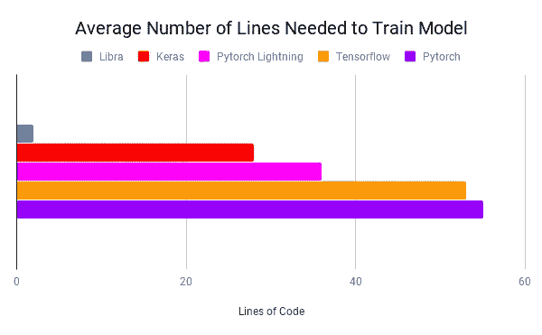

图片取自[文档](https://libradocs.github.io/index.html)

在这篇博客中，我将给出如何使用天秤座的完整指导。我将针对不同的问题采用不同的数据集，并向您展示一步一步的方法。

# 使用 Libra 检测信用卡欺诈

我已经使用 Kaggle 数据集来预测信用卡欺诈。该数据已经经过主成分分析，因此与原始数据相比，它现在减少到更少的维度数据。解决这个问题需要遵循一个系统的方法。一般来说，你会按照第一段提到的顺序。但是和天秤座在一起，就不用担心这个了。

数据集的链接`https:/[/www.kaggle.com/mlg-ulb/creditcardfraud](https://colab.research.google.com/drive/1khr-nqQVkP_XMUQ5y8GWrK5AUS41lyzC#)`

该数据中的大多数交易在 99.83%的时间内是非欺诈性的，而欺诈性交易在数据集中的 0.17%的时间内发生。这意味着数据是高度不平衡的。让我们看看 Libra 对数据的预处理有多好，并给出结果。

## 安装 Libra

```
pip install -U libra
```

## 从 libra 导入客户端

```
from libra import client
```

## 利用天秤座

一切都是围绕客户机对象构建的。您可以对它调用不同的查询，所有内容都将存储在对象的 models 字段下。

我们在客户机对象中传递文件的位置，并将其命名为 newClient。现在要访问各种查询，请参考文档。我在这里使用决策树。英语中的指令是一个陈述，代表你想要完成的任务。比如预测房子价值中位数，或者请估计一下家庭人数。否则，该指令应该对应于数据集中的一列。Libra 自动检测目标列，但是为了确保它选择了正确的列，我传递了目标列名。

```
newClient = client('creditcard.csv')newClient.decision_tree_query('Class')
```

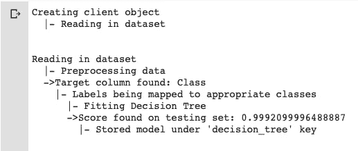

仅用两行代码，我们就获得了大约 0.99 的分数，这是我们能得到的最好分数。如果您查看其他内核，您会发现只有少数人获得了 0.99 的精度，并且他们需要花费数小时来预处理数据并为其编写代码。那样的话，天秤座为你节省了很多时间，给了你最好的结果。Libra 使用智能预处理，这样你就不需要自己预处理数据了。

## 你不需要担心分析结果。

newClient.analyze()为所有分类问题创建混淆矩阵和 ROC 曲线。它还计算召回率、精确度、f1 和 f2 分数。

```
newClient.analyze()
```

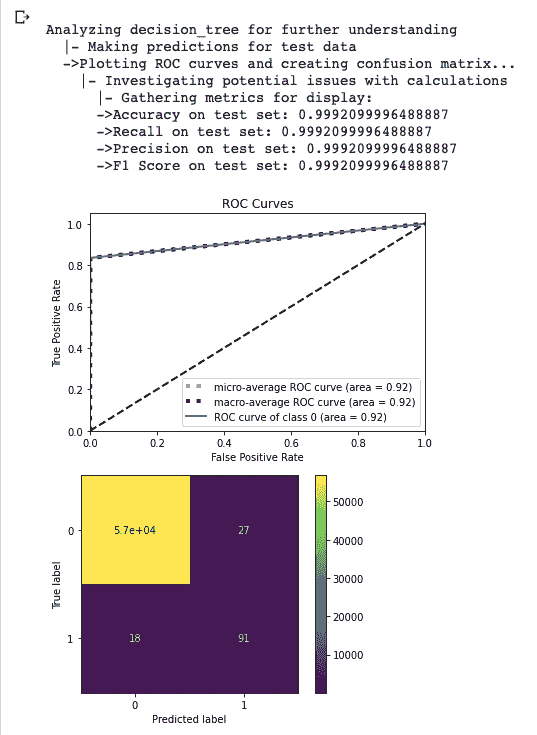

newClient.info()返回所有键，代表为数据集生成的每一类数据。

```
newClient.info()
```


newClient.model()返回该模型的字典。它包括从准确度、精确度、召回率、F1 分数到所有预处理技术的一切。对于已经了解这些概念并能编码的人更有帮助。非技术用户无需担心这一点。

```
newClient.model()
```

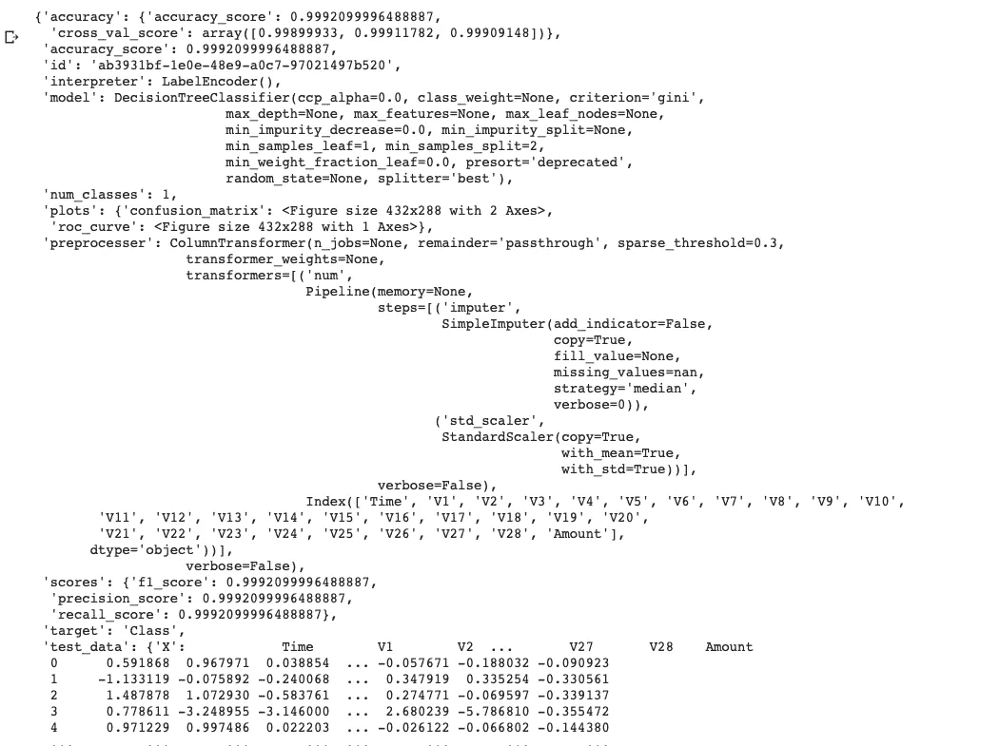

## 访问模型

返回一个字典，如果你想访问模型，你可以直接使用 newClient.model()['model']

```
newClient.model()['model']
```

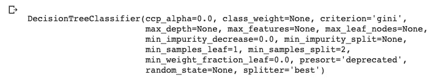

# 使用 Libra 的卷积神经网络

使用下面的代码在 colab 笔记本上下载 Laurence Moroney 的石头、纸、剪刀数据集。我可以直接向您展示使用 Libra 创建 CNN 的代码，但是我想创建一个示例，您可以在自己的 colab 笔记本中尝试，以便更好地理解。你不需要担心下面的代码。

```
!wget --no-check-certificate \https://storage.googleapis.com/laurencemoroney-blog.appspot.com/rps.zip \-O /tmp/rps.zip!wget --no-check-certificate \https://storage.googleapis.com/laurencemoroney-blog.appspot.com/rps-test-set.zip \-O /tmp/rps-test-set.zip
```

使用下面的代码提取下载的文件。

```
import osimport zipfilelocal_zip = '/tmp/rps.zip'zip_ref = zipfile.ZipFile(local_zip, 'r')zip_ref.extractall('/tmp/')zip_ref.close()local_zip = '/tmp/rps-test-set.zip'zip_ref = zipfile.ZipFile(local_zip, 'r')zip_ref.extractall('/tmp/')zip_ref.close()
```

使用下面的代码创建文件夹，并将提取的图像放入其中。

```
rock_dir = os.path.join('/tmp/rps/rock')paper_dir = os.path.join('/tmp/rps/paper')scissors_dir = os.path.join('/tmp/rps/scissors')print('total training rock images:', len(os.listdir(rock_dir)))print('total training paper images:', len(os.listdir(paper_dir)))print('total training scissors images:', len(os.listdir(scissors_dir)))rock_files = os.listdir(rock_dir)print(rock_files[:10])paper_files = os.listdir(paper_dir)print(paper_files[:10])scissors_files = os.listdir(scissors_dir)print(scissors_files[:10])
```

下图显示了数据集的相关信息。

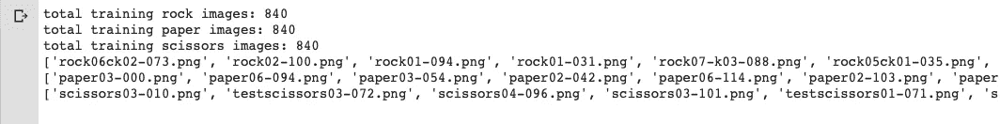

使用下面的代码，你可以创建 CNN。数据将通过缩放、剪切、翻转和重缩放自动增加。然后将选择最佳的图像尺寸。您还会注意到每个类中图像的数量以及与之相关的类的数量。最后，你还会观察训练精度和测试精度。

还可以在 convolutional _ query 内部传递**read _ mode**hyper-parameter，在其中可以指定读取模式。允许三种读取模式。我将一一描述它们。默认情况下**read _ mode = distinguisher()**自动检测数据的类型。允许的三种读取模式是:

## 1.Setwise

目录由“训练集”和“测试集”文件夹组成，这两个文件夹都包含分类文件夹，文件夹内有图像。[1]

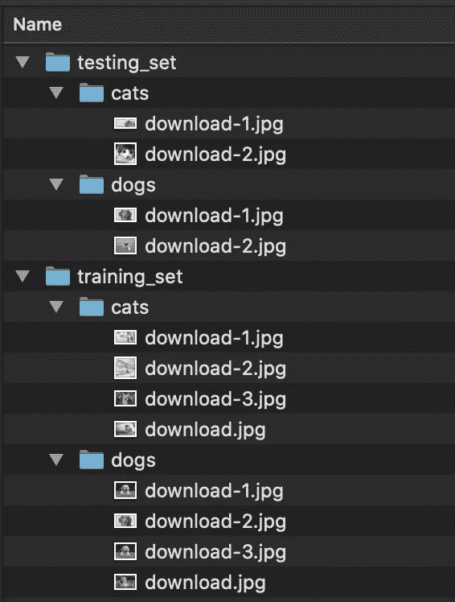

图片取自[文档](https://libradocs.github.io/index.html)

## 2.按类别

目录由分类文件夹组成，里面有图像。[1]

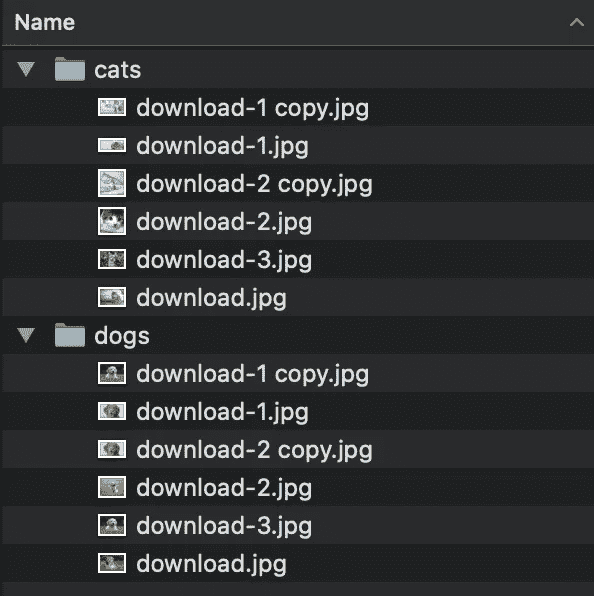

图片取自[文档](https://libradocs.github.io/index.html)

## **3。CSV Wise**

目录由图像文件夹和包含图像列的 CSV 文件组成。[1]


图片取自[文档](https://libradocs.github.io/index.html)

```
newClient = client('/tmp/rps')newClient.convolutional_query("Please classify my images")
```

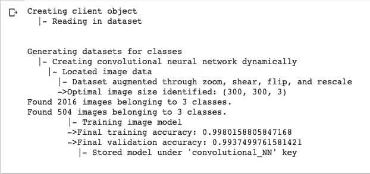

# 基于 Libra 的自然语言文本分类

对于这个问题，我使用了[垃圾短信分类](https://www.kaggle.com/team-ai/spam-text-message-classification)数据集。

链接:[https://www . ka ggle . com/team-ai/spam-text-message-class ification](https://www.kaggle.com/team-ai/spam-text-message-classification)

```
new_client = client('SPAM text message 20170820 - Data.csv')new_client.text_classification_query('sentiment')new_client.classify_text('new text to classify')
```

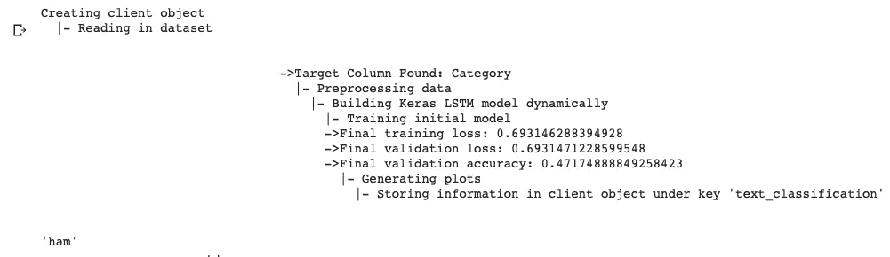

new_client.classify_text()将对输入其中的文本进行分类。在上面的输出中，你可以看到它已经把我的文本归类为‘火腿’。

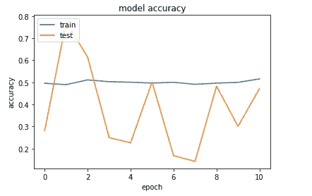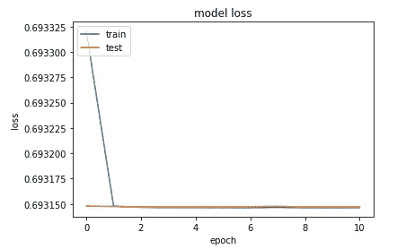

# k 表示使用 Libra 进行聚类

这个问题我用的是商城客户细分数据:[https://www . ka ggle . com/vjchoudhary 7/Customer-Segmentation-tutorial-in-python](https://www.kaggle.com/vjchoudhary7/customer-segmentation-tutorial-in-python)

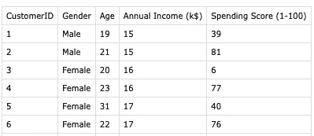

数据集的图像。

下面的代码将创建一个 K 均值聚类模型，并确定最佳质心计数和优化精度，以及最佳的聚类数。

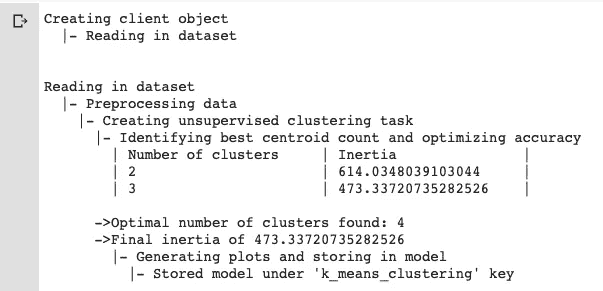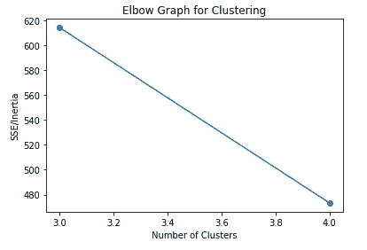

# 使用 Libra 进行分类的神经网络

在本节中，我将使用神经网络查询进行分类。为此，我使用一个私人数据集，从大脑信号预测行为。让我们来看看它在数据集上的表现如何。

```
new_client = client('Mood_classification.csv')new_client.neural_network_query('Predict the behavior')
```

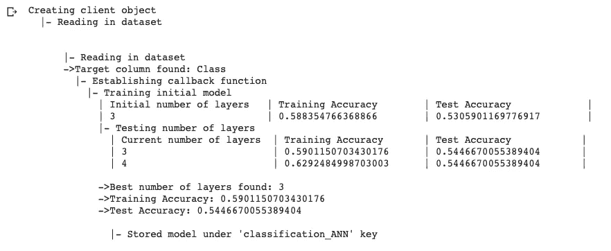

从上面的代码中，您可以注意到模型使用的初始层数是 3。然后，它还使用根据前一层的性能而变化的不同层数来测试精度。它预测找到的最佳层数及其训练和测试精度。看起来我需要为我的数据集收集更多的数据。

您可以使用 new_client.model()['model']来访问模型，并可以使用 Keras 中的 summary()函数来获得神经网络模型的摘要。

```
new_client.model()['model'].summary()
```

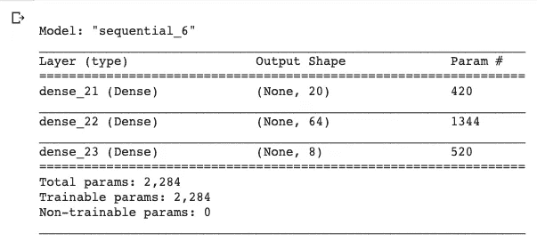

# 结论

天秤座是一个非常有趣的框架，每天都在进步。该框架让我们大致了解了数据科学领域的发展速度，也让我们看到了该领域可能出现的变化类型。他们还为现有的数据科学家添加功能，以修改现有的神经网络，并在指定的索引处添加像 LSTM 这样的层。这个框架带来的概念让我兴奋不已。你也可以在 Github 上投稿。

# 参考资料:

[1] Libra，文献(2020)，[资料来源](http://libradocs.github.io)