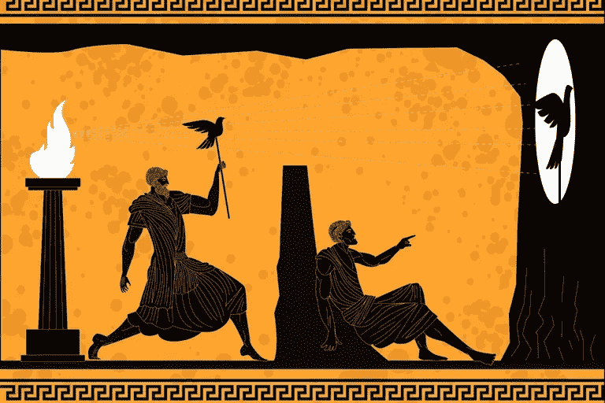
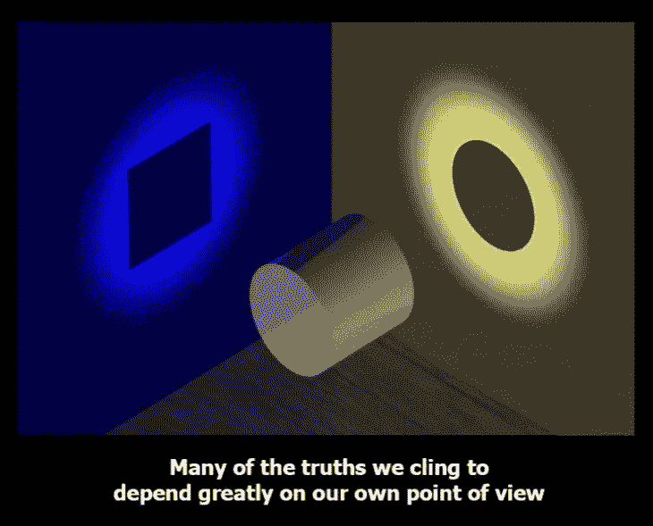

# 机器学习与柏拉图的洞穴寓言

> 原文：<https://towardsdatascience.com/machine-learning-and-platos-allegory-of-the-cave-9b9846bb63f3?source=collection_archive---------23----------------------->

## 当前机器学习的方法如何符合柏拉图著名的寓言以及我们将从那里走向何方。

洞穴的寓言由希腊哲学家柏拉图在他的作品*共和国*中提出，最初是*T5，用来比较“教育和缺乏教育对我们本性的影响”。奇怪的是，事实证明，最先进的机器学习领域仍然或多或少地符合这个超过 2000 年的模具。*

# 洞穴的寓言

这个寓言是从苏格拉底和他的弟子格劳肯之间的对话中得到阐释的。

简而言之，苏格拉底告诉格劳肯想象人们生活在一个巨大的地下洞穴中，只通过一条艰难而陡峭的隧道与外界相通。人们被铁链锁着，面对着一堵高墙，无法转过脸去，也无法挣脱锁链。在囚犯的背后，有一个巨大的火在燃烧，从而将人们身后发生的事情投射到囚犯面对的墙上，形成各种形状的影子。

由于人们在一生中从未能够转过脸来一点，他们看着墙上的影子长大和死去，这些影子构成了他们所有已知的现实。

MatiasEnElMundo / Getty Images

从象征意义上来说，墙上的阴影代表了表面的真相——一个“虚拟”的现实，只通过我们的感官**感知**，而不是终极的“真实”现实，根据柏拉图主义，它是由我们凡人永远无法通过感官了解的形式(想法)组成的。

此外，墙上的二维投影构成了可怜的囚犯的整个世界。他们好奇的头脑会尝试为这些幻影开发故事或历史——它们倾向于如何相互作用，何时一些影子倾向于一起出现，是否一个特殊的影子导致另一个出现，等等。他们推测并想象出最复杂的理论来解释影子的行为；然而可悲的是，他们仍然不知道阴影的真正本质。

如果他们可以转身，他们会发现他们最喜欢的一些影子理论是基于他们身后的一些骗子的一些糟糕的笑话，他们可能会在任何时候停止游戏，从囚犯队中消灭一些最好的模特。即使我们假设一个仁慈的世界，没有人在那里捉弄可怜的囚犯，任何时候一个三维图形出现的角度的微小随机调整都会在墙上的投影上造成很大的差异，肯定会在囚犯理论家中引起相当大的混乱。

# 机器学习做什么

尽管围绕机器学习或人工智能有各种宣传和承诺，但本质上，机器学习算法会查看一系列关于现象及其附加标签/值的观察结果(取决于它是分类任务还是回归任务)，尝试提出一个由形状似乎与数据形状匹配的已知函数组成的函数，然后在新观察结果出现时继续指定标签或值。

马库斯·斯皮斯克在 [Unsplash](https://unsplash.com?utm_source=medium&utm_medium=referral) 上的照片

经验法则是:( 1)任何机器学习输出的质量在很大程度上取决于输入的质量。简单来说，垃圾进，垃圾出；(2)机器学习算法永远无法“学习”或发现任何我们未知的新规则。

换句话说，我们最终可以通过机器学习模型实现的目标一方面受到数据质量的限制，另一方面也受到精心制作这些模型的研究人员的已知“现实”的限制。

# 相似之处

暂时回到洞穴的寓言。显然，正如现实生活中的三维图形被投影为墙上的二维阴影一样，在日常的机器学习实践中，对现实生活中的对象(变量)的描述，当作为数字或分类数据记录下来时，从来都不是原始对象的完整画面。

原因可能是由于各种逻辑约束，我们缺乏对某些属性的测量，但更有可能的是，作为一个从出生起就受到各种启动和集体学习经验约束的人，我们只是缺乏甚至是一个对象的某些关键属性的存在的知识。显然，如果我们甚至没有意识到一个东西的存在，我们怎么能首先要求它，然后对它提出问题，最后测量它呢？

投影从来都不是对原始对象的良好描述

在这种情况下，目前为所有机器学习问题引入替代数据的努力非常有意义，值得称赞，因为我们已经意识到传统的特征集不再满足我们的需求，而且既然我们正在处理“影子”的数据，为什么不借用其他“影子”的片段来帮助我们解决现实问题呢？难怪工厂的卫星图像或社交网络情绪数据越来越多地被纳入自动交易模型；事实是，它们一直是预测股票表现的良好因素，而受困于资产负债表的老学生们只是错过了机会。

不难想象，每天都有数百万个机器学习模型在“影子”数据的基础上接受训练，同时承担着计算出产生数据的现实生活对象之间的关系(相关性，甚至因果关系，如果一些过度成就的项目经理要求的话)的任务。在不进入散发主义的新柏拉图主义主题的情况下，我们也许能够通过转向另一个例子来描述这一困境，散发主义基本上认为一切都源于完美的第一现实，当进一步从第一现实中派生和异化时，变得不那么纯粹和不那么完美。

在 Lewis Carroll 的小说*透过镜子*中，当白骑士向爱丽丝解释歌曲*阿道克斯的眼睛*时，作者讨论了“这首歌，这首歌叫什么，这首歌的名字，以及这首歌的名字叫什么”之间的区别。歌曲本身，作为一种柏拉图式的形式，产生了派生的形式，如歌曲的名字，甚至是歌曲的名字(这可以无限地继续下去)；然而，这些衍生词甚至可能与歌曲的主题没有密切关系。尽管如此，在大多数情况下,(低级)派生是真实对象所知道和分析的，而对象本身仍然是不可言喻的或未知的。

# 奥卡姆剃刀

因此，当我们对一个物体进行观察的时候，一个推导就产生了，我们在墙上创造了一个影子。如果我们意识到，在一天结束时，我们正在处理“影子”数据集，我们可能会更好地设定我们对磨床学习模型的期望。通过释放我们的好奇心和想象力，并假设一个现实的参数化模型，我们也许能够意外地、短暂地打破我们头脑中的锁链，但显然奥卡姆剃刀支配着这个洞穴，顿悟的洞察力终究并不常见。

照片由[视觉效果](https://unsplash.com/@visuals?utm_source=medium&utm_medium=referral)在 [Unsplash](https://unsplash.com?utm_source=medium&utm_medium=referral) 上拍摄