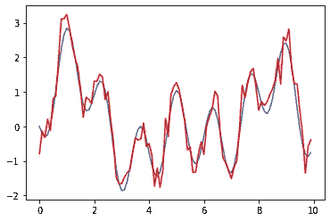
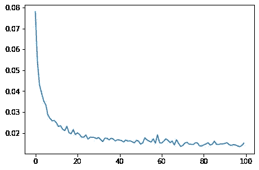
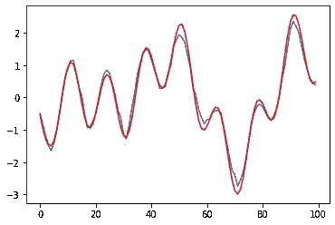
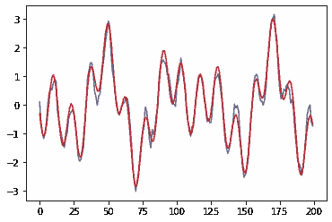
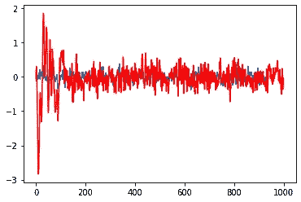
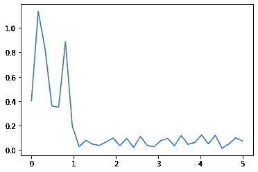
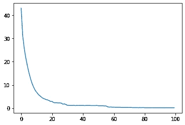
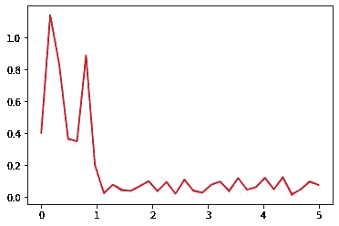
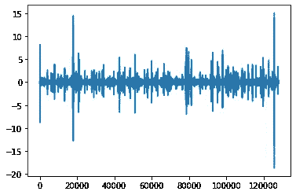

# 机器学习和信号处理

> 原文：<https://towardsdatascience.com/machine-learning-and-signal-processing-103281d27c4b?source=collection_archive---------3----------------------->

## 机器学习性能与两种关键信号处理算法(快速傅立叶变换和最小均方预测)的有趣比较。

## 从信号处理的角度看机器学习和神经网络。

信号处理为我们提供了一套工具，在过去的五十年里，这些工具得到了完善并得到了很好的应用。举几个例子，有自相关、卷积、傅立叶和小波变换、通过最小均方(LMS)或递归最小二乘(RLS)的自适应滤波、线性估计器、压缩传感和梯度下降。不同的工具用于解决不同的问题，有时，我们结合使用这些工具来构建一个系统来处理信号。

机器学习或深度神经网络更容易适应，因为无论我们使用什么网络架构，底层数学都相当简单。神经网络的复杂性和神秘性在于它们处理的数据量，以获得我们目前拥有的迷人结果。

## **时间序列预测**

本文旨在比较几种关键信号处理算法的神经网络性能。让我们看看时间序列预测作为第一个例子。我们将实现一个三层顺序深度神经网络来预测信号的下一个样本。我们也将以传统方式实现，使用抽头延迟滤波器，并根据均方误差调整权重，这就是 [LMS 滤波](https://en.wikipedia.org/wiki/Similarities_between_Wiener_and_LMS)，这是一种针对最优[韦纳滤波器](https://en.wikipedia.org/wiki/Wiener_filter)的迭代方法，用于从噪声测量中估计信号。然后我们将比较两种方法的预测误差。因此，让我们开始编写代码吧！

让我们首先导入我们需要的所有常用 python 库。由于我们将使用 TensorFlow 和 Keras 框架，我们也将导入它们。

## **用神经网络预测**

让我们现在开始建立我们的 3 层神经网络。输入层获取 64 个样本并产生 32 个样本。隐藏层将第一层的这 32 个输出映射到 8 个样本。最后一层将这 8 个样本映射到 1 个预测输出。记住输入尺寸是由第一层的 *input_shape* 参数提供的。

我们将使用 Adam 优化器，而不考虑它是什么。这就是 TensorFlow 的好处，我们不需要知道神经网络使用这个惊人的框架构建一个网络所需的所有处理的每个细节。如果我们发现 Adam 优化器不能很好地工作，我们将简单地尝试[另一个优化器](https://www.tensorflow.org/api_docs/python/tf/keras/optimizers) —例如 RMSprop。

现在让我们创建一个时间序列，一个简单的正弦波叠加。然后我们将添加噪声来模拟真实世界的信号。



现在我们有了数据，让我们考虑如何将这些数据输入神经网络进行训练。我们知道网络在输入端采集 64 个样本，产生一个输出样本。因为我们希望训练网络来预测下一个样本，所以我们希望使用第 65 个样本作为输出标签。

因此，第一个输入集是从样本 0 到样本 63(前 64 个样本)，第一个标签是样本 64(第 65 个样本)。第二个输入集可以是一个单独的 64 个样本集(非重叠窗口)，或者我们可以选择一个滑动窗口，从样本 1 到样本 64 取 64 个样本。让我们遵循滑动窗口方法，只是为了从我们拥有的时间序列中生成大量的训练数据。

还要注意，我们使用有噪声的样本作为输入，而使用无噪声的数据作为标签。我们希望神经网络即使在有噪声的情况下也能预测实际信号。

让我们看看时间序列数据和训练数据的大小。请注意，我们为时间序列数据生成了 5000 个样本，但我们为神经网络创建了 3935 x 64 = 251840 个输入数据样本。

train_data 的形状是输入集的数量 x 输入长度。这里，我们有 3935 批输入，每个输入有 64 个样本长。

```
print(y.shape, train_data.shape, train_labels.shape)(5000,) (3935, 64) (3935,)
```

我们现在准备训练神经网络。让我们首先实例化这个模型。模型摘要提供了关于有多少层、输出形状是什么以及我们需要为此神经网络训练的参数数量的信息。

对于第一层，我们有 64 个输入和 32 个输出。密集层实现等式 *y = f(Wx + b)* ，其中 *f* 是激活函数， *W* 是权重矩阵， *b* 是偏差。我们马上可以看到 *W* 是一个 64×32 的矩阵， *b* 是一个 32×1 的向量。这给了我们 32 x 64 + 32 = 2080 个参数来训练第一层。读者可以做类似的计算来验证第二层和第三层的参数，作为理解的练习。毕竟，除非你是机器学习的初学者并且渴望开始，否则你不会阅读这篇文章:)

```
model = dnn_keras_tspred_model()Model: "sequential"
_________________________________________________________________
Layer (type)                 Output Shape              Param #   
=================================================================
dense (Dense)                (None, 32)                2080      
_________________________________________________________________
dense_1 (Dense)              (None, 8)                 264       
_________________________________________________________________
dense_2 (Dense)              (None, 1)                 9         
=================================================================
Total params: 2,353
Trainable params: 2,353
Non-trainable params: 0
_________________________________________________________________
```

好吧，继续训练吧。由于我们使用的是 Keras 框架，训练就像调用 fit()方法一样简单。对于 TensorFlow，我们需要做更多的工作，但那是另一篇文章。

让我们使用 100 个[历元](https://docs.paperspace.com/machine-learning/wiki/epoch)，这只是意味着我们将一次又一次地使用相同的训练数据来训练神经网络，并将这样做 100 次。在每个时期，网络使用输入和标签集的批次数量来训练参数。

让我们使用*日期时间*来描述这个训练需要多长时间，以及作为 Python 字典返回的历史值，以获得每个时期之后的验证损失。

```
DNN training done. Time elapsed:  10.177171 s
```



现在网络已经训练好了，我们看到验证损失随着时间的推移已经下降到趋于平缓的程度(表明进一步的训练不会产生任何显著的改进)，让我们使用这个网络来看看它相对于测试数据的表现如何。

让我们以与创建训练数据集完全相同的方式创建测试数据集，但是只使用我们以前没有用于训练的那部分时间序列。我们想用以前从未见过的数据给神经网络一个惊喜，以了解它的表现有多好。

我们现在将调用 Keras 框架中的 *predict()* 方法来获得测试数据集的神经网络输出。如果我们使用 TensorFlow 框架，这一步会有所不同，但我们将在另一篇文章中讨论这一点。

正如我们所看到的，神经网络的预测非常接近实际的无噪声数据！



## **用 LMS 算法预测**

我们将使用 *L=64* 抽头滤波器来预测下一个样本。我们不需要那么大的滤波器，但是让我们保持每个输出样本的输入数量与我们用于神经网络的数量相同。

通过计算预测样本和测量样本之间的误差，并基于均方误差和输入测量值之间的相关性调整权重，获得滤波器系数(或权重)。

如代码所示， *yrlms[k]* 是输入为 *ypn[k-L:k]* 时的滤波器输出，误差计算为噪声测量值 *ypn[k]* 与滤波器输出 *yrlms[k]* 之差。测量和误差之间的相关性由 *ypn[k-L:k]* 和 *e* 的乘积给出， *mu* 为 LMS 步长(或学习率)。

正如我们所看到的，尽管复杂性低得多，但 LMS 预测同样不错。

```
(64,) (1064,)
```



## **比较 LMS 和神经网络的预测结果**

在我们结束本节之前，让我们比较一下 LMS 预测和神经网络预测之间的误差。公平地说，我忽略了 LMS 的初始部分，以便在测量均方误差和 SNR 时有时间收敛。尽管如此，我们看到神经网络性能比 LMS 性能好 5 dB！



```
Neural network SNR: **19.986311477279084**
LMS Prediction SNR: **14.93359076022336**
```

## **快速傅立叶变换**

好吧，在信号预测方面，神经网络比 LMS 快 5 dB，但是让我们看看神经网络是否可以被训练来进行傅立叶变换。我们将它与 SciPy FFTPack 中的 FFT(快速傅立叶变换)进行比较。FFT 算法是信号处理的核心，可以训练神经网络来模仿它吗？让我们来找出…

我们将使用之前创建的相同信号，即正弦波叠加，来评估 FFT。让我们先看看 FFT 输出。



现在让我们创建一个神经网络模型来模拟 FFT。与我们之前创建的有 64 个输入但只有一个输出的模型相比，这个模型需要为每 64 个样本输入集生成 64 个输出。

由于 FFT 输入和输出都很复杂，我们需要输入端两倍的样本数，先用实数后用虚数排列。由于输出也是复数，我们再次 2 x NFFT 样本。

为了训练这个神经网络模型，让我们使用通过 *numpy.random.normal* 生成的随机数据，并基于我们正在比较的 SciPy FFTPack 中的 FFT 例程设置标签。

代码的其余部分与前面的神经网络训练非常相似。在这里，我一次运行 10，000 批，如果网络需要更多的训练，我有一个外部 for 循环来做多组 10，000 批。请注意，这需要在 for 循环之外创建模型，以便权重不会被重新初始化。

从模型摘要中可以看出，仅 64 点 FFT 就有近 50，000 个参数。我们可以减少一点，因为我们只评估实输入，而虚部保持为零，但这里的目标是快速比较神经网络是否可以被训练来进行傅立叶变换。

```
Model: "sequential_1"
_________________________________________________________________
Layer (type)                 Output Shape              Param #   
=================================================================
dense_3 (Dense)              (None, 128)               16512     
_________________________________________________________________
dense_4 (Dense)              (None, 128)               16512     
_________________________________________________________________
dense_5 (Dense)              (None, 128)               16512     
=================================================================
Total params: 49,536
Trainable params: 49,536
Non-trainable params: 0
_________________________________________________________________
DNN training done. Time elapsed:  30.64511 s
```



训练结束了。现在让我们使用为 LMS 创建的相同输入样本来测试网络。我们将神经网络输出与 FFT 输出进行比较，它们是相同的！多神奇啊！



在结束本文之前，让我们做最后一次评估。对于一些随机输入数据，我们将比较神经网络输出和 FFT 输出，看看均方误差和 SNR 是什么样的。

运行下面的代码，我们得到一个体面的 23.64 dB 信噪比。虽然我们偶尔会看到一些误差较高的样本，但在大多数情况下，误差非常小。鉴于我们只训练了 10，000 批神经网络，这是一个相当不错的结果！



```
Neural Network SNR compared to SciPy FFT:  **23.64254974707859**
```

## **总结**

在新冠肺炎期间被困在里面，将机器学习性能与一些关键的信号处理算法进行比较是一个有趣的周末项目。我们看到，机器学习可以做信号处理可以做的事情，但天生具有更高的复杂性，其好处是可以推广到不同的问题。就复杂性而言，信号处理算法对工作来说是最佳的，但它们是针对它们所解决的特定问题的。我们不能用 FFT 代替 LMS，反之亦然，但我们可以使用相同的神经网络处理器，只需加载不同的权重集来解决不同的问题。这就是神经网络的多功能性。

有了这个提示，我将结束这篇文章。我希望你读这篇文章的时候和我整理这篇文章的时候一样开心。如果你觉得有帮助并且学到了一些东西，也请留下你的反馈！

[https://www.linkedin.com/in/prasannasethuraman/](https://www.linkedin.com/in/prasannasethuraman/)