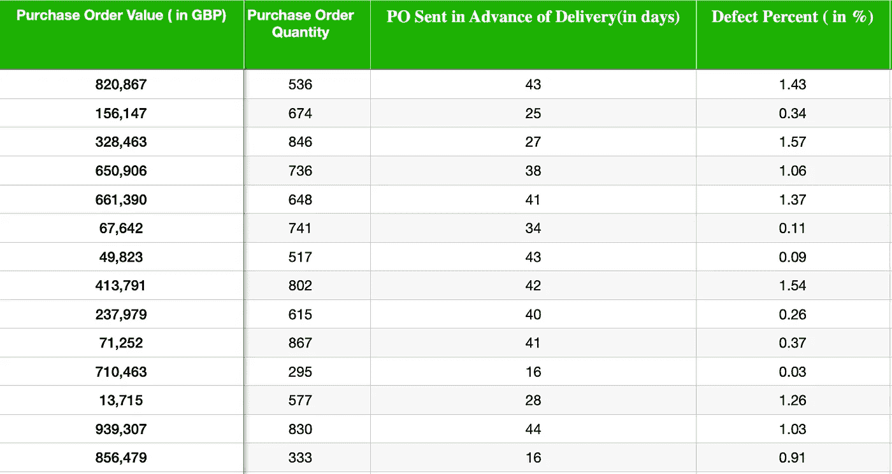
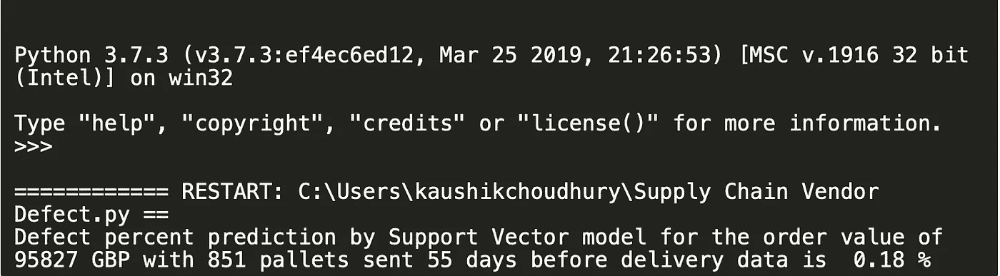
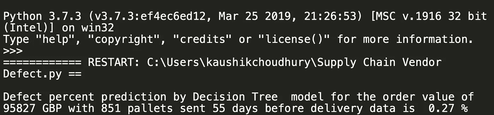

# 机器学习和供应链管理:动手系列#1

> 原文：<https://towardsdatascience.com/machine-learning-and-supply-chain-management-1a1d9462eb35?source=collection_archive---------16----------------------->

## [内部 AI](https://towardsdatascience.com/machine-learning/home)

## 拥抱未来


由 [Shaah Shahidh](https://unsplash.com/@shaahshahidh?utm_source=medium&utm_medium=referral) 在 [Unsplash](https://unsplash.com?utm_source=medium&utm_medium=referral) 上拍摄

机器学习、深度学习和人工智能正在从医学到音乐的所有领域实现转型变革。它正在帮助企业从采购到支付、计划生产、订购到兑现和记录到报告，发现优化机会并支持决策制定，这在以前使用传统商业分析和信息技术是不可能的。

机器学习和人工智能是一个复杂的领域，对我们这一代人来说有点令人畏惧，他们可能在本科教育之前没有接触过计算机。在这篇介绍性文章中，我将举例说明机器学习在采购和质量管理业务流程优化中的简化实现。在本文中，我将避免复杂和微妙的细节，在这一点上保持示例的简单性。我们将在本文的下一个系列中讨论复杂的场景。在本系列中，我将使用编程语言 Python 来实现机器学习算法，以解决供应链业务挑战，并且我假设您对 Python 语言有一些基本的了解。

***商业案例***

一个供应商供应不同的材料，其单价和采购订单总值相差很大。有时供应商的一些零件未能通过质量检查，但缺陷百分比似乎没有遵循一种趋势。在本系列的第一篇博客中，为了简单起见，我假设了独立特性和从属特性之间的线性关系。

***目标***

企业希望预测供应商交付的次品百分比。如果预测的次品百分比低于阈值水平，则不会执行质量检查。让我们考虑一下，如果交货中的次品率超过 0.4%，那么就需要明确的进货检验，以确保最终产品的质量。

这将有助于专注于特定采购订单交付的质量检查，以控制最终产品质量，并优化检验成本。它还能够发现有时影响少量材料有缺陷交付的变量/参数，并与供应商合作解决这个问题。

***数据点和信息***

ERP 中的采购订单信息和相应的进货检验结果为三年期间的所有订单提供了数据点。

*对从 ERP 导出的历史数据进行采样，以训练机器学习算法*



用于训练算法的样本数据

预计质量缺陷百分比的采购订单(PO)数据


用于预测值的测试数据

***整装待发***

为了简单起见，我假设过去的数据点是从 ERP 中导出的，并以 excel 格式保存在本地机器中。

我将解释每一行代码，然后将完整的代码放在文章的末尾以供参考。如前所述，为了让我们理解核心概念，我在这里简化了一些东西，在以后的系列文章中，我将在其上构建更真实的复杂示例。

***第一步****——首先，我们将导入我们将在机器学习程序中使用的所有 python 模块。我不会在本文中详细介绍这些库和模块，您可以在网上找到关于这些模块的更多细节。*

```
*import pandas as pd
from sklearn.tree import DecisionTreeRegressor # Import Decision Tree Algorithm
from sklearn.preprocessing import StandardScaler
from sklearn.svm import SVR #import for support vector regressor*
```

***Pandas** 是一个用 Python 编写的软件库，用于数据操作和分析。使用 Pandas 可以非常轻松地读写 excel、CSV 和其他文件格式的数据，并处理时间序列数据。 **Scikit-learn** 是一个免费的 python 机器学习库。我们将使用决策树学习和支持向量机来预测未来供应商交付中的缺陷百分比。为此，我们将专门从 Scikit Learn 中导入这两个模块。*

***步骤 2** -我们将读取 excel 文件中过去的数据点，并将其保存到 pandas dataframe SourceData。类似地，我们将读取我们希望算法预测交付缺陷百分比的交付数据点。*

```
*SourceData=pd.read_excel("Supplier Past Performance.xlsx") # Load the training data into Pandas DataFrameTestdata=pd.read_excel("Defect Predict.xlsx") # Load the test data*
```

**注意* —我已经将 python 程序、过去数据点 excel 表、未来数据集保存在同一个文件夹中。因此，在代码中，只指定了文件名。如果文件位于不同的文件夹位置，则需要提供完整路径。*

***第三步** -现在过去的所有四个数据点，即采购订单金额、采购订单数量、交货前发送的采购订单和缺陷百分比将从 excel 读入 Pandas 数据框架。*

*我们将使用采购订单金额、采购订单数量、交货前发送的 PO(天数)来预测未来交货中的缺陷百分比。自变量是用于进行预测的参数，因变量是被预测的变量。由于我们将使用从 ERP 收集的过去的数据点来训练机器学习算法，因此我们将把它称为 SourceData_train_independent 和 SourceData_train_dependent 变量。*

*在下面的代码中，我们声明了除“缺陷百分比”之外的所有列数据为自变量，只有“缺陷百分比”为因变量。*

```
*SourceData_train_independent= SourceData.drop(["Defect Percent"], axis=1) # Drop depedent variable from training datasetSourceData_train_dependent=SourceData["Defect Percent"].copy() 
# New dataframe with only independent variable value for training dataset*
```

***步骤 4** -采购订单价值从一千到一百万英镑不等，而订单数量从一百到一千个托盘不等。采购订单在交货日期前 15 到 45 天发出。由于独立变量的范围非常不同，因此我们需要对其进行调整，以避免一个变量(在本例中为采购订单价值)对其他因素的意外影响。*

*我们只需要缩放独立变量。*

*在下面的代码中，独立的训练和测试变量被缩放，并分别保存到 X-train 和 X_test。在 y_train 中，保存的从属训练变量不进行缩放。*

```
*sc_X = StandardScaler()

X_train=sc_X.fit_transform(SourceData_train_independent.values) 
# scale the independent training dataset variablesX_test=sc_X.transform(Testdata.values) # scale the independent test datasety_train=SourceData_train_dependent # scaling is not required for dependent variable*
```

***步骤 5** -现在我们将分别输入独立和非独立的训练数据，即 X_train 和 y_train，来训练支持向量机模型。为了避免混淆，我不会在第一个系列中讨论复杂的细节，比如算法(超参数)的设置。*

*在下面的代码中，我们首先用一个拟合方法来拟合 X_train 和 y_train。在模型被训练后，我们通过测试独立变量值，即新订单的“PO 数量”、“PO 数量”和“交货前发送的 PO”以及 X_test 变量，并将预测的缺陷百分比存储在变量“预测”中。*

```
*svm_reg = SVR(kernel="linear", C=1)
svm_reg.fit(X_train, y_train) # fit and train the modelpredictions = svm_reg.predict(X_test)

print("Defect percent prediction by Support Vector model for the order value of 95827 GBP with 851 pallets sent 55 days before delivery data is " ,round(predictions[0],2) , "%")*
```

*最后，使用 print 语句打印预测的缺陷百分比。*

**

***步骤 6** —同样，我们将把训练数据集(自变量和因变量的值)送入决策树模型。*

```
*tree_reg = DecisionTreeRegressor()
tree_reg.fit(X_train, y_train) # fit and train the modeldecision_predictions = tree_reg.predict(X_test) # Predict the value of dependent variableprint("Defect percent prediction by Decision Tree model for the order value of 95827 GBP with 851 pallets sent 55 days before delivery data is " ,round(decision_predictions[0],2) , "%")*
```

*使用 print 语句打印预测的缺陷百分比。*

**

*我们已经了解了如何使用决策树学习和支持向量模型算法来预测未来交付中的缺陷百分比数量，并基于此为特定供应商的交付计划质量检查。请注意，为了建立最初的理解，我已经简化了一些实际用例之外的元素。*

*在此示例中，每次运行代码来预测新订单的结果时，我们都会对模型进行定型。对于大型数据集和复杂的示例，这可能不可行。在本文的[下一个系列](https://medium.com/@kaushikthoughts/machine-learning-and-supply-chain-management-hands-on-series-2-d723125f749e)中，我将讨论保存训练好的模型，然后直接加载它来预测测试数据的结果。*

*[*机器学习与供应链管理:动手系列#2*](https://medium.com/@kaushikthoughts/machine-learning-and-supply-chain-management-hands-on-series-2-d723125f749e)*

***完整代码***

```
*""" Step 1 - Import the required modules"""

import pandas as pd
from sklearn.tree import DecisionTreeRegressor 
from sklearn.preprocessing import StandardScaler 
from sklearn.svm import SVR

""" Step 2 - Read the data source"""
SourceData=pd.read_excel("Supplier Past Performance.xlsx") # Load the training data into Pandas DataFrame
Testdata=pd.read_excel("Defect Predict.xlsx") # Load the test data 

""" Step 3  - Declare the independent and dependent train data from the sample"""
SourceData_train_independent= SourceData.drop(["Defect Percent"], axis=1) # Drop depedent variable from training dataset
SourceData_train_dependent=SourceData["Defect Percent"].copy() #  New dataframe with only independent variable value for training dataset

""" Step 4  - Scale the independent test and train data"""
sc_X = StandardScaler()
X_train=sc_X.fit_transform(SourceData_train_independent.values) # scale the independent variables
y_train=SourceData_train_dependent # scaling is not required for dependent variable
X_test=sc_X.transform(Testdata.values)

""" Step 5  - Fit the test data in maching learning model - Support Vector Regressor"""
svm_reg = SVR(kernel="linear", C=1)
svm_reg.fit(X_train, y_train) # fit and train the modelpredictions = svm_reg.predict(X_test)

print("Defect percent prediction by Support Vector model for the order value of 95827 GBP with 851 pallets sent 55 days before delivery data is " ,round(predictions[0],2) , "%")

""" Step 6 - Fit the test data in maching learning model - Decision Tree Model"""
tree_reg = DecisionTreeRegressor()
tree_reg.fit(X_train, y_train) # fit and train the modeldecision_predictions = tree_reg.predict(X_test) # Predict the value of dependent variableprint("Defect percent prediction by Decision Tree model for the order value of 95827 GBP with 851 pallets sent 55 days before delivery data is " ,round(decision_predictions[0],2) , "%")*
```