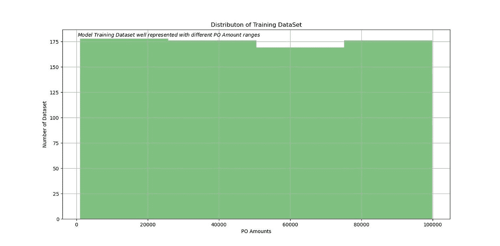

# 机器学习和供应链管理:动手系列#2

> 原文：<https://towardsdatascience.com/machine-learning-and-supply-chain-management-hands-on-series-2-d723125f749e?source=collection_archive---------46----------------------->

## [内部 AI](https://towardsdatascience.com/machine-learning/home)

## 不准确的预测比不预测更糟糕。学习保存机器学习训练的模型以备将来使用，并测量模型的准确性。


照片由[Shaah Shahidh](https://unsplash.com/@shaahshahidh?utm_source=medium&utm_medium=referral)&[Alexandre debiève](https://unsplash.com/@alexkixa?utm_source=medium&utm_medium=referral)在 [Unsplash](https://unsplash.com/?utm_source=medium&utm_medium=referral)

在本系列的第[部分](https://medium.com/@kaushikthoughts/machine-learning-and-supply-chain-management-1a1d9462eb35)中，我已经讨论了机器学习算法的一个基本简化实现，它可以根据输入参数预测未来采购订单的缺陷百分比。

在这一部分中，我将谈到训练模型的准确性度量。我们有许多参数(称为估计量的超参数),这些参数在模型中作为变量传递以执行预测。在实践中，基于训练模型的准确性度量结果，在模型被实施用于生产中的预测之前，超参数被调整。算法可以搜索并推荐优化的超参数，而不是通过试错法手动调整超参数来获得优化的准确度分数。我将在本系列的后面部分讨论有效的参数搜索策略。

正如在本系列的前一部分中提到的，在预测之前每次都从头开始训练模型是不实际的。我还将讨论如何保存一个训练好的模型，并将其直接导入另一个程序进行预测。

*注*:我将详细解释新的领域和概念，并将避免详细重复我之前文章中解释的部分。我鼓励您参考前面的[部分](https://medium.com/@kaushikthoughts/machine-learning-and-supply-chain-management-1a1d9462eb35)。

***第一步***

首先，我们将导入模型所需的包。**需要使用 StratifiedShuffleSplit** 导入来构建一个训练模型，其样本集很好地代表了不同的子集值范围。 **Pickle** 模块将帮助我们保存训练好的模型，然后直接在其他程序中导入模型进行预测。最后，sklearn.metrics 有一套方法来衡量任何模型的准确性。

```
import pandas as pdimport numpy as npfrom sklearn.model_selection import StratifiedShuffleSplit #import to have equal weigtage samples in training datasetfrom sklearn.tree import DecisionTreeRegressor # import for Decision Tree Algorithmimport picklefrom sklearn.preprocessing import StandardScalerfrom sklearn.svm import SVR #import for support vector regressorfrom sklearn.metrics import mean_squared_error  # import to calculate root mean square
```

***第二步***

将从 ERP 和其他应用程序导出的样本数据集读入 pandas 数据框架。请参考[早前的文章](https://www.linkedin.com/pulse/machine-learning-supply-chain-management-hands-on-series-choudhury/?trackingId=RRoR7gjSWF1Sfz5tBIWipA%3D%3D)了解数据集的结构和其他细节。

```
SourceData=pd.read_excel("Supplier Past Performance.xlsx") # Load the data into Pandas DataFrame
```

***第三步***

粗略分析数据样本后，似乎“PO 数量”对“缺陷百分比”有着密切而强烈的影响，因此我们希望确保使用不同范围的“PO 数量”记录来训练模型。如果我们用由 30，000 到 60，000 英镑之间的“PO 数量”过度表示的数据集来训练我们的模型，那么我们的模型学习将不会准确到现实生活场景，并且可能不会准确预测。

在下面的代码中，引入了一个新的列“采购订单类别”,将 0 至 30，000 英镑的“采购订单金额”分类为采购订单类别 1，30，000 至 60，000 英镑的为采购订单类别 2。

```
SourceData["PO Category"]=pd.cut(SourceData["PO Amount"],
                                     bins=[0., 30000, 60000, 90000,
np.inf],                                     
labels=[1, 2, 3, 4])
```

***第四步***

StatifiedShuffleSplit 提供训练和测试索引，将过去的数据集分成训练集和测试集。在下面的代码中，我们保留了 30%的数据用于测试模型，60%用于训练模型

```
split = StratifiedShuffleSplit(n_splits=2, test_size=0.3)
```

***第五步***



使用前面步骤中的训练和测试索引，我们将初始源数据分成两部分，即。strat_train_set 作为训练数据集，strat_test_set 分别作为模型的测试和训练数据集。

在下面的代码中，我们使用“采购订单类别”来确保在每个分开的集合中，不同的采购订单类别都得到很好的表示。

```
for train_index, test_index in split.split(SourceData, SourceData["PO Category"]):
    strat_train_set = SourceData.loc[train_index]  # stratfied train dataset 
    strat_test_set = SourceData.loc[test_index] #stratified test dataset
```

***第六步***

我们引入了一个额外的列“PO Category ”,以确保在测试和训练数据集中充分表示来自所有 PO 金额范围的采购订单。由于已经完成，因此我们将从数据集中删除这个额外的 PO 类别。

```
for set_ in (strat_train_set, strat_test_set): 
    set_.drop("PO Category", axis=1, inplace=True)
```

***第七步***

现在，我们将为我们的模型定义、测试和训练数据独立变量和因变量。我们将使用独立和从属训练数据集来训练模型，因为它是一种受监督的机器学习。此外，我们将使用模型之前没有见过的测试数据集来测试模型性能。

```
SourceData_train_independent= strat_train_set.drop(["Defect Percent"], axis=1)
SourceData_train_dependent=strat_train_set["Defect Percent"].copy()SourceData_test_independent= strat_test_set.drop(["Defect Percent"], axis=1)
SourceData_test_dependent=strat_test_set["Defect Percent"].copy()
```

***第八步***

由于数据属性具有不同的范围，因此我们需要在使用它进行训练之前对其进行缩放。关于缩放数据的更多信息，请参考我之前的文章。

在下面的代码中，我们使用 pickle.dump()将 scale 保存为“Scaler.sav ”,以后我们可以在其他程序中导入以供使用。

```
sc_X = StandardScaler()
X_train=sc_X.fit_transform(SourceData_train_independent.values)
y_train=SourceData_train_dependentpickle.dump(sc_X, open("Scaler.sav", 'wb'))X_test=sc_X.fit_transform(SourceData_test_independent.values)
y_test=SourceData_test_dependent
```

***第九步***

我们将用训练数据集训练支持向量模型，并用 pickle 将训练好的模型保存为“SVR_TrainedModel.sav”。“SVR_TrainedModel.sav”和当前程序保存在同一个文件目录中，因为我们没有提供完整的路径和唯一的文件名作为保存参数。

```
svm_reg = SVR(kernel="linear", C=1)
svm_reg.fit(X_train, y_train)filename = 'SVR_TrainedModel.sav'
pickle.dump(svm_reg, open(filename, 'wb'),protocol=-1)
```

***第十步***

现在，我们将从经过训练的独立数据集预测因变量，即缺陷百分比值，并测量模型的误差/准确性。在下面的代码中，我们传递训练数据集，然后将模型的预测值与实际值进行比较。将独立训练变量数据集的预测与实际值进行比较，并通过评分方法返回回归估计量的 R 分数。

```
decision_predictions = svm_reg.predict(X_train)Score = (svm_reg.score(X_train, y_train))  # It provides the R-Squared Value
print ( "The score of the Support  Vector model is", round(Score,2))lin_mse = mean_squared_error(y_train, decision_predictions)
print("MSE  of  Vector  model is ", round(lin_mse,2))lin_rmse = mean_squared_error(y_train, decision_predictions, squared=False)
print("RMSE of  Support  Vector  Learning model is ", round(lin_rmse,2))
```

在这篇文章中，我不会涉及 R-Square、均方差和均方根误差的统计细节，我强烈建议大家阅读维基百科中关于这些统计指标的页面。这将有助于解释模型是否被训练到可接受的极限，或者我们需要微调数据和超参数。

```
The score of the Support  Vector model is 0.09
MSE  of  Vector  model is  0.05
RMSE of  Support  Vector  Learning model is  0.12
```

***第十一步***

对于决策树学习模型，我们遵循相同的步骤，并检查模型的准确性。

```
tree_reg = DecisionTreeRegressor()
tree_reg.fit(X_train, y_train)
filename = 'DecisionTree_TrainedModel.sav'
pickle.dump(tree_reg, open(filename, 'wb'),protocol=-1 predictions = tree_reg.predict(X_train) Score = (tree_reg.score(X_train, y_train))  # It provides the R-Squared Value
print ( "The score of model Decision Tree model is ", round(Score,2))lin_mse = mean_squared_error(y_train, predictions)
print("MSE of Decision Tree model is ", round(lin_mse,2))lin_rmse = mean_squared_error(y_train, decision_predictions, squared=False)
print("RMSE of Decision Tree model is ", round(lin_rmse,2))
```

***第十二步***

一旦模型预测的结果在可接受的误差范围内，我们就可以将模型以前没有见过的测试数据集输入到预测模型中。我们可以用与训练数据集相同的方式来比较测试数据集相关的数据准确性。

```
test_predictions = tree_reg.predict(X_test)
test_decision_predictions = svm_reg.predict(X_test)
```

**导入训练好的模型和预测**

要在另一个程序中使用训练好的模型，我们需要使用“pickle.load”导入自变量 scales 和学习模型，如下面的代码片段所示。

这里，我们从“Supply Chain Predict.xlsx”文件中读取新的独立值数据集，预测相应因变量的进一步步骤如上文针对测试数据所述。

```
import pickle
import pandas as pd testdata=pd.read_excel("Supply Chain Predict.xlsx") # Load the test datasc_X = pickle.load(open('Scaler.sav', 'rb'))  # Load the pickleloaded_model = pickle.load(open('DecisionTree_TrainedModel.sav', 'rb')) # load the trained modelX_test=sc_X.transform(testdata.values) # scale the independent variables for test datadecision_predictions = loaded_model.predict(X_test) # Predict the value of dependent variableprint("The prediction by Decision Treemodel is " , decision_predictions )
```

*完整的代码片段*

```
# Importing the required modules 
import pandas as pd
import numpy as np
from sklearn.model_selection import StratifiedShuffleSplit #import to have equal weigtage samples in training dataset
from sklearn.tree import DecisionTreeRegressor # import for Decision Tree Algorithm
import pickle
from sklearn.preprocessing import StandardScaler
from sklearn.svm import SVR #import for support vector regressor
from sklearn.metrics import mean_squared_error  # import to calculate root mean squareSourceData=pd.read_excel("Supplier Past Performance.xlsx") # Load the data into Pandas DataFrame
SourceData_independent= SourceData.drop(["Defect Percent"], axis=1) # Drop depedent variable from training dataset
SourceData_dependent=SourceData["Defect Percent"].copy() # New dataframe with only independent variable value for training dataset
SourceData["PO Category"]=pd.cut(SourceData["PO Amount "],
                                     bins=[0., 30000, 60000, 90000,
np.inf],                                     
labels=[1, 2, 3, 4])
split = StratifiedShuffleSplit(n_splits=1, test_size=0.3)
for train_index, test_index in split.split(SourceData, SourceData["PO Category"]):
    strat_train_set = SourceData.loc[train_index]  # stratfied train dataset 
    strat_test_set = SourceData.loc[test_index] #stratified test datasetfor set_ in (strat_train_set, strat_test_set): 
    set_.drop("PO Category", axis=1, inplace=True) SourceData_train_independent= strat_train_set.drop(["Defect Percent"], axis=1)
SourceData_train_dependent=strat_train_set["Defect Percent"].copy()
SourceData_test_independent= strat_test_set.drop(["Defect Percent"], axis=1)
SourceData_test_dependent=strat_test_set["Defect Percent"].copy()
sc_X = StandardScaler()
X_train=sc_X.fit_transform(SourceData_train_independent.values)
y_train=SourceData_train_dependent
pickle.dump(sc_X, open("Scaler.sav", 'wb'))
X_test=sc_X.fit_transform(SourceData_test_independent.values)
y_test=SourceData_test_dependentsvm_reg = SVR(kernel="linear", C=1)
svm_reg.fit(X_train, y_train)
filename = 'SVR_TrainedModel.sav'
pickle.dump(svm_reg, open(filename, 'wb'),protocol=-1)
decision_predictions = svm_reg.predict(X_test)
Score = (svm_reg.score(X_test, y_test))  # It provides the R-Squared Value
print ( "The score of the Support  Vector model is", round(Score,2))
lin_mse = mean_squared_error(y_test, decision_predictions)
print("MSE  of  Vector  model is ", round(lin_mse,2))
lin_rmse = mean_squared_error(y_test, decision_predictions, squared=False)
print("RMSE of  Support  Vector  Learning model is ", round(lin_rmse,2))tree_reg = DecisionTreeRegressor()
tree_reg.fit(X_train, y_train)
filename = 'DecisionTree_TrainedModel.sav'
pickle.dump(tree_reg, open(filename, 'wb'),protocol=-1)
predictions = tree_reg.predict(X_test) 
Score = (tree_reg.score(X_test, y_test))  # It provides the R-Squared Value
print ( "The score of model Decision Tree model is ", round(Score,2))
lin_mse = mean_squared_error(y_test, predictions)
print("MSE of Decision Tree model is ", round(lin_mse,2))
lin_rmse = mean_squared_error(y_test, decision_predictions, squared=False)
print("RMSE of Decision Tree model is ", round(lin_rmse,2))
```

在本文的下一个系列中，我将讨论不同机器学习算法中的超参数，以及可用于为健壮的机器学习模型确定这些参数的最佳值的选项。

[*机器学习与供应链管理:动手系列#1*](https://medium.com/@kaushikthoughts/machine-learning-and-supply-chain-management-1a1d9462eb35)

在[上学习结构化方法如何识别机器学习监督算法的正确自变量？](/how-to-identify-the-right-independent-variables-for-machine-learning-supervised-algorithms-439986562d32)