# 机器学习和情绪交易

> 原文：<https://towardsdatascience.com/machine-learning-and-trading-on-sentiment-76a484cefca8?source=collection_archive---------28----------------------->


照片由[ZQ·李](https://unsplash.com/photos/DcyL0IoCY0A)在 [Unsplash](https://unsplash.com/) 拍摄

## 建立一个分类算法的集合，以利用短期 SPDR 部门 ETF 价格行为

**你将学到什么和学到什么技能**

*   **如何将多个分类机器学习模型构建成复合集成模型**
*   **使用时序分割和随机交叉验证进行超参数调整**
*   **探索评估模型质量的重要分类指标，如 F1 分数和准确度**
*   **可应用于多种策略的投资组合绩效和构建代码，将现实世界的交易成本考虑在内**
*   **如何使用一个热编码构建功能集**
*   **发现是否可以从基本机器学习模型中预测短期价格变动**

在我之前的[文章](/trading-on-sentiment-trying-to-make-money-off-the-mood-of-the-market-312368c068f0)中，我探讨了是否有可能使用一个单一的情绪指标和一个简单的线性模型来系统地跑赢美国股市。不出所料，我发现一个简单的系统根本行不通。但也许结合不同情绪信号的机器学习模型可以创造一种有利可图的策略？

## **文献综述**

随着社交媒体的出现，分析师已经使用社交媒体分析和自然语言处理来提取特定公司的情绪情绪，像 [Ravenpack](https://www.ravenpack.com/research/short-term-stock-selection-using-news/) 这样的公司在长期高积极情绪公司和短期消极情绪公司中找到了阿尔法。他们发现，在 2-3 天的时间里，长/短的顶部 10%和底部 10%组合的回报率为 50-100 个基点。

Shlaefer 发现，有 1 到 12 个月的反应不足(股票价格在好消息后上涨，坏消息后下跌)表明投资者需要时间来处理新信息，但在 3 到 5 年的时间里，投资者反应过度，为一连串的正收益付出太多，并忽略了公司基本面的均值回复性质。

贝克和斯坦恩发现，一段时期的高流动性和较小的买卖差价会导致未来回报较低。由于非理性投资者往往使市场更具流动性，流动性的措施提供了一个指标，这些投资者的相对存在或不存在，因此价格水平相对于基本面。

[贝克和沃格勒](https://papers.ssrn.com/sol3/papers.cfm?abstract_id=962706)假设，对投资者情绪最敏感的股票将是那些更年轻、更小、更不稳定、不盈利、不支付股息、陷入困境或具有极大增长潜力或具有类似特征的公司。而“债券类”股票将较少受情绪驱动。他们发现，对于年轻、高度不稳定、接近财务困境且无利可图的小盘股和投机股，情绪可能是一个强有力的短期反向指标。具体来说，在这组公司中，当情绪低于历史平均水平一个标准差时，他们的月回报率平均为-34%，当情绪高于历史平均水平一个标准差时，他们的月回报率为 1.18%。

[Borovoka 和 Dijkstra](https://papers.ssrn.com/sol3/papers.cfm?abstract_id=3253043) 在他们的深度神经网络模型中实现了 60%的准确性，根据围绕单个指数公司的高频新闻情绪预测欧洲斯托克 50 指数的价格走势。

泰特洛克发现，根据《华尔街日报》的“与市场同步”专栏的测量，媒体情绪是几天来整体股市回报的一个确认指标，尤其是对小型股而言。此外，他发现异常高或低的市场悲观情绪会导致高交易量。

## **数据和方法**

没有一项研究调查了由整体投资者情绪驱动的特定行业效应，所以我很想探究一下。

我使用了 9 只 SPDR 行业交易所交易基金(XLU，XLK，XLB，XLI，XLV，XLF，XLE，XLP，XLY ),它们成立于 1998 年 12 月，提供了雅虎财经超过 21 年的每日 OHLC 和交易量数据。请注意，免费数据，如雅虎金融，并不总是最干净的价格数据，但我保留了它，这样你就可以用最小的成本利用代码，以防你想添加不同的 ETF 或股票报价机来测试模型。

我还利用了来自沙拉达、圣路易斯美联储、杜克大学、芝加哥期权交易所、密歇根大学、经济政策不确定性和

将 scikit-learn python 库中的多个分类机器学习模型组合成一个集成分类，我希望与任何单个模型相比，一个多样化的模型将在样本外表现良好。

将数据集转换为训练集、验证集和测试集:

*   训练/验证(样本内)—从数据开始到 2013 年底，训练占样本数据的 80%，验证占样本数据的剩余 20%
*   测试(样本外)—2014 年 1 月—2020 年 5 月

## 沉思和好奇

我将尝试回答的问题是:

*   基于市场情绪，在多长时间内行业回报最可预测？由于高 OHLC 和交易量数据，我只能在第二天开盘时买入，在 n 天后平仓。
*   在最终的集合模型中应该使用什么模型来组合？
*   什么超参数对于样本外数据的预测是最佳的？
*   在组合了最佳模型后，机器学习投资组合在扣除交易成本后是否会表现更好，因为这将是一种高流动战略？
*   该模型能胜过被动的买入并持有策略吗？

## **构建特征集**

在整篇文章中，我将分享部分代码，但由于可读性，并非全部，但是您可以在 [GitHub](https://github.com/StevenDowney86/Public_Research_and_Backtests/tree/master/Sentiment%20Research) 上访问数据(由于许可限制，除了 Sharadar)和 python 文件供您个人使用。

以下内容构成了算法将从中预测期望值的特征集，即该证券在 n 天内是正回报还是负回报。

1.  市场成交量(占一天交易的总流通股的百分比)
2.  上涨/下跌比率(股票总数增加/股票总数减少)
3.  简单移动平均线/价格在滚动的 2 到 22 个交易日内迭代
4.  在滚动的 2 到 22 个交易日内迭代的年化标准差
5.  维克斯
6.  Sahm 法则——在实时预测经济衰退方面非常有用
7.  投资级——高收益公司债券利差
8.  政治不确定指数
9.  杜克首席财务官乐观指数
10.  卖出/买入比率
11.  AAII 投资者情绪指数
12.  密歇根大学消费者情绪指数
13.  耶鲁/希勒投资者情绪指数

## **一热编码**

我很好奇，在相同的功能集下，各个部门的 ETF 是否表现不同，因此我使用了一个热编码来为每个 ETF 创建列，如果使用，列为 1，否则为 0(见下图)。

最终的特性和值 pandas 数据帧如下所示，然后被转换为 NumPy 数组。

```
Credit Spread  US Shiller Valuation Index Indiv (Lag)  \
date                                                                
2003-10-17           3.95                                   66.24   
2003-10-17           3.95                                   66.24   
2003-10-17           3.95                                   66.24   
2003-10-17           3.95                                   66.24   
2003-10-17           3.95                                   66.24US Shiller Valuation Index Inst (Lag)               ...
date                                                ...
2003-10-17                                  76.64   ...
2003-10-17                                  76.64   ...
2003-10-17                                  76.64   ...
2003-10-17                                  76.64   ...
2003-10-17                                  76.64   ... XLK  XLP  XLU  XLV  XLY  
date                                 
2003-10-17  0.0  0.0  0.0  0.0  0.0  
2003-10-17  0.0  1.0  0.0  0.0  0.0  
2003-10-17  1.0  0.0  0.0  0.0  0.0  
2003-10-17  0.0  0.0  0.0  0.0  1.0  
2003-10-17  0.0  0.0  0.0  0.0  0.0
```

## 创建训练、验证和测试集

您可以很容易地创建一个训练和验证集，注意需要放置 shuffle=False 来防止数据中的混洗，因为财务数据不是独立的，这会使模型过拟合。我喜欢将样本数据(训练和验证)保存在一个 python 文件中，将样本外(测试)数据保存在一个单独的文件中，以防止任何欺骗和展望未来的诱惑。

```
############Creating Training/Validation Set################# Labels are the values we want to predict
labels = np.array(features['value'])# Remove the labels from the feature and the date
features_array = features.drop(['value','index'], axis=1)# Saving feature names for later use
feature_list = list(features_array.columns)# Convert to numpy array
features_array = np.array(features_array)# Using Skicit-learn to split data into training and testing sets, but in this case it is a validation set

test_ratio = .2 #variable for the percentage of train data to leave as validation# Split the data into training and testing sets, with simple split
train_features, validation_features, train_labels, validation_labels = train_test_split(features_array, labels, test_size=test_ratio, random_state=42, shuffle=False)number_features = train_features.shape[1]
```

## **组合模型和选择交易日期**

准确度测试在 1-30 天的保持期内使用以下分类器进行:

*   adaboost 算法
*   随机森林
*   梯度推进
*   高斯过程
*   k 个最近邻居
*   MLP 神经网络
*   支持向量机

当我在分类气泡中一步一步地浏览 scikit-learn 算法[备忘单](https://scikit-learn.org/stable/tutorial/machine_learning_map/index.html)时，我特别选择了这些。

每个模型都基于 F1 分数、准确性分数(正确预测的百分比)以及两者的平均值进行测试。我选择排除 SVC 和 MLP 神经网络模型，因为它们分别具有最低的两个组合分数 0.516 和 0.521。接下来，我选择专注于 3 天的持有期，因为算法能够很好地预测时间范围，并且假设模型是好的，更多的交易机会将很好地服务于它，尽管受到交易成本的限制。下表使用条件格式直观地选择高分和低分，标准偏差有一个使用红色的单独公式。我希望看到的是所有模型之间的高平均分和低标准差，这向我表明在特征集中有一个信号要提取，并且算法能够可靠地访问它。

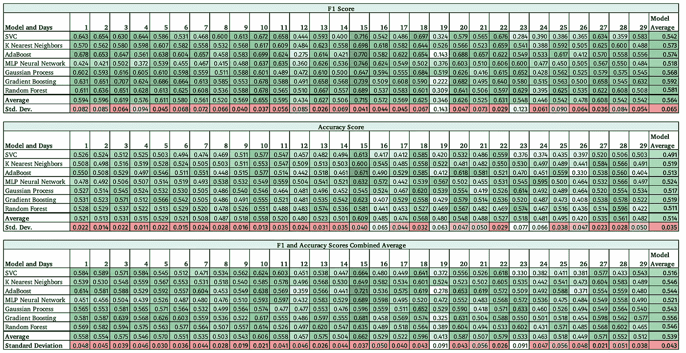

单元格用颜色编码，暗绿色表示较高的分数，底部行表示模型的标准偏差，以辨别跨模型的稳定性，暗红色表示较低的标准偏差。

## 超参数调整和交叉验证

我将使用 sci-kit 学习库中的时间序列分割和随机交叉验证搜索功能进行超参数调整。时间序列分割，也称为[向前移动方法](https://scikit-learn.org/stable/modules/cross_validation.html)，是为时间序列数据设计的，因为它通常不是独立和同分布的。

然而，正如 De Prado 在[机器学习进展](https://www.amazon.ae/Advances-Financial-Machine-Learning-Marcos/dp/1119482089)中提出的挑战，交叉验证功能对所有分数进行同等加权，即使一些分数是在整体数据的一小部分上训练的。为了解决这个问题，我决定根据总使用折叠的分数来衡量交叉验证分数(即，对于 5 次交叉验证，最后一次测试的分数将为 5 / (5+4+3+2))。

De Prado 提出的另一个问题是，需要清除交叉验证方法中训练/验证分割边缘附近的数据，以尽量减少测试和训练集之间的数据泄漏。我试图利用他的 purgedKfoldCV 函数，但由于每个时间点都有多个数据点，我们同时在看 9 个行业 ETF，所以我做不到。

[F1 得分](https://en.wikipedia.org/wiki/F1_score)是主要指标，由精确度和召回率的调和平均值组成，在交叉验证期间将通过它来测试模型的准确性。

使用随机 CV 搜索功能，我将给出一个参数列表，从中随机选择，然后分离出最佳评分组合，然后用于验证集。具有最高的，并且希望是不相关的，预测能力的算法将在一个多数表决系统中被组合，以创建最终的预测系统。

下面是一个随机森林算法的随机搜索参数的例子，我摘自[威尔·科尔森](https://medium.com/u/e2f299e30cb9?source=post_page-----76a484cefca8--------------------------------)的一篇文章，并根据我的目的进行了修改。

```
#### Create 5 K Fold Split Time Series ####number_of_splits = 5
tscv = TimeSeriesSplit(n_splits=number_of_splits)

#####Randomized CV for Random Forest using Timseries split #######

# Number of trees in random forest
n_estimators = [int(x) for x in np.linspace(start = 200, stop = 2000, num = 10)]# Number of features to consider at every split
max_features = ['auto', 'sqrt']# Maximum number of levels in tree
max_depth = [int(x) for x in np.linspace(10, 110, num = 11)]
max_depth.append(None)# Minimum number of samples required to split a node
min_samples_split = [2, 5, 10]# Minimum number of samples required at each leaf node
min_samples_leaf = [1, 2, 4]# Method of selecting samples for training each tree
bootstrap = [True, False]# Create the random grid
random_grid = {'n_estimators': n_estimators,
                'max_features': max_features,
                'max_depth': max_depth,
                'min_samples_split': min_samples_split,
                'min_samples_leaf': min_samples_leaf,
                'bootstrap': bootstrap}
print(random_grid)# Use the random grid to search for best hyperparameters
# First create the base model to tune
rf = RandomForestClassifier(n_jobs=-1)# Random search of parameters, using time series split, 
# search across 100 different combinations
rf_random = RandomizedSearchCV(estimator = rf, param_distributions = random_grid, n_iter = 100, cv = tscv, verbose=2, random_state=42, \
                                    scoring='f1')
# Fit the random search model
search_rf = rf_random.fit(train_features, train_labels)search_rf.best_params_
search_rf.cv_results_
search_rf.best_score_
search_rf.best_estimator_
search_rf.scorer_
```

一些随机搜索需要一些时间，例如在我的 Mac 上随机森林需要 77 分钟，梯度提升需要 144 分钟(16GB 内存和 2.9 GHz 双核英特尔酷睿 i5)。你可以尝试使用基于[直方图的梯度推进分类树](https://scikit-learn.org/stable/modules/generated/sklearn.ensemble.HistGradientBoostingClassifier.html)，它被设计成在大型特征集上更快。

## **特征重要性和模型多样化**

使用随机森林和梯度增强，您可以看到每个要素的相对重要性百分比。

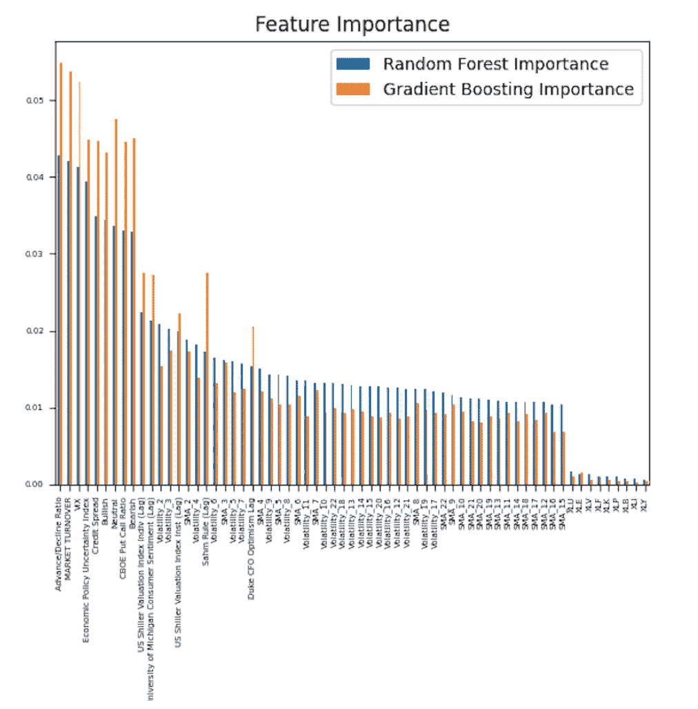

**一般观察:**

*   在最右边，我们看到模型在 ETF 是否是特定部门的 ETF 方面几乎没有用处
*   毫无疑问，对 3 天回报率预测最高的波动特征是 2 天和 3 天的波动
*   整体市场动态，如上涨/下跌和市场成交量，对预测未来 3 天的回报最有用

从下面的相关矩阵可以看出，这五个模型的组合确实提供了多样性，这是有意义的，因为它们利用不同的数学算法基于特征集进行分类。

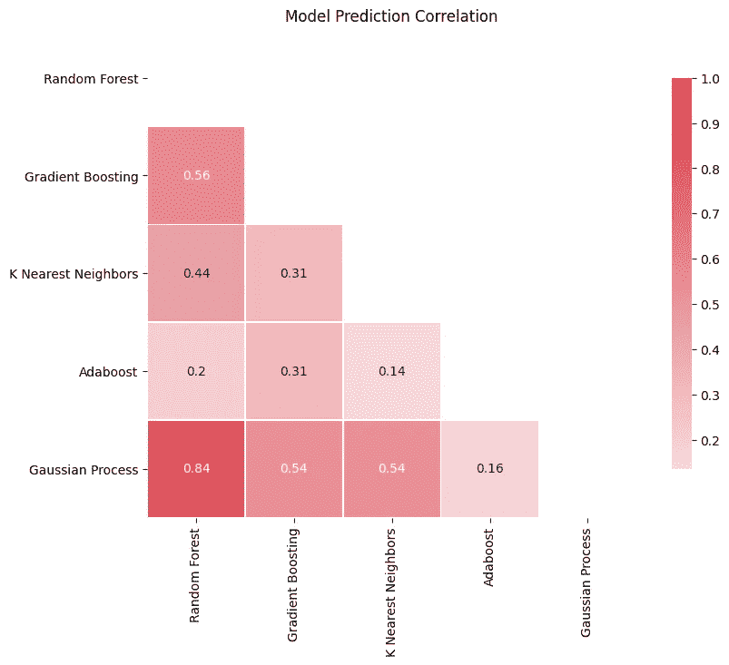

## **投资组合实施**

在综合了所有 5 个模型的预测后，我创建了一个多数投票系统。接下来，我在训练和验证数据集上运行该策略，并与同等权重的投资策略进行比较。

设置实施投资组合所需的变量

```
#########  Portfolio Construction  ########
Predictions_DF = features.iloc[:,(-len(tickers)-1):]#Using the same in sample dates here and for equal weight benchmark
f_date = datetime.datetime.strptime(In_Sample_Start, '%Y-%m-%d')
l_date = datetime.datetime.strptime(In_Sample_End,  '%Y-%m-%d')delta = l_date - f_date#Choose the number of periods (days in range / the forecasted return days)period_delta = np.floor(delta.days/(Number_days_to_hold))
period_delta = int(period_delta)
first_period = In_Sample_Start #using f_datereturns_df_portfolio = pd.DataFrame()
row_length = Predictions_DF.shape[0]
Portfolio_Turnover = pd.DataFrame()
```

创建遍历数据并执行交易的 for 循环(当我试图嵌入时，下面的代码看起来相当糟糕)。

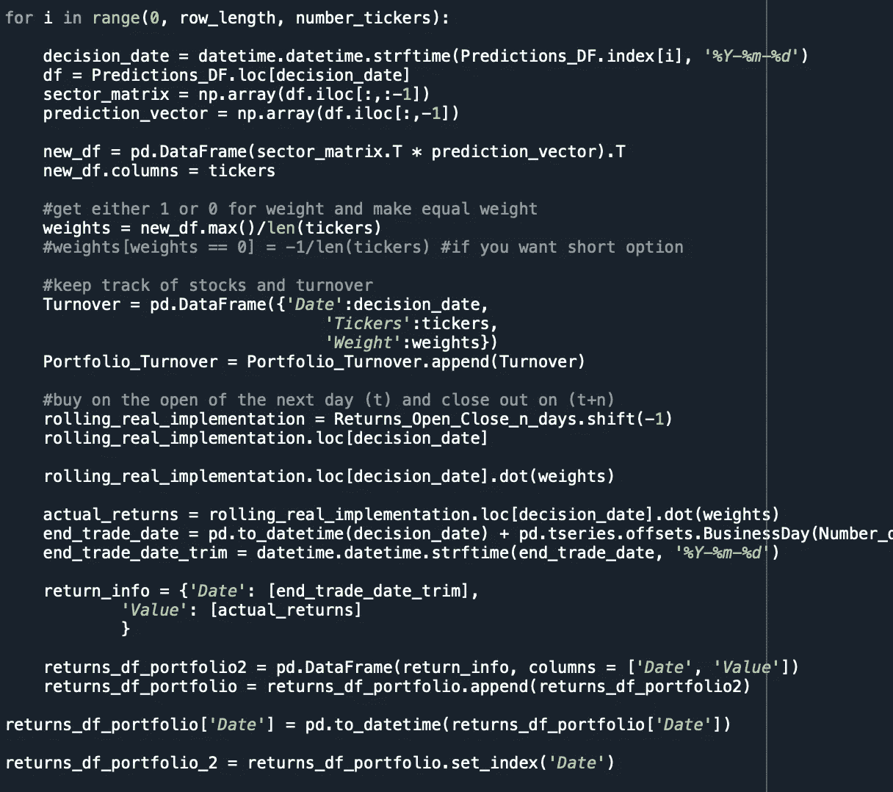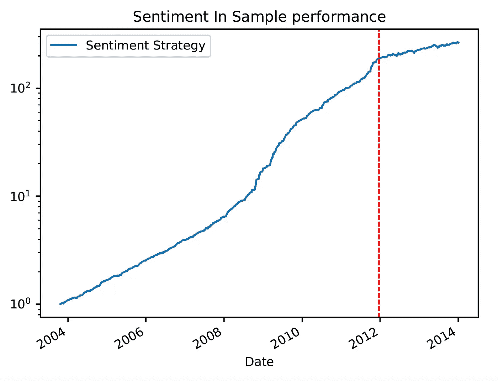

注意:y 轴是对数刻度，红线表示验证集的开始

正如您所看到的，与验证集相比，in 样本高度超出预期，因此我解析出了图表来说明差异。

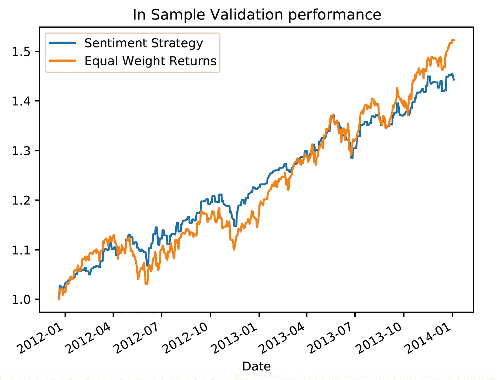

该策略有较高的风险调整回报率，表现为较高的夏普比率，但在其他方面并没有实质性的改善。

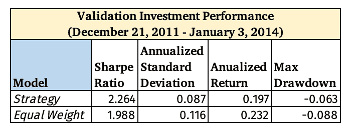

## **测试数据**

下面是围绕模型分类的统计数据，最后一行显示了如果我假设市场将永远上涨，这类似于永远全额投资，结果会是什么。

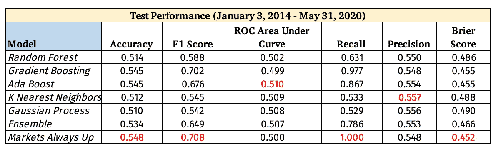

每一栏中的最佳分数以红色突出显示

“市场总是上涨”的购买和持有取向是普遍的赢家。

正如在下面的混淆矩阵中看到的，集合模型在预测未来回报何时为正(右下)方面比预测何时会有负回报(左上)做得更好。

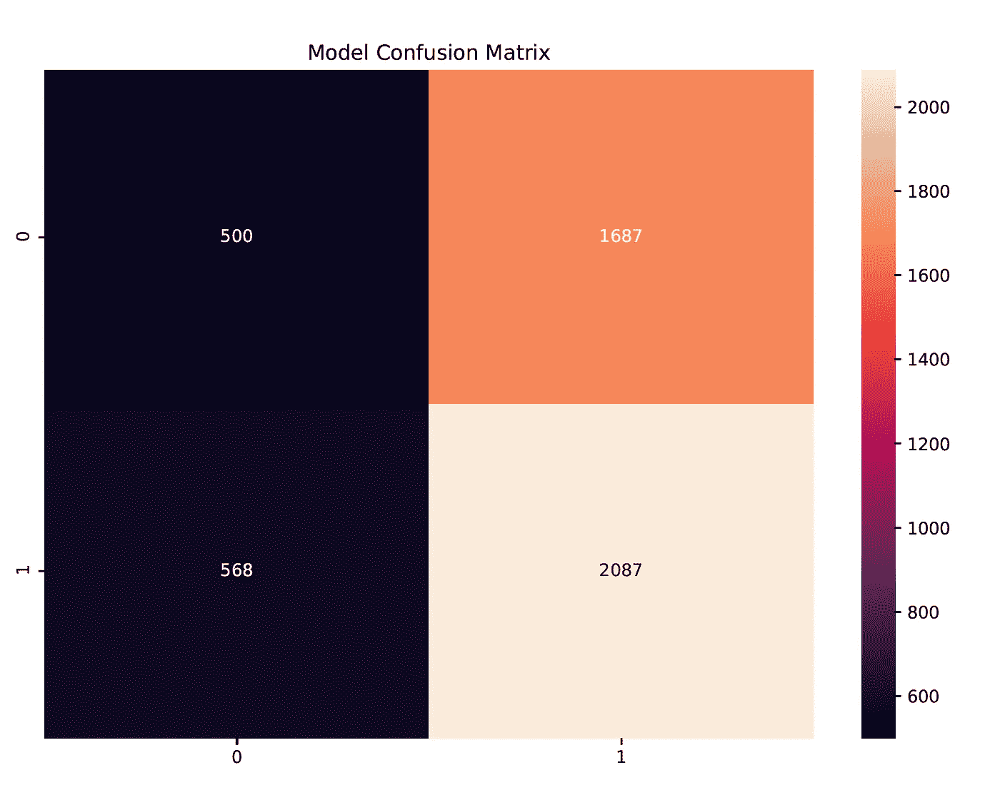

下面是使用测试数据(2014 年 1 月-2020 年 5 月)的策略实际性能图表。

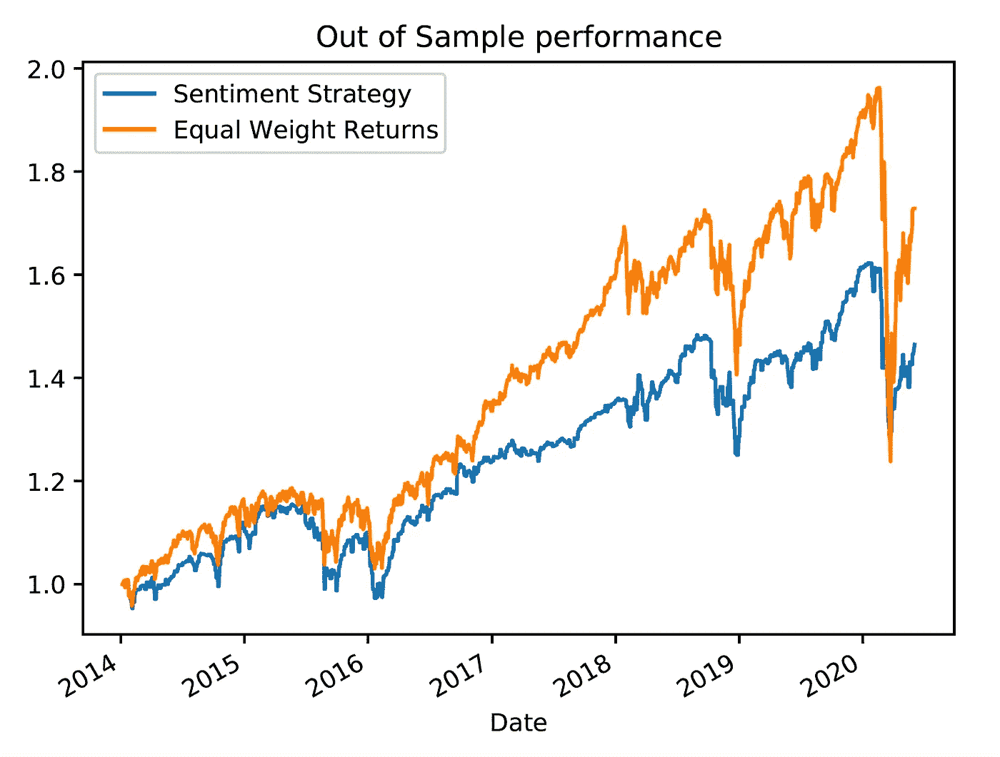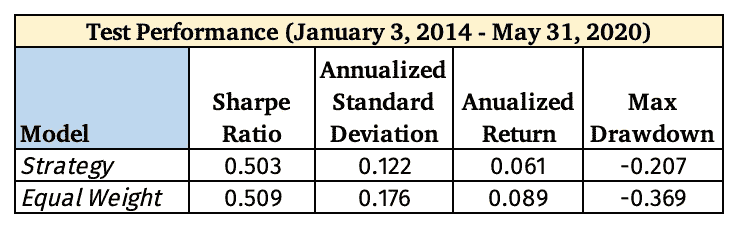

该模型执行了 1074 笔单向交易，假设由于市场影响和滑点，交易佣金为 1 美元，成本为 15 个基点，那么现实世界的成本将从 10，000，000 美元的投资组合的总业绩中减去 17.9 %和 1，074 美元，导致年化回报率为 1.3%，远低于不切实际的 6.1%的年化回报率。

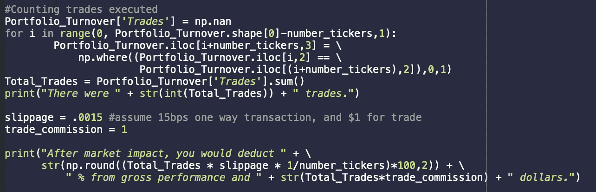

## **吸取的教训**

*   集合模型在预测上涨天数方面做得很好，但在高交易成本之后，它并没有带来任何更好的风险调整表现
*   正如 53.4%的准确性所证明的那样，该模型确实比随机机会做得更好，但市场上涨的时间为 54.8%，因此，如果你有一个简单的命题“市场将上涨”，那么你会有更高的准确性分数。
*   机器学习模型能够从市场内部特征中提取一些信号，如市场成交量，但最终，并没有创造出一个优于天真的“总是被投资”模型的预测模型。
*   基于前面提到的其他相关研究，我希望机器学习模型能够从特定股票的社交媒体分析、小盘股和微盘股中提取出更有意义的信号，并通过深度神经网络提高整体准确性。

***注来自《走向数据科学》的编辑:*** *虽然我们允许独立作者根据我们的* [*规则和指导方针*](/questions-96667b06af5) *发表文章，但我们不认可每个作者的贡献。你不应该在没有寻求专业建议的情况下依赖一个作者的作品。详见我们的* [*读者术语*](/readers-terms-b5d780a700a4) *。*