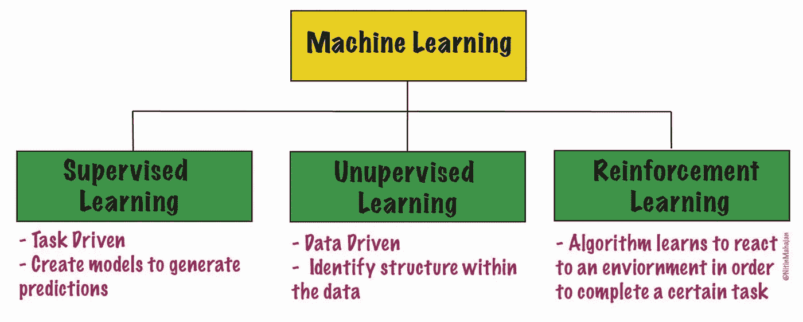
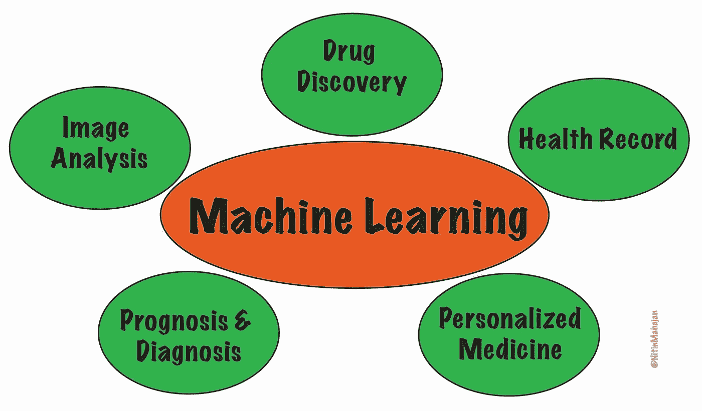

# 机器学习和转化研究

> 原文：<https://towardsdatascience.com/machine-learning-and-translational-research-d0738ac13d6?source=collection_archive---------29----------------------->

## 从电脑到诊所

作者创造的形象

互联网网络服务的扩展和高通量技术的最新进展使得公众，特别是科学界，能够容易地访问重要的生物数据集。因此，处理、分析和推断知识的方式在最近几年发生了巨大的变化，无论是临床数据、测序数据、电子健康记录还是一般医学。正因为如此，像机器学习和人工智能这样的数据科学术语已经以这样或那样的方式成为我们日常使用词汇的一部分。他们已经彻底改变了转化研究的设计和执行方式，为改善人类健康带来了全球性的发现。

> 在这篇文章中，我们将介绍机器学习的基本概念及其在转化研究或医学方面的应用。

# 机器学习

机器学习无疑是当今世界谈论最多的技术之一。简单来说，**机器学习就是把信息变成知识的工具**。在当今世界，我们正在生成大量数据，除非我们分析这些数据并找到其中隐藏的模式，否则这些数据毫无用处。

> 机器学习专注于算法的分析和开发，使计算机能够根据之前观察到的数据做出决策和预测，而不依赖于基于规则的编程

机器学习主要分为三种类型:监督学习、非监督学习和强化学习。

作者创造的形象

# 监督学习

目标是生成一个**模型**或**预测函数**，它可以基于一个或多个输入值预测一个**输出。**

*   模型的输出通常被称为**标签**、**目标值**或**响应变量**。
*   模型的输入通常被称为**特征**或**预测器**。

该算法通过研究由几个**观察值**组成的数据**训练集**来“学习”最佳模型，每个数据都具有其**特征**和其**标签**的值。

进一步，**监督学习**又分为**两类**、**分类** 、 ***回归*** 。在**分类**中，输出变量被分类为“存在”或“不存在”或“疾病”或“无疾病”或分级(1 级、2 级等)。).在 ***回归中，*** 输出变量是一个真实值，如“浓度”或“重量”，例如，你根据标准曲线测量样品中的蛋白质浓度。

这种类型的机器学习可以广泛用于放射学、病理学或任何其他成像领域中的医学成像。这种研究是有用的，必须小心谨慎，因为它们需要大量的数据集才能足够准确，而且数据必须准确标注。

# 无监督学习

在无监督学习中，数据集有**特征**，但**没有标签**。无监督学习的目标是识别数据中我们不容易注意到的结构。因此，所设计的算法必须基于数据集中的相似性来创建其组和类别。与监督学习不同，无监督学习预测未知的结果，并发现隐藏的模式。同样，在无监督学习中，我们一般不会从可能的标签会是什么这个先入为主的概念开始。**聚类**是非监督学习的一个例子。下一代测序等技术帮助科学家建立模型，从一组不同的独立变量中预测结果。无监督学习方法一般称为**降维技术**(如 PCA、tSNE 等。).单细胞测序分析过程中细胞在不同组中的聚类就是其中一个例子。另一个例子是基于基因表达值的组织样本聚类。

# 强化学习

强化学习是指计算机程序从它的错误和成功中学习，并最终根据它的经验建立一个算法。所以，这种学习是基于试错法。强化学习任务的示例包括训练算法(I)下棋或玩视频游戏，(ii)驾驶自动驾驶汽车，(iii) [了解医疗注册数据上的治疗方案，](https://www.ncbi.nlm.nih.gov/pmc/articles/PMC5856473/) (iv) [找到治疗化疗患者的最佳策略](http://proceedings.mlr.press/v85/yauney18a.html)。

在麻省理工学院研究人员发表的[研究中，作者报告了一个作为强化学习问题的临床试验剂量的成功公式，其中算法教会了适当的剂量方案，以减少接受化疗和放疗临床试验的患者的平均肿瘤直径。](http://web.media.mit.edu/~pratiks/mlhc_2018/reinforcement_learning_with_action_derived_rewards_for_chemotherapy_and_clinical_trial_dosing_regimen_selection.pdf)

> 机器学习算法正在帮助揭示数据矿下隐藏的宝石。但有一点应该永远记住，“更复杂的算法不一定会产生最好的结果”。

# 机器学习和转化研究——“友谊”

机器学习的应用包括但不限于简化行政工作、医院记录管理、医疗和传染病等。下面只是几个例子，讨论了在医学研究和医疗保健中具有重大潜力的机器学习任务。

作者创造的形象

**医学成像**(磁共振成像(MRI)、X 射线、计算机断层扫描、乳房 X 线摄影、组织切片等)分析可以通过使用机器学习算法而受益匪浅。例如，目前，病理学家手动检查载玻片并决定患者是否患有转移性癌症。因为人的判断是不一致的，并且诊断可能因人而异，甚至由同一个人每天都不同。在这种情况下，机器学习算法可以自动完成这一过程，并且最好能够提供无偏见的结果。这些算法通过从以前的样本中学习来提高诊断的准确性，因此可以提供治疗选择。有前景的应用包括检测肿瘤、动脉狭窄、[、乳腺癌](https://www.nature.com/articles/s41598-019-48995-4)、[淋巴结](https://jamanetwork.com/journals/jama/article-abstract/2665757)、器官描绘等。

如今,**高通量技术**的出现产生了海量数据，这些数据被收集起来，可供研究界使用。此外，像**癌症基因组图谱研究网络**等社区资源项目提供了对**基因组数据**的访问。每个人都有许多已知或未知的基因变异。即使有先进的测序技术，预测突变的发生及其后果仍然具有挑战性。完整的**基因组序列**的可用性允许更好地观察和理解个体的遗传图谱，这最终与健康直接相关。在**多组学**(基因组、转录组、蛋白质组、表观基因组、代谢组和微生物组)时代，医疗保健的前景看起来很有希望。二十多年来，各种不同的机器学习算法被广泛应用于**疾病的预后和预测。**机器学习有助于预测易感性、复发率和存活率。

**药物发现和开发**过程漫长而艰难，取决于众多因素和学科。[一种新药从实验室走向药店货架平均需要 12 年时间，耗资超过 3 . 5 亿美元。](https://www.drugs.com/fda-approval-process.html)机器学习算法可以通过帮助决策来改进药物发现，因为它可以生成高质量和高维度的数据。它适用于药物发现的所有阶段，无论是**靶标验证、预后生物标志物的识别，还是临床试验。**然而，方法和算法仍处于开发阶段，但有助于加快过程并降低失败率，最终将节省时间和金钱。此外，遗传学数据与药物-蛋白质结合数据库的结合允许针对细胞类型、突变等的每种可能组合来测试不同的化学物质。这种分析使研究人员能够建立模型，从各种独立变量的组合中预测结果。

**个性化医疗**，这是一种根据患者个体特征(临床、分子或行为)而非总体平均水平做出医疗决策的医疗方法。个性化医疗的概念与数据科学，特别是机器学习有着密切的联系。预计到 2023 年，市场规模将达到[870 亿美元，机器学习将成为设计个性化](https://www.alliedmarketresearch.com/precision-medicine-market)[药物](https://ghr.nlm.nih.gov/primer/precisionmedicine/definition)的发电站，这将有助于打破一刀切的方法。

在诊所中使用机器学习有可能改变现有的医疗保健提供模式。然而，人们应该牢记道德和监管问题，以避免不必要的风险和陷阱，阻碍“计算机到诊所”的流动。

# **结论**

为了提高生活质量，需要多学科的努力，包括数据科学家、研究科学家、临床医生、监管事务机构和医疗保险组织。

*感谢阅读😄。*