# 机器学习在岩石物理行业的应用:声波测井综合预测故事

> 原文：<https://towardsdatascience.com/machine-learning-application-in-petrophysics-industry-a-sonic-log-synthesis-prediction-story-cf0ea54ffdad?source=collection_archive---------46----------------------->


扎卡里·西奥多在 [Unsplash](https://unsplash.com?utm_source=medium&utm_medium=referral) 上的照片

# 岩石物理学是什么意思？

岩石物理学是对岩石性质的研究，也是对液体相互作用的简要描述。它主要用于石油和天然气行业，以研究不同类型的油藏的动态。它还解释了地下孔隙的化学性质以及它们之间的联系。它有助于控制油气的运移和聚集，同时解释化学和物理性质，岩石物理学还解释许多其他相关术语，如岩性、含水饱和度、密度、渗透率和孔隙度。

# 岩石物理学家的职责是什么？


由[上](https://unsplash.com?utm_source=medium&utm_medium=referral)的[间隔](https://unsplash.com/@headwayio?utm_source=medium&utm_medium=referral)拍摄

岩石物理学强调与孔隙系统及其流体分布和流动特征相关的性质。这些属性及其关系用于识别和评估:

*   油气藏
*   碳氢化合物来源
*   密封
*   含水层

岩石物理学家或岩石物理工程师作为油藏管理团队的一员实践岩石物理学。这位岩石物理学家提供了团队成员需要和使用的产品的答案，以及其他队友需要的物理和化学见解。要确定的储层和流体特性有:

*   厚度(地层边界)
*   岩性(岩石类型)
*   多孔性
*   流体饱和度和压力
*   流体识别和表征
*   渗透率(绝对)
*   分流(油、气、水)

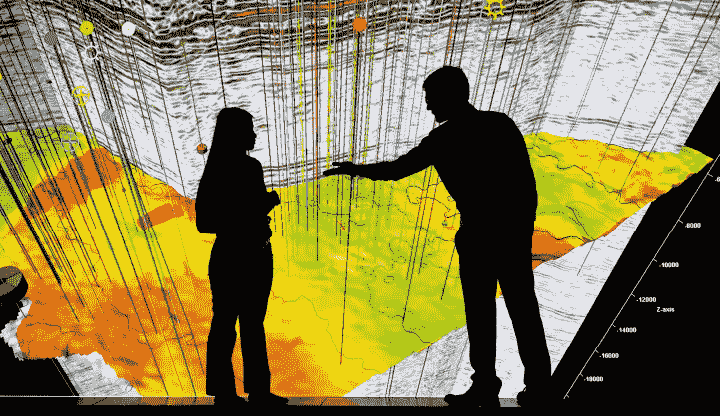

来自 [***斯伦贝谢*** 媒体公司](https://media.corporate-ir.net/media_files/IROL/97/97513/2016AR/interactive/pore-to-pipeline.html)

很容易定义这些特征并理解它们在储量评估中的作用。困难的部分在于确定它们的实际价值，这种确定性是作出导致开发和生产的经济决策所必需的。列出的七个特征是相互依赖的(即，为了正确确定电缆测井的孔隙度，必须知道岩性、流体饱和度和流体类型)。然后，岩石物理学被用来解读从地表以下到超过四英里深的储层中岩石和流体性质的隐藏世界。然后，这位岩石物理学家利用虚构侦探夏洛克·福尔摩斯的许多特征，从最贫乏的线索中推断出地下储油层的真实情况，用顽强的决心从现有数据中获取所有可能的信息，同时享受狩猎的刺激。

# 岩石物理学家是如何解决这个难题的？

阿奇的一般方法是将问题细分成更小的片段，使用所有数据迭代，直到所有数据一致。一个起点是确定岩石类型(岩相),其中我们确定:

*   孔隙类型
*   气孔分布
*   孔喉型
*   孔喉分布

当与流体类型相结合时，可以建立一个毛细管压力模型，这将导致对原位流体饱和度和流体流动的理解。然而，可供岩石物理学家使用的工具有:

*   [泥浆录井](https://petrowiki.org/Mud_logging)(固体、液体、气体、体积、速率、浓度和温度)
*   [随钻测量(MWD)](https://petrowiki.org/Measurement_while_drilling_(MWD)) 和[随钻测井(LWD)](https://petrowiki.org/Logging_while_drilling_(LWD))
*   [电缆测井](https://www.glossary.oilfield.slb.com/en/Terms/w/wireline_log.aspx)(裸眼井和套管井)
*   [岩心取样](https://en.wikipedia.org/wiki/Core_sample)和[岩心分析](https://wiki.aapg.org/Overview_of_routine_core_analysis)
*   [流体取样](https://petrowiki.org/Fluid_sampling)(电缆和/或钻杆测试)

# 案例研究:声波测井综合预测


照片由[本工程](https://unsplash.com/@thisisengineering?utm_source=medium&utm_medium=referral)在 [Unsplash](https://unsplash.com?utm_source=medium&utm_medium=referral) 上拍摄

由于财政或操作的限制，并不是在一个油田中钻探的所有井都获得压缩旅行时(DTC)和剪切旅行时(DTS)测井。在这种情况下，可以使用机器学习技术来预测 DTC 和 DTS 测井，以改善地下表征。本岩石物理数据驱动分析项目的目标是通过处理 casr 研究“1 井”中“易于获取”的常规测井数据开发数据驱动模型，并使用数据驱动模型生成案例研究“2 井”中的合成 DTC 和 DTS 测井数据。用于期望的声波测井合成的稳健的数据驱动模型将导致低的预测误差，这可以通过比较合成的和原始的 DTC 和 DTS 测井，以均方根误差(RME)来量化。

提供了井数据集(由井 1 和井 2 组成),目标是使用井 1 数据集建立可概括的数据驱动模型。接下来，您将在 Well 2 数据集上部署新开发的数据驱动模型，以合成 DTS 和 DTC 日志。数据驱动模型使用从以下七种测井中导出的特征集:井径、中子、伽马射线、深层电阻率、介质电阻率、光电系数和密度。数据驱动模型应该合成两个目标日志:DTC 和 DTS 日志。

## 数据源

数据的位置是一个 Github 存储库，该存储库来源于由位于 [Petrophysical 数据驱动分析](https://www.spwla.org/SPWLA/Chapters_SIGs/SIGs/PDDA/PDDA.aspx)的 amazing 团队维护的 GitHub 存储库

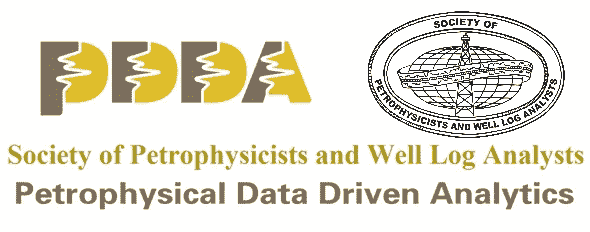

来自 [SPWLA](https://www.spwla.org/SPWLA/Chapters_SIGs/SIGs/PDDA/PDDA.aspx)

# 用哪种机器学习算法？


照片由 [Charles Deluvio](https://unsplash.com/@charlesdeluvio?utm_source=medium&utm_medium=referral) 在 [Unsplash](https://unsplash.com?utm_source=medium&utm_medium=referral) 上拍摄

> 对于给定的问题，找到最佳算法的唯一方法是尝试和测试所有算法

为这个项目尝试所有可能的机器学习算法非常耗时，因此在本文的上下文中，我们将使用 e**X**treme**G**radient**B**oosting(XGBoost)算法。从问题陈述中，我们预测两个特征，使其成为一个多目标回归问题。将应用 XGBoost 回归器和 SKlearn 的 [MultiOutputRegressor](https://scikit-learn.org/stable/modules/generated/sklearn.multioutput.MultiOutputRegressor.html) 。

## XGBoost 是什么？


来自 [Github 库](https://github.com/dmlc/xgboost)的 XGBoost 徽标

> 名称 [XGBoost](https://github.com/dmlc/xgboost) 实际上指的是提升树算法的计算资源极限的工程目标。这也是很多人用 [XGBoost](https://github.com/dmlc/xgboost) 的原因。

这是一个由陈天琦创建的梯度推进机器的实现，现在有许多开发者参与其中。它属于分布式机器学习社区或 [DMLC](http://dmlc.ml/) 旗下更广泛的工具集合，他们也是流行的 [mxnet 深度学习库](https://github.com/dmlc/mxnet)的创造者。这是一个免费的开源软件，可以在 Apache-2 许可下使用，它支持以下主要接口:

*   命令行界面(CLI)。
*   Python 接口以及 scikit-learn 中的一个模型。
*   C++(编写库的语言)。
*   r 接口以及 caret 包中的一个模型。
*   朱莉娅。
*   像 Scala 这样的 Java 和 JVM 语言以及 Hadoop 这样的平台。

## 为什么选择 XGBoost？

图书馆被激光聚焦

1.  **计算速度:**一般情况下， [XGBoost](https://github.com/dmlc/xgboost) 快。与梯度增强的其他实现相比，速度非常快。
2.  **模型性能:** [XGBoost](https://github.com/dmlc/xgboost) 在分类和回归预测建模问题上主导结构化或表格化数据集。证据是，它是竞争数据科学平台 [Kaggle](https://www.kaggle.com/) 上竞争获胜者的首选算法。

## XGBoost 安装

对于稳定版本，可以使用 python 包索引(PyPI)将 XGBoost 包安装到 Python 环境中。

```
pip install xgboost
```

## 导入包

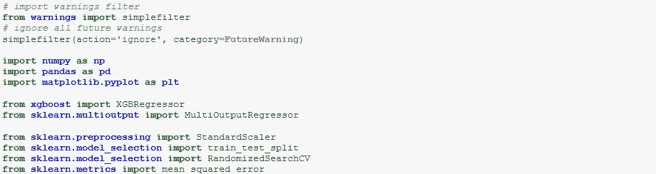

这里，我们从导入这个项目需要的所有 python 库开始。

*   `warning`:用于抑制 python 包中不推荐使用的函数的警告控件。
*   `numpy`:用于科学计算。
*   `pandas`:为了数据争论和分析
*   `matplotlib`:用于图形和图表的可视化。
*   `xgboost`:用于预测的机器学习算法。
*   `MultiOutputRegressor`:提供多目标回归环境。
*   `StandardScaler`:缩放数据
*   `train_test_split`:拆分数据
*   `RandomizedSearchCV`:随机参数调谐
*   `mean_square_error`:用于评估预测的性能指标。

## 读取数据

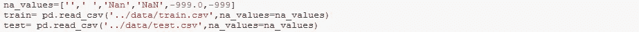

首先，在数据输入过程中，大多数情况下缺失值被替换为`-999`，因此将其识别为系统的缺失值指示器是理想的。这里，空白以及`Nan`和`NaN`也被识别为数据集中的缺失值指示符。

## 获取数据概览

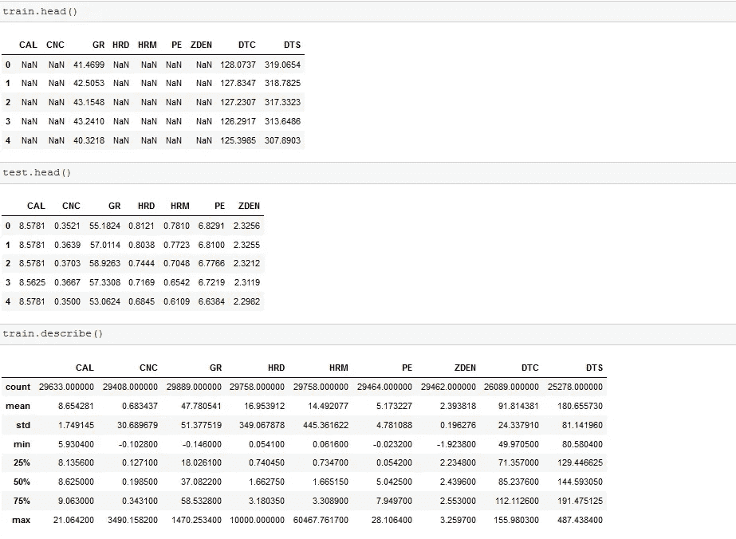

各个特征的数据描述如下:

*   CAL:井径测井(单位为英寸)
*   CNC:神经元日志(单位为十二月)
*   GR:伽马射线测井(单位为 API)
*   HRD:深电阻率测井(单位为欧姆每米)
*   HRM:中电阻率测井(单位为欧姆每米)
*   PE:光电系数(单位为谷仓)
*   ZDEN:密度测井(单位为克每立方公尺)
*   DTC:压缩传播时间 lo(单位为纳秒每英尺)
*   DTS:剪切传播时间测井(单位为纳秒每英尺)

DTC 和 DTS 称为**声波测井，**可以从接收器记录的波形中计算出来。还计算了描述性统计。

**检查缺失值**

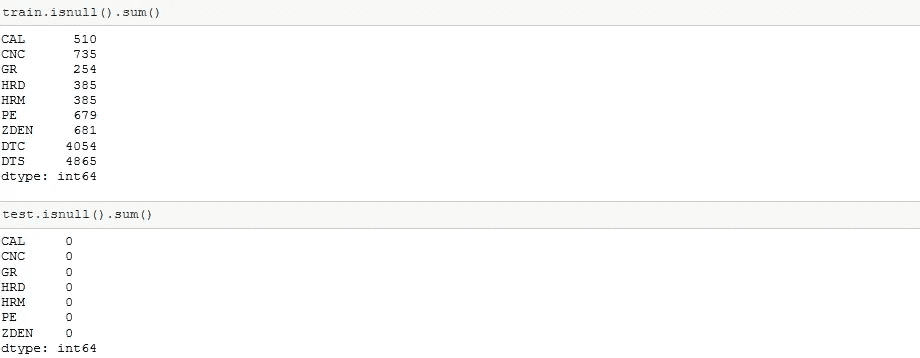

可以观察到，在训练数据中存在大量的缺失值。让我们来看看数据的分布情况。

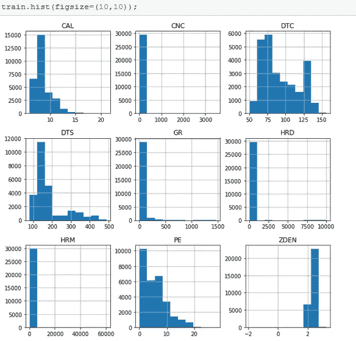

## 填充缺失的值

大多数要素的直方图是单摩尔直方图，而其他直方图是倾斜的，用数据框中的前一个值填充前者，用中值填充后者将非常合理。pandas fillna `backfill`方法和 median`median.()`方法将支持使用先前值方法进行填充。

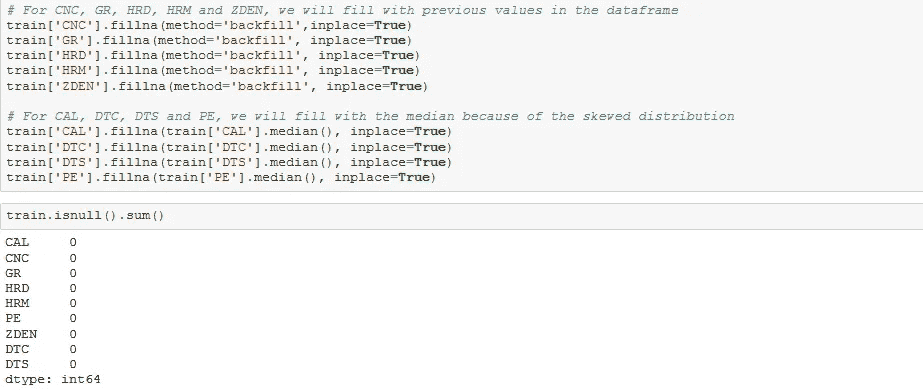

## 特征工程

本出版物中的特征工程主要关注伽马射线测井(GR)特征。从直方图中可以观察到异常值，因为 GR 值通常在 0-200 之间。我们将从 GR 中创建两个新特性，同时将其限制在上限和下限。要创建的两个新功能是:

1.  伽马射线指数(IGR)
2.  自然伽马辐射(NGR)

在使用伽马射线测井(GR)功能创建其他功能以减少数据冗余后，应将其删除。

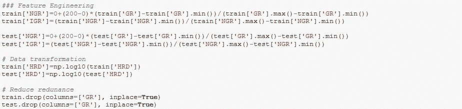

## 拆分数据

训练数据以 70:30 的比例分割

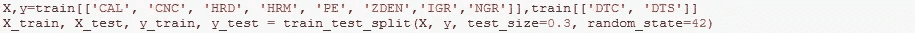

## 数据的标准化

当各种**变量**放在相同的刻度上时，大多数机器模型工作得最好。

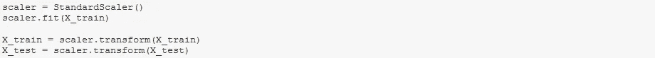

## 模型建立和拟合

XGBoost 回归是用已经调优的超参数实例化的。超参数调整是一个非常耗时的过程，本文中跳过了这一步，但是可以在 github 上的[笔记本](https://github.com/codebrain001/PDDA-Sonic-Log-Prediction/blob/master/notebook/Article.ipynb)中查阅。该模型适合于训练数据，以帮助学习过程。

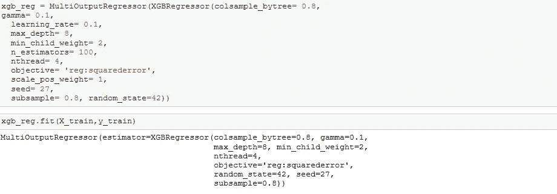

## 模型预测和评估

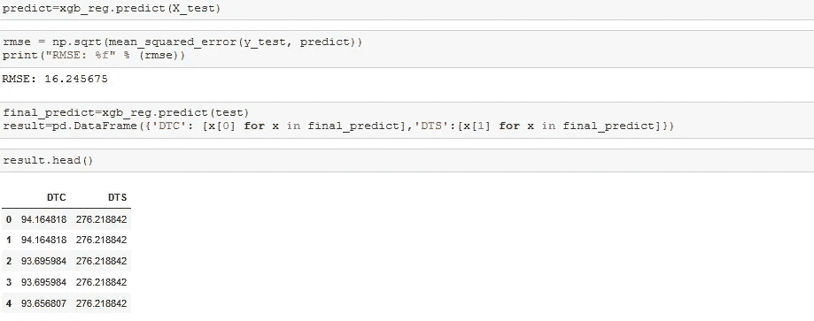

模型的最终输出—预测。****的**值越低，表明拟合度越好，模型看起来越好！最后，模型被应用于它没有见过的数据——“测试”数据。**

**我希望本文能拓宽机器学习在岩石物理行业的应用领域。感谢阅读和保持安全。**