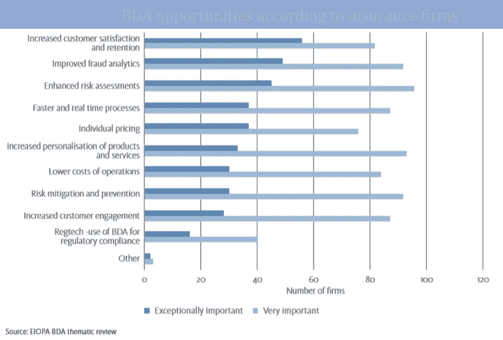
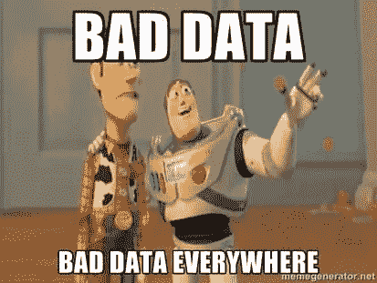

# 保险公司的机器学习

> 原文：<https://towardsdatascience.com/machine-learning-at-insurance-companies-2ac7ad109c65?source=collection_archive---------58----------------------->

## 洞察保险公司对先进模型的缓慢采用

谁是德尼罗？ on [Unsplash](https://unsplash.com?utm_source=medium&utm_medium=referral)

这些年来，我阅读了很多关于保险公司以及由商业和技术创新驱动的即将到来的变革的论文，通常被称为*保险技术*。与传统的保险业务模式相比，这些保险技术公司利用技术开发基于分析的方法来改进现有流程，从而获得竞争优势。保险公司被警告要么跟上，要么灭亡…

鉴于竞争格局和不断蒸发的利润率，传统保险公司被建议发展成为由机器学习(ML)和人工智能(AI)驱动的数据驱动型企业。保险公司的这些高级模型有几个[用例](https://i2.wp.com/insuranceblog.accenture.com/wp-content/uploads/2018/07/AI-Value-Chain-July-2.jpg?ssl=1)。大数据分析(BDA)为保险公司带来的优势如下:

资料来源:ei opa——欧洲保险和职业养老金管理局，[https://www.eiopa.europa.eu/](https://www.eiopa.europa.eu/)，[专题评论](https://www.eiopa.europa.eu/sites/default/files/publications/eiopa_bigdataanalytics_thematicreview_april2019.pdf)

保险公司在采用 ML 和 AI 方面取得了一些进展。一些公司已经建立了数据科学卓越中心来定义和实现他们业务中的用例。此外，一些保险公司正在投资，通过向员工提供数据科学和大数据课程，有机地构建他们的内部知识。

为了进一步加速数字创新，一些保险公司正在通过内部孵化器、加速器和创新实验室与初创公司合作。这对双方都有利，因为初创公司受益于成熟的技术支持、指导和与行业专家的联系，而保险公司则获得了新技术。

另一方面，一些保险公司通过组建企业风险投资公司来投资 T2 的保险技术公司。向多家初创公司投入相对较少的资金，可以让保险公司在他们感兴趣的众多领域获得潜在突破。

尽管围绕高级模型的嗡嗡声令人麻木，这些创新的解决方案还没有**获得显著的牵引力**。保险公司没有像预期的那样迅速瓦解，而是慢慢适应了这些变化。因此，我想解释一下保险公司采用先进模型的缓慢过程。

下图总结了保险公司面临的大数据分析(BDA)挑战。

资料来源:ei opa——欧洲保险和职业养老金管理局，[https://www.eiopa.europa.eu/](https://www.eiopa.europa.eu/)，[专题评论](https://www.eiopa.europa.eu/sites/default/files/publications/eiopa_bigdataanalytics_thematicreview_april2019.pdf)

保险公司在负责任地实施 ML 和 AI 方面面临着相当多的挑战。我想考虑其中的一些挑战，并提供额外的背景。首先，保险公司认为主要风险在于与消费者打交道，这需要保持消费者的信任，合乎道德地使用人工智能，并识别危及保险公司和保险行业声誉的潜在风险。

创新是保险公司的一个议程项目，然而，预测机器学习项目的投资回报几乎是不可能的。规划或预算这样的项目并不容易，因为根据调查结果，项目期间的资金可能会有所不同。因此，这一项被忽视了，尤其是与更紧迫的项目相比，如符合新的和即将出台的(监管)标准或保险公司的盈利能力考虑到当前的低利率环境。

每个数据科学家都知道 GIGO " *垃圾输入，垃圾输出*"。这是 ML 在保险公司中没有获得牵引力的另一个原因，即数据质量。高质量和各种输入数据的可用性是应用高级模型的先决条件。目前，保险公司的数据质量很差，因此最大限度地降低了 ML 和 AI 的附加值。

保险公司 AI 和 ML 的一个有利发展是新法规和即将出台的法规对数据的要求增加。具体来说，新的报告标准(IFRS 17)要求更多的[数据粒度](https://www2.deloitte.com/content/dam/Deloitte/ie/Documents/FinancialServices/ie_2018_data_system_requirements_IFRS17_Insurance_Contracts_Deloitte_Ireland.pdf)，因为保险公司正在彻底检查其 IT 系统和架构，以应对数据量和质量的增加。

最后，保险公司也意识到他们需要“保持控制”，尤其是在定价和保留领域。ML 和 AI 模型通常与术语[黑盒模型](https://www.investopedia.com/terms/b/blackbox.asp)联系在一起。因此，保险公司不清楚如何在不超出法律和监管要求的情况下使用人工智能。因此，保险公司面临的挑战是在监管空间内构建一个合规且可解释的垫款模型框架。

# 结论

颠覆通常与创新发展结合使用。然而，要真正颠覆一个行业，仅仅创新是不够的。颠覆需要大规模采用。

保险业已经注意到了这些技术的发展，保险公司也相应地动员了他们的努力和资金。考虑到保险公司在 ML 和 AI 方面面临的一系列挑战，他们正在慢慢适应不断变化的环境。因此，它们越来越受数据和技术的驱动。