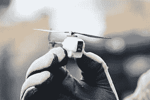
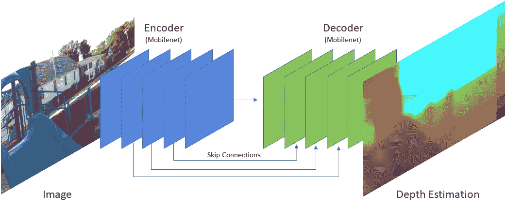
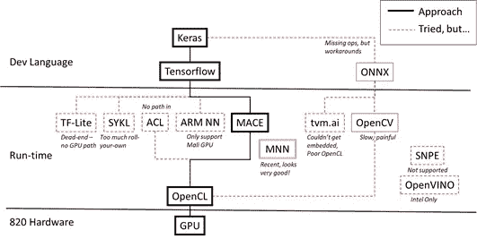

# 边缘的机器学习！

> 原文：<https://towardsdatascience.com/machine-learning-at-the-edge-a751397e5a06?source=collection_archive---------44----------------------->

## 使用 OpenCL 在运行嵌入式 Linux 的小型处理器的 GPU 上实现机器学习/图像处理，以获得实时性能



(图片由维基百科提供)

**内容:**

*   概观
*   旅行寻找可行的解决方案
*   构建您自己的工作解决方案
*   吸取的教训。

**概述**

所以，我有一个工作机器学习(ML)模型，我想把它移到边缘。

顺便说一下，我的 ML 模型处理图像以进行深度估计，从而为自主机器人提供感知能力。使用的机器学习模型是基于麻省理工学院的[快速深度。这是一个专注于速度的 U-Net 架构。它使用一个 MobileNet 编码器和一个匹配的带跳跃连接的解码器。](http://fastdepth.mit.edu/)



(图片由作者提供)

它是在 Python 上使用 Keras(起初是 PyTorch)开发的，带有 CUDA 后端。

通过移动到边缘，我的意思是我需要在运行嵌入式 Linux 的小型 CPU/GPU(高通 820)上运行，其中 GPU (Adreno 530)只能通过 OpenCL(即，不是 CUDA)访问。)

警告——如果你在 iOS 或 Android 上，你已经相对自由了。这篇文章是为了在嵌入式 Linux 的 GPU 上使用 OpenCL 进行机器学习。

**四处寻找可行的解决方案**

这很容易。哈！原来一旦你离开 CUDA，你就在荒野中…

实际上，有两种广泛的方法可以在边缘部署模型。

1.  尝试在边缘复制您的开发环境，并让它在那里运行。如果这是可能的，这总是一个好的第一步，如果只是为了说服自己它的表现有多慢。我尽可能地探索了这个世界，尽管在我的设备上甚至没有完整的 Linux，所以我甚至不能支持 Python。
2.  找到一个推理框架，它可以在一个更高性能、更少资源的环境中运行你的代码。这需要你做更多的工作，特别是当你要把你的 C++编码技能拿出来的时候。这就是我们要探索的地方。

通过谷歌搜索和参考资料，我发现了一系列可能的方法。

同样，我有一个 Keras 模型，我想在嵌入式 Linux 上的高通 820 GPU(实际上 Adreno 530 是 GPU)上尽可能快地运行。没有量化的方法进行评估。

这是我探索的世界:(即，很多很多的“死胡同”)



GPU“边界”的地图

解释:

*   Keras —该模型是在 Keras 开发的。
*   ONNX —一些选项提供了 ONNX 导入，例如 OpenCV。原来 ONNX，至少在那个时候——2019 并不支持我在用的所有 Keras 算子。
*   Tensorflow-这是一个重要的层，因为大多数(如果不是全部)引擎都是从 tensor flow 导入/转换的，而不是从 Keras 导入/转换的。最终的解决方案——MACE 需要相对较旧版本的 tensor flow——他们要求 1.08 版——尽管 1.14 版也能工作……请参见下面的 SYKL 了解如何使用 Tensorflow runtime。
*   Tensorflow Lite/TF-Lite。然而，为这种情况设计的，没有办法(我能找到)通过 OpenCL 把它连接到 GPU。
*   SYKL——据说是一种将 Tensorflow 连接到 OpenCL 的方法。没什么进展就只好放弃了。
*   Arm 计算机库。这是可行的，但是缺点是(我无法找到)导入模型。使用这些或用他们的语言编码。
*   ARM 神经网络。来自制造商的一种“官方”方式——ARM。应该很容易。见鬼，我被卡在巨大的安装区域的某个地方，永远也不能让它工作。这是一个可以从提供 Docker 环境中真正受益的群体。
*   **移动 AI 计算引擎——MACE**。至少部分是为这个用例设计的！来自小米。这个居然管用！而且效率很高！他们的支持很好——这些人很棒！更多见下文。
*   移动神经网络-MNN。只是玩玩这个，因为我最近刚刚“发现”这个，但这个看起来很棒，可能会更容易从 Keras 过渡到平台，也可能会进行更多的优化。来自阿里巴巴。
*   tvm.ai .专为在 GPU 上执行而设计，尤其是为了效率。然而，它需要的比我的迷你 Linux 所能提供的更多，而且他们并不真正喜欢 OpenCL。我想让这个工作，特别是发挥了 MNN 的效率。
*   OpenCV。DNN 软件包是为运行 ONNX 模型而设计的，事实也的确如此。如果 verrryyyy 慢。非常失望。此外，结果是我不能在我的运行时使用 OpenCV，所以这是一个不成功的例子。
*   骁龙神经处理引擎。从高通，见鬼，这应该很容易。首先，来自高通的支持让康卡斯特看起来像明星。见鬼，就此打住——这个工具在我的环境中是行不通的。
*   open vino——看起来很有前景，但似乎只面向英特尔。

**在 MACE 上构建自己的工作解决方案**

下面是让你的模型在 GPU 上运行的大致步骤(在使用 OpenCL 的嵌入式 Linux 系统上！)这很像是他们文档的画外音，其中有一些关键的提示。

1.  克隆权杖。【https://github.com/XiaoMi/mace 
2.  让 Docker 环境工作起来。我用的是全环境。
3.  为您的目标配置。有多种架构选项以及 Linux/Android 选择。在我的例子中，我的架构选择是 armeabi-v7a。(这是一个更长的故事，为什么不是 64 位架构。)不幸的是，为该架构配置的操作系统是 Android。所以我不得不稍微混合搭配一下来得到 Linux。
4.  为目标制造狼牙棒。

所有这些都是一次性的启动事件(一旦成功)。

现在，要获得你的 Keras 模型的梅斯转换…

**输入张量流**

哦，等等。原来 MACE 只支持 Tensorflow 到大约 1.14 版，根本不支持 Keras。因此，我必须将我的 Keras 模型转换为正确年份的 Tensorflow。这是一些工作，基本上是在 Tensorflow 中制作完全相同的模型，然后复制权重。和迭代，因为没有什么是那么容易的。Netron 是一个很好的工具，可以深入了解和比较你的模型的本质。

一个优化是，您还可以轻松地添加图像预处理以提高性能。例如，这些线不在 Keras 模型中，只在 Tensorflow 模型的前面。这允许我们将预处理从 CPU 转移到 GPU 上，特别是图像大小调整和数据规范化。

```
Rs224 = tf.image.resize_bilinear(input,(224,224), name='resize224')
# normalize data, identical to how we trained
Norm224 = tf.scalar_mul(1./255., Rs224)
Norm224 = tf.scalar_mul(2., Norm224)
Norm224 = tf.math.add(-1., Norm224)
```

**继续转化为狼牙棒**

回到转换:

1.  创建您的 YAML 文件。请注意，您需要为模型的每个新版本创建一个 sha256sum 代码。
2.  做你的转换。

```
python tools/python/convert.py — config ../mace-models/yourmodel.yml
```

3.测试你的转换。好吧，梅斯倒在这里。事实证明，如果不加入一些东西来移动，Linux 版本并不能真正工作。应该起作用的是…

```
python tools/python/run_model.py  \
    --config ../../mace-models/yourmodel/yourmodel.yml \
    --validate \
    --target_abi arm-linux-gnueabihf \
    --target_socs root@192.168.8.1 \
    --device_conf ../../mace-models/820.yml
```

*但事实并非如此。结果他们的剧本失败了。(修复—您需要手动将“/tmp/mace _ run/your model/validate _ in/XXX”上移一级，然后执行。他们脚本中的/mace_run 命令。)*

**运行时的 c++**

最后，编写在目标环境中运行的 C++代码。我在一个 ROS 节点内运行，该节点监听新的摄像机图像事件。这个节点将处理它们，并创建深度云输出，以供下游处理，比如说八分图。

调用 MACE 推理引擎的关键部分包括:

```
**// define input node (output nodes not shown)**
const std::vector<std::string> mace_input_nodes{"input"};
const std::vector<int64_t> mace_input_shape{{1, 480, 640, 3},};
...
**// initialize the 'engine' (though of course more surrounds this)**
create_engine_status = CreateMaceEngineFromProto(reinterpret_cast<const unsigned char *>(
                              model_graph_data->data()),
                              model_graph_data->length(),
                              reinterpret_cast<const unsigned char *>(
                              model_weights_data->data()),
                              model_weights_data->length(),
                              mace_input_nodes,
                              mace_output_nodes,
                              config,
                              &engine);
...
**// execute model**
run_status = engine->Run(inputs, &outputs, nullptr);
```

**真正的好消息**。我希望每秒 10 帧。即使在添加了之前显示的图像预处理(通常在 C++代码中)后，我最终达到了 25 fps。太棒了。以至于整个系统的其他部分成了门控因素。实际上，我必须降低 ML 推理的执行速度，以免系统的其他部分过载！

**吸取的经验教训**

*   对于所有这些推理方法，请确保您的操作受到支持。例如，OpenCV 不支持上采样。
*   你必须尝试一下，看看是否行得通。
*   如果工具供应商提供了一个 Docker 环境，那么它工作的可能性会大得多。
*   如果他们对论坛上的问题做出回应，这是一个好迹象。如果没有，那就跑吧，不要走开。
*   尝试多种方法，因为许多方法都会以某种方式失败，通常是你不怀疑的方法。

祝你好运！