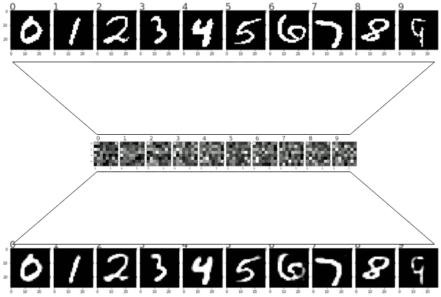
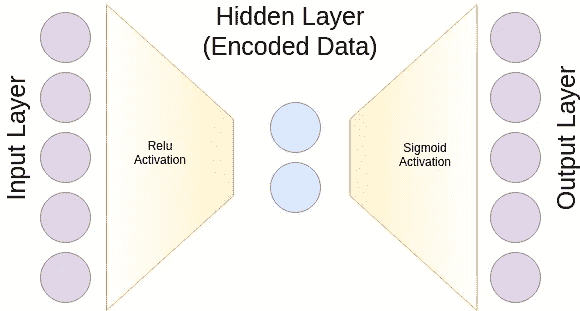
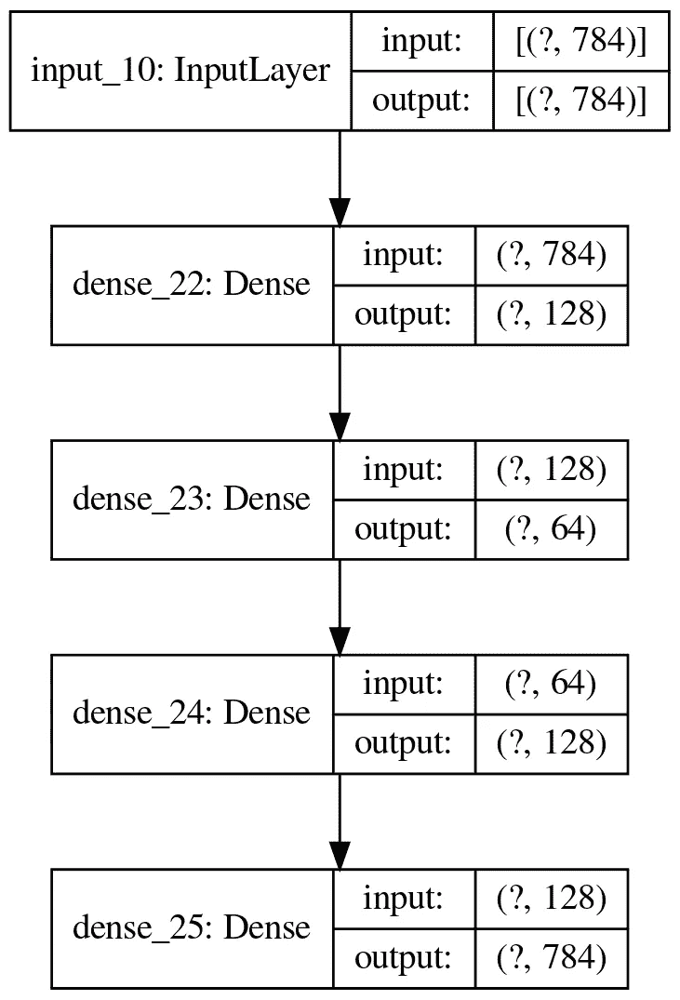
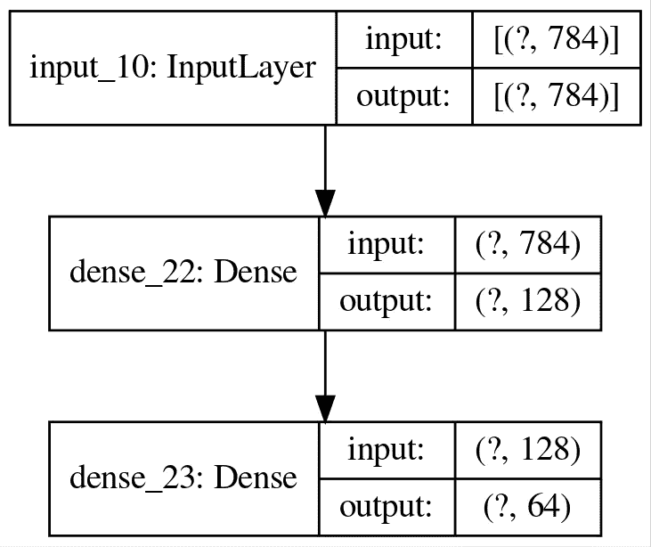
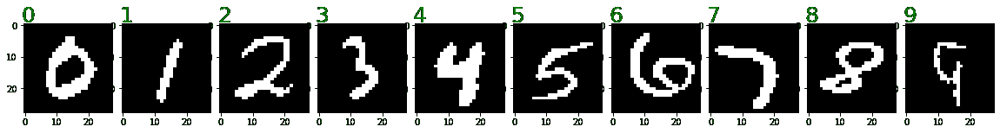
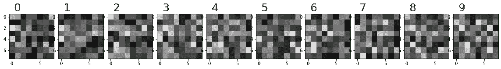
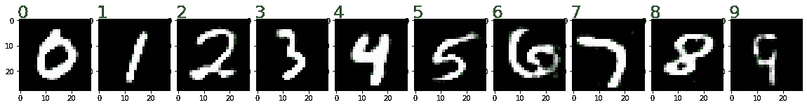
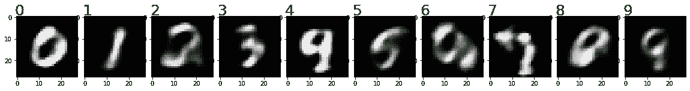

# 机器学习:自动编码器

> 原文：<https://towardsdatascience.com/machine-learning-autoencoders-712337a07c71?source=collection_archive---------14----------------------->

## 使用自动编码器将高维数据拟合到更密集的表示中

我通过维基百科找到了自动编码器最简单的定义，它将自己翻译为“一种学习数据低维编码的机器学习模型”。这是减少数据集维数的最聪明的方法之一，只需使用微分终止(Tensorflow，PyTorch 等)的功能。事实上，我们应该有一个特定的神经网络架构，以实现这一点。不过，在开始之前，我们先简单概述一下降维。



# PCA 与自动编码器

PCA 和自动编码器都打算学习低维表示，从而通过低维表示减少原始维度的重构误差。但是，正如您可能知道的，PCA 将原始数据转换为一组较低的相互正交的维度。我们称之为到另一个空间的线性转换。问题来自于线性部分。信息损失可能会更高。与自动编码器相比，神经网络使用梯度下降来估计较低维度的隐藏层的最佳可能参数。

# 设计自动编码器

自动编码器采用数据流通过瓶颈的架构。这个瓶颈代表了较低的维度。自动编码器被期望学习这个较低的维度，从而最小化在输入和输出之间定义的误差分数。

让我们来看看一个简单的自动编码器(来自维基百科)。



自动编码器示意图

如你所见，我们有一个中间元素，它是一个狭窄的通道。训练的输入和输出通常是相同的，因为我们打算学习低维表示。

# 使用 Keras 构建自动编码器

我们通常的进口商品是:

```
import tensorflow as tf
import numpy as np
import matplotlib.pyplot as plt # for plots
```

处理数据；以 MNIST 手写数据集为例。

```
(x_train, y_train), (x_test, y_test) = tf.keras.datasets.mnist.load_data()x_train = x_train.astype('float32') / 255
x_test = x_test.astype('float32') / 255x_train = np.round(x_train, 0)
x_test = np.round(x_test, 0)x_train = x_train.reshape((len(x_train), np.prod(x_train.shape[1:])))
x_test = x_test.reshape((len(x_test), np.prod(x_test.shape[1:])))print(x_train.shape)
```

请注意，我们对数据进行了四舍五入。这是因为这个数据集是灰度的，我们只考虑严格的黑色像素和严格的白色像素。这有助于我们形成一个 ***二元交叉熵*** 作为损失函数。

让我们使用 Keras functional API 创建网络。

```
inputs = tf.keras.layers.Input(784)
encoded_1 = tf.keras.layers.Dense(128)(inputs)
encoded = tf.keras.layers.Dense(64, activation='relu')(encoded_1)
decoded_1 = tf.keras.layers.Dense(128)(encoded)
decoded = tf.keras.layers.Dense(784, activation='sigmoid')(decoded_1)auto_encoder = tf.keras.Model(inputs, decoded)
auto_encoder.compile(loss='binary_crossentropy', 
                     optimizer='adam', 
                     metrics=['accuracy'])auto_encoder.summary()
tf.keras.utils.plot_model(auto_encoder, show_shapes=True, to_file='autoenc.png', dpi=200)
```

注意，我使用了***binary _ cross entropy***，因为我们的数据是二进制格式(0 或 1)。完整的层集是自动编码器(编码和解码以给出相同的输出)。让我们看看我们的编码器。我们可以使用从 ***输入*** 到 ***编码*** 的层来构建它，如下所示。



自动编码器的可视化

```
encoder = tf.keras.Model(inputs, encoded)encoder.summary()
tf.keras.utils.plot_model(encoder, show_shapes=True, to_file='enc.png', dpi=200)
```



编码器的可视化

虽然您可以使用顺序 Keras API 来实现这一点，但我发现函数式 API 更优雅(只是个人意见，您可能会在以后的文章中看到原因)。

# 使用自动编码器

既然我们已经构建了我们的自动编码器，我们可以拟合我们的训练数据。

```
auto_encoder.fit(x_train, x_train, 
                 epochs=10,
                 batch_size=256,
                 shuffle=True)
```

经过训练，我获得了 0.98510.9851 的准确度，这个准确度还不错！。因此，我们可以期待降维方面的良好表现。

让我们看看 MNIST 测试数据集的估计低维和重建图像。

```
predicted_2dim = encoder.predict(x_test)
predicted_original = auto_encoder.predict(x_test)
```

注意，对于解码后的值，我直接将原始数据提供给完整的自动编码器，后者在编码后直接进行重构。对于编码，我使用编码器组件。

# 看起来怎么样？

未经调整的输入数据如下所示:



原始字符

编码图像看起来像这样:



编码字符

重建看起来是这样的；



重构字符

# 注意事项

*   请注意，重建的图像看起来很模糊。这是因为我们的最后一层是由***s 形*** 函数激活的。该函数返回范围 ***0*** 和 ***1*** 内的值。
*   我们使用 ***relu*** 激活函数，因为在中间层，当我们使用 ***sigmoid*** 函数时，值变小的几率更高。
*   当我们减小隐藏维数时，重建的精度降低。重建看起来像这样。它只有人物的可辨别的特征，而不是确切的人物。



使用二维重建

*   我们可以看到，在上面的图像 9 和 4 几乎是相似的。更多的信息丢失了。
*   我的字符绘图功能(可能会有用)

```
shown = {}
fig = plt.figure(figsize=(20, 10))
fig.subplots_adjust(hspace=1, wspace=0.1)
i = 0for data, y in zip(predicted_original, y_test):
    if y not in shown and y==len(shown):
        i += 1
        ax = fig.add_subplot(1, 10, i)
        ax.text(1, -1, str(y), fontsize=25, ha='center', c='g')
        ax.imshow(np.array(data).reshape(28, 28), cmap='gray')shown[y] = True
    if len(shown) == 10:
        break
```

随意更改代码并运行。希望这篇文章有用。我将在以后的文章中介绍变型自动编码器！

干杯！