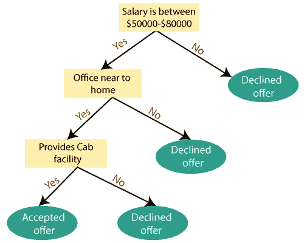
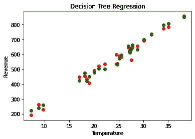
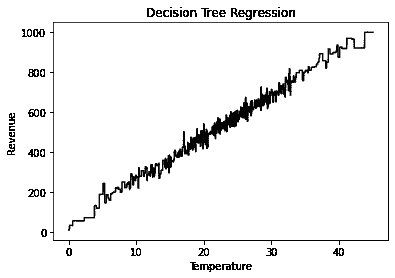

# 机器学习基础:决策树回归

> 原文：<https://towardsdatascience.com/machine-learning-basics-decision-tree-regression-1d73ea003fda?source=collection_archive---------2----------------------->

## 实施决策树回归算法并绘制结果。

之前，我已经解释了各种回归模型，如线性、多项式和支持向量回归。在本文中，我将通过一个真实的例子向您介绍决策树回归的算法和实现。

## 决策树算法综述

决策树是监督学习最常用、最实用的方法之一。它既可以用来解决回归问题，也可以用来解决分类问题，而分类问题在实际应用中得到更多的应用。

它是一个树形结构的分类器，有三种类型的节点。 ***根节点*** 是代表整个样本的初始节点，并且可以被进一步分割成更多的节点。 ***内部节点*** 代表数据集的特征，分支代表决策规则。最后， ***叶节点*** 表示结果。这个算法对于解决决策相关的问题非常有用。


[来源](https://www.google.com/url?sa=i&url=https%3A%2F%2Fwww.python-course.eu%2FDecision_Trees.php&psig=AOvVaw2TW-tCuePuAsAYuADqagpN&ust=1594725515226000&source=images&cd=vfe&ved=0CAkQjhxqFwoTCJDayM-NyuoCFQAAAAAdAAAAABAN)

对于一个特定的数据点，通过回答*对/错*问题来完全遍历整个树，直到它到达叶节点。最终预测是该特定叶节点中因变量的平均值。通过多次迭代，该树能够预测数据点的适当值。



决策树模型示例([来源](https://www.javatpoint.com/machine-learning-decision-tree-classification-algorithm)

上图是决策树算法实现的示意图。决策树具有易于理解、需要较少的数据清理、非线性不影响模型性能以及要调整的超参数数量几乎为零的优点。然而，它可能有一个过度拟合的问题，这个问题可以使用 ***随机森林*** 算法来解决，这将在下一篇文章中解释。

在这个例子中，我们将经历 ***决策树回归*** 的实现，其中我们将根据一个地区 500 天的温度来预测一家冰淇淋店的收入。

## 问题分析

在这个数据中，我们有一个独立变量*温度*和一个独立变量*收入*，我们必须预测它们。在这个问题中，我们必须建立一个决策树回归模型，该模型将研究冰淇淋店的温度和收入之间的相关性，并根据特定日期的温度预测冰淇淋店的收入。

## 步骤 1:导入库

第一步总是包括导入开发 ML 模型所需的库。导入 ***NumPy*** ， ***matplotlib*** 和 ***熊猫库*** 。

```
import numpy as np
import matplotlib.pyplot as plt
import pandas as pd
```

## 步骤 2:导入数据集

在这一步中，我们将使用 pandas 来存储从我的 github 存储库中获得的数据，并使用函数' *pd.read_csv* '将其存储为 Pandas DataFrame。在此，我们将自变量(X)分配给'*温度'*列，将因变量(y)分配给'*收入'*列。

```
dataset = pd.read_csv('[https://raw.githubusercontent.com/mk-gurucharan/Regression/master/IceCreamData.csv'](https://raw.githubusercontent.com/mk-gurucharan/Regression/master/IceCreamData.csv'))X = dataset['Temperature'].values
y = dataset['Revenue'].valuesdataset.head(5)>>Temperature   Revenue
24.566884     534.799028
26.005191     625.190122
27.790554     660.632289
20.595335     487.706960
11.503498     316.240194
```

## 步骤 3:将数据集分为训练集和测试集

下一步，我们必须像往常一样将数据集分成*训练集*和*测试集*。为此，我们使用`test_size=0.05`,这意味着 500 个数据行的 5%(*25 行*)将仅用作测试集，剩余的 *475 行*将用作构建模型的训练集。

```
from sklearn.model_selection import train_test_split
X_train, X_test, y_train, y_test = train_test_split(X, y, test_size = 0.05)
```

## 步骤 4:在训练集上训练决策树回归模型

我们从`sklearn.tree`导入`DecisionTreeRegressor`类，并将其赋给变量' ***'回归变量'*** 。然后我们通过使用`regressor.fit`函数将 X_train 和 y_train 拟合到模型中。我们使用`reshape(-1,1)`将变量整形为一个列向量。

```
# Fitting Decision Tree Regression to the dataset
from sklearn.tree import DecisionTreeRegressor
regressor = DecisionTreeRegressor()
regressor.fit(X_train.reshape(-1,1), y_train.reshape(-1,1))
```

## 第五步:预测结果

在此步骤中，我们使用`regressor.predict`函数预测模型在训练集值上训练的测试集的结果，并将其分配给' ***y_pred'* 。**

```
y_pred = regressor.predict(X_test.reshape(-1,1))
```

## 步骤 6:将实际值与预测值进行比较

在这一步中，我们将在 Pandas 数据帧中比较并显示 y_test 的值为'**真实值**，y_pred 的值为'**预测值**。

```
df = pd.DataFrame({'Real Values':y_test.reshape(-1), 'Predicted Values':y_pred.reshape(-1)})
df>>
Real Values    Predicted Values
448.325981     425.265596
535.866729     500.065779
264.123914     237.763911
691.855484     698.971806
587.221246     571.434257
653.986736     633.504009
538.179684     530.748225
643.944327     660.632289
771.789537     797.566536
644.488633     654.197406
192.341996     223.435016
491.430500     477.295054
781.983795     807.541287
432.819795     420.966453
623.598861     612.803770
599.364914     534.799028
856.303304     850.246982
583.084449     596.236690
521.775445     503.084268
228.901030     258.286810
453.785607     473.568112
406.516091     450.473207
562.792463     634.121978
642.349814     621.189730
737.800824     733.215828
```

从上述值，我们推断该模型能够以良好的准确度预测 y_test 的值。

## 步骤 7:可视化决策树回归结果



温度与收入(决策树回归)

在该图中，实际值用“ ***、红色*** ”绘制，预测值用“ ***、绿色*** ”绘制。决策树回归模型的绘图也是用 ***黑色*** 颜色绘制的。

我附上了我的 github 资源库的链接，你可以在那里找到 Google Colab 笔记本和数据文件供你参考。

[](https://github.com/mk-gurucharan/Regression) [## MK-guru charan/回归

### GitHub 是超过 5000 万开发人员的家园，他们一起工作来托管和审查代码、管理项目和构建…

github.com](https://github.com/mk-gurucharan/Regression) 

我真的希望我已经用一个例子解释了构建决策树回归模型的 ML 代码。

您还可以在下面找到该程序对其他回归模型的解释:

*   [简单线性回归](/machine-learning-basics-simple-linear-regression-bc83c01baa07)
*   [多元线性回归](/machine-learning-basics-multiple-linear-regression-9c70f796e5e3)
*   [多项式回归](/machine-learning-basics-polynomial-regression-3f9dd30223d1)
*   [支持向量回归](/machine-learning-basics-support-vector-regression-660306ac5226)
*   [决策树回归](/machine-learning-basics-decision-tree-regression-1d73ea003fda)
*   [随机森林回归](/machine-learning-basics-random-forest-regression-be3e1e3bb91a)

在接下来的文章中，我们将会遇到更复杂的回归、分类和聚类模型。到那时，快乐的机器学习！