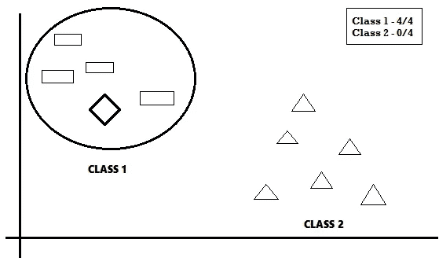
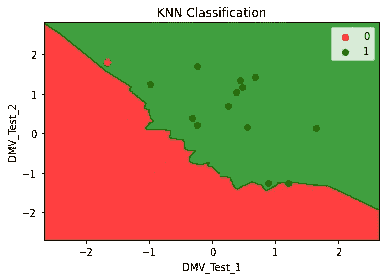

# 机器学习基础:K-最近邻分类

> 原文：<https://towardsdatascience.com/machine-learning-basics-k-nearest-neighbors-classification-6c1e0b209542?source=collection_archive---------20----------------------->

## 了解 KNN 分类并在简单数据集上构建模型以可视化您的结果！

在之前的[故事](/machine-learning-basics-simple-linear-regression-bc83c01baa07)中，我已经解释了各种 ***回归*** 模型的实现程序。此外，我已经描述了[逻辑回归](/machine-learning-basics-logistic-regression-890ef5e3a272)模型的实现。在本文中，我们将看到 K-最近邻或 KNN 分类的算法以及一个简单的例子。

## KNN 分类概述

K-最近邻或 KNN 分类是一种简单且易于实现的监督机器学习算法，主要用于分类问题。

让我们用一个非常简单的例子来理解这个算法。假设有两个类，分别用矩形和三角形表示。如果我们想给任何一个类添加一个新的形状(菱形),那么我们可以实现 KNN 分类模型。



KNN 模型(来源——自我)

在这个模型中，我们必须选择最近邻的数量(N)。这里，由于我们选择了 N=4，新的数据点将计算每个点之间的距离，并在其最近的 4 个邻居周围绘制一个圆形区域(N=4)。在这个问题中，由于所有四个最近的邻居都位于类 1(矩形)中，所以新的数据点(菱形)也被指定为类 1 数据点。

这样，我们可以用不同的值改变参数 N，并通过试错法为模型选择最精确的值，也避免了过拟合和高损失。

这样，我们就可以实现 KNN 分类算法。现在让我们在下一节中通过一个真实的例子来讨论它的实现。

## 问题分析

为了在实际应用中应用 KNN 分类模型，我使用了与构建逻辑回归模型相同的数据集。在这里，我们 DMV 测试数据集有三列。前两列由两个 DMV 书面测试( ***DMV_Test_1*** 和 ***DMV_Test_2*** )组成，这两列是自变量，最后一列由因变量 ***Results*** 组成，这两列表示驾驶员已获得驾照(1)或未获得驾照(0)。

在这种情况下，我们必须使用这些数据建立一个 KNN 分类模型，以预测参加了两次 DMV 笔试的司机是否会获得驾照，并使用他们在笔试中获得的分数对结果进行分类。

## 步骤 1:导入库

和往常一样，第一步总是包括导入库，即 NumPy、Pandas 和 Matplotlib。

```
import numpy as np
import matplotlib.pyplot as plt
import pandas as pd
```

## 步骤 2:导入数据集

在这一步中，我们将从我的 GitHub 存储库中以“DMVWrittenTests.csv”的形式获取数据集。变量 ***X*** 将存储两个 ***DMV 测试*** ，变量 ***Y*** 将最终输出存储为 ***结果******。***`dataset.head(5)`用于可视化前 5 行数据。

```
dataset = pd.read_csv('[https://raw.githubusercontent.com/mk-gurucharan/Classification/master/DMVWrittenTests.csv'](https://raw.githubusercontent.com/mk-gurucharan/Classification/master/DMVWrittenTests.csv'))X = dataset.iloc[:, [0, 1]].values
y = dataset.iloc[:, 2].valuesdataset.head(5)>>
DMV_Test_1   DMV_Test_2   Results
34.623660    78.024693    0
30.286711    43.894998    0
35.847409    72.902198    0
60.182599    86.308552    1
79.032736    75.344376    1
```

## 步骤 3:将数据集分为训练集和测试集

在这一步中，我们必须将数据集分为训练集和测试集，在训练集上将训练逻辑回归模型，在测试集上将应用训练模型对结果进行分类。其中的`test_size=0.25`表示*数据的 25%将作为 ***测试集*** 保存，剩余的 75%*将作为 ***训练集*** 用于训练。**

```
**from sklearn.model_selection import train_test_split
X_train, X_test, y_train, y_test = train_test_split(X, y, test_size = 0.25)**
```

## **步骤 4:特征缩放**

**这是一个附加步骤，用于对特定范围内的数据进行标准化。它也有助于加速计算。由于数据变化很大，我们使用此函数将数据范围限制在一个小范围内(-2，2)。例如，分数 62.0730638 被规范化为-0.21231162，分数 96.51142588 被规范化为 1.55187648。这样 X_train 和 X_test 的分数就归一化到一个更小的范围。**

```
**from sklearn.preprocessing import StandardScaler
sc = StandardScaler()
X_train = sc.fit_transform(X_train)
X_test = sc.transform(X_test)**
```

## **步骤 5:在训练集上训练 KNN 分类模型**

**在这一步中，类`KNeighborsClassifier`被导入并分配给变量 ***【分类器】*** 。`classifier.fit()`功能配有 **X_train** 和 ***Y_train*** 对模型进行训练。**

```
**from sklearn.neighbors import KNeighborsClassifier
classifier = KNeighborsClassifier(n_neighbors = 5, metric = 'minkowski', p = 2)
classifier.fit(X_train, y_train)**
```

## **步骤 6:预测测试集结果**

**在这一步中，`classifier.predict()`函数用于预测测试集的值，这些值被存储到变量`y_pred.`**

```
**y_pred = classifier.predict(X_test) 
y_pred**
```

## **步骤 7:混淆矩阵和准确性**

**这是分类技术中最常用的一步。在这里，我们看到了训练模型的准确性，并绘制了混淆矩阵。**

**混淆矩阵是一个表，用于显示当测试集的真实值已知时，对分类问题的正确和错误预测的数量。它的格式如下**

****

**来源—自己**

**真实值是正确预测的次数。**

```
**from sklearn.metrics import confusion_matrix
cm = confusion_matrix(y_test, y_pred)from sklearn.metrics import accuracy_score 
print ("Accuracy : ", accuracy_score(y_test, y_pred))
cm>>Accuracy :  0.92>>array([[11,  1],
       [ 1, 12]])**
```

**从上面的混淆矩阵，我们推断，在 25 个测试集数据中，23 个被正确分类，2 个被错误分类，这比逻辑回归模型好不了多少。**

## **步骤 8:将实际值与预测值进行比较**

**在这个步骤中，创建一个 Pandas DataFrame 来比较原始测试集( ***y_test*** )和预测结果( ***y_pred*** )的分类值。**

```
**df = pd.DataFrame({'Real Values':y_test, 'Predicted Values':y_pred})
df>> 
Real Values   Predicted Values
0             0
0             1
1             1
0             0
0             0
1             1
1             1
0             0
0             0
1             1
0             0
1             0
1             1
1             1
0             0
0             0
0             0
1             1
1             1
1             1
1             1
0             0
1             1
1             1
0             0**
```

**虽然这种可视化可能没有回归那么有用，但从这一点上，我们可以看到，该模型能够以 92%的相当高的准确度对测试集值进行分类，如上面计算的那样。**

## **步骤 9:可视化结果**

**在最后一步中，我们将 KNN 分类模型的结果可视化在一个沿着两个区域绘制的图上。**

```
**from matplotlib.colors import ListedColormap
X_set, y_set = X_test, y_test
X1, X2 = np.meshgrid(np.arange(start = X_set[:, 0].min() - 1, stop = X_set[:, 0].max() + 1, step = 0.01),
                     np.arange(start = X_set[:, 1].min() - 1, stop = X_set[:, 1].max() + 1, step = 0.01))
plt.contourf(X1, X2, classifier.predict(np.array([X1.ravel(), X2.ravel()]).T).reshape(X1.shape),
             alpha = 0.75, cmap = ListedColormap(('red', 'green')))
plt.xlim(X1.min(), X1.max())
plt.ylim(X2.min(), X2.max())
for i, j in enumerate(np.unique(y_set)):
    plt.scatter(X_set[y_set == j, 0], X_set[y_set == j, 1],
                c = ListedColormap(('red', 'green'))(i), label = j)
plt.title('KNN Classification')
plt.xlabel('DMV_Test_1')
plt.ylabel('DMV_Test_2')
plt.legend()
plt.show()**
```

****

**KNN 分类**

**在该图中，值 ***1(即，是)*** 用“*红色绘制，值 ***0(即，否)*** 用“*绿色绘制。KNN 分类模型将这两个区域分开。它不像逻辑回归模型那样是线性的。因此，具有给定的两个数据点(DMV_Test_1 和 DMV_Test_2)的任何数据都可以绘制在图上，并且根据属于哪个区域，结果(获得驾驶执照)可以分类为是或否。****

***根据上面的计算，我们可以看到测试集中有两个值，每个区域都有一个被错误分类的值。***

## ***结论—***

***因此，在这个故事中，我们已经成功地建立了一个 ***KNN 分类*** 模型，它能够预测一个人是否能够通过笔试获得驾驶执照，并可视化结果。***

**我还附上了我的 GitHub 资源库的链接，你可以在那里下载这个 Google Colab 笔记本和数据文件供你参考。**

**[](https://github.com/mk-gurucharan/Classification) [## MK-guru charan/分类

### 这是一个由 Python 代码组成的知识库，用于构建不同类型的分类模型，以评估和…

github.com](https://github.com/mk-gurucharan/Classification) 

您还可以在下面找到该程序对其他分类模型的解释:

*   [逻辑回归](/machine-learning-basics-logistic-regression-890ef5e3a272)
*   k 近邻(KNN)分类
*   支持向量机(SVM)分类(即将推出)
*   朴素贝叶斯分类(即将推出)
*   随机森林分类(即将推出)

在接下来的文章中，我们将会遇到更复杂的回归、分类和聚类模型。到那时，快乐的机器学习！**