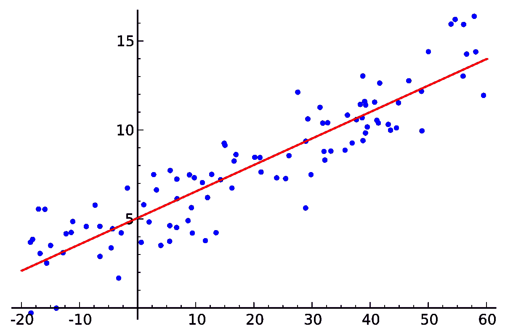

# 机器学习基础:多元线性回归

> 原文：<https://towardsdatascience.com/machine-learning-basics-multiple-linear-regression-9c70f796e5e3?source=collection_archive---------14----------------------->

## 学习用 Python 编程实现多元线性回归。

在前面的故事中，我简要介绍了线性回归，并展示了如何执行简单的线性回归。在简单线性回归中，我们有一个因变量(y)和一个自变量(x)。如果学生的分数取决于两个或更多的独立变量会怎样？

## 概观

在这个例子中，我们将经历 ***多元线性回归*** 的实现，其中我们将为一个想要分析一个初创公司是否值得投资以获得良好回报的风险投资家预测初创公司的利润。



线性回归([来源](https://en.wikipedia.org/wiki/Linear_regression))

## 问题分析

在这个数据中，我们有四个自变量，即， *R & D 支出，行政管理，营销支出*和*状态*。有一个自变量，即*利润*。因此，我们的工作是用这些数据训练 ML 模型，以了解四个特征(或独立变量)之间的相关性，并使用所有这些数据预测另一家新公司的利润。

## 步骤 1:导入库

在第一步中，我们将导入构建 ML 模型所需的库。导入 ***NumPy*** 库和 ***matplotlib*** 。另外，我们导入了 ***熊猫*** 库进行数据分析。

```
import numpy as np
import matplotlib.pyplot as plt
import pandas as pd
```

## 步骤 2:导入数据集

在下一步中，我们将使用 pandas 来存储从我的 github 存储库中获得的数据，并使用函数" *pd.read_csv* "将其存储为名为" ***dataset*** "的 Pandas DataFrame。

我们浏览我们的数据集，并将自变量(x)分配给数据集的前四列，即 R&D 支出(指数=0)、行政管理(指数=1)、营销支出(指数=2)和州(指数=3)。

```
dataset = pd.read_csv('[https://raw.githubusercontent.com/mk-gurucharan/Regression/master/Startups_Data.csv'](https://raw.githubusercontent.com/mk-gurucharan/Regression/master/Startups_Data.csv'))X = dataset.iloc[:, :-1].values
y = dataset.iloc[:, -1].valuesdataset.head(5)>>
R&D Spend  Administration  Marketing Spend   State      Profit
165349.20  136897.80       471784.10         New York   192261.83
162597.70  151377.59       443898.53         California 191792.06
153441.51  101145.55       407934.54         Florida    191050.39
144372.41  118671.85       383199.62         New York   182901.99
142107.34  91391.77        366168.42         Florida    166187.94
```

我们使用相应的。iloc 函数对数据帧进行切片，将这些索引赋给 x，这里我们使用 **[:，:-1]** ，可以解释为**【包含所有行，包含所有列直到-1(不含-1)】**。在这里，-1 表示倒数第一列。因此，我们将第 0、1、2 和 3 列指定为 x。

我们将最后一列(-1)分配给因变量 y。我们打印数据帧以查看我们是否为训练数据获得了正确的列。

## 步骤 3:编码分类数据

只要数据集中有数字，我们就可以轻松地对数据集进行数学计算，并创建预测模型。在这个数据集中，我们遇到了一个非数字变量，即“ ***、状态*** ”。这也称为分类数据。

我们使用另一个叫做 **sklearn 的重要库对这些分类数据进行编码。**在这里，我们导入了 **ColumnTransformer** 和 **OneHotEncoder** 。ColumnTransformer 允许单独转换数据帧的特定列。在我们的例子中，我们使用 OneHotEncoder 将“State”列(index=3)转换为数字数据。

在对分类数据进行编码后，我们打印数据帧 X 并查看变化。我们看到在开始时增加了三个新栏目。每一列代表一个“状态”。例如，在第一行中，第三列表示“纽约”，因此第三列中的值为“1”。

```
from sklearn.compose import ColumnTransformer
from sklearn.preprocessing import OneHotEncoder
ct = ColumnTransformer(transformers=[('encoder', OneHotEncoder(), [3])], remainder='passthrough')
X = np.array(ct.fit_transform(X))
```

## 步骤 4:将数据集分为训练集和测试集

一旦我们准备好了数据集，下一个重要的任务就是将数据集分成训练集和测试集。我们这样做是为了用称为“**训练集**的一部分数据训练我们的模型，并在称为“**测试集**的另一组数据上测试预测结果。

我们使用“train_test_split”函数来拆分我们的数据。这里我们给出“test_size =0.2”，表示 20%的数据是测试集。在我们的例子中，将选择 10 个随机启动数据作为测试集，并将选择 40 个剩余的启动数据作为训练集。

```
from sklearn.model_selection import train_test_split
X_train, X_test, y_train, y_test = train_test_split(X, y, test_size = 0.2)
```

## 步骤 5:在训练集上训练多元线性回归模型

下一步，我们导入" **LinearRegression** "类，它将应用于我们的训练集。我们给 LinearRegression 类分配一个变量“**回归变量**”。然后，我们使用“ **regressor.fit** ”将训练数据集(X_train 和 y_train)拟合到这个线性回归类，以便进行训练过程。

```
from sklearn.linear_model import LinearRegression
regressor = LinearRegression()
regressor.fit(X_train, y_train)
```

## 步骤 6:预测测试集结果

下一步，我们将使用训练好的模型(即“回归器”)来预测测试集的利润。测试集数据(X_test)的真实值(利润)存储在变量 y_test 中。

然后，我们使用“ **regressor.predict** ”函数来预测测试数据 X_test 的值。我们将预测值指定为 y_pred。我们现在有两个数据，y_test(真实值)和 y_pred(预测值)。

```
y_pred = regressor.predict(X_test)
```

## 步骤 7:将测试集与预测值进行比较

在这一步中，我们将把 y_test 的值打印为 Pandas DataFrame 中每个 X_test 的*实际值和 y_pred 值打印为 ***预测值*** 。这样，我们获得了所有 10 个 X_test 数据的值。*

```
*df = pd.DataFrame({'Real Values':y_test, 'Predicted Values':y_pred})
df>>
Real Values Predicted Values
78239.91    74963.602167
182901.99   173144.548525
64926.08    45804.248438
105733.54   108530.843936
141585.52   127674.466487
108552.04   111471.421444
146121.95   133618.038644
105008.31   114655.651664
96778.92    96466.443219
97483.56    96007.236281*
```

*在第一行中，实际值的值为 ***78239.91*** ，预测值的值为 ***74963.60*** 。我们看到该模型已经精确地预测了该值，因此我们可以说我们的模型具有良好的准确性。*

*恭喜你！现在，您已经从构建简单的线性回归模型扩展到多元线性回归模型。我附上了我的 Github 资源库的链接，你可以在那里找到 Python 笔记本和数据文件供你参考。*

*[](https://github.com/mk-gurucharan/Regression) [## MK-guru charan/回归

### GitHub 是超过 5000 万开发人员的家园，他们一起工作来托管和审查代码、管理项目和构建…

github.com](https://github.com/mk-gurucharan/Regression) 

希望我已经清楚地解释了开发多元线性回归的 ML 模型的过程，以便用相关数据预测一家初创公司的利润。

您还可以在下面找到该程序对其他回归模型的解释:

*   [简单线性回归](/machine-learning-basics-simple-linear-regression-bc83c01baa07)
*   [多元线性回归](/machine-learning-basics-multiple-linear-regression-9c70f796e5e3)
*   [多项式回归](/machine-learning-basics-polynomial-regression-3f9dd30223d1)
*   [支持向量回归](/machine-learning-basics-support-vector-regression-660306ac5226)
*   [决策树回归](/machine-learning-basics-decision-tree-regression-1d73ea003fda)
*   [随机森林回归](/machine-learning-basics-random-forest-regression-be3e1e3bb91a)

在接下来的文章中，我们将会遇到更复杂的回归、分类和聚类模型。到那时，快乐的机器学习！*