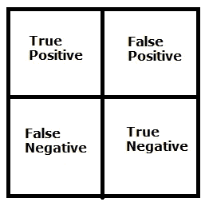

# 机器学习基础:朴素贝叶斯分类

> 原文：<https://towardsdatascience.com/machine-learning-basics-naive-bayes-classification-964af6f2a965?source=collection_archive---------8----------------------->

## 了解朴素贝叶斯算法，并通过实现朴素贝叶斯分类模型来解决一个著名的虹膜数据集问题

在之前的[故事](/machine-learning-basics-simple-linear-regression-bc83c01baa07)中，我已经解释了各种 ***回归*** 模型的实现程序。此外，我还描述了逻辑回归，KNN 和 SVM 分类模型的实施。在本文中，我们将通过一个例子来介绍著名的朴素贝叶斯分类模型的算法。

## 朴素贝叶斯分类综述

朴素贝叶斯就是这样一种分类算法，由于其“*”的特性，在分类中是一个不容忽视的算法。它假设测量的特征是相互独立的。*

*例如，如果一种动物有猫眼、胡须和一条长尾巴，它就可以被认为是猫。即使这些特征相互依赖或依赖于其他特征的存在，所有这些特性独立地促成了这种动物是猫的可能性，这就是为什么它被称为“天真”。*

*根据贝叶斯定理，各种特征是相互独立的。对于两个独立的事件，`P(A,B) = P(A)P(B)`。贝叶斯定理的这个假设可能在实践中从未遇到过，因此它解释了朴素贝叶斯中的“朴素”部分。贝叶斯定理表述为:***P(a | b)=(P(b | a)* P(a))/P(b)。*** 其中 P(a|b)是给定 b 的概率。*

*让我们用一个简单的例子来理解这个算法。如果这个学生在考试那天穿红色的衣服，他就会通过考试。我们可以使用上面讨论的后验概率方法来解决它。*

*由贝叶斯定理， *P(通|红)= P(红|通)* P(通)/ P(红)。**

*从数值来看，我们假设 P(红|通)= 3/9 = 0.33，P(红)= 5/14 = 0.36，P(通)= 9/14 = 0.64。现在 P(通|红)= 0.33 * 0.64 / 0.36 = 0.60，概率较高。*

*这样，朴素贝叶斯使用类似的方法来预测基于各种属性的不同类的概率。*

## *问题分析*

*为了实现朴素贝叶斯分类，我们将使用一个非常著名的鸢尾花数据集，它由 3 类花组成。其中有 4 个自变量，分别是:****萼片宽度******花瓣长度*** 和 ***花瓣宽度*** 。因变量是 ***物种*** ，我们将利用花的四个独立特征对其进行预测。**

****

**安妮·斯普拉特在 [Unsplash](https://unsplash.com?utm_source=medium&utm_medium=referral) 上的照片**

**有 3 类物种，即*刚毛藻、*云芝和*海滨锦葵*。这个数据集最初是由罗纳德·费雪在 1936 年提出的。使用花的各种特征(独立变量)，我们必须使用朴素贝叶斯分类模型对给定的花进行分类。**

## **步骤 1:导入库**

**和往常一样，第一步总是包括导入库，即 NumPy、Pandas 和 Matplotlib。**

```
**import numpy as np
import matplotlib.pyplot as plt
import pandas as pd**
```

## **步骤 2:导入数据集**

**在这一步中，我们将导入 Iris Flower 数据集，该数据集作为`IrisDataset.csv`存储在我的 github 存储库中，并将其保存到变量`dataset.` 中。此后，我们将 4 个自变量分配给*X，将因变量“物种”分配给 ***Y*** 。显示数据集的前 5 行。***

```
**dataset = pd.read_csv('[https://raw.githubusercontent.com/mk-gurucharan/Classification/master/IrisDataset.csv'](https://raw.githubusercontent.com/mk-gurucharan/Classification/master/IrisDataset.csv'))X = dataset.iloc[:,:4].values
y = dataset['species'].valuesdataset.head(5)>>
sepal_length  sepal_width  petal_length  petal_width   species
5.1           3.5          1.4           0.2           setosa
4.9           3.0          1.4           0.2           setosa
4.7           3.2          1.3           0.2           setosa
4.6           3.1          1.5           0.2           setosa
5.0           3.6          1.4           0.2           setosa**
```

## **步骤 3:将数据集分为训练集和测试集**

**一旦我们获得了数据集，我们必须将数据分成训练集和测试集。在这个数据集中，有 150 行，3 个类中的每一个都有 50 行。由于每个类都是以连续的顺序给出的，所以我们需要随机分割数据集。这里，我们有`test_size=0.2`，这意味着数据集的*的 20%*将用于测试目的，剩余的*的 80%*将用于训练朴素贝叶斯分类模型。******

```
***from sklearn.model_selection import train_test_split
X_train, X_test, y_train, y_test = train_test_split(X, y, test_size = 0.2)***
```

## ***步骤 4:特征缩放***

***使用要素缩放选项将数据集缩小到更小的范围。在这种情况下，`X_train`和`X_test` 值都被缩小到更小的值，以提高程序的速度。***

```
***from sklearn.preprocessing import StandardScaler
sc = StandardScaler()
X_train = sc.fit_transform(X_train)
X_test = sc.transform(X_test)***
```

## ***步骤 5:在训练集上训练朴素贝叶斯分类模型***

***在这一步，我们引入从`sklearn.naive_bayes`库中使用的类`GaussianNB`。这里，我们使用了高斯模型，还有其他几种模型，如伯努利模型、分类模型和多项式模型。这里，我们将 GaussianNB 类分配给变量`classifier`，并为其拟合 X_train 和 y_train 值，用于训练目的。***

```
***from sklearn.naive_bayes import GaussianNB
classifier = GaussianNB()
classifier.fit(X_train, y_train)***
```

## ***步骤 6:预测测试集结果***

***一旦模型被训练，我们使用`classifier.predict()`来预测测试集的值，并且预测的值被存储到变量`y_pred.`***

```
***y_pred = classifier.predict(X_test) 
y_pred***
```

## ***步骤 7:混淆矩阵和准确性***

***这是分类技术中最常用的一步。在这里，我们看到了训练模型的准确性，并绘制了混淆矩阵。***

***混淆矩阵是一个表，用于显示当测试集的真实值已知时，对分类问题的正确和错误预测的数量。它的格式如下***

******

***作者图片***

***真实值是正确预测的次数。***

```
***from sklearn.metrics import confusion_matrix
cm = confusion_matrix(y_test, y_pred)from sklearn.metrics import accuracy_score 
print ("Accuracy : ", accuracy_score(y_test, y_pred))
cm>>Accuracy :  0.9666666666666667>>array([[14,  0,  0],
       [ 0,  7,  0],
       [ 0,  1,  8]])***
```

***从上面的混淆矩阵，我们推断，在 30 个测试集数据中，29 个被正确分类，只有 1 个被错误分类。这给了我们 96.67%的高准确率。***

## ***步骤 8:将实际值与预测值进行比较***

***在这个步骤中，创建一个 Pandas DataFrame 来比较原始测试集( ***y_test*** )和预测结果( ***y_pred*** )的分类值。***

```
**df = pd.DataFrame({'Real Values':y_test, 'Predicted Values':y_pred})
df>> 
Real Values   Predicted Values
setosa        setosa
setosa        setosa
virginica     virginica
versicolor    versicolor
setosa        setosa
setosa        setosa
...  ...   ...  ...  ...
virginica     versicolor
virginica     virginica
setosa        setosa
setosa        setosa
versicolor    versicolor
versicolor    versicolor**
```

**这个步骤是一个额外的步骤，它不像混淆矩阵那样提供很多信息，并且主要用于回归以检查预测值的准确性。**

**如你所见，有一个错误的预测是预测了*云芝*而不是*弗吉尼亚*。**

## **结论—**

**因此，在这个故事中，我们已经成功地建立了一个 ***朴素贝叶斯分类*** 模型，该模型能够根据 4 个特征对一朵花进行分类。这个模型可以用网上的其他几个分类数据集来实现和测试。**

**我还附上了我的 GitHub 资源库的链接，你可以在那里下载这个 Google Colab 笔记本和数据文件供你参考。**

**[](https://github.com/mk-gurucharan/Classification) [## MK-guru charan/分类

### 这是一个由 Python 代码组成的知识库，用于构建不同类型的分类模型，以评估和…

github.com](https://github.com/mk-gurucharan/Classification) 

您还可以在下面找到该程序对其他分类模型的解释:

*   [逻辑回归](/machine-learning-basics-logistic-regression-890ef5e3a272)
*   [K-最近邻(KNN)分类](/machine-learning-basics-k-nearest-neighbors-classification-6c1e0b209542)
*   [支持向量机(SVM)分类](/machine-learning-basics-support-vector-machine-svm-classification-205ecd28a09d)
*   朴素贝叶斯分类
*   随机森林分类(即将推出)

在接下来的文章中，我们将会遇到更复杂的回归、分类和聚类模型。到那时，快乐的机器学习！**