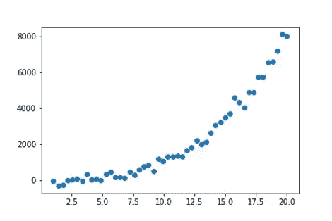
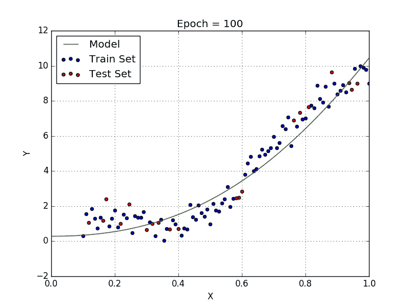
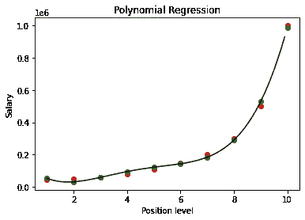

# 机器学习基础:多项式回归

> 原文：<https://towardsdatascience.com/machine-learning-basics-polynomial-regression-3f9dd30223d1?source=collection_archive---------12----------------------->

## 了解如何构建多项式回归模型来预测非线性数据集的值。

在以前的故事中，我简要介绍了线性回归，并展示了如何执行简单和多元线性回归。在本文中，我们将通过程序来建立一个基于非线性数据的多项式回归模型。

## 概观

在前面的线性回归示例中，当数据绘制在图表上时，因变量和自变量之间存在线性关系。因此，更适合建立线性模型来获得准确的预测。如果数据点具有以下非线性，使得线性模型由于非线性而在预测中产生错误，会怎么样？



非线性数据点([来源](https://hackerstreak.com/polynomial-regression-from-scratch/)

在这种情况下，我们必须建立一个多项式关系，它将精确地拟合给定图中的数据点。这被称为多项式回归。多项式回归曲线的公式如`y=w1x+w2x²+..+b`所示

以下是对非线性数据拟合线性回归模型和多项式回归模型的 gif。



左:线性回归，右:多项式回归([来源](/introduction-to-linear-regression-and-polynomial-regression-f8adc96f31cb)

正如我们所看到的，线性回归总是会出错，无论它如何努力去适应数据。另一方面，多项式回归图能够更准确地将数据点拟合到直线上。

在本例中，我们将完成 ***多项式回归*** 的实现，其中我们将根据新员工在以前公司的职位级别，从新公司相同职位级别的工资数据中预测其工资。

## 问题分析

在该数据中，我们有两个独立变量，即*位置和*水平。有一个自变量，即*工资*。因此，在这个问题中，我们必须使用该数据训练一个多项式回归模型，以了解公司中员工数据的级别和工资之间的相关性，并能够根据该数据预测新员工的工资。

## 步骤 1:导入库

在第一步中，我们将导入构建 ML 模型所需的库。导入 ***NumPy*** 库和 ***matplotlib*** 。另外，我们导入了 ***熊猫*** 库进行数据分析。

```
import numpy as np
import matplotlib.pyplot as plt
import pandas as pd
```

## 步骤 2:导入数据集

在这一步中，我们将使用 pandas 来存储从我的 github 存储库中获得的数据，并使用函数" **pd.read_csv** "将其存储为 Pandas DataFrame。

我们遍历数据集，将自变量(x)赋给列名为“*”的第二列，将因变量(y)赋给最后一列，即要预测的“*”工资。**

```
**dataset = pd.read_csv('[https://raw.githubusercontent.com/mk-gurucharan/Regression/master/PositionSalaries_Data.csv'](https://raw.githubusercontent.com/mk-gurucharan/Regression/master/PositionSalaries_Data.csv'))X = dataset.iloc[:, 1:-1].values
y = dataset.iloc[:, -1].valuesdataset.head(5)>>

Position           Level   Salary
Business Analyst   1       45000
Junior Consultant  2       50000
Senior Consultant  3       60000
Manager            4       80000
Country Manager    5       110000**
```

**我们使用相应的。iloc 函数对数据帧进行切片，以将这些指数分配给 X 和 y。在这种情况下，*级别*被视为独立变量，并被分配给 X。要预测的因变量是最后一列(-1)，即*薪金*，它被分配给 y。我们打印 DataFrame " **数据集**，以查看我们是否为训练数据获得了正确的列。**

## **步骤 3:在整个数据集上训练多项式回归模型**

**我们使用的数据集只有很少的行数，因此我们训练整个数据集来构建多项式回归模型。在此" ***多项式特性*** "功能用于指定我们将要绘制的多项式线的次数。在此，度数被设定为 ***4*** 。**

**独立变量 X 随后被多项式特征类拟合，并被转换为新变量 ***X_poly*** 。在这种情况下，变量 X 被转换成新的矩阵 X_Poly，该矩阵包括所有次数=4 的特征的多项式组合。**

```
**from sklearn.preprocessing import PolynomialFeatures
from sklearn.linear_model import LinearRegression
poly_reg = PolynomialFeatures(degree = 4)
X_poly = poly_reg.fit_transform(X)
lin_reg = LinearRegression()
lin_reg.fit(X_poly, y)**
```

**类"***【linear regression】***也被导入并赋给变量***【Lin _ reg】***，该变量与 X_poly 和 y 相匹配，用于构建模型。**

## **第四步:预测结果**

**在这一步中，我们将根据构建的多项式回归模型来预测值 Salary。“ **regressor.predict** ”函数用于预测自变量 X_poly 的值。我们将预测值指定为 y_pred。我们现在有两个数据，y(真实值)和 y_pred(预测值)。**

```
**y_pred = lin_reg.predict(X_poly)**
```

## **步骤 5:将实际值与预测值进行比较**

**在这一步中，我们将把 y 值打印为 Pandas DataFrame 中每个 X_test 的 ***实际值*** 和 y_pred 值作为 ***预测值*** 。**

```
**df = pd.DataFrame({'Real Values':y, 'Predicted Values':y_pred})
df>>
Real Values  Predicted Values
45000        53356.643357
50000        31759.906760
60000        58642.191142
80000        94632.867133
110000       121724.941725
150000       143275.058275
200000       184003.496504
300000       289994.172494
500000       528694.638695
1000000      988916.083916**
```

**我们可以看到，该模型在拟合数据和根据职位级别预测员工工资方面做得非常好。**

## **步骤 6: **可视化多项式回归结果****

**在最后一步中，我们将可视化使用给定数据构建的多项式模型，并在图上绘制“***【y***”和“ ***y_pred*** ”的值，并分析结果**

```
**X_grid = np.arange(min(X), max(X), 0.1)
X_grid = X_grid.reshape((len(X_grid), 1))
plt.scatter(X, y, color = 'red')
plt.scatter(X, y_pred, color = 'green')
plt.plot(X_grid, lin_reg.predict(poly_reg.fit_transform(X_grid)), color = 'black')
plt.title('Polynomial Regression')
plt.xlabel('Position level')
plt.ylabel('Salary')
plt.show()**
```

****

**多项式回归模型**

**在该图中，实际值用“ ***红色*** 绘制，预测值用“ ***绿色*** 绘制。生成的多项式回归线以“ ***黑色*** ”颜色绘制。**

**我附上了我的 github 资源库的链接，你可以在那里找到 Google Colab 笔记本和数据文件供你参考。**

**[](https://github.com/mk-gurucharan/Regression) [## MK-guru charan/回归

### GitHub 是超过 5000 万开发人员的家园，他们一起工作来托管和审查代码、管理项目和构建…

github.com](https://github.com/mk-gurucharan/Regression) 

希望我已经能够清楚地解释建立多项式回归模型的程序。

您还可以在下面找到该程序对其他回归模型的解释:

*   [简单线性回归](/machine-learning-basics-simple-linear-regression-bc83c01baa07)
*   [多元线性回归](/machine-learning-basics-multiple-linear-regression-9c70f796e5e3)
*   [多项式回归](/machine-learning-basics-polynomial-regression-3f9dd30223d1)
*   [支持向量回归](/machine-learning-basics-support-vector-regression-660306ac5226)
*   [决策树回归](/machine-learning-basics-decision-tree-regression-1d73ea003fda)
*   [随机森林回归](/machine-learning-basics-random-forest-regression-be3e1e3bb91a)

在接下来的文章中，我们将会遇到更复杂的回归、分类和聚类模型。到那时，快乐的机器学习！**