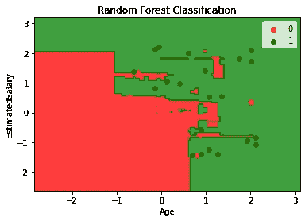

# 机器学习基础:随机森林分类

> 原文：<https://towardsdatascience.com/machine-learning-basics-random-forest-classification-499279bac51e?source=collection_archive---------19----------------------->

## 对数据集执行随机森林算法并可视化结果！

## 随机森林分类综述

随机森林也是一种基于“树”的算法，它使用多个决策树的质量特征来做出决策。因此，它可以被称为一个*‘森林’*的树木，因此得名“随机森林”。术语“*随机*是因为这个算法是一个***‘随机生成的决策树’***的森林。

随机森林算法是对现有决策树算法的改进，现有决策树算法存在一个主要问题*“过拟合”*。与决策树算法相比，它被认为更快更准确。


随机森林算法([来源](https://en.wikipedia.org/wiki/Random_forest))

它结合了多个决策树的结果，并根据结果对输出进行分类。让我们用这个算法实际求解一个数据集。

## 问题分析

在这个随机森林分类模型的实现中，我们将使用一个社交网络广告数据集，我已经在构建 SVM 分类器时使用过它。它由三列组成。前两列是自变量，即' ***【年龄】'*** 和' ***【估计销量】*** ，最后一列是因变量' ***【购买量】'*** ，以二进制格式表示个人是否购买了产品(1)或(0)。

使用这些数据，我们必须为一家产品公司建立一个分类器，该分类器将对特定年龄和特定薪水的人是否会购买他们在社交媒体平台上做广告的产品进行分类。

## 步骤 1:导入库

和往常一样，第一步总是包括导入库，即 NumPy、Pandas 和 Matplotlib。

```
import numpy as np
import matplotlib.pyplot as plt
import pandas as pd
```

## 步骤 2:导入数据集

在这一步中，我们将从我的 github 存储库中获取存储为`SocialNetworkAds.csv` 的数据集，并将其存储到变量 *dataset* 中。然后我们将相应的变量赋给 X 和 y。最后，我们将看到数据集*的前 5 行。*

```
dataset = pd.read_csv('[https://raw.githubusercontent.com/mk-gurucharan/Classification/master/SocialNetworkAds.csv'](https://raw.githubusercontent.com/mk-gurucharan/Classification/master/SocialNetworkAds.csv'))X = dataset.iloc[:, [0, 1]].values
y = dataset.iloc[:, 2].valuesdataset.head(5)>>
Age   EstimatedSalary   Purchased
19    19000             0
35    20000             0
26    43000             0
27    57000             0
19    76000             0
```

## 步骤 3:将数据集分为训练集和测试集

我们将把数据分成训练集和测试集。在此，我们保留了`test_size=0.20`。表示 ***数据的 20%*** 将作为 ***测试集*** 保留，剩余的*80%***训练集*** 用于训练。由于有 400 行，大约 80 个数据点将被分配给测试集，剩余的 320 个数据点将用于训练目的。*

```
*from sklearn.model_selection import train_test_split
X_train, X_test, y_train, y_test = train_test_split(X, y, test_size = 0.2)*
```

## *步骤 4:特征缩放*

*这是一个额外的步骤，当我们把 X 的值缩小到一个更小的范围时，它将提高程序的速度。在这里，我们将`X_train`和`X_test`缩小到-2 到+2 的小范围。例如，工资 75000 按比例缩减为 0.16418997。*

```
*from sklearn.preprocessing import StandardScaler
sc = StandardScaler()
X_train = sc.fit_transform(X_train)
X_test = sc.transform(X_test)*
```

## *步骤 5:在训练集上训练随机森林分类模型*

*一旦训练测试准备好了，我们就可以导入`RandomForestClassifier` 类并使训练集适合我们的模型。类别`SVC`被分配给变量分类器。这里用的判据是“*”。也可以使用的另一个标准是" ***基尼*** "。然后使用`classifier.fit()` 函数来训练模型。**

```
**from sklearn.ensemble import RandomForestClassifier
classifier = RandomForestClassifier(n_estimators = 10, criterion = 'entropy')
classifier.fit(X_train, y_train)**
```

## **步骤 6:预测测试集结果**

**在这一步中，`classifier.predict()`函数用于预测测试集的值，这些值被存储到变量`y_pred.`**

```
**y_pred = classifier.predict(X_test) 
y_pred**
```

## **步骤 7:混淆矩阵和准确性**

**这是分类技术中最常用的一步。在这里，我们看到了训练模型的准确性，并绘制了混淆矩阵。**

**混淆矩阵是一个表，用于显示当测试集的真实值已知时，对分类问题的正确和错误预测的数量。它的格式如下**

****

**来源—自己**

**真实值是正确预测的次数。**

```
**from sklearn.metrics import confusion_matrix
cm = confusion_matrix(y_test, y_pred)from sklearn.metrics import accuracy_score 
print ("Accuracy : ", accuracy_score(y_test, y_pred))
cm>>Accuracy :  0.9625

>>array([[55,  3],
       [ 0, 22]])**
```

**从上面的混淆矩阵，我们推断，在 80 个测试集数据中，77 个被正确分类，只有 3 个被错误分类，留给我们 96.25%的准确率。**

## **步骤 8:将实际值与预测值进行比较**

**在这个步骤中，创建一个 Pandas DataFrame 来比较原始测试集( ***y_test*** )和预测结果( ***y_pred*** )的分类值。**

```
**df = pd.DataFrame({'Real Values':y_test, 'Predicted Values':y_pred})
df>> 
Real Values   Predicted Values
1             1
1             1
0             0
0             0
0             0
... ...  ... ...
1             1
0             1
0             0
0             0
1             1**
```

**这个步骤是一个额外的步骤，它不像混淆矩阵那样提供很多信息，并且主要用于回归以检查预测值的准确性。试着找出错误预测的值！**

## **步骤 9:可视化结果**

**在最后一步中，我们将随机森林分类模型的结果可视化在一个图表上，该图表与两个区域一起绘制。**

```
**from matplotlib.colors import ListedColormap
X_set, y_set = X_test, y_test
X1, X2 = np.meshgrid(np.arange(start = X_set[:, 0].min() - 1, stop = X_set[:, 0].max() + 1, step = 0.01),
                     np.arange(start = X_set[:, 1].min() - 1, stop = X_set[:, 1].max() + 1, step = 0.01))
plt.contourf(X1, X2, classifier.predict(np.array([X1.ravel(), X2.ravel()]).T).reshape(X1.shape),
             alpha = 0.75, cmap = ListedColormap(('red', 'green')))
plt.xlim(X1.min(), X1.max())
plt.ylim(X2.min(), X2.max())
for i, j in enumerate(np.unique(y_set)):
    plt.scatter(X_set[y_set == j, 0], X_set[y_set == j, 1],
                c = ListedColormap(('red', 'green'))(i), label = j)
plt.title('SVM Classification')
plt.xlabel('Age')
plt.ylabel('EstimatedSalary')
plt.legend()
plt.show()**
```

****

**随机森林分类**

**在这个图中，有两个区域。 ***红色*** 区域表示 ***0*** ，由未购买该产品的人组成， ***绿色*** 区域表示 ***1*** ，由已购买该产品的人组成。**

**如果您仔细观察，我们可以看到测试集中红色的 3 个错误分类的数据点，在特定区域有颜色差异。**

## **结论—**

**因此，在这个故事中，我们已经成功地构建了一个 ***随机森林分类*** 模型，该模型能够根据一个人的年龄和工资来预测他是否会购买一件产品。请随意尝试网上其他各种常见的分类数据集。**

**我还附上了我的 github 资源库的链接，你可以在那里下载这个 Google Colab 笔记本和数据文件供你参考。**

**[](https://github.com/mk-gurucharan/Classification) [## MK-guru charan/分类

### 这是一个由 Python 代码组成的知识库，用于构建不同类型的分类模型，以评估和…

github.com](https://github.com/mk-gurucharan/Classification) 

您还可以在下面找到该程序对其他分类模型的解释:

*   [逻辑回归](/machine-learning-basics-logistic-regression-890ef5e3a272)
*   [K-最近邻(KNN)分类](/machine-learning-basics-k-nearest-neighbors-classification-6c1e0b209542)
*   [支持向量机(SVM)分类](/machine-learning-basics-support-vector-machine-svm-classification-205ecd28a09d)
*   [朴素贝叶斯分类](/machine-learning-basics-naive-bayes-classification-964af6f2a965)
*   随机森林分类

在接下来的文章中，我们将会遇到更复杂的回归、分类和聚类模型。到那时，快乐的机器学习！**