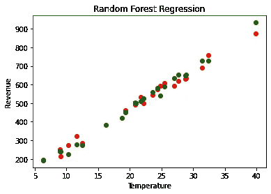
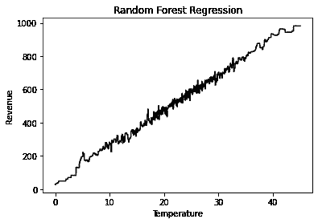

# 机器学习基础:随机森林回归

> 原文：<https://towardsdatascience.com/machine-learning-basics-random-forest-regression-be3e1e3bb91a?source=collection_archive---------4----------------------->

## 学习用 Python 构建机器学习中的随机森林回归模型

之前，我已经解释了各种回归模型，如线性、多项式、支持向量和决策树回归。在本文中，我们将浏览随机森林回归应用程序的代码，它是对之前实现的 [*决策树回归*](/machine-learning-basics-decision-tree-regression-1d73ea003fda) 的扩展。

## 随机森林算法综述

决策树是一种易于理解和解释的算法，因此单个树可能不足以让模型从中学习特征。另一方面，随机森林也是一种基于“树”的算法，它使用多个决策树的质量特征来进行决策。

因此，它可以被称为一个*【森林】*的树木，因此得名“随机森林”。术语' *Random* 是因为这个算法是一个 ***'随机创建的决策树'*** 的森林。

决策树算法的一个主要缺点是它会导致*过拟合*。这个问题可以通过用随机森林回归代替决策树回归来解决。此外，与其他回归模型相比，随机森林算法也非常*快速*和*稳健*。


随机森林算法([来源](https://medium.com/@williamkoehrsen/random-forest-simple-explanation-377895a60d2d))

简而言之，随机森林算法合并多个决策树的输出，以生成最终输出。

## 问题分析

用于 [*决策树回归*](/machine-learning-basics-decision-tree-regression-1d73ea003fda) 的相同数据集在此使用，我们有一个独立变量*温度*和一个独立变量*收入*，我们必须预测。在这个问题中，我们必须建立一个随机森林回归模型，该模型将研究冰淇淋店的温度和收入之间的相关性，并根据特定日期的温度预测冰淇淋店的收入。

## 步骤 1:导入库

照常导入***NumPy******matplotlib***和 ***熊猫库*** 。

```
import numpy as np
import matplotlib.pyplot as plt
import pandas as pd
```

## 步骤 2:导入数据集

使用函数' *pd.read_csv* '从我的 github 存储库中导入数据集。在此，我们将自变量(X)分配给'*温度'*列，将因变量(y)分配给'*收入'*列。

```
dataset = pd.read_csv('[https://raw.githubusercontent.com/mk-gurucharan/Regression/master/IceCreamData.csv'](https://raw.githubusercontent.com/mk-gurucharan/Regression/master/IceCreamData.csv'))X = dataset['Temperature'].values
y = dataset['Revenue'].valuesdataset.head(5)>>Temperature   Revenue
24.566884     534.799028
26.005191     625.190122
27.790554     660.632289
20.595335     487.706960
11.503498     316.240194
```

## 步骤 3:将数据集分为训练集和测试集

类似于决策树回归模型，我们将拆分数据集，我们使用`test_size=0.05`，这意味着 500 个数据行( *25 行*)中的 5%将仅用作*测试集*，剩余的 *475 行*将用作*训练集*，用于构建随机森林回归模型。

```
from sklearn.model_selection import train_test_split
X_train, X_test, y_train, y_test = train_test_split(X, y, test_size = 0.05)
```

## 步骤 4:在训练集上训练随机森林回归模型

在这一步中，为了训练模型，我们导入了`RandomForestRegressor`类，并将其赋给了变量`regressor`。然后，我们使用`.fit()`函数，通过相应地调整回归变量来拟合 X_train 和 y_train 值。

```
# Fitting Random Forest Regression to the dataset
from sklearn.ensemble import RandomForestRegressor
regressor = RandomForestRegressor(n_estimators = 10, random_state = 0)
regressor.fit(X_train.reshape(-1,1), y_train.reshape(-1,1))
```

## 第五步:预测结果

在这一步中，我们使用`regressor.predict`函数预测模型在训练集值上训练的测试集的结果，并将其分配给' ***y_pred'* 。**

```
y_pred = regressor.predict(X_test.reshape(-1,1))
```

## 步骤 6:将实际值与预测值进行比较

在这一步中，我们将在 Pandas 数据帧中比较并显示 y_test 的值为'**真实值**，y_pred 的值为'**预测值**。

```
df = pd.DataFrame({'Real Values':y_test.reshape(-1), 'Predicted Values':y_pred.reshape(-1)})
df>>
Real Values    Predicted Values
534.622865     510.602018
542.608070     558.764770
618.457277     653.356430
460.402500     449.302331
759.377432     728.037404
631.318237     649.712332
572.672047     583.685756
494.627437     503.075097
250.131728     239.372956
594.651009     635.653662
383.956240     384.531416
491.230603     503.075097
875.019348     933.984685
273.073342     224.659296
500.925064     498.355934
191.623312     193.223331
691.516541     726.817925
421.621505     420.997198
636.298374     653.945550
321.848273     276.772845
283.679657     275.805778
608.936345     589.542982
212.591740     239.372956
594.804871     541.164031
500.065779     524.649546
```

从上述值，我们推断该模型能够以良好的准确度预测 y_test 的值，尽管它可以通过调整超参数如`n_estimators`和`max_depth`来改进。我把这些参数交给你们来处理，以提高随机森林回归模型的准确性。

## 步骤 7:可视化随机森林回归结果



温度与收入(随机森林回归)

在该图中，实际值用" ***、红色*** "绘制，预测值用" ***、绿色*** "绘制。决策树回归模型的绘图也是用 ***黑色*** 颜色绘制的。

随机森林回归

我附上了我的 github 资源库的链接，你可以在那里找到 Google Colab 笔记本和数据文件供你参考。

[](https://github.com/mk-gurucharan/Regression) [## MK-guru charan/回归

### GitHub 是超过 5000 万开发人员的家园，他们一起工作来托管和审查代码、管理项目和构建…

github.com](https://github.com/mk-gurucharan/Regression) 

我真的希望我已经用一个例子解释了构建决策树回归模型的 ML 代码。

您还可以在下面找到该程序对其他回归模型的解释:

*   [简单线性回归](/machine-learning-basics-simple-linear-regression-bc83c01baa07)
*   [多元线性回归](/machine-learning-basics-multiple-linear-regression-9c70f796e5e3)
*   [多项式回归](/machine-learning-basics-polynomial-regression-3f9dd30223d1)
*   [支持向量回归](/machine-learning-basics-support-vector-regression-660306ac5226)
*   [决策树回归](/machine-learning-basics-decision-tree-regression-1d73ea003fda)
*   [随机森林回归](/machine-learning-basics-random-forest-regression-be3e1e3bb91a)

在接下来的文章中，我们将会遇到更复杂的回归、分类和聚类模型。到那时，快乐的机器学习！