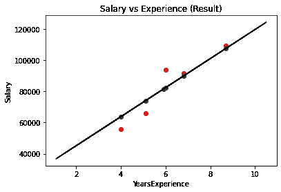

# 机器学习基础:简单线性回归

> 原文：<https://towardsdatascience.com/machine-learning-basics-simple-linear-regression-bc83c01baa07?source=collection_archive---------16----------------------->

## 学习简单线性回归的基本机器学习程序。

在数据科学编程的最初几天，人们可能会遇到术语“**回归**”。在这个故事中，我想用一个常见的例子来解释非常基本的“*”的程序代码。*

## *概述—*

*在统计学中， ***线性回归*** 是一种对标量响应(或因变量)与一个或多个解释变量(或自变量)之间的关系进行建模的线性方法。在我们的例子中，我们将经历简单的线性回归。*

*简单线性回归的形式为`y = wx + b`，其中 ***y*** 为因变量， ***x*** 为自变量， ***w*** 和 ***b*** 为训练参数，在训练过程中需要对其进行优化，以获得准确的预测。*

*现在让我们应用机器学习来训练一个数据集，根据*年的经验来预测 ***工资*** 。**

## **步骤 1:导入库**

**在第一步中，我们将导入 ***pandas*** 库，该库将用于存储 pandas 数据帧中的数据。 ***matplotlib*** 用于绘制图形。**

```
**import numpy as np
import matplotlib.pyplot as plt
import pandas as pd**
```

## **步骤 2:导入数据集**

**在这一步中，我们将从我的 github 存储库中下载数据集，其中包含的数据为“Salary_Data.csv”。变量 ***X*** 会存储“ ***年资*** ”，变量*会存储“ ***工资******。***`dataset.head(5)`用于可视化前 5 行数据。***

```
**dataset = pd.read_csv('https://raw.githubusercontent.com/mk-gurucharan/Regression/master/Salary_Data.csv')X = dataset.iloc[:, :-1].values
y = dataset.iloc[:, -1].valuesdataset.head(5)>>
YearsExperience Salary
1.1             39343.0
1.3             46205.0
1.5             37731.0
2.0             43525.0
2.2             39891.0**
```

## **步骤 3:将数据集分为训练集和测试集**

**在这一步中，我们必须将数据集分为训练集和测试集，前者将训练线性回归模型，后者将应用训练好的模型来可视化结果。在此，`test_size=0.2`表示*数据的 20%***将作为*** 测试集保存，剩余的*的 80%***将作为*** 训练集用于训练。****

```
**from sklearn.model_selection import train_test_split
X_train, X_test, y_train, y_test = train_test_split(X, y, test_size = 0.2)**
```

## **步骤 4:在训练集上训练简单线性回归模型**

**第四步，导入类`LinearRegression`，并将其赋给变量 ***“回归量”*** 。`regressor.fit()`功能配有 **X_train** 和 ***Y_train*** ，模型将在其上进行训练。**

```
**from sklearn.linear_model import LinearRegression
regressor = LinearRegression()
regressor.fit(X_train, y_train)**
```

## **步骤 5:预测测试集结果**

**在这一步中，`regressor.predict()`函数用于预测测试集的值，这些值被存储到变量`y_pred.`**

```
**y_pred = regressor.predict(X_test)**
```

## **步骤 6:将测试集与预测值进行比较**

**在这个步骤中，创建一个 Pandas DataFrame 来比较原始测试集( ***y_test*** )和预测结果( ***y_pred*** )的工资值。**

```
**df = pd.DataFrame({'Real Values':y_test, 'Predicted Values':y_pred})
df>> 
Real Values    Predicted Values
109431.0       107621.917107
81363.0        81508.217112
93940.0        82440.849255
55794.0        63788.206401
66029.0        74047.159970
91738.0        89901.906396**
```

**我们可以看到，预测的工资非常接近实际工资值，可以得出结论，该模型已经过良好的训练。**

## **第七步:可视化结果**

**在最后一步中，我们将 ***实际*** 和 ***预测*** 工资值的结果以及绘制的图表上的线性回归线可视化。**

```
**plt.scatter(X_test, y_test, color = 'red')
plt.scatter(X_test, y_pred, color = 'green')
plt.plot(X_train, regressor.predict(X_train), color = 'black')
plt.title('Salary vs Experience (Result)')
plt.xlabel('YearsExperience')
plt.ylabel('Salary')
plt.show()**
```

****

**薪水与经验**

**在该图中，实际值用“ ***红色*** 绘制，预测值用“ ***绿色*** 绘制。生成的线性回归线以“ ***黑色*** ”颜色绘制。**

## **结论—**

**因此，在这个故事中，我们已经成功地构建了一个 ***简单线性回归*** 模型，该模型根据员工的“工作经验”来预测他们的“工资”,并将结果可视化。**

**我还附上了我的 github 资源库的链接，你可以在那里下载这个 Google Colab 笔记本和数据文件供你参考。**

**[](https://github.com/mk-gurucharan/Regression) [## MK-guru charan/回归

### GitHub 是超过 5000 万开发人员的家园，他们一起工作来托管和审查代码、管理项目和构建…

github.com](https://github.com/mk-gurucharan/Regression) 

您还可以在下面找到该程序对其他回归模型的解释:

*   [简单线性回归](/machine-learning-basics-simple-linear-regression-bc83c01baa07)
*   [多元线性回归](/machine-learning-basics-multiple-linear-regression-9c70f796e5e3)
*   [多项式回归](/machine-learning-basics-polynomial-regression-3f9dd30223d1)
*   [支持向量回归](/machine-learning-basics-support-vector-regression-660306ac5226)
*   [决策树回归](/machine-learning-basics-decision-tree-regression-1d73ea003fda)
*   [随机森林回归](/machine-learning-basics-random-forest-regression-be3e1e3bb91a)

在接下来的文章中，我们将会遇到更复杂的回归、分类和聚类模型。到那时，快乐的机器学习！**