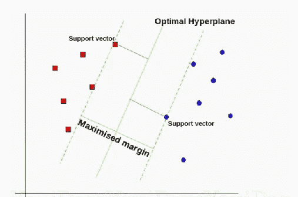
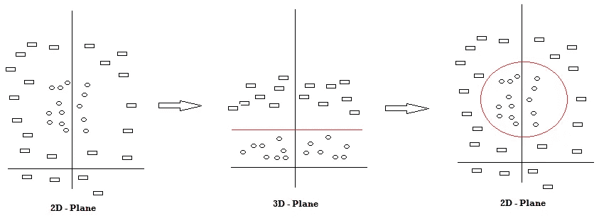
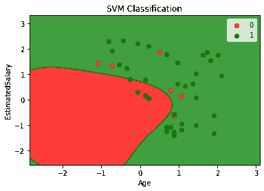

# 机器学习基础:支持向量机(SVM)分类

> 原文：<https://towardsdatascience.com/machine-learning-basics-support-vector-machine-svm-classification-205ecd28a09d?source=collection_archive---------9----------------------->

## 了解支持向量机制，并将其应用于实时示例。

在之前的[故事](/machine-learning-basics-simple-linear-regression-bc83c01baa07)中，我已经解释了各种 ***回归*** 模型的实现程序。此外，我还描述了逻辑回归和 KNN 分类模型的实现。在本文中，我们将通过一个清晰的例子来了解 SVM 分类的算法和实现。

## SVM 分类概述

支持向量机(SVM)分类类似于我在之前的[故事](/machine-learning-basics-support-vector-regression-660306ac5226)中解释过的支持向量机。在 SVM，用来分隔类的线被称为 ***超平面*** 。超平面任意一侧最接近超平面的数据点称为 ***支持向量*** ，用于绘制边界线。



[来源](https://gdcoder.com/support-vector-machine-vs-logistic-regression/)

在 SVM 分类中，数据可以是线性的，也可以是非线性的。在 SVM 分类器中可以设置不同的内核。对于线性数据集，我们可以将内核设置为' *linear* '。

另一方面，对于非线性数据集，有两个核，即' *rbf* 和'*多项式*'。在这种情况下，数据被映射到更高的维度，这使得绘制超平面更容易。之后，它被降低到较低的维度。



SVM 机制(信息来源——本人)

从上图中，我们可以看到有两类形状，矩形和圆形。由于很难在 2D 平面中绘制 SVM 线，我们将数据点映射到更高维度(3D 平面)，然后绘制超平面。然后，用红色绘制的 SVM 分类器将它还原到原始平面。

通过这种方式，SVM 分类器可用于从给定的数据集中对数据点进行分类，确定其所属的类别。让我们用这个算法来解决一个现实世界的问题。

## 问题分析

在 SVM 分类模型的这个实现中，我们将使用由三列组成的社交网络广告数据集。前两列是自变量，即' ***【年龄】'*** 和' ***【估计销售额】'*** ，最后一列是因变量' ***【购买量】'*** ，以二进制格式表示个人是否购买了产品(1)或(0)。

在这个问题中，我们必须为一家公司建立一个 SVM 分类模型，该模型将对特定年龄和特定工资的用户是否会购买他们的特定产品进行分类。现在让我们来看一下模型的实现。

## 步骤 1:导入库

和往常一样，第一步总是包括导入库，即 NumPy、Pandas 和 Matplotlib。

```
import numpy as np
import matplotlib.pyplot as plt
import pandas as pd
```

## 步骤 2:导入数据集

在这一步中，我们将从我的 github 存储库中获取存储为`[SocialNetworkAds.csv](https://github.com/mk-gurucharan/Classification/blob/master/SocialNetworkAds.csv)` 的数据集，并将其存储到变量 *dataset* 中。然后我们将相应的变量赋给 X 和 y。最后，我们将看到数据集*的前 5 行。*

```
dataset = pd.read_csv('[https://raw.githubusercontent.com/mk-gurucharan/Classification/master/SocialNetworkAds.csv'](https://raw.githubusercontent.com/mk-gurucharan/Classification/master/SocialNetworkAds.csv'))X = dataset.iloc[:, [0, 1]].values
y = dataset.iloc[:, 2].valuesdataset.head(5)>>
Age   EstimatedSalary   Purchased
19    19000             0
35    20000             0
26    43000             0
27    57000             0
19    76000             0
```

## 步骤 3:将数据集分为训练集和测试集

该数据集中有 400 行。我们将把数据分成训练集和测试集。这里的`test_size=0.25`表示*数据的 25%将作为 ***测试集*** 保存，剩余的 75%*将作为 ***训练集*** 用于训练。因此，测试集中大约有 100 个数据点。**

```
**from sklearn.model_selection import train_test_split
X_train, X_test, y_train, y_test = train_test_split(X, y, test_size = 0.25)**
```

## **步骤 4:特征缩放**

**这个特征缩放步骤是一个额外的步骤，当我们将 X 的值缩小到一个更小的范围时，它可以提高程序的速度。在这里，我们将`X_train`和`X_test`缩小到-2 到+2 的小范围。例如，工资 75000 按比例缩减为 0.16418997。**

```
**from sklearn.preprocessing import StandardScaler
sc = StandardScaler()
X_train = sc.fit_transform(X_train)
X_test = sc.transform(X_test)**
```

## **步骤 5:在训练集上训练 SVM 分类模型**

**一旦训练测试准备就绪，我们就可以导入 SVM 分类类并使训练集适合我们的模型。类别`SVC`被分配给变量`classifier`。这里用的核是“***RBF”***核，代表径向基函数。还有其他几种核，例如线性核和高斯核，也可以实现。然后使用`classifier.fit()` 功能来训练模型。**

```
**from sklearn.svm import SVC
classifier = SVC(kernel = 'rbf', random_state = 0)
classifier.fit(X_train, y_train)**
```

## **步骤 6:预测测试集结果**

**在这一步中，`classifier.predict()`函数用于预测测试集的值，这些值被存储到变量`y_pred.`**

```
**y_pred = classifier.predict(X_test) 
y_pred**
```

## **步骤 7:混淆矩阵和准确性**

**这是分类技术中最常用的一步。在这里，我们看到了训练模型的准确性，并绘制了混淆矩阵。**

**混淆矩阵是一个表，用于显示当测试集的真实值已知时，对分类问题的正确和错误预测的数量。它的格式如下**

****

**来源—自己**

**真实值是正确预测的次数。**

```
**from sklearn.metrics import confusion_matrix
cm = confusion_matrix(y_test, y_pred)from sklearn.metrics import accuracy_score 
print ("Accuracy : ", accuracy_score(y_test, y_pred))
cm>>Accuracy :  0.9>>array([[59,  6],
       [ 4, 31]])**
```

**从上面的混淆矩阵中，我们推断，在 100 个测试集数据中，90 个被正确分类，10 个被错误分类，留给我们 90%的准确率。**

## **步骤 8:将实际值与预测值进行比较**

**在这个步骤中，创建一个 Pandas DataFrame 来比较原始测试集( ***y_test*** )和预测结果( ***y_pred*** )的分类值。**

```
**df = pd.DataFrame({'Real Values':y_test, 'Predicted Values':y_pred})
df>> 
Real Values   Predicted Values
1             1
0             0
0             0
1             1
0             0
... ...  ... ...
1             1
1             1
0             0
0             0
1             1**
```

**这个步骤是一个额外的步骤，它不像混淆矩阵那样提供很多信息，并且主要用于回归以检查预测值的准确性。**

## **步骤 9:可视化结果**

**在最后一步中，我们将 SVM 分类模型的结果可视化在一个沿着两个区域绘制的图上。**

```
**from matplotlib.colors import ListedColormap
X_set, y_set = X_test, y_test
X1, X2 = np.meshgrid(np.arange(start = X_set[:, 0].min() - 1, stop = X_set[:, 0].max() + 1, step = 0.01),
                     np.arange(start = X_set[:, 1].min() - 1, stop = X_set[:, 1].max() + 1, step = 0.01))
plt.contourf(X1, X2, classifier.predict(np.array([X1.ravel(), X2.ravel()]).T).reshape(X1.shape),
             alpha = 0.75, cmap = ListedColormap(('red', 'green')))
plt.xlim(X1.min(), X1.max())
plt.ylim(X2.min(), X2.max())
for i, j in enumerate(np.unique(y_set)):
    plt.scatter(X_set[y_set == j, 0], X_set[y_set == j, 1],
                c = ListedColormap(('red', 'green'))(i), label = j)
plt.title('SVM Classification')
plt.xlabel('Age')
plt.ylabel('EstimatedSalary')
plt.legend()
plt.show()**
```

****

**SVM 分类**

**在这个图中，有两个区域。 ***红色*** 区域表示 ***0*** ，由未购买该产品的人组成， ***绿色*** 区域表示 ***1*** ，由已购买该产品的人组成。由于我们选择了非线性核(rbf ),我们得到的区域没有被线性线分开。**

**如果您仔细观察，我们可以看到测试集中的 10 个错误分类的数据点，它们在特定区域的颜色有所不同。**

## **结论—**

**因此，在这个故事中，我们已经成功地建立了一个 ***SVM 分类*** 模型，它能够根据一个人的年龄和工资来预测他是否会购买一件产品。请随意尝试网上其他各种常见的分类数据集。**

**我还附上了我的 github 资源库的链接，你可以在那里下载这个 Google Colab 笔记本和数据文件供你参考。**

**[](https://github.com/mk-gurucharan/Classification) [## MK-guru charan/分类

### 这是一个由 Python 代码组成的知识库，用于构建不同类型的分类模型，以评估和…

github.com](https://github.com/mk-gurucharan/Classification) 

您还可以在下面找到该程序对其他分类模型的解释:

*   [逻辑回归](/machine-learning-basics-logistic-regression-890ef5e3a272)
*   [K-最近邻(KNN)分类](/machine-learning-basics-k-nearest-neighbors-classification-6c1e0b209542)
*   支持向量机(SVM)分类
*   朴素贝叶斯分类(即将推出)
*   随机森林分类(即将推出)

在接下来的文章中，我们将会遇到更复杂的回归、分类和聚类模型。到那时，快乐的机器学习！**