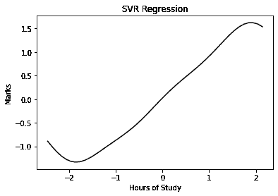

# 机器学习基础:支持向量回归

> 原文：<https://towardsdatascience.com/machine-learning-basics-support-vector-regression-660306ac5226?source=collection_archive---------6----------------------->

## 学会在机器学习中建立支持向量回归(SVR)模型，并分析结果。

在前面的故事中，我解释了用 Python 构建线性和多项式回归模型的机器学习程序。在本文中，我们将介绍基于非线性数据构建支持向量回归模型的程序。

## SVR 概述

支持向量机(SVM)是一种非常流行的机器学习算法，用于回归和分类。支持向量回归类似于线性回归，在 SVR 中直线的方程是`y= wx+b`，这条直线被称为 ***超平面*** 。超平面任意一侧最接近超平面的数据点称为 ***支持向量*** ，用于绘制边界线。

与试图最小化实际值和预测值之间的误差的其他回归模型不同，SVR 试图在阈值(超平面和边界线之间的距离)内拟合最佳直线。因此，我们可以说 SVR 模型满足条件`-a < y-wx+b < a`。它使用具有此边界的点来预测值。


[来源](https://gdcoder.com/support-vector-machine-vs-logistic-regression/)

对于非线性回归，核函数将数据转换到更高维度，并执行线性分离。这里我们将使用 ***rbf*** 内核。

在这个例子中，我们将完成 ***支持向量回归(SVM)*** 的实现，其中我们将根据学生投入学习的小时数来预测他或她的分数。

## 问题分析

在这个数据中，我们有一个自变量*学习时间*和一个因变量*分数*。在这个问题中，我们必须使用这些数据训练一个 SVR 模型，以了解学习时间和学生分数之间的相关性，并能够根据学生投入学习的时间预测他们的分数。

## 步骤 1:导入库

在第一步中，我们将导入构建 ML 模型所需的库。导入 ***NumPy*** 库和 ***matplotlib*** 。另外，我们导入了 ***熊猫*** 库用于数据分析。

```
import numpy as np
import matplotlib.pyplot as plt
import pandas as pd
```

## 步骤 2:导入数据集

在这一步，我们将使用 pandas 来存储从我的 github 存储库中获得的数据，并使用函数“ **pd.read_csv** ”将其存储为 Pandas DataFrame。

我们遍历我们的数据集，将自变量(x)分配给列“*”的学习时间，将因变量(y)分配给最后一列，即要预测的“*”标记。**

```
**dataset = pd.read_csv('[https://raw.githubusercontent.com/mk-gurucharan/Regression/master/SampleData.csv'](https://raw.githubusercontent.com/mk-gurucharan/Regression/master/SampleData.csv'))X = dataset.iloc[:, 0].values
y = dataset.iloc[:, 1].values
y = np.array(y).reshape(-1,1)dataset.head(5)>>Hours of Study   Marks
32.502345        31.707006
53.426804        68.777596
61.530358        62.562382
47.475640        71.546632
59.813208        87.230925**
```

**我们使用相应的。iloc 函数对数据帧进行切片，以将这些指标分配给 X 和 y。在这种情况下，*小时的学习时间*被视为独立变量，并被分配给 X。要预测的因变量是最后一列，即*标记的*，它被分配给 y。我们将使用`reshape(-1,1)`将变量 ***y*** 整形为列向量。**

## **步骤 3:特征缩放**

**大多数可用的数据通常具有不同的范围和大小，这使得建立模型很困难。因此，数据的范围需要被标准化为更小的范围，这使得模型在训练时更加准确。在该数据集中，数据被归一化到接近零的小值之间。例如， *87.23092513* 的分数归一化为 *1.00475931* ，而 *53.45439421* 的分数归一化为 *-1.22856288* 。**

```
**from sklearn.preprocessing import StandardScaler
sc_X = StandardScaler()
sc_y = StandardScaler()
X = sc_X.fit_transform(X.reshape(-1,1))
y = sc_y.fit_transform(y.reshape(-1,1))**
```

**在大多数常见的回归和分类模型中，特征缩放主要是在内部执行的。支持向量机不是一个常用的类，因此数据被标准化到一个有限的范围。**

## **步骤 4:在训练集上训练支持向量回归模型**

**在构建任何 ML 模型时，我们总是需要将数据分成训练集和测试集。将使用*训练集*的值训练 SVR 模型，并在*测试集*上测试预测。在 100 行中，80 行用于训练，并且在由条件`test_size=0.2`给出的剩余 20 行上测试模型**

```
**from sklearn.model_selection import train_test_split
X_train, X_test, y_train, y_test = train_test_split(X, y, test_size = 0.2)**
```

## **步骤 5:在训练集上训练支持向量回归模型**

**在此，函数 ***SVM*** 被导入并被赋给变量`regressor`。使用内核***【RBF】***(径向基函数)。径向基函数核用于将非线性引入到支持向量回归模型中。这样做是因为我们的数据是非线性的。`regressor.fit`用于通过相应地调整数据来拟合变量 *X_train* 和 *y_train* 。**

```
**from sklearn.svm import SVR
regressor = SVR(kernel = 'rbf')
regressor.fit(X_train.reshape(-1,1), y_train.reshape(-1,1))**
```

## **步骤 6:预测测试集结果**

**在这一步中，我们将使用构建的 SVR 模型来预测测试集的分数。`regressor.predict`函数用于预测 X_test 的值。我们将预测值赋给 y_pred。我们现在有两个数据，y_test(真实值)和 y_pred(预测值)。**

```
**y_pred = regressor.predict(X_test)
y_pred = sc_y.inverse_transform(y_pred)**
```

## **步骤 7:将测试集与预测值进行比较**

**在这一步中，我们将在 Pandas DataFrame 中将每个 X_test 的 *y_test* 的值显示为 ***真实值*** ，将 *y_pred* 值显示为 ***预测值*** 。**

```
**df = pd.DataFrame({'Real Values':sc_y.inverse_transform(y_test.reshape(-1)), 'Predicted Values':y_pred})
df>>
Real Values   Predicted Values
31.707006     53.824386
76.617341     61.430210
65.101712     63.921849
85.498068     80.773056
81.536991     72.686906
79.102830     60.357810
95.244153     89.523157
52.725494     54.616087
95.455053     82.003370
80.207523     81.575287
79.052406     67.225121
83.432071     73.541885
85.668203     78.033983
71.300880     76.536061
52.682983     63.993284
45.570589     53.912184
63.358790     76.077840
57.812513     62.178748
82.892504     64.172003
83.878565     93.823265**
```

**我们可以看到，预测值与测试集的真实值之间存在显著偏差，因此我们可以得出结论，该模型并不完全适合以下数据。**

## **步骤 8:可视化 SVR 结果**

**在最后一步中，我们将可视化使用给定数据构建的 SVR 模型，并在图上绘制“ ***y*** ”和“ ***y_pred*** ”的值，以可视化结果**

```
**X_grid = np.arange(min(X), max(X), 0.1)
X_grid = X_grid.reshape((len(X_grid), 1))
plt.scatter(sc_X.inverse_transform(X_test), sc_y.inverse_transform(y_test.reshape(-1)), color = 'red')
plt.scatter(sc_X.inverse_transform(X_test), y_pred, color = 'green')plt.title('SVR Regression')
plt.xlabel('Position level')
plt.ylabel('Salary')
plt.show()**
```

******

学习时间与分数(SVR)** 

**在该图中，实际值用“ ***红色*** 绘制，预测值用“ ***绿色*** 绘制。SVR 模型的绘图也以 ***黑色*** 颜色显示。**

**我附上了我的 github 资源库的链接，你可以在那里找到 Google Colab 笔记本和数据文件供你参考。**

**[](https://github.com/mk-gurucharan/Regression) [## MK-guru charan/回归

### GitHub 是超过 5000 万开发人员的家园，他们一起工作来托管和审查代码、管理项目和构建…

github.com](https://github.com/mk-gurucharan/Regression) 

希望我已经清楚地解释了用非线性数据集构建支持向量回归模型的程序。

您还可以在下面找到该程序对其他回归模型的解释:

*   [简单线性回归](/machine-learning-basics-simple-linear-regression-bc83c01baa07)
*   [多元线性回归](/machine-learning-basics-multiple-linear-regression-9c70f796e5e3)
*   [多项式回归](/machine-learning-basics-polynomial-regression-3f9dd30223d1)
*   支持向量回归
*   [决策树回归](/machine-learning-basics-decision-tree-regression-1d73ea003fda)
*   [随机森林回归](/machine-learning-basics-random-forest-regression-be3e1e3bb91a)

在接下来的文章中，我们将会遇到更复杂的回归、分类和聚类模型。到那时，快乐的机器学习！**