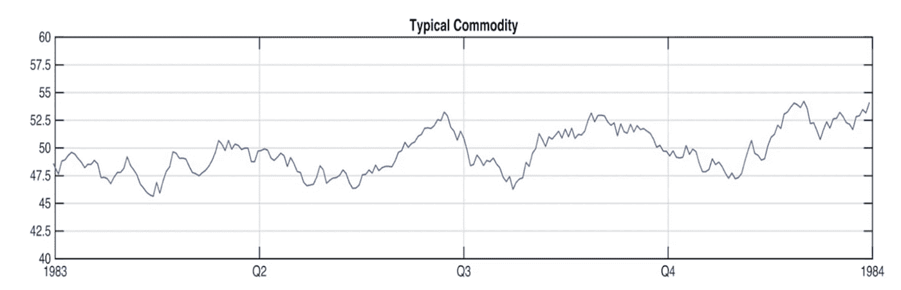
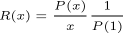
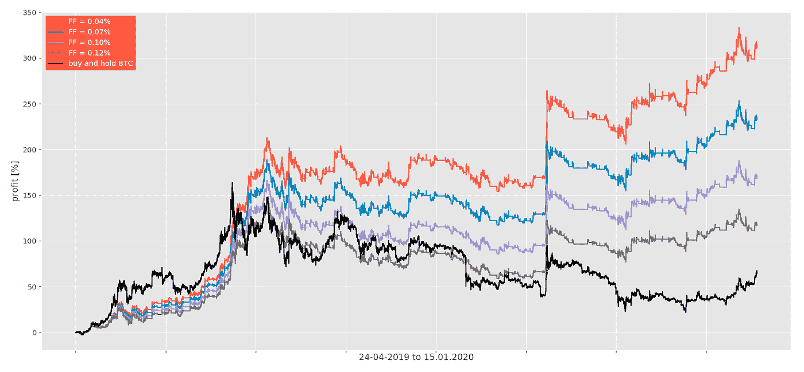
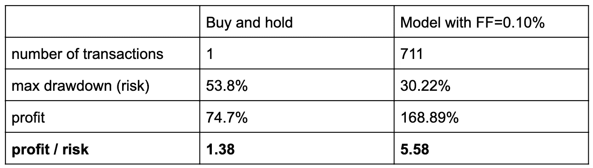
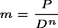
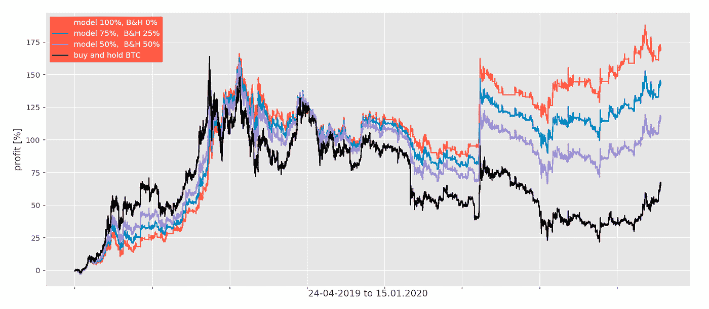
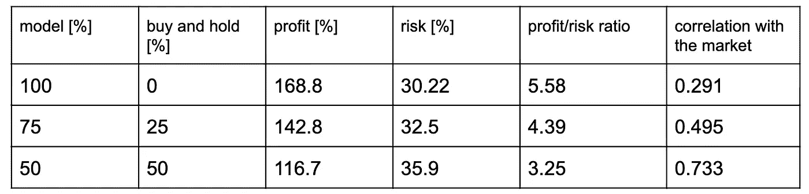

# 机器学习在看不见的数据上击败了 BTC/USDT，即使有交易费和滑点。

> 原文：<https://towardsdatascience.com/machine-learning-beats-btc-usdt-on-unseen-data-even-with-transaction-fees-and-slippage-caa5e7a40caf?source=collection_archive---------5----------------------->

## 物理学研究如何变成人工智能模型，如何变成密码交易。

在一盘棋中，为了赢，必须有人输。这同样适用于高度不稳定的数字市场——比特币。投机者同时买入和卖出，肯定有人错了。[来源](https://pixabay.com/pl/photos/szachy-pionek-taktyki-kr%C3%B3lowa-gry-3325010/)

# **前言**

有很多关于将机器学习应用于加密交易的实验文章，但很难找到一个具有现实方法论的文章。理想情况下，结果应该来自实际交易所的交易历史，或者来自带有看不见的数据和交易费用的模拟。这就是我写这篇文章的原因——我想告诉你我是如何进行金融市场研究的，展示一些研究结果，并最终向你展示实际结果。所有这些都是基于现实的假设——包括交易费用、滑点和看不见的数据。

# 看到什么不起作用

我曾经从事各种物理实验——最著名的是欧洲核子研究中心的 ATLAS 项目(使用大型强子对撞机，世界上最大和最高能量的粒子对撞机，也是世界上最大的机器)。我来到那里时是一名物理系学生，后来成为一名数据科学家，研究事件拓扑分类问题。2018 年夏天，我开始对股票交易感兴趣。我知道我的数据科学直觉和编程技能可能是有用的，所以使用数学模型和一些自动化的想法很自然地出现了。我花了一个夏天寻找有用的文章，但很难找到有趣的东西。如果有人声称某样东西有效，我无法以任何方式复制它。

在过去的 1.5 年里，我阅读了大约 100 篇关于金融领域机器学习的文章。我见过有人使用 LSTMs，路径积分，各种强化学习，但我没有发现任何异常的性能。尽管如此，看看什么不起作用还是很有用的，这样你就不必浪费时间亲自尝试了。

# 市场行为

有效市场假说认为资产价格反映了所有可获得的信息。如果这个假设是真的，那么只有那些拥有公众无法获得的信息的内部人士才能战胜市场，并且仅仅通过交易赚钱。在一次采访中，数学家兼对冲基金亿万富翁詹姆斯·西蒙斯强烈反对这一假设。他指出，在公开可用的数据中存在一些模式，可以用来持续战胜市场。他指出这些模式来来去去。一旦人们开始滥用某些统计异常，异常就会消失。这是因为我们的交易影响市场——尤其是当交易量很大的时候。一个已经消失的异常现象的例子是 20 世纪 80 年代许多商品随季节变化的趋势。人们可以在价格高于均线时买入，在价格低于均线时卖出，这样每年都能赚钱。

*图 1:1984 年一种典型商品(糖)的价格，当时许多商品都有明显的季节性影响。原始的趋势跟踪系统可以让投资者在市场上获得优势。如今，价格模式要复杂得多。来源*

西蒙的观点很有道理——一群人的行为有一定的模式，投资者也不例外。因此，我们可以利用人们在某种程度上可以用正确的数学模型预测的优势(数学模型需要不断进化，就像那群人一样)。这是否意味着这种模式可以在没有风险和没有交易量限制的情况下赚钱？显然不是。主要由复兴科技(Renaissance Technologies)的基金员工管理的梅达莲基金(Medallion fund)因其在华尔街的最佳记录而闻名。它主要面向基金员工，而不是每个投资者，原因是他们必须引入约 100 亿 dollars⁴.的资本限制在这种规模下，很难不对市场产生太大影响，这会扰乱模型本身的数据，进而导致预测不正确。越来越多的领先基金引入了类似的资本限制，这为较小的基金获得必要的资本创造了机会。

另一方面，风险不可能降低到零，因为首先，没有人知道市场的确切状态(要知道市场的状态，我们需要知道所有参与者的状态，这是不可能的)，也没有人确切知道市场未来会如何反应(某些行动的蝴蝶效应是可能的)。然而，通过引入随机变量，这是概率论的创造，我们可以在一定程度上建立这样的市场模型。风险无法消除，但其降低是可以控制的。由于我们的系统中存在随机变量，短期情景可能会有很大变化。即使是最好的系统也可能在短期内亏损。例如，在这份年度财务报告中，report⁵ JP 摩根称，由于进行了不良交易，他们在一天内损失了大约 1 亿美元。重要的是长期的结果。

# 可用信息:技术与基本面

在深入研究可以将信息用于我们的优势(即降低投资风险)的模型之前，让我们先回顾一下可用的信息。证券交易所记录了他们调解的每一笔交易，对公众隐瞒了他们的价格和交易量数据数据集，只愿意以几十万美元的价格出售(通常按年收费)。然而，加密货币交易所要透明得多。足够熟练的程序员应该能够通过使用他们的 API“免费”访问每个主要加密货币交易所的每个硬币对(从众所周知的比特币和莱特币到最近的储备权令牌 RSR 等新的热门令牌)上的每个交易，不计算时间和精力。如果我们假设价格大致反映了市场的状态，我们不需要任何其他信息来建立一个有效的交易系统。然而，实践表明，这种系统也可以从地缘政治局势/立法行动/财务报告等分析中受益匪浅。(通常指基础研究)。例如，历史上，黄金在冲突爆发时会上涨。

# **首先模拟市场**

上世纪 80 年代，领先的量化对冲基金使用线性模型。转向隐马尔可夫模型，后来完全接受了机器学习 solutions⁶.没有对冲基金吹嘘他们的方法，但如果你持续观察他们足够长的时间，并关注细节，你就能到处发现小信息。这是对他们 website⁷:的一个研究科学家职位的描述

> 研究科学家:使用机器学习、应用数学和现代统计学技术来开发和完善金融市场模型，并基于这些模型开发交易算法。

乍一看，这似乎不重要，但请密切注意这一部分:“开发和改进模型[……]并基于这些模型开发交易算法”。他们明确区分了市场模型和交易算法。通过我的研究，我也意识到，目前，这可能是建立交易系统最有效的方式。首先，尝试建立一个市场模型。试着预测某些市场状态，某些变量，行为，然后，根据你的预测建立一个交易算法。如果你开发了一个黑匣子，它只是简单地获取原始价格数据，不经过中间步骤就做出交易决定，那么理解和修改起来就会困难得多。相信我——你必须修改你的第一个系统，因为没有人能一次就做对。此外，记住，要维护一个交易系统，你必须定期修改它，这是上一节的结论(根据霍华德摩根，复兴科技的原始团队成员之一，更新他们的系统 monthly⁸).

# **特色工程**

如果你遵循一条规则，即长期决策应该由长期模式驱动，短期决策应该主要由短期模式驱动——时间投资窗口越短，模式数据集就越大。如果我们真的在短期内(亚秒甚至毫秒)，那么模型往往会工作得更好(由于大量的可用数据点)，然而，这导致昂贵的计算机基础设施能够非常精确地进行计算和执行订单。由于我不是通过加入现有的公司，而是创建自己的公司来开始我的财务之旅，我个人专注于分分秒秒的时间窗口，这很简单，因为 4 人团队的技术限制。

如果我们从每分钟提取一个数据点(一个数据点可以是一列数字，例如买/卖量、给定分钟内按量加权的平均价格、最低价格、最高价格等。)那么我们每年剩下大约 50 万个数据点。相比之下，在我在欧洲核子研究中心从事分析工作期间，我们过去常常基于数亿个数据点来制作神经网络模型。那时，我们可以输入原始数据，但在分钟到分钟价格的情况下，它们必须得到适当的简化，以避免不必要的过度拟合——使模型无法在看不见的数据上正常工作。这些数据点的空间表示可能会极大地影响性能。例如，为了表示音频，查看频率要容易得多。如果金融世界中的某些东西可行，那么人们不太可能与他人分享所有细节——如果你想成功，你需要有创造力，并找到一种合适的空间表示(所谓的特征工程)。

# **避免偏差和过拟合**

虽然可以使用 k-fold 交叉验证等解决方案在整个数据集上可靠地测试模型的性能，但在许多现有文章中，这通常是前瞻偏差的来源。为了透明起见，我将比特币价格分为两个数据集:训练和测试(算法和我都看不见的数据)。2019 年 10 月 1 日之后的数据没有用于训练/拟合模型的参数，我将介绍该模型的结果。在欧洲粒子物理研究所，有一条规定，所有的物理分析都是首先根据前一年的数据集准备的，任何研究人员(除了极少数例外)都无法获得最新的数据。建立这条规则是为了防止各种偏见。例如，我们知道价格在测试数据集中下降，所以(可能只是下意识地)我们使模型更加厌恶风险。在我的工作中，我也遵循了这一规则，在大多数情况下，我没有查看该模型建立之前的最新数据(从 2019 年 10 月 1 日起)。该模型目前与我和我的客户的真实交易所交易相关联——根据定义，这种数据没有任何偏见，我将展示其中的一些数据来支持模拟。

避免过度拟合的一个方法是引入一个二值随机变量“x ”,如果“x=1 ”,则允许订单进入模拟，如果“x=0 ”,则阻止订单。在您的策略中没有这样的变量相当于它的平均值为 1。应该尝试将平均值设置为 0.1 或 0.5，看看性能会发生什么。这是过度策略和/或交易不足以达到统计显著性的真正杀手。下面我们来介绍一下性能比 R(x)如下:

等式 1:R(x)—x 函数中的性能比。除以 x 作为归一化。

其中 P(x)是 x 的函数，鲁棒系统的 R(x)常数应在 1 左右。

# **模拟现实交易费用**

任何现实市场模型的基本特征是交易费用。除了向交易所支付佣金，我们还必须考虑“延期费”，也称为滑点。我们永远不能使用最后看到的交易价格进行买卖。计算预测和执行订单的基础设施总有一个反应时间。最后但并非最不重要的一点是，存在“价差”——某一订单深度的买卖差价(在交易量巨大的情况下尤其重要)。总结一下，最终费用(FF)为:FF =交易费(TF)，延误费(DF)，点差费(SF)。

# **结果**

不同最终费用的**2019 年 4 月 24 日**至**2020 年 1 月 15 日**期间的模拟结果如下所示。

*图 2:不同最终费用的模型和“买入并持有”策略在比特币上的性能比较。每月 81 笔交易使得业绩对最终费用非常敏感。*

HitBTC 向(接受者/制造者)提供 0.07%的交易费(如果你是验证用户)，没有任何额外的交易量要求。同样，币安提供 0.075%(如果你持有 BNB，但其大多数用户持有)。我们的系统在几秒钟内执行一笔交易，平均延迟费用约为 0.015%(如果你的策略是反向策略，这可以低得多，甚至是负数)。对于小投资者来说，价差约为 0.01%。SF 随着资本的增加而增加，但交易费用随着交易量的增加而减少，因此 FF 在资本方面相对稳定，约为 0.095%。你可以看到，这是在一个有利可图的范围内。

表 1:B&H 对 BTC/USDT 的策略与 FFF=0.10%的模型的比较。

这种程度的风险降低只能通过加密市场上的活跃交易来实现。所有主要因素都高度相关(从 0.4 到 0.9)，所以像资产多样化和再平衡这样的标准风险降低方法在 well⁹.并不适用

# **如何纳入基本面投入并多样化**

如果你进行基本面研究，研究结果表明市场会上涨或下跌，那么就有办法增加或减少策略与市场的相关性。

假设我们的度量“m”是:

情商。2:将 m 度量为利润 P 和风险 D 的 n 次方之比。

对于 n=1，我们有一个平衡策略，风险和利润一样重要。如果我们设置 n <1 we will make our strategy riskier, thus indirectly increasing the correlation with the market. Similarly, n> 1 将减少相关性。另一种方法，一种更直接的强制关联/去关联的方法是在策略方面使我们的投资组合多样化。我们可以在市场资产中持有一定比例，或者从投资中撤出，而不是将我们的所有资本都投入到模型中。参见下图和下表进行比较。

*图 3:混合策略之间的比较。使用买入并持有(B & H)的策略在明显上升趋势期间(2019 年 4 月至 6 月)表现优于模型。*

表 2: *混合策略之间的绩效比较。在策略投资组合中加入 B & H 会增加风险，降低回报，但如果我们预期上涨趋势，这可能是有用的。风险以最大提款来衡量。*

# **接下来是什么？**

由于我每天收集越来越多的数据，我将在 2020 年 3 月进一步提高决策的分辨率，在 1 分钟内达到 4 个预测/决策。这将使模型对更快速的运动更敏感，到目前为止，这种运动在 2020 年非常频繁。

***注来自《走向数据科学》的编辑:*** *虽然我们允许独立作者根据我们的* [*规则和指导方针*](/questions-96667b06af5) *发表文章，但我们不认可每个作者的贡献。你不应该在没有寻求专业建议的情况下依赖一个作者的作品。详见我们的* [*读者术语*](/readers-terms-b5d780a700a4) *。*

来源:

*[2] [*面试可在线获得*](https://www.youtube.com/watch?v=QNznD9hMEh0)*

*[3] [*面试可在线获得*](https://www.youtube.com/watch?v=U5kIdtMJGc8)*

**财务评论**

**[5] [摩根大通年度报告](https://www.jpmorganchase.com/corporate/investor-relations/document/annualreport-2018.pdf)**

**[6]格雷戈里·祖克曼，《解决市场的人》(2019)**

**[7] [rentec 网站](https://www.rentec.com/Careers.action?researchScientist=true)**

**在线采访**

**[9] [币安年报](https://research.binance.com/analysis/annual-crypto-correlations-2019)**