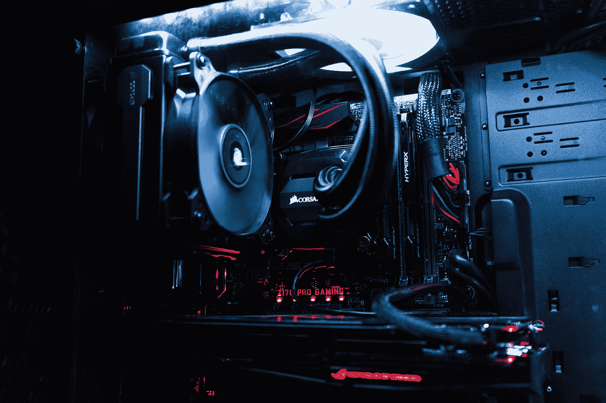
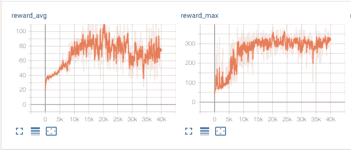
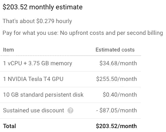
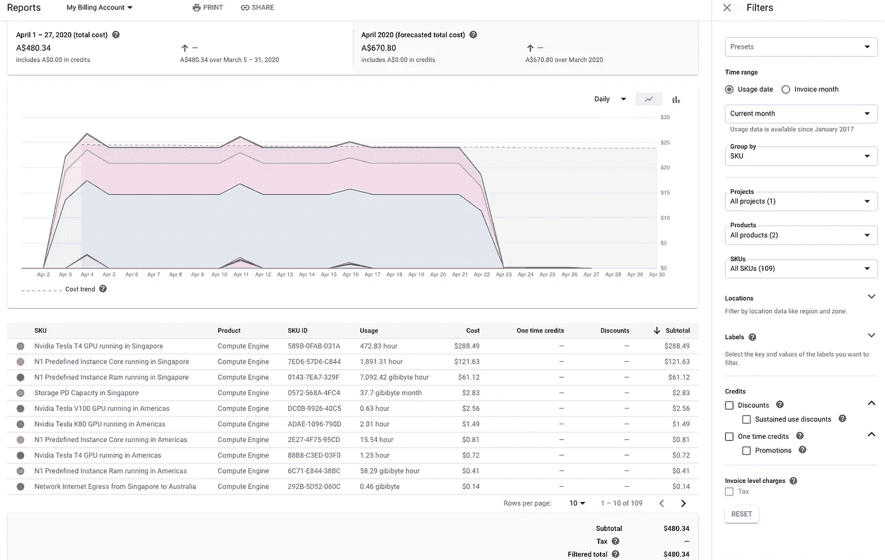
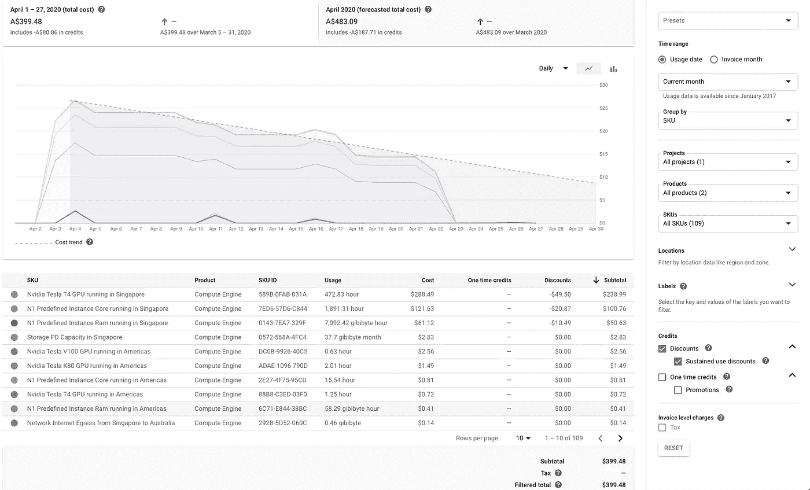
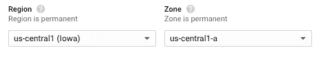
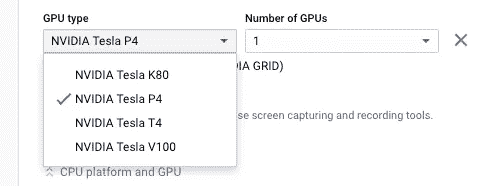

# GCP 上的机器学习—选择 GPU 来训练您的模型

> 原文：<https://towardsdatascience.com/machine-learning-best-gpu-option-on-google-cloud-platform-performance-price-discounts-81e0aa99ad46?source=collection_archive---------18----------------------->

## GCP GPU 概览——价格、性能、效率、折扣

G oogle 云平台提供了广泛的 GPU 选项可供选择。GPU 可以提高你的 ML 处理能力，尤其是在矩阵计算方面。然而，我们机器上的 CPU 并没有为此进行优化。他们努力处理图像或视频，并且经常会延迟模型训练过程。



照片由 [Artiom Vallat](https://unsplash.com/@virussinside?utm_source=medium&utm_medium=referral) 在 [Unsplash](https://unsplash.com?utm_source=medium&utm_medium=referral) 上拍摄

在 Tensorflow/Keras 中，NCHW(通道优先)输入的卷积网络需要 GPU 运行。

我的大部分人工智能实验都围绕着人工智能游戏，使用简洁的深度 Q 强化学习或类似的技术。这涉及到对游戏框架的激烈的矩阵操作，这是 CPU 难以应付的。

在切换到 GCP GPU 后，在 CPU 上花费数周时间训练的游戏模型在 GPU 上几天内就完成了。因为它们运行在云上，所以只需使用外部 IP 暴露您的 Tensorboard，无需登录即可轻松监控您的模型。

以下是目前可用的 GPU 选项(*2020 年 8 月 10 日*)以及它们的价格:—

```
**NVIDIA® Tesla® T4:** $255.50/month 
**NVIDIA® Tesla® K80:** $328.50/month
**NVIDIA® Tesla® P4:** $438.00/month
**NVIDIA® Tesla® P100:** $1,065.80/month
**NVIDIA® Tesla® V100:** $1,810.40/month
```

> 更多信息请点击这里:[https://cloud.google.com/compute/docs/gpus](https://cloud.google.com/compute/docs/gpus)

本评估仅涵盖特斯拉 T4、K80 和 P4。P100 和 V100 已经被排除在外，仅仅是因为它们对小项目和业余爱好者来说过于昂贵。

***注意*** :并非所有 GPU 在所有 GCP 地区都可用。您可能希望根据您所使用的 GPU 来更改区域。

## NVIDIA Tesla T4—圣杯|首选

特斯拉 T4 是圣杯——它既便宜又高效。它已经成为我为任何 ML 模型设置 GCP 环境的首选。

这是使用 Tensorflow 2.2.0-rc0(在**特斯拉 T4** 上)运行 DDQN 的 Tensorboard 输出:最高得分:406

```
Model: "sequential"_________________________________________________________________Layer (type)                 Output Shape              Param #   =================================================================conv2d (Conv2D)              (None, 32, 20, 20)        8224      _________________________________________________________________conv2d_1 (Conv2D)            (None, 64, 9, 9)          32832     _________________________________________________________________conv2d_2 (Conv2D)            (None, 64, 7, 7)          36928     _________________________________________________________________flatten (Flatten)            (None, 3136)              0         _________________________________________________________________dense (Dense)                (None, 512)               1606144   _________________________________________________________________dense_1 (Dense)              (None, 4)                 2052      =================================================================
```



作者图片

```
Link to Tensorboard: [https://tensorboard.dev/experiment/1yrW70A0QHertoJDVZk1ig/#scalars&tagFilter=rew](https://tensorboard.dev/experiment/1yrW70A0QHertoJDVZk1ig/#scalars&tagFilter=rew)
```

你可以观察到训练过程在短短 2 天内就在突围游戏中取得了接近 300 分的成绩。

特斯拉 T4 的另一个优点是，你可以让它们运行更长时间，以获得持续的折扣，因为它们很便宜(稍后讨论)。

## 比较 T4 和 P4 的 K80

与 P4 的 K80 相比，特斯拉 T4 是一款相对较新的车型。

> 上市日期:
> **特斯拉 T4—**2018 年 9 月
> **特斯拉 P4**—2016 年 9 月
> **特斯拉 K80s**—2014 年 11 月

在 Tensorflow 分布式训练中，这些在多个 GPU 上的表现如何，此处尚未评估。

但是就性能而言，Atari Breakout 模型的 DDQN 在所有 3 个 GPU 上花费了类似的时间来完成，性能没有重大差异。

```
Github Link to my project: [https://github.com/komal-SkyNET/ai-neural-networks/tree/master/ai-atari](https://github.com/komal-SkyNET/ai-neural-networks/tree/master/ai-atari)
```

## 持续折扣——一定要小心这些！

**持续折扣**提供大幅折扣，让您的实例运行更长时间。这个是按月计算的。



*作者图片:*使用特斯拉 T4 GPU 计算引擎实例的成本估算(来自 GCP 控制台)

如图所示，请注意，仅使用特斯拉 T4 运行虚拟机，您就可以获得近 80 美元的持续折扣。

```
*More information here:* [https://cloud.google.com/compute/docs/sustained-use-discounts](https://cloud.google.com/compute/docs/sustained-use-discounts?_ga=2.15197878.-1086316627.1594861704)
```

# 通过*持续折扣*，我节省了将近 100 澳元

下面是一个月来运行 GPU 工作负载有/没有持续折扣的比较。注意图表。

## 不打折→



作者图片:Komal Venkatesh Ganesan

## 持续折扣→



作者图片:Komal Venkatesh Ganesan

## 区域与 GPU 选项

请注意，GPU 选项基于区域。如果您发现下拉列表中缺少某个特定的 GPU 选项，您可能需要尝试不同的地区/区域。



**区域 VS GPU 选项(** *图片作者)*



**GPU 选项 us-central1-a(缺少 P100) (** *图片由作者提供)*

## 结论

*   特斯拉 T4 既便宜又高效，很容易成为第一选择，其次是 K80 和 P4。但是，它们在分布式培训(使用多个 GPU)中的性能可能会有所不同，不在本评估范围内。
*   持续折扣:只要多运行一会儿您的工作负载，您就可以获得巨大的折扣。调配虚拟机时，通常会显示预测估计值。