# 2021 年必读的机器学习书籍

> 原文：<https://towardsdatascience.com/machine-learning-books-you-must-read-in-2020-d6e0620b34d7?source=collection_archive---------1----------------------->

## 看看吧，你为什么要读它们？

照片由[像素](https://www.pexels.com/photo/row-of-books-in-shelf-256541/?utm_content=attributionCopyText&utm_medium=referral&utm_source=pexels)的[皮克斯拜](https://www.pexels.com/@pixabay?utm_content=attributionCopyText&utm_medium=referral&utm_source=pexels)拍摄

> "机器学习:计算机能够从经验中学习，而不需要专门编程."
> **-S**[**upplychain today**](https://www.supplychaintoday.com/)

[**人工智能**](https://blog.digitalogy.co/artificial-intelligence-technologies/) **和机器学习**自这十年以来一直在获得大量牵引力，每个人都想成为这一变化的一部分。企业对该技术的好处很好奇，而专业人士则对机器学习的能力着迷，并渴望提升自己的技能。

无论是哪种情况，总是需要一个起点，还有什么比阅读那些教你技术细节的伟大书籍更好的方法呢？不管你的专业技能如何，你总能找到适合各种人的书籍，无论是技术爱好者还是新手。

# 机器学习书籍

在本文中，我们将简要介绍一些可以帮助您理解机器学习概念的最佳书籍，并指导您成为这一迷人领域的专家。此外，假设你熟悉[编程语言的基础](/top-programming-languages-for-ai-engineers-in-2020-33a9f16a80b0)，这些书是灵感的巨大来源，充满了想法和创新。请继续阅读，了解更多信息—

## **1。绝对初学者的机器学习:简明英语介绍**

**作者:**奥利弗·西奥博尔德

**出版社** —散点图出版社

**难度等级:**初学者

**在这里获取图书**——[亚马逊](https://www.amazon.in/dp/B06VXKBLNG?tag=hackr0df-21)

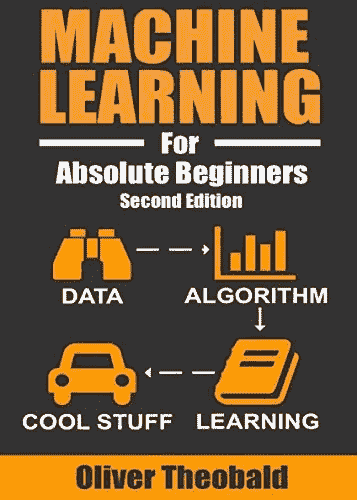

《绝对初学者的机器学习》一书封面

正如标题所解释的，如果你是机器学习的绝对初学者，这本书应该是你的切入点。要求**很少到没有编码** **或者数学背景**，书中所有的概念都已经解释的很清楚了。

**示例之后是视觉效果**以更友好的方式展示主题，帮助理解 ML 的关键要素。

奥利弗·西奥博尔德在他的书中简化了几个与 ML 相关的复杂主题，如它的基础知识，以及其他技术，如数据清理，回归分析，聚类，偏差，人工神经网络等。这本书还提供了进一步学习的额外资源。

> “作为机器的‘Hello World’的分析”
> ― **奥利弗·西奥博尔德**

## 2.**深度学习**

**作者:**伊恩·古德菲勒、约舒阿·本吉奥和亚伦·库维尔

**出版商—** 麻省理工学院出版社

**难度等级:**初学者

**在此获取图书—** [**亚马逊**](https://www.amazon.com/Deep-Learning-Adaptive-Computation-Machine/dp/0262035618/ref=as_li_ss_tl?ie=UTF8&qid=1524579439&sr=8-5&keywords=machine+learning&linkCode=sl1&tag=solutionsre04-20&linkId=527a04aa3f63d31dc51e053be9182d95)

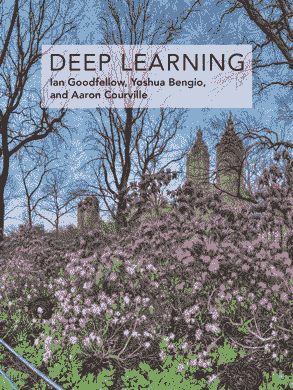

《深度学习》一书的封面

被认为是一本非常适合初学者的书，它向你介绍了深度学习的广泛主题，同时也涵盖了机器学习的相关方面。

DL 的基本概念在本书中从头开始进行了全面的解释，以便在这个领域中有一个更强的立足点。这本书解释了线性代数的相关概念，概率和信息论，数值计算，行业标准技术，如优化算法，卷积网络，计算机视觉，以及研究课题，如蒙特卡罗方法，配分函数。为了更深入的理解，捆绑了足够的补充材料。

> *《深度学习》由该领域的三位专家撰写，是唯一一本关于 subject"⁠的综合性书籍——埃隆·马斯克，特斯拉和 SpaceX 的联合创始人兼首席执行官*

## 3.使用 Scikit-Learn、Keras 和 TensorFlow 进行机器学习:构建智能系统的概念、工具和技术(第一版)

**作者:**奥雷连诺

**发行方** —奥莱利传媒

**难度等级:**初学者

**在这里获取图书**——[亚马逊](https://www.amazon.in/dp/1491962291?tag=hackr0df-21)

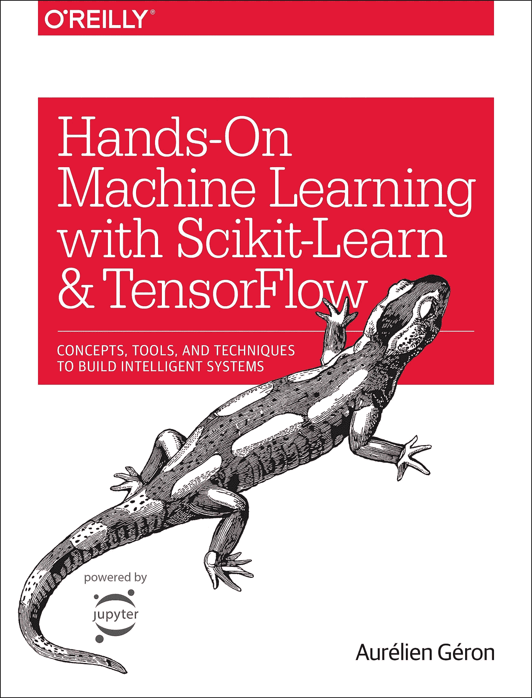

《使用 Scikit-Learn、Keras 和 TensorFlow 进行机器学习》一书的封面

对于任何计划开始学习机器的人或该领域的爱好者来说，这是最畅销的书籍之一。它要求预先了解 Python 编程语言，解释了一些最常用的 ML 库 Scikit-Learn、Keras 和 TensorFlow 2，用于构建智能系统。

直观解释的概念和易于实现的示例使得实际实现和理解更加顺畅。主题包括支持向量机、随机森林、神经网络、深度强化学习、热切执行、时序处理等等。这本书包含了几个库的更新代码示例，以及相关的 API。

**补充:**还可以在 GitHub 上找到带幻灯片的[讲座](http://www.deeplearningbook.org/lecture_slides.html)和[练习](http://www.deeplearningbook.org/exercises.html) [。](https://github.com/goodfeli/dlbook_exercises)

> “在机器学习中，这被称为过度拟合:这意味着模型在训练数据上表现良好，但不能很好地概括。”
> ― **奥雷连·盖伦**

## 这是关于机器学习的最好的书吗？

## **查看该书的第二版—**

## 4.**面向虚拟人的机器学习(Python 和 R 语言)**

**作者:**约翰·保罗·穆勒和卢卡·马萨隆

**出版者** —为假人

**难度等级:**初学者

**在这里获取图书**——[亚马逊](https://www.amazon.in/dp/1119245516?tag=hackr0df-21)

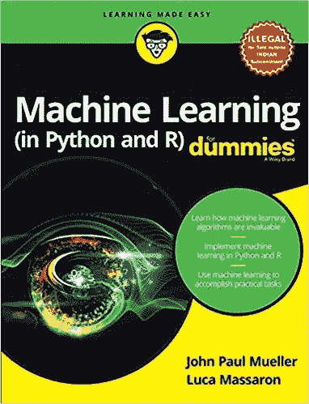

《面向傻瓜的机器学习(Python 和 R 语言)》一书的封面

著名的**“假人”**系列的所有书籍都对新手非常友好。这本书，就像这个系列的其他书一样，以一种读者容易理解的方式阐述了它的概念。

这本书包括 ML 中的**介绍性概念和理论**以及所涉及的**工具和编程语言**。书中涵盖的主题从在 Windows、Linux 和 macOS 上安装 R 开始，然后是矩阵创建、使用矢量和数据帧、使用 RStudio 或 Anaconda 用 R 或 Python 编码。对于数据挖掘和分析的基本概念，这是一本方便的指南。

> “作为一种学习，它类似于人类用来判断某些对象或事件来自同一类别的方法，例如通过观察对象之间的相似程度。”约翰·保罗·穆勒

## 5.**机器学习在行动**

**作者:**彼得·哈灵顿

**出版社** —曼宁出版公司

**难度等级:**初学者

**在这里获取图书**——[亚马逊](https://www.amazon.in/dp/9350044137?tag=hackr0df-21&th=1&psc=1)

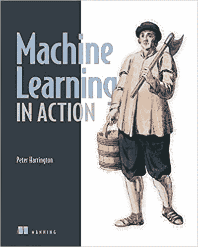

《机器学习在行动》一书的封面

一本有价值的书，旨在给开发者机器学习所需技术的实践经验。对于熟悉与 ML 相关的 Python 代码片段来说，这是一本同样重要的书，尽管需要事先有 Python 的[经验。](/python-libraries-for-natural-language-processing-be0e5a35dd64)

该书包含用于统计数据处理、数据分析和数据可视化的各种算法的代码，以及诸如分类、预测、建议、简化等任务。用最少的理论，这本书直接切入这些算法的实际实现。

## 6.模式识别和机器学习

**作者:**克里斯托弗·m·毕晓普

**出版商** —施普林格

**难度等级:**中级

**在这里获取图书**——[亚马逊](https://www.amazon.in/dp/0387310738?tag=hackr0df-21)

**Github 回购:**—[https://github.com/ctgk/PRML](https://github.com/ctgk/PRML)

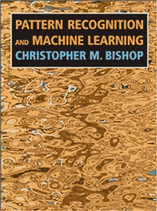

《模式识别与机器学习》一书的封面

针对有模式识别和机器学习的基本想法的个人，这本书假定读者在多元微积分和代数方面有某种程度的先验知识。

本书中的概念旨在解释 ML 领域中底层算法和技术的最新发展。涵盖广泛使用的主题，如贝叶斯方法，回归，分类，神经网络，图形模型，采样方法，等等，这本书非常适合理解 ML，统计，计算机视觉和挖掘。这本书配有大量练习和附加材料。

## 7.统计学习导论(R 语言应用)

作者:加雷斯·詹姆斯、丹妮拉·威滕、特雷弗·哈斯蒂和罗伯特·蒂布拉尼

**出版商—** 施普林格

**难度等级:**中级

**在这里获取图书**——[亚马逊](https://www.amazon.com/Introduction-Statistical-Learning-Applications-Statistics/dp/1461471370/ref=as_li_ss_tl?ie=UTF8&qid=1524588541&sr=8-19&keywords=machine+learning&linkCode=sl1&tag=solutionsre04-20&linkId=1175764b6f5765dade3fe89c63f1940e)

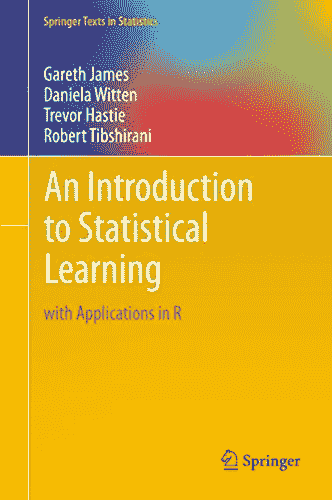

《统计学习导论(R 语言应用)》封面

这本书，虽然需要一些线性回归的先验知识，却是理解统计学习概念的一个极好的工具。通过提供关于如何利用大型复杂数据集的平衡见解，它旨在教育广大统计人员和非统计人员，使他们能够理解手中的数据。

它涵盖了统计学习的几个重要概念，如线性回归，分类，基于树的模型，支持向量机，重采样方法，等等。各种例子和教程使学习过程更加愉快，它包括几个 R 实验室，演示这些统计方法的实施。

## 8.**应用预测建模**

**作者:**马克斯·库恩和杰尔·约翰逊

**出版商—** 施普林格

**难度等级:**中级

**在这里获取图书**——[亚马逊](https://www.amazon.in/Applied-Predictive-Modeling-Max-Kuhn/dp/1461468485)

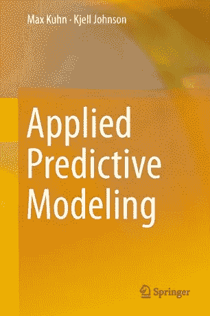

《应用预测模型》的封面

这本书被认为是许多预测建模概念的特别参考书，要求对统计学、R 编程语言和机器学习概念有很好的理解。作者着重解释数据收集、操作和转换过程，因为这在 ML 书籍中经常被忽略。

这本书的应用性质使它成为分析行业面临的实际问题的绝佳选择。读者可以深入数据预处理，分裂，模型调整，然后回归，分类，处理类不平衡，选择预测。

## 9.**黑客的机器学习:案例研究和算法让你入门**

**作者:**德鲁·康威&约翰·迈尔斯

**出版商** —奥赖利媒体

**难度等级:**中级

**在这里获取图书**——[亚马逊](https://www.amazon.in/s?k=Drew+Conway+machine+learning+for+hackers&tag=hackr0df-21)

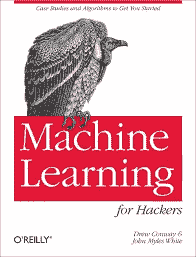

《黑客的机器学习》一书的封面

正如标题所说，这本书不是给黑客看的，而是给那些对动手案例研究感兴趣的人看的。这本书需要很强的编程背景，旨在用驱动机器学习的算法来训练你。不同的章节集中于 ML 中的每个问题，例如分类、优化、预测和推荐。

这本书还训练你使用 R，以及如何分析数据集，并让你开始编写简单的 ML 算法。它不同于其他书籍的一个重要方面是它不太依赖数学来教授数学。

## 10.**集体智慧编程:构建智能 Web 2.0 应用**

**作者:**托比·塞格兰

**出版商** —奥莱利传媒

**难度等级:**中级

**在这里获取图书**——[亚马逊](https://www.amazon.in/dp/0596529325?tag=hackr0df-21)

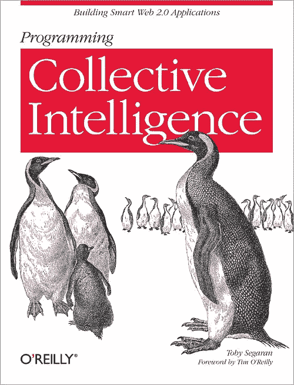

《集体智慧编程》一书的封面

被许多人认为是机器学习的最佳指南，这本书更喜欢教你 ML 的实现，假设你知道 Python。它包括创建算法和程序的步骤，用于访问网站外的数据集，自己收集数据，以及分析和利用数据。

带你进入 ML 和统计，这本书包括爬虫，索引器，优化，PageRank 算法，过滤技术，决策树的例子。本书旨在引导你按照自己的节奏完成创建算法的整个过程，这本书做得很好。

## 11.统计学习的要素:数据挖掘、推理和预测

**作者:**特雷弗·哈斯蒂，罗伯特·蒂布拉尼，杰罗姆·弗里德曼

**难度:**专家

**出版商** —施普林格

**在这里获取图书**——[亚马逊](https://www.amazon.in/Elements-Statistical-Learning-Prediction-Statistics/dp/0387848576?tag=hackr0df-21)

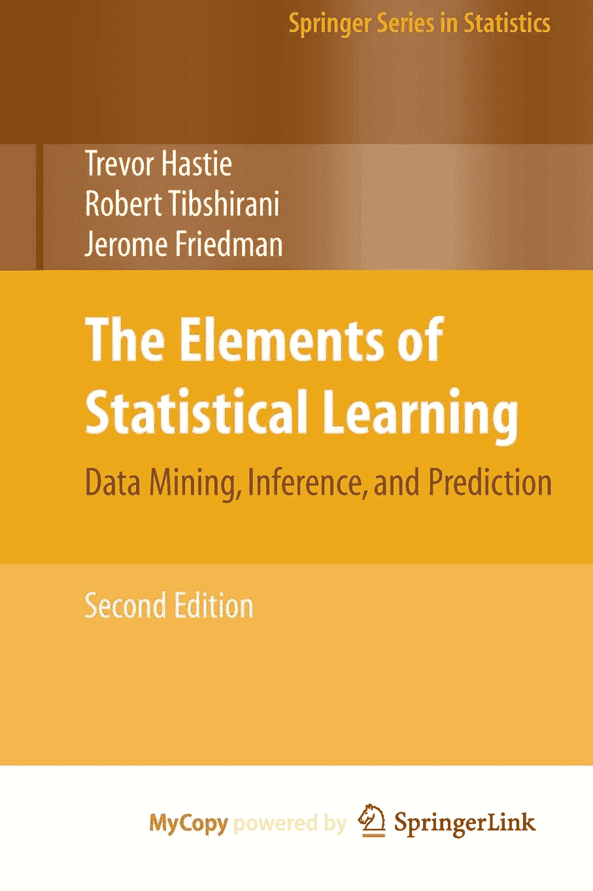

《统计学习的要素》的封面

这本书侧重于概念，而不是概念背后的数学。它收集了大量关于在几个部门实施统计学习的想法。充满了相关的例子和可视化，它应该是任何统计学家或数据挖掘爱好者的图书馆中必不可少的一块。

这本书涵盖监督和非监督学习，包括支持向量机，分类树，神经网络，助推，集成方法，图形模型，谱聚类，最小角度回归，路径算法等主题。

## 12.Python 机器学习

作者:塞巴斯蒂安·拉什卡和瓦伊德·米尔贾利利

**出版者** — Packt

**难度:**专家

**在这里获取图书**——[亚马逊](https://www.amazon.com/Python-Machine-Learning-scikit-learn-TensorFlow/dp/1789955750/ref=as_li_ss_tl?ie=UTF8&linkCode=sl1&tag=solutionsre04-20&linkId=2b9ea1af4c90d626a01f0e13fc5435d5&language=en_US)

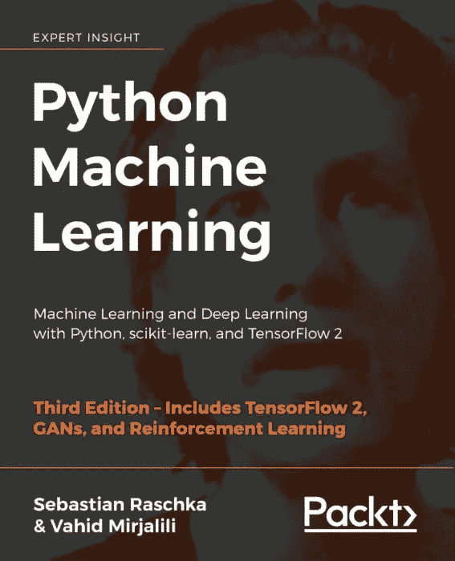

《Python 机器学习》一书的封面

假设你已经很好地理解了 [Python 和机器学习](/best-python-libraries-for-machine-learning-and-deep-learning-b0bd40c7e8c?source=your_stories_page---------------------------)的许多核心概念，这本书直接切入概念的实际实现。书中的概念包括 NumPy、Scikit-learn、TensorFlow2 和 SciPy 的最新解释。这本书通过从行业中面临的现实世界的挑战教你，为你承担现实世界的挑战做准备。它包括各种主题，如降维，集成学习，回归，聚类分析，神经网络，等等。

“最终，分类器的性能、计算能力以及预测能力在很大程度上取决于可用于学习的基础数据。训练机器学习算法所涉及的五个主要步骤可以总结如下:选择特征。选择绩效指标。选择分类器和优化算法。评估模型的性能。调整算法。”
― **塞巴斯蒂安·拉什卡，** [**Python 机器学习**](https://www.goodreads.com/work/quotes/45338752)

# 结论

在这个快速发展的时代，跟上这些进步并不断提升自己是当前的需要。有数百本关于机器学习和相关技术的书籍、指南和其他在线资源。机器学习一开始可能会令人吃惊，这就是为什么我们在本文中概述了十本最受欢迎的书籍，希望其中一些能引起你的兴趣。请随意推荐您认为可能对该列表有帮助的扩展。

> 注意:为了消除不同类型的问题，我想提醒你一个事实，这篇文章仅代表我想分享的个人观点，你有权不同意它。

# 更多有趣的阅读—

我希望这篇文章对你有用！以下是一些有趣的读物，希望你也喜欢

 [## 面向所有人的顶级谷歌人工智能工具

### 使用谷歌人工智能中心将想法变为现实

towardsdatascience.com](/top-google-ai-tools-for-everyone-60346ab7e08)  [## 数据科学家的最佳数据科学工具

### 数据科学工具，使任务可以实现

towardsdatascience.com](/best-data-science-tools-for-data-scientists-75be64144a88)  [## 2020 年的数据科学趋势

### 新十年的关键数据科学趋势

towardsdatascience.com](/data-science-trends-for-2020-9b2ee27af499)  [## 数据科学如何助推网飞

### 当有效使用时，数据可以神奇的方式改变您的业务，并将它带到新的高度。

towardsdatascience.com](/how-data-science-is-boosting-netflix-785a1cba7e45) 

> **关于作者**
> 
> **克莱尔丁**。是[**Digitalogy**](https://www.digitalogy.co/)**—**的内容制作者和营销人员，这是一个技术采购和定制匹配市场，根据全球各地的特定需求，将人们与预先筛选的&顶尖开发人员和设计师联系起来。在 [**Linkedin**](https://www.linkedin.com/company/digitalogy) ， [**Twitter**](https://twitter.com/DigitalogyCorp) ， [**Instagram**](https://www.instagram.com/digitalogycorp) 上连接 **Digitalogy** 。