# 机器学习可以在不到五分钟内检测到新冠肺炎！

> 原文：<https://towardsdatascience.com/machine-learning-can-detect-covid-19-in-less-than-five-minutes-23bba57aeaa3?source=collection_archive---------27----------------------->

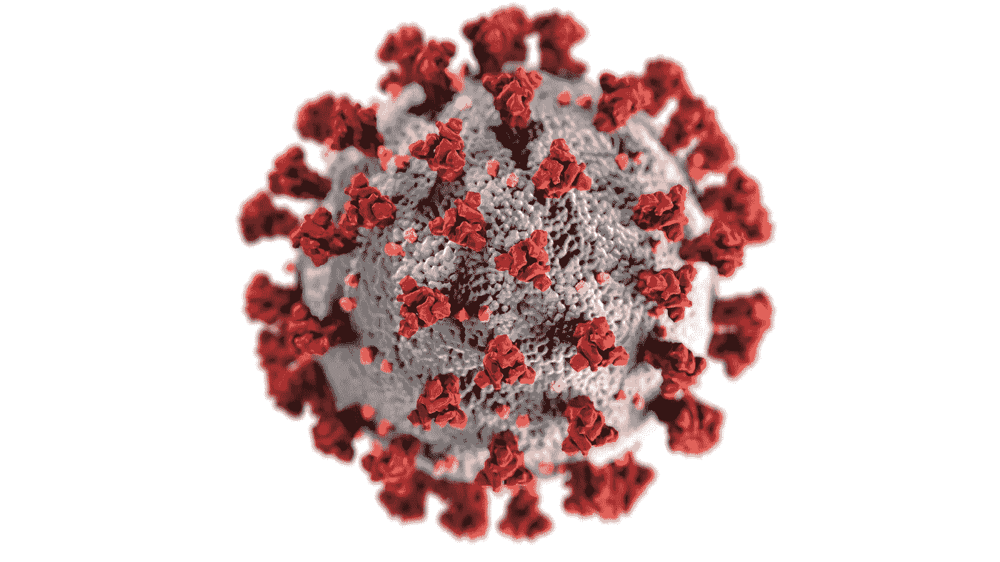

[疾控中心](https://unsplash.com/@cdc?utm_source=unsplash&utm_medium=referral&utm_content=creditCopyText)在 [Unsplash](https://unsplash.com/s/photos/covid?utm_source=unsplash&utm_medium=referral&utm_content=creditCopyText) 拍摄的照片

## 旨在快速检测冠状病毒的研究进展的信息和收获。

# 介绍

一群来自世界知名学术机构的研究人员，如牛津大学[、](https://www.ox.ac.uk/)[华威大学](https://warwick.ac.uk/)、[蒙彼利埃大学](https://www.umontpellier.fr/en/)和可信的研究实验室，发明了一种在几分钟内检测新冠肺炎(新型冠状病毒)和其他呼吸道病原体的方法。

这一壮举是通过利用图像分析和机器学习技术，更具体地说是卷积神经网络，根据病毒特有的结构特征对呼吸道疾病的微观病毒进行分类而实现的。

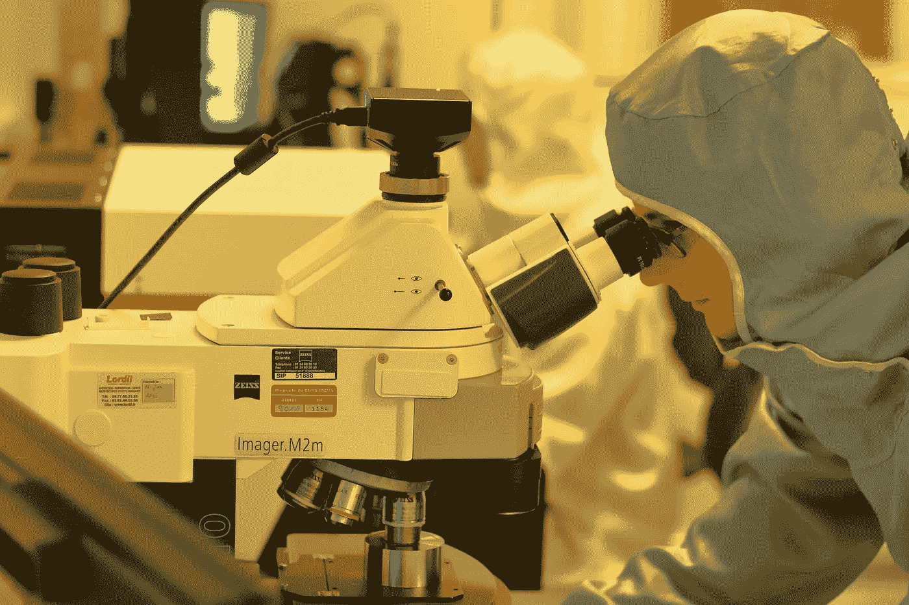

照片由 [L N](https://unsplash.com/@younis67?utm_source=unsplash&utm_medium=referral&utm_content=creditCopyText) 在 [Unsplash](https://unsplash.com/s/photos/researchers?utm_source=unsplash&utm_medium=referral&utm_content=creditCopyText) 上拍摄

## 本文介绍了与上述机构研究人员开展的工作相关的[发表的研究论文](https://www.medrxiv.org/content/10.1101/2020.10.13.20212035v3.full.pdf)中的关键信息和要点。

## 通过阅读这篇文章，你将理解用于创建新冠肺炎 5 五分钟检测系统和其他重要背景信息的方法背后的直觉和技术。

有些读者可能不熟悉本文中的一些术语和短语，这是完全可以理解的，因此，在本文的某些地方，一些章节提供了所用单词和关键术语的定义。

> **新型冠状病毒**:引起新冠肺炎病的人类冠状病毒株。
> 
> **病原体**:致病生物或传染物。常见的病原体有病毒、细菌、真菌、朊病毒和寄生虫。

# 以前检测新冠肺炎的方法(新型冠状病毒)

你可能已经熟悉了检测新冠肺炎的方法，也许你最近做过一些新冠肺炎试验。一些新冠肺炎测试检测咽拭子样本中病毒的存在，而其他测试检测人类免疫系统产生的抗体来对抗疾病。

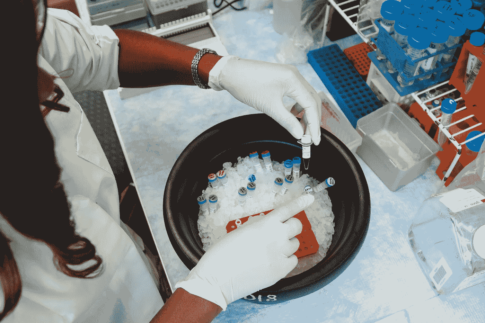

[国家癌症研究所](https://unsplash.com/@nci?utm_source=unsplash&utm_medium=referral&utm_content=creditCopyText)在 [Unsplash](https://unsplash.com/s/photos/researchers?utm_source=unsplash&utm_medium=referral&utm_content=creditCopyText) 上拍摄的照片

以下是对通常用于检测新冠肺炎病毒的测试的更正式的解释和描述。

## 核酸扩增试验

核酸扩增测试通过识别特定的核酸序列来检测新冠肺炎；这意味着对病毒特有的独特的[生物聚合物](https://en.wikipedia.org/wiki/Biopolymer)或[生物分子](https://en.wikipedia.org/wiki/Biomolecule)的检测。

这种检测程序的扩增部分是指产生新冠肺炎特有的遗传物质或 DNA 的拷贝。

就早期疾病诊断而言，与抗体检测相比，检测病毒 DNA 的存在实际上好得多。身体通常需要一段时间来产生抗体，以应对新冠肺炎病毒感染。

## 抗原和抗体检测

抗原是侵入性生物，可引发免疫系统产生抗体的反应。抗体通常会将自身结合到抗原上，导致感染和疾病，进而导致免疫系统中和抗原。

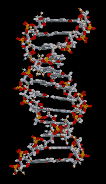

由 Brian 0918&# 153；—自己的作品，公共领域，[https://commons.wikimedia.org/w/index.php?curid=404735](https://commons.wikimedia.org/w/index.php?curid=404735)

新冠肺炎的抗体测试通过检测血液中的抗体来检测个体中抗体的存在，从而揭示一个人以前是否感染过新冠肺炎病毒。

抗体测试不会显示一个人目前是否感染了新冠肺炎病毒，而抗原测试将确认一个人现在是否被感染。

抗原测试的工作原理是检测与入侵病原体相关的蛋白质的存在。

> **生物聚合物**:这些是由活生物体产生的长重复分子链的材料，(RNA(核糖核酸)或 DNA(脱氧核糖核酸))。

# 五分钟检测程序如何工作

该程序的工作原理是传递标记病毒粒子的图像，这些图像经过处理后显示出特定的颜色信号。卷积神经网络对显微镜图像中的病毒颗粒信号进行分类。

## 以下是更详细的程序步骤:

1.  该程序从通过咽拭子提取病毒颗粒开始。
2.  收集的病毒样本用甲醛灭活。
3.  下一步是通过短的荧光 DNA 与病毒表面的结合来即时标记完整的病毒颗粒。
4.  标记后，使用壳聚糖包被的载玻片固定病毒颗粒，并置于其上。
5.  通过使用显微成像收集病毒颗粒的衍射受限图像。
6.  然后使用图像处理和机器学习技术对样本中的各种类型的病毒进行分类。

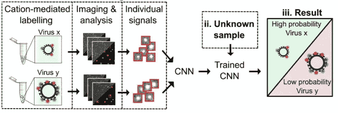

[荧光标记策略和病毒检测的程序。](https://www.medrxiv.org/content/10.1101/2020.10.13.20212035v3.full.pdf)

卷积神经网络(CNN)根据病毒颗粒表面荧光团的分布对病毒颗粒进行分类。CNN 利用了病毒颗粒表面荧光团分布的独特特性。

病毒颗粒具有独特的形状、大小、结构和表面化学性质，这反过来使得病毒颗粒表面荧光团的分布能够作为对病毒进行分类的独特特征。

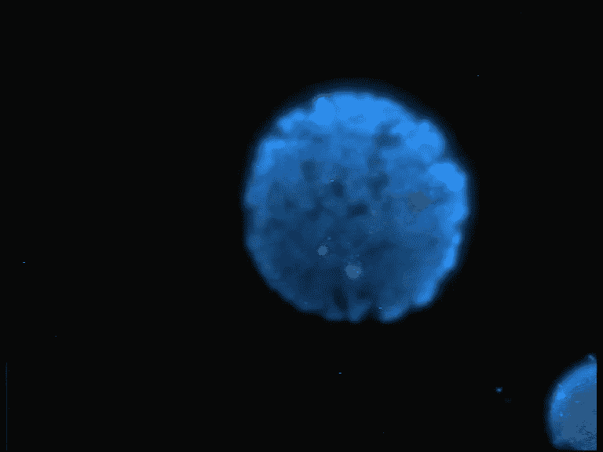

作者 Gregor 1976——自有作品，公共领域，【https://commons.wikimedia.org/w/index.php?curid=1251744 

呈现给 CNN 网络的图像包含被照亮为单一绿色或红色荧光信号的病毒粒子和黄色粒子。黄色颗粒对应于共同定位的绿色和红色荧光信号(具有红色和绿色荧光标记的病毒颗粒)。

根据研究，在不含新型冠状病毒病毒(病毒阴性)的咽拭子样品中，观察到几乎没有共定位信号。

在病毒阳性样品中更容易观察到共定位信号。有关提取图像的示例，请参见下面的图像。

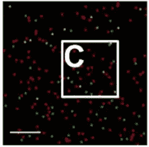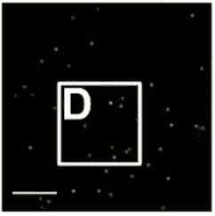

[左图:荧光显微成像显示共定位的红色和绿色信号为黄色颗粒(病毒阳性)。右图:病毒负面形象](https://www.medrxiv.org/content/10.1101/2020.10.13.20212035v3.full.pdf)

在通过卷积神经网络前馈图像之前，基于定义的视场内图像信号的稀缺性(< 10 pixels) of image signals areas or abundance(> 100 像素)来过滤图像信号的区域。

***自适应滤波*** 是用于从背景中分割病毒信号的图像处理方法。

用于确保病毒粒子信号在图像中普遍存在的另一种方法是通过基于协同定位条件的信号过滤。

符合设定的协同定位信号条件的信号将被保留，不符合条件的信号将从通过 CNN 的最终图像中过滤掉。

大多数机器学习实践者将上述过程视为在机器学习项目生命周期的数据准备阶段强制执行的确保数据完整性和清洁性的方法。

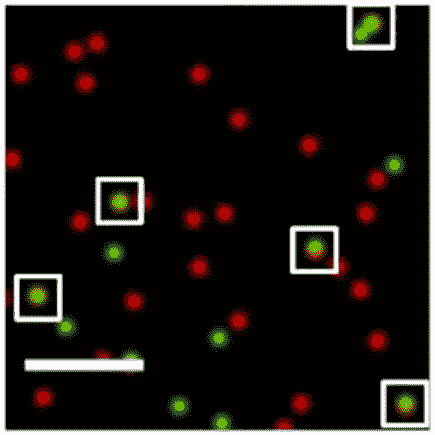

[放置在协同定位信号周围的边界框](https://www.medrxiv.org/content/10.1101/2020.10.13.20212035v3.full.pdf)

> **荧光团**:一种化合物，通过其吸收和重新发射各种波长的光的能力而充当检测剂。
> 
> **共定位**:涉及荧光标记空间重叠的事件。

# 网络体系结构和 ML 技术

在这项[研究工作](https://www.medrxiv.org/content/10.1101/2020.10.13.20212035v3.full.pdf)中设计和实现的卷积神经网络架构由 15 层组成。

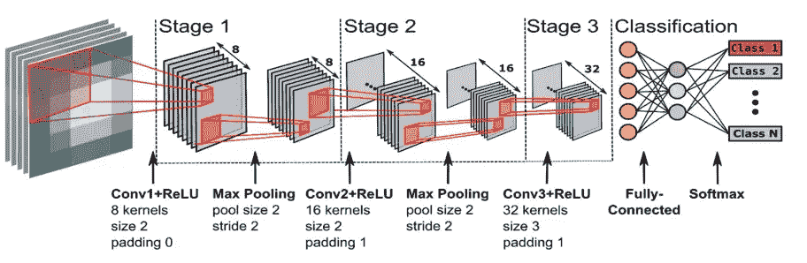

CNN 架构的设计分为三个阶段，最后才是分类头。

第一阶段在输入层之后，其中有一个 conv 层(8 个通道，2x2 滤波器大小，0 填充)，随后是一个 ReLu，批量归一化和一个最大池层(池大小 2x2，步长 2)。第一阶段向下一阶段输出八个下采样特征图。

第二阶段由 conv 层(16 个通道，2×2 滤波器大小，填充为 1)组成，随后是 ReLu、批量归一化和最大池层(池大小为 2×2，步长为 2)。第二阶段向下一阶段输出 16 个下采样特征图。

第三阶段由 conv 层(32 个通道，3×3 的滤波器大小，填充为 1)组成，随后是 ReLu、批量归一化和无最大池层。

第三阶段的结果被传递到完全连接的层上。在典型的 CNN 中，conv 层的输出在传递到完全连接的层之前被展平为一维数组。

全连接层(致密层)包含任意数量的神经元/单元。全连接层的激活通过 softmax 层，在此对输入数据进行分类。

以下是本节包含的一些关键术语的快速定义，如果您已经熟悉这些术语，请随意跳过。

> **卷积层**:卷积是一个数学术语，描述两组元素之间的点积相乘。在深度学习中，卷积运算作用于卷积层中的滤波器/内核和图像数据阵列。因此，卷积层只是一个包含滤波器和通过卷积神经网络的图像之间的卷积运算的层。
> 
> [**批量标准化层**](/batch-normalization-explained-algorithm-breakdown-23d2794511c) :批量标准化是一种通过引入一个附加层来减轻神经网络内不稳定梯度影响的技术，该附加层对来自前一层的输入执行操作。这些操作对输入值进行标准化和规范化，然后通过缩放和移位操作转换输入值。
> 
> [下面的 max-pooling 操作有一个 2x2 的窗口，并滑过输入数据，输出内核感受域内像素的平均值。](/you-should-understand-sub-sampling-layers-within-deep-learning-b51016acd551)
> 
> **展平图层**:取一个输入图形，将输入图像数据展平成一维数组。
> 
> **Softmax 激活函数**:一种激活函数，用于导出输入向量中一组数字的概率分布。softmax 激活函数的输出是一个向量，其中它的一组值表示一个类或事件发生的概率。向量中的值加起来都是 1。

## 超参数和附加信息

*   当训练卷积神经网络时使用的学习速率被设置为 0.01，没有学习速率衰减。
*   小批量:1000 个
*   训练时期数:100
*   验证频率:20 步

# 培训和测试

新型冠状病毒病毒与其他呼吸道疾病如流感和季节性人类冠状病毒(hCov)有相似的早期症状；因此，任何新冠肺炎检测方法必须有助于区分相似的病毒。

本[研究](https://www.medrxiv.org/content/10.1101/2020.10.13.20212035v3.full.pdf)中使用的 CNN 网络在包含四种独特病毒的数据集上进行训练和验证，训练和验证分区分别为 70%和 30%。

研究人员确保实现的 CNN 可以区分具有相似形状、结构和表面化学的病毒。

根据[研究论文](https://www.medrxiv.org/content/10.1101/2020.10.13.20212035v3.full.pdf)的笔记，训练和验证阶段总共花了 12 分钟。

# 结果

经过训练的 CNN 架构的性能通过包含在[研究论文](https://www.medrxiv.org/content/10.1101/2020.10.13.20212035v3.full.pdf)中的混淆矩阵呈现。

混淆矩阵说明了分类算法在一组测试或评估数据上的性能，其中数据分类(标签)是已知的。

CNN 在受控环境中的实验室生长病毒和从患者身上获得的病毒临床样本上进行了测试。

下面是分类的性能和结果的详细信息。

## 实验室培养的病毒和受控测试

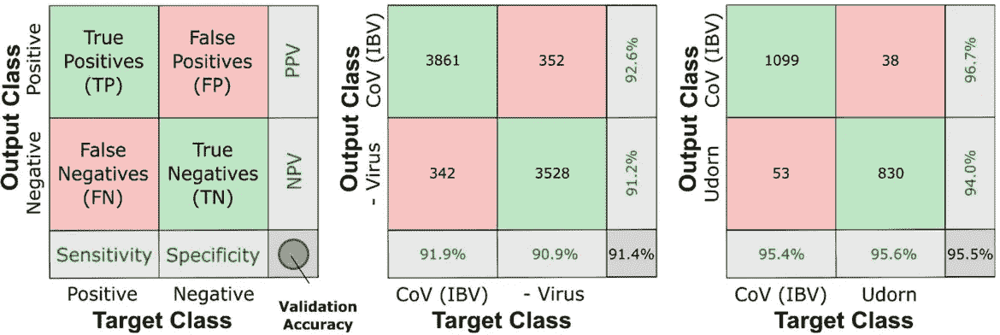

[实验室培养的病毒和控制测试结果](https://www.medrxiv.org/content/10.1101/2020.10.13.20212035v3.full.pdf)

测试了 CNN 对阳性和阴性 IBV(传染性支气管炎病毒)病毒样本进行分类的能力。IBV 是一种影响鸟类的冠状病毒。CNN 能够以 91.4%的准确度对阳性和阴性 IBV 单一病毒颗粒进行分类。

进行的另一项测试是 CNN 区分具有相似结构特性的病毒的能力。用于本次试验的病毒为 IBV 和其他三种流感病毒( [Udorn](https://www.fludb.org/brc/fluStrainDetails.spg?strainName=A/Udorn/72&decorator=influenza) 、 [X31](https://www.fludb.org/brc/fluStrainDetails.spg?strainName=A/X-31(H3N2)&decorator=influenza) 和 [PR8](https://www.fludb.org/brc/fluStrainDetails.spg?strainName=A/PR8/1934&decorator=influenza) 株)。

CNN 能够区分来自 IBV 样本的病毒，准确率为 95.5%(乌多恩)94.5%(PR8)。当任务是对病毒 X31 或 Udorn 病毒样本进行分类时，CNN 提供了 68.8%的性能，这两种病毒在结构特性方面非常相似。

## 非受控环境中的临床病毒样本

一个更可靠的测试突出了 CNN 的性能，那就是对来自病人的新型冠状病毒病毒样本进行分类。病毒样本取自新型冠状病毒病毒检测呈阳性和阴性的患者的咽拭子，以及其他人类冠状病毒株( [OC43](https://en.wikipedia.org/wiki/Human_coronavirus_OC43) 、 [HKU1](https://en.wikipedia.org/wiki/Human_coronavirus_HKU1) 和 [NL63](https://en.wikipedia.org/wiki/Human_coronavirus_NL63) )

CNN 架构在从咽拭子病毒样本收集的数据上被训练和测试。

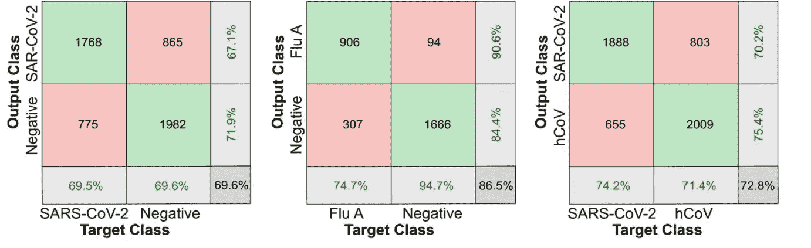

[非受控环境中的临床病毒样本结果](https://www.medrxiv.org/content/10.1101/2020.10.13.20212035v3.full.pdf)

经过训练的 CNN 在阳性和阴性新型冠状病毒之间的分类表现良好，准确率约为 70%，在 hCov 和阴性样本之间的分类准确率为 78%。

当 CNN 的任务是对新型冠状病毒或任何季节性人类冠状病毒的病毒样本进行分类时，分类准确率达到了 73%。

在实验室培养的病毒和临床样本之间观察到的性能准确性的降低归因于临床样本中病毒的复杂性；此外，实验室培养的样品不含会影响病毒样品完整性的外部残留细胞物质。

# 优势和推广计划

本文中提到的快速测试过程和技术的好处是显而易见的。

至关重要的是，我们作为一个社会，实施的方法，使目前的疫情处于控制之下。

## 以下是所讨论的快速测试技术提供的一些主要优势:

*   在 2-5 分钟内提供高准确度的诊断结果。
*   本文提到的研究中提出的快速新冠肺炎检测方法作为早期诊断工具是有益的，可以通过早期诊断帮助抑制感染的传播。
*   可以有效区分类似于新型冠状病毒病毒的病毒，这在季节性冠状病毒在患者中更流行的冬季月份中将是有益的属性。
*   在这种特定的新冠肺炎检测方法中使用的过程可以重新用于检测其他呼吸道病毒。
*   在[研究论文](https://www.medrxiv.org/content/10.1101/2020.10.13.20212035v3.full.pdf)中提出的检测技术可以在实验室环境之外使用。因此，我们可以看到这种检测技术在学校、养老院、医院和国际交通枢纽的部署。

就这种 5 分钟新冠肺炎探测技术何时向公众推出的时间框架而言，目前计划成立一家公司，该公司可以在 2021 年初开始产品开发。

值得一提的是一种快速检测技术，这种技术一直处于公共新闻的最前沿，这就是目前在英国健康和美容零售商 Boots 销售的 12 分钟新冠肺炎检测测试。这些测试设备来自 [LumiraDx](https://www.lumiradx.com/us-en/) ，最初价格为 120 英镑，随着需求的增加，价格会下降。

 [## 使用单粒子成像和深度学习在几分钟内检测和识别病毒

### 近几十年来，病毒爆发的频率和规模不断增加，集中体现在当前的新冠肺炎…

www.medrxiv.org](https://www.medrxiv.org/content/10.1101/2020.10.13.20212035v3) 

# 我希望这篇文章对你有用。

要联系我或找到更多类似本文的内容，请执行以下操作:

1.  订阅我的 [**邮件列表**](https://richmond-alake.ck.page/c8e63294ee) 获取每周简讯
2.  跟我上 [**中**](https://medium.com/@richmond.alake)
3.  通过 [**LinkedIn**](https://www.linkedin.com/in/richmondalake/) 联系我

## 其他文章

 [## 我如何使用智能手表传感器来防止面部触摸

### 一个值得追求的想法？

towardsdatascience.com](/how-im-using-smartwatch-sensors-to-limit-covid-19-infection-51abe04f81f9)  [## 你可以通过这些 YouTube 视频了解 GPT 3

### 通过这些 YouTube 视频，在不到 3 分钟的时间内对 GPT 3 号有一个初步的了解

towardsdatascience.com。](/you-can-understand-gpt-3-with-these-youtube-videos-6a30887c928b)