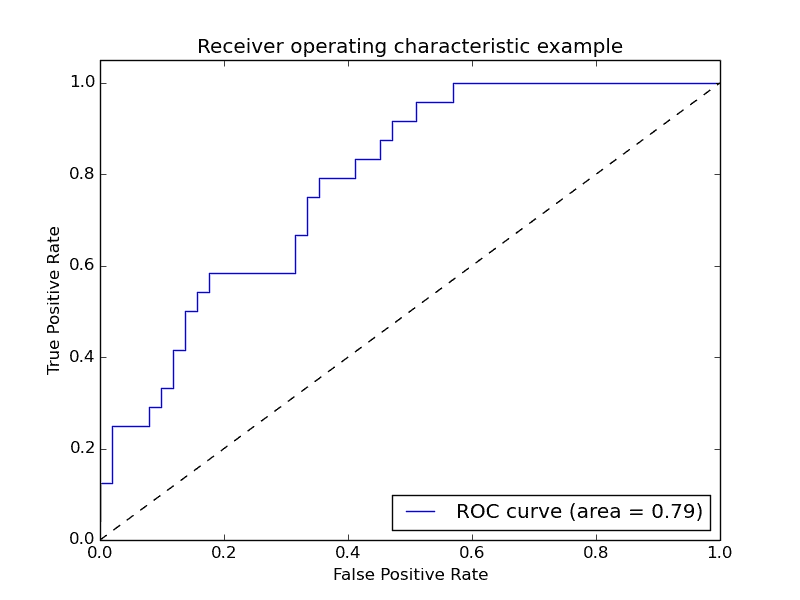
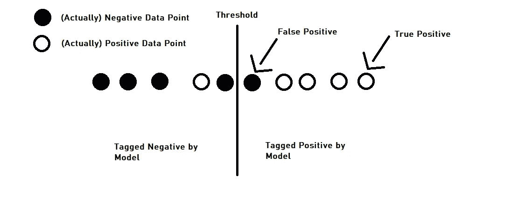
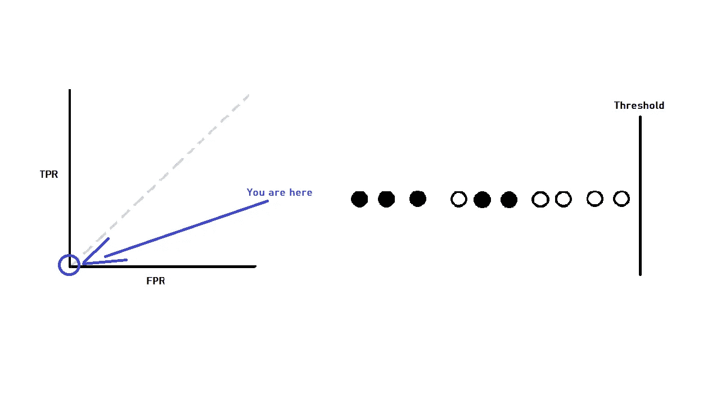
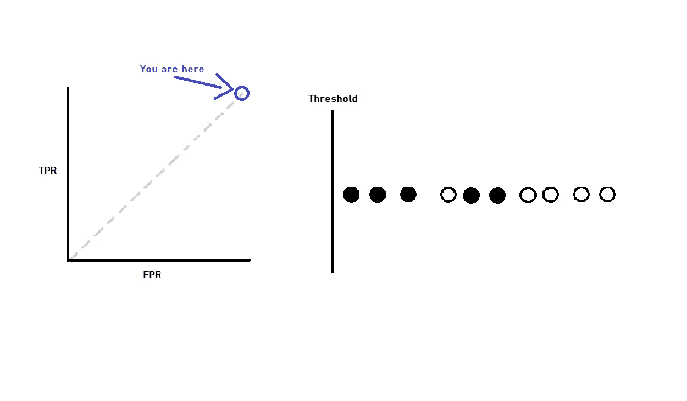
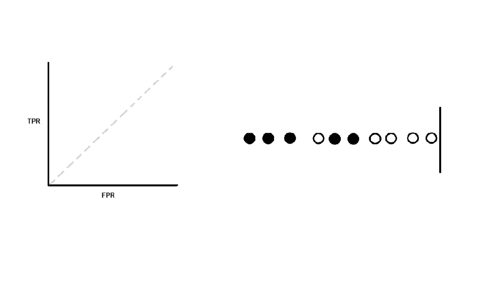
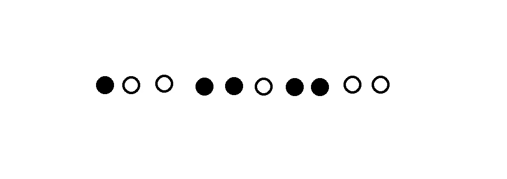
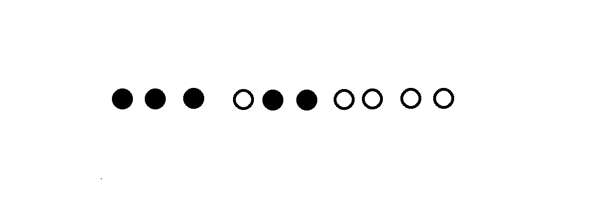
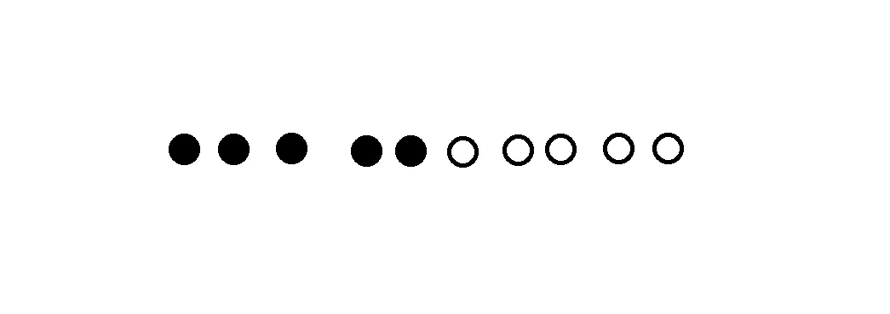
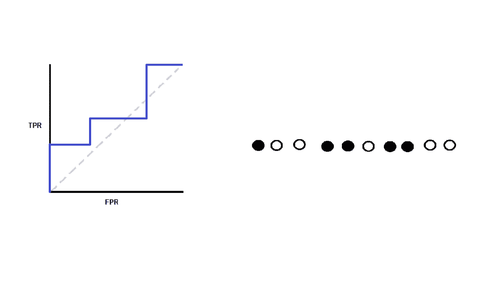
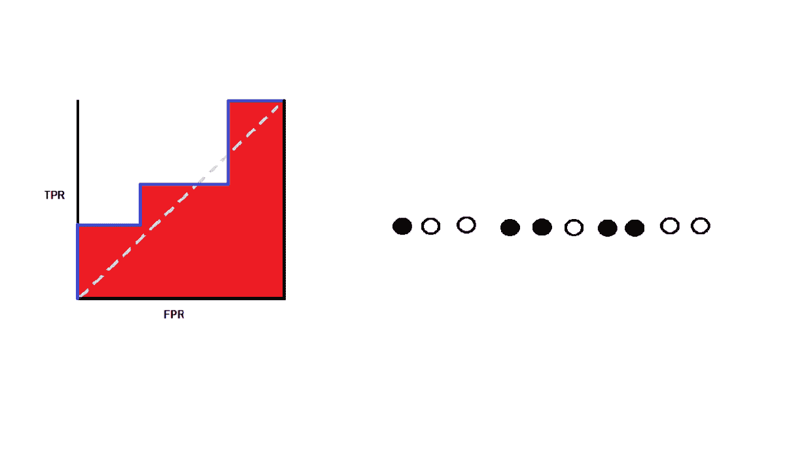

# 对 ROC-AUC 指标的零数学直观理解

> 原文：<https://towardsdatascience.com/machine-learning-classification-making-sense-of-the-roc-curve-30a510bba81d?source=collection_archive---------30----------------------->

## 没有数学或公式。是的图像和动画。

卡伦·艾姆斯利在 [Unsplash](https://unsplash.com/photos/Y8lCoTRgHPE?utm_source=unsplash&utm_medium=referral&utm_content=creditCopyText) 上的照片

# 了解轴

典型的 ROC 图如下所示:

在我们进入任何其他内容之前，我们需要理解轴的含义。不要陷入令人困惑的公式，这里有一个最简单的解释:

1.  x 轴(假阳性率，或 FPR)是模型标记为阳性(假阳性)的实际*阴性*样本的分数。
2.  y 轴(真阳性率，或 TPR)是模型标记为阳性(真阳性)的实际*阳性*样本的分数。

请注意两者之间的相似性！本质上，ROC 曲线是真阳性对假阳性曲线，两个轴都是标准化的。

# 与阈值的关系

每当我们看到一个线图，我们倾向于认为随着时间的线性进展，或一些参数表示在 x 轴上。当我们增加 x 轴上的参数时，线图会前进。思维过程通常是这样的:“对于 x 轴上给定的值，图形给我 y 轴上对应的值”。

但是 ROC 在这方面很微妙——它不是从 FPR 值(x 轴)到 TPR 值(y 轴)的映射，因为你不能真正计算 TPR 作为 FPR 的函数。那么，随着 ROC 曲线远离原点，什么在变化呢？答案是(请击鼓):*门槛。*

如果我们更深入地研究大多数分类模型，我们会发现它们不只是给一个数据点分配一个标签，而是给一个数据点分配一个*分数*，然后将该分数与一个阈值进行比较，以决定是将其分类为正面还是负面:

分类模型在幕后使用分数和阈值

因此，给定一个阈值，模型将为每个数据点生成一个分类。对于给定的一组分类，TPR 和 FPR 各有一个值。但是，随着阈值的变化，TPR 和 FPR 都将在 0 到 1 之间变化。这就是为什么我们说阈值随着 ROC 曲线的进展而变化。

## 极端情况

为了恰当地形象化这一点，让我们从考虑极端情况开始；这将为我们理解 ROC 曲线在其他情况下如何工作提供一个更好的视角。

首先，考虑阈值被设置为最大值的情况。没有比阈值更高的得分，也没有被模型标记为阳性。这是 ROC 曲线位于(0，0)时的情况:

现在考虑另一种极端情况——当阈值处于最小值时。所有事情的得分都高于阈值，并且所有事情都被模型标记为积极的。这是 ROC 曲线位于(1，1)时的情况:

## 介于两者之间的一切

贯穿这两个极端之间的一切看起来像这样:

> 随着模型阈值的降低，正面预测的总数将会增加。ROC 图表达了这些阳性预测是如何被分为真阳性和假阳性的。

# ROC 曲线的理想特征

现在我们知道了 ROC 曲线代表什么，我们可以开始理解什么会使一个给定的 ROC 曲线“好”或“坏”。

让我们再来看看这些轴:

很明显，我们想要真阳性，不想要假阳性。对于坐标轴，我们想沿着 y 轴向上移动，但不想沿着 x 轴向前移动。然而，ROC 曲线从(0，0)一直到(1，1)…换句话说，无论如何，你都要穿过 x 轴。

所以 ROC 曲线*的好坏必然*与曲线的形状有关。为了理解什么形状被认为是好的，我们回到阈值图，试图理解什么使分类模型更好。很明显，一个给数据点打分的模型是这样的:

比这样计算数据点的公司更糟糕:

哪一个比这样的数据点更糟糕(理想情况):

如果我们将所有这些与它们的 ROC 曲线进行比较，一个清晰的模式开始显现出来:

如果更多的白点(实际上是正数据点)比黑点(实际上是负数据点)排名更高，ROC 曲线在 x 轴(FPR)上向前移动之前沿 y 轴(TPR)上升。TPR 上升越早，曲线下的面积越大:

这就是为什么您会经常看到 ROC-AUC(ROC-曲线下面积)或 AUROC(ROC 下面积)指标被用来衡量分类算法的性能。

> 本质上，更好的 ROC 曲线是曲线下具有更大面积的曲线，因为这意味着分类模型对更多正样本的排序高于负样本，即模型具有更好的正负数据点分离(在正确的方向上)。

# 结论

希望这些动画和解释能让你更直观地理解什么是 ROC 曲线，以及为什么我们选择 ROC 曲线下的面积作为分类算法性能的度量。