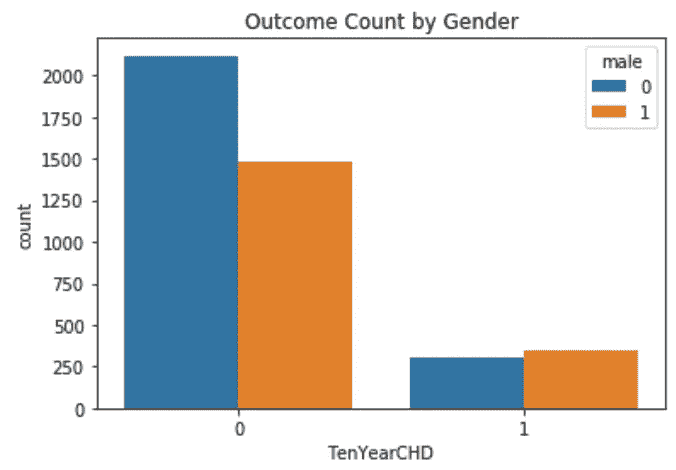

# 机器学习分类器与 Python 的比较

> 原文：<https://towardsdatascience.com/machine-learning-classifiers-comparison-with-python-33149aecdbca?source=collection_archive---------6----------------------->

## 用于机器学习的 Python

## 评估和比较分类器性能

凯文·Ku 拍摄的图片可在 [Unsplash](https://unsplash.com/photos/w7ZyuGYNpRQ) 获得

# 机器学习分类器

机器学习分类器是用于在标记数据可用时预测数据点类别的模型(即监督学习)。一些最广泛使用的算法是逻辑回归、朴素贝叶斯、随机梯度下降、k-最近邻、决策树、随机森林和支持向量机。

## 选择正确的评估者

在解决机器学习问题时，为给定的工作确定正确的估计器是最关键和最困难的部分之一。每个估计值都适用于特定类型的数据和问题。 [Scikit-learn](https://scikit-learn.org/stable/index.html) ，机器学习最流行的 Python 库之一，提供了下面的图表来指导用户选择最合适的估计器的决策过程。

图片由 scikit-learn 提供[scikit-learn.org](https://scikit-learn.org/stable/tutorial/machine_learning_map/index.html)

## 绩效评估指标

必须对分类模型进行评估，以确定它们执行特定任务的有效程度。虽然好的分类模型对于预测目的是有用的，但是差的分类模型导致不可靠的结果，因此对于用户是无用的。

绩效评估指标基于以下变量的总数:

*   **真阳性**:结果被正确预测为阳性类别
*   **真阴性**:结果被正确预测为阴性类别
*   **假阳性**:结果被错误地预测为阳性类别
*   **假阴性**:结果被错误地预测为阴性类别

其中一个轴是机器学习模型预测的标签，另一个轴是实际标签:

二元分类的混淆矩阵

有四个主要的性能指标用于评估分类模型的有效性:

*   **准确性**:测试正确预测两个类别的能力
*   **精度**:测试从所有预测的阳性类别中正确检测出阳性类别的能力
*   **回忆(灵敏度):**测试从所有实际阳性类别中正确检测出阳性类别的能力
*   **F1 得分**:精确度和召回率的调和平均值

绩效指标公式

在下面的例子中，让我们评估五种不同分类模型(即逻辑回归、支持向量分类器、决策树、随机森林和高斯朴素贝叶斯分类器)在[弗雷明汉心脏研究数据集](https://github.com/rsalaza4/Machine-Learning-Classifiers-Comparison/blob/master/Data%20Sets/framingham.csv)(一项旨在确定导致心血管疾病的常见因素的研究)上的性能，以确定导致最可靠结果的模型。

下面的 Python 代码将分为五个主要步骤。包含的注释行提供了简短的解释，并指导您完成编码过程。

## 步骤#1:数据加载

弗雷明汉心脏研究

## 步骤 2:探索性数据分析

男性/女性比例

根据上面的图，弗雷明汉心脏研究包含更多与女性相关的数据点，而不是男性。

结果计数

上面的图表揭示了弗雷明汉心脏研究是一个严重不平衡的数据集。大多数数据点对应于负面类别(即十年内发展成心血管疾病的低风险)。要解决这个问题，需要进一步的数据平衡。

按性别统计的结果

有意思。尽管与男性相对应的数据点总数较低，但上图表明，男性患心血管疾病的风险高于女性。

## 步骤 3:数据清理

## 步骤 4:数据平衡

上图显示，在使用随机欠采样技术平衡数据集后，相同数量的类是相等的。

## 步骤#5:模型建立和性能评估

**最终结果**

模型的绩效评估得分表

## 结果解释

根据上表的结果，支持向量分类器获得了最好的准确度、召回率和 F1 分数，以及第二好的精确度分数，使其成为该数据集最可靠的机器学习分类器。另一方面，可以说决策树和高斯朴素贝叶斯模型具有最差的性能，因此，对于该数据集不是可靠的分类模型。

## 接下来是什么？

在支持向量分类器被识别为最可靠的机器学习分类器之后，下一步将包括调整其参数，以确定其性能是否可以进一步提高。

值得说明的是，在上述代码中机器学习分类器的实例化期间，它们的参数被设置为默认参数，除了逻辑回归模型中用于实现模型收敛的 *max_iter* 参数和支持向量分类器中的 *dual* 参数，因为样本的数量大于特征的数量。

## 现在轮到你了

在前面的示例中，分类模型是使用整个数据集(即，对应于男性和女性的数据点)构建的，它假设导致心血管疾病的因素对两性具有相同的权重。作为练习编码技能的一种方式，尝试按性别划分数据集，并为每个数据集建立分类模型。使用本文中讨论的评估指标比较它们的性能，并评估是为每种性别建立独立的分类模型更方便，还是为两种性别建立一个公共的分类模型更方便。

# 总结想法

机器学习和人工智能算法在解决问题和复杂任务方面有许多有用和多样的应用。除了数据科学，它们已经成为学术界和专业人士非常流行的研究趋势，在广泛的领域中出现了新的研究方向。研究人员继续为多种编程语言和软件更新和开发新的编程库和包，以促进这些算法的实现和执行。

Python 代表了一种伟大的免费开源编程语言，能够执行广泛的机器学习、人工智能、数据科学和数据分析任务。它最受欢迎的一些机器学习和深度学习库包括 scikit-learn、TensorFlow、Keras、PyTorch、Pandas 和 NLTK。数据科学家和分析师必须充分利用这些工具来解决现实生活中的复杂问题和任务，从而为组织、客户或研究领域带来附加值。

*— —*

*如果你觉得这篇文章有用，欢迎在*[*GitHub*](https://github.com/rsalaza4/Machine-Learning-Classifiers-Comparison)*上下载我的个人代码。你也可以直接在 rsalaza4@binghamton.edu 给我发邮件，在*[*LinkedIn*](https://www.linkedin.com/in/roberto-salazar-reyna/)*上找到我。有兴趣了解工程领域的数据分析、数据科学和机器学习应用的更多信息吗？通过访问我的媒体* [*个人资料*](https://robertosalazarr.medium.com/) *来探索我以前的文章。感谢阅读。*

*——罗伯特*