# 机器学习分类器:数据重采样器与 Python 的比较

> 原文：<https://towardsdatascience.com/machine-learning-classifiers-data-resamplers-comparison-906442d04fde?source=collection_archive---------61----------------------->

## 用于机器学习的 Python

## 评估和比较重采样技术

图片由[杰瑞米·托马斯](https://unsplash.com/@jeremythomasphoto)提供，在 [Unsplash](https://unsplash.com/photos/FO7bKvgETgQ)

# 机器学习分类器

机器学习分类器是用于在标记数据可用时预测数据点类别的模型(即监督学习)。一些最广泛使用的算法是逻辑回归、朴素贝叶斯、随机梯度下降、k-最近邻、决策树、随机森林和支持向量机。

# 绩效评估指标

必须对分类模型进行评估，以确定它们执行特定任务的有效程度。虽然好的分类模型对于预测目的是有用的，但是差的分类模型导致不可靠的结果，因此对于用户是无用的。

绩效评估指标基于以下变量的总数:

*   **真阳性**:结果被正确预测为阳性类别
*   **真阴性**:结果被正确预测为阴性类别
*   **假阳性**:结果被错误地预测为阳性类别
*   **假阴性**:结果被错误地预测为阴性类别

其中一个轴是机器学习模型预测的标签，另一个轴是实际标签:

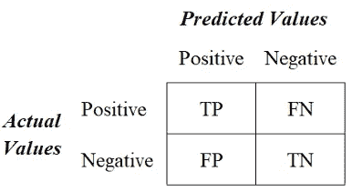

二元分类的混淆矩阵

有四个主要的性能指标用于评估分类模型的有效性:

*   **准确性**:测试正确预测两个类别的能力
*   **精度**:测试从所有预测的阳性类别中正确检测出阳性类别的能力
*   **回忆(灵敏度):**测试从所有实际阳性类别中正确检测出阳性类别的能力
*   **F1 得分**:精确度和召回率的调和平均值

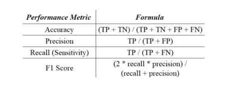

绩效指标公式

# 不平衡数据集

不平衡数据集是指不同类别中样本总数变化很大的数据集，导致机器学习分类器偏向样本数较大的类别(即多数类别)。下图说明了使用不同级别的类平衡训练线性 SVC(支持向量分类器)。

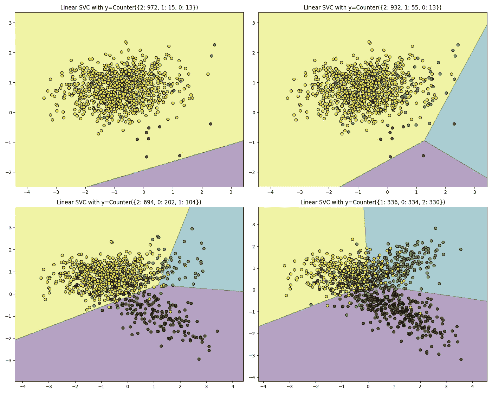

图片由 g .勒迈特等人提供，可在 I[m balanced-learn . readthedocs . io](https://imbalanced-learn.readthedocs.io/en/stable/introduction.html)获取

为了解决这个问题，有两组重采样技术用于平衡数据集:

## 欠采样技术

欠采样包括减少来自多数类的样本数量，以使其与来自少数类的样本数量相匹配。一些欠采样技术包括:随机欠采样、托梅克链接和压缩最近邻。

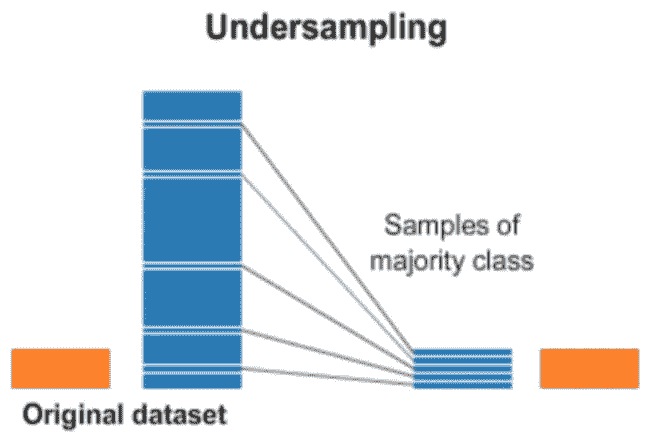

欠采样表示

## 过采样技术

过采样包括增加来自少数类的样本数，使其与来自多数类的样本数相匹配。一些过采样技术包括:随机过采样、SMOTE、SMOTE-NC、边界 SMOTE 和自适应合成。

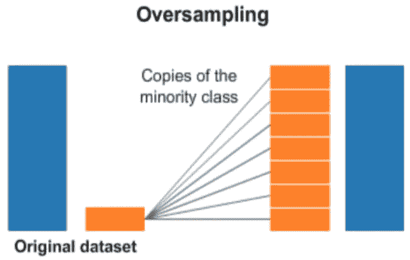

过采样表示

对于下面的例子，让我们在应用了 11 种不同的重采样技术(随机欠采样、接近缺失 I、接近缺失 II、接近缺失 III、Tomek 链接、浓缩最近邻、SMOTE、边界 SMOTE、SMOTE-NC、自适应合成和随机过采样)以确定导致最可靠结果的技术之后，评估逻辑回归模型在[弗雷明汉心脏研究数据集](https://github.com/rsalaza4/Machine-Learning-Classifiers-Comparison/blob/master/Data%20Sets/framingham.csv)上的性能。

下面的 Python 代码将分为五个主要步骤。包含的注释行提供了简短的解释，并指导您完成编码过程。

## 步骤#1:数据加载

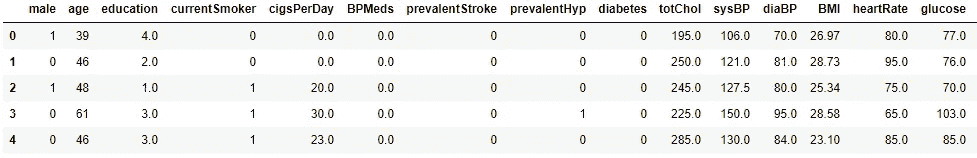

弗雷明汉心脏研究

## 步骤 2:探索性数据分析

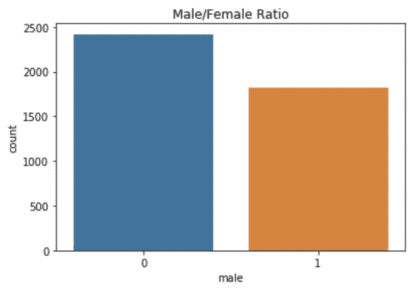

男性/女性比例

根据上面的图，弗雷明汉心脏研究包含更多与女性相关的数据点，而不是男性。

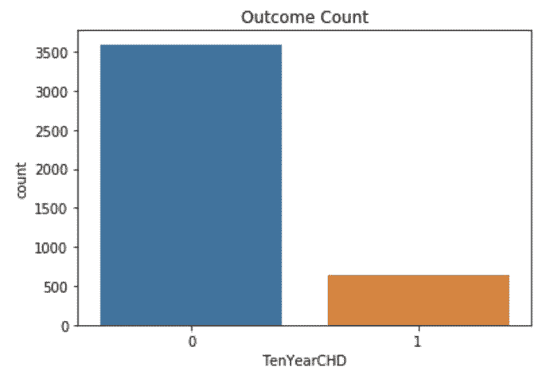

结果计数

上面的图表揭示了弗雷明汉心脏研究是一个严重不平衡的数据集。大多数数据点对应于负面类别(即十年内发展成心血管疾病的低风险)。要解决这个问题，需要进一步的数据平衡。

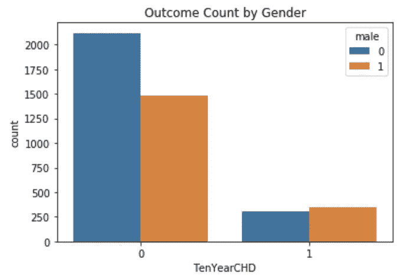

按性别统计的结果

有意思。尽管与男性相对应的数据点总数较低，但上图表明，男性患心血管疾病的风险高于女性。

## 步骤 3:数据清理

## 步骤 4:不平衡的模型构建和性能评估

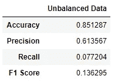

模型的性能衡量不平衡数据集中的分数

## 第 5 步:数据平衡

## 步骤#6:平衡的模型构建和性能评估

**最终结果**

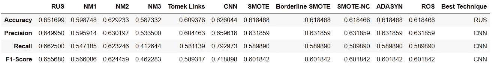

模型的性能衡量平衡数据集中的分数

## 结果解释

根据上表中的结果，为在采样技术下与浓缩最近邻平衡的数据集开发的逻辑回归模型获得了最佳的精确度、召回率和 F1 分数，以及第三好的精确度分数，使其成为该数据集最可靠的模型。

与从为原始不平衡数据集开发的逻辑回归模型中获得的绩效指标得分相比，为平衡数据集开发的模型的绩效指标得分有所提高。精确度分数从 0.6135 增加到 0.6596，召回分数从 0.0777 增加到 0.7929，F1 分数从 0.1362 增加到 0.7188。然而，准确度分数从 0.8512 下降到 0.6260。根据上表中的结果，没有可提高模型精度得分的重采样技术，因为最高的一个是通过随机欠采样技术获得的值 0.6516。

## 接下来是什么？

在浓缩最近邻被识别为导致最可靠的机器学习模型的最佳重采样技术之后，下一步将包括调整其参数以确定其性能是否可以进一步提高。

值得说明的是，在机器学习分类器的实例化和上面代码中的重采样技术期间，它们的参数被设置为默认参数，除了逻辑回归模型中的 *max_iter* 参数用于实现模型收敛，以及一些重采样函数中的 *random_state* 参数用于可复制性。

## 现在轮到你了

在前面的示例中，仅开发了一个机器学习分类器(即逻辑回归)，并使用多种重新采样技术进行了评估。然而，其他机器学习分类器(例如决策树、随机森林、支持向量分类器、高斯朴素贝叶斯分类器)的发展可能会导致更好的结果。尝试用其他机器学习分类器重复这个实验，以确定对于这个数据集，是否有更好的分类器和重采样技术的组合。

同样，机器学习模型是使用整个数据集(即对应于男性和女性的数据点)建立的，它假设导致心血管疾病的因素对两性具有相同的权重。作为练习编码技能的一种方式，尝试按性别划分数据集，并为每个数据集建立分类模型。使用本文中讨论的评估指标比较它们的性能，并评估是为每种性别建立独立的分类模型更方便，还是为两种性别建立一个公共的分类模型更方便。

# 总结想法

机器学习和人工智能算法在解决问题和复杂任务方面有许多有用和多样的应用。除了数据科学，它们已经成为学术界和专业人士非常流行的研究趋势，在广泛的领域中出现了新的研究方向。研究人员继续为多种编程语言和软件更新和开发新的编程库和包，以促进这些算法的实现和执行。

处理不平衡数据集并选择最合适的重采样技术是数据科学项目中的重要一步。适当的重采样技术选择可以导致更可靠的机器学习模型，而不适当的选择可能导致机器学习模型的偏差，不能预测准确的结果。本文展示了一种为给定数据集决定最佳重采样技术的方法。

Python 代表了一种伟大的免费开源编程语言，能够执行广泛的机器学习、人工智能、数据科学和数据分析任务。它最受欢迎的一些机器学习和深度学习库包括 scikit-learn、TensorFlow、Keras、PyTorch、Pandas 和 NLTK。数据科学家和分析师必须充分利用这些工具来解决现实生活中的复杂问题和任务，从而为组织、客户或研究领域带来附加值。

*—*

*如果你觉得这篇文章有用，欢迎在* [*GitHub*](https://github.com/rsalaza4/Data-Resamplers-Comparison/blob/master/Python%20Code/Code.py) *上下载我的个人代码。你也可以直接在 rsalaza4@binghamton.edu 给我发邮件，在*[*LinkedIn*](https://www.linkedin.com/in/roberto-salazar-reyna/)*上找到我。有兴趣了解工程领域的数据分析、数据科学和机器学习应用的更多信息吗？通过访问我的媒体* [*简介*](https://robertosalazarr.medium.com/) *来探索我以前的文章。感谢阅读。*

*——罗伯特*