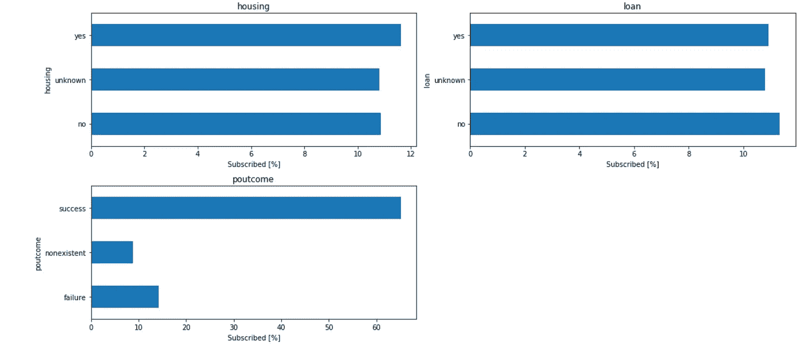

# 银行营销活动:成本预测-EDA(I)

> 原文：<https://towardsdatascience.com/machine-learning-costs-prediction-of-a-marketing-campaign-exploratory-data-analysis-part-i-758b8f0ff5d4?source=collection_archive---------16----------------------->


照片由[萨姆森](https://unsplash.com/@samsonyyc?utm_source=medium&utm_medium=referral)在 [Unsplash](https://unsplash.com?utm_source=medium&utm_medium=referral) 上拍摄

## 预测营销活动最佳目标候选人的数据科学方法


探索性数据分析—gon alo GUI mares Gomes

# 关于项目

该数据集存储了 2008 年至 2015 年葡萄牙一家银行的营销团队为吸引客户认购定期存款而实施的营销销售操作(电话营销)的信息，将结果分为“是”和“否”两个二进制分类变量。

在那之前，我们的策略是不加区别地争取最大数量的客户，并试图通过电话向他们销售金融产品。然而，这种方法除了花费许多资源之外，对于许多被这种类型的行为困扰的客户来说也是非常不舒服的。

为了确定营销活动的成本，营销团队得出结论:

*   对于每个被确定为**优秀候选人**并因此被定义为目标但没有认购存款的客户，银行的**成本为 500 欧元**。
*   对于每个被确定为**不良候选人**并被排除在目标之外但会认购产品的客户，银行的**成本为 2.000 欧元**。

# 机器学习问题和目标

我们面临一个**二元分类问题**。目标是训练最好的机器学习模型，该模型应该能够预测作为目标的候选人的最佳数量，以便将成本降至最低，并将效率最大化。

# 项目结构

该项目分为三类:

1.  **EDA:** 探索性数据分析
2.  [**数据争论:**清理和特征选择](https://bit.ly/2S5Su8i)
3.  **机器学习:**预测建模

在本文中，我将只关注第一部分，探索性数据分析(EDA)。

# 绩效指标

用于评估的指标是**总成本**，因为目标是确定活动的最低成本。

你可以在这里找到这个项目的全部代码。
可点击此处[下载“银行 _ 营销 _ 营销活动. csv”数据集。](https://bit.ly/31a0EAL)


丹尼尔·麦金尼斯在 [Unsplash](https://unsplash.com?utm_source=medium&utm_medium=referral) 上的照片

首先要做的是导入所需的库和依赖项。

```
# import librariesimport pandas as pd
from pandas.plotting import table
import numpy as np
import seaborn as sns
import scipy.stats
import matplotlib.pyplot as plt
%matplotlib inline
```

加载数据集(我将把它指定为“df”)并检查第一行。

```
df = pd.read_csv('bank_marketing_campaign.csv') # load the datasetdf.head() # print the data
```


`head()`是一种用于显示数据帧中前‘n’行的方法，而`tail()` 用于显示最后‘n’行

标有“y”的因变量或目标(在右边最后一列)是一个二元范畴变量。让我们从将它转换成二进制数字开始，如果客户端订阅，它将假定值为 1，否则为 0。新列“目标”将替换“y”(将被删除)。

```
# converting into a binary numeric variabledf['target'] = df.apply(lambda row: 1 if row["y"] == "yes" else 0, axis=1)
df.drop(["y"],axis=1,inplace=True)
```

我还将重命名一些列，用下划线代替点。

```
# Renaming some columns for better typing and calling variablesdf.rename(columns={"emp.var.rate":"emp_var_rate", "cons.price.idx":"cons_price_idx", "cons.conf.idx":"cons_conf_idx", "nr.employed":"nr_employed"}, inplace=True)df.head()
```


将二进制类别目标转换为二进制数值变量，并重命名一些列

# 数据集的基本信息

*   有多少功能可用？
*   数据集中有多少客户端？
*   有重复的记录吗？
*   有多少客户订阅了定期存款，有多少没有？

```
# Printing number of observations, variables including the target, and duplicate samplesprint(f"Number of clients: {df.shape[0]}")
print(f"Number of variables: {df.shape[1]} incl. target")
print(f"Number of duplicate entries: {df.duplicated().sum()}")
```

客户端数量:41188
变量数量:16 包括目标
重复条目数量:5853

我必须得出结论，这些明显重复的样本实际上来自具有相同特征的人。

```
# How many clients have subscribed and how many didn't?absolut = df.target.value_counts().to_frame().rename(columns={"target":"clients"})
percent = (df.target.value_counts(normalize=True) *100).to_frame().rename(columns={"target":"%"})
df_bal = pd.concat([absolut,percent],axis=1).round(decimals=2)

print(f"[0] Number of clients that haven't subscribed the term deposit: {df.target.value_counts()[0]}")
print(f"[1] Number of clients that have subscribed the term deposit: {df.target.value_counts()[1]}")

display(df_bal)absolut.plot(kind='pie', subplots=True, autopct='%1.2f%%', 
             explode= (0.05, 0.05), startangle=80, 
             legend=False, fontsize=12, figsize=(14,6));
```

## 数据集高度不平衡:

[0]未认购定期存款客户数:36548
[1]已认购定期存款客户数:4640


数据集不平衡，0:“否”大约是 1:“是”的八倍

# 探索性数据分析

现在让我们检查变量类型、缺失值、相关性以及显示统计描述。

```
# Type of variables
df.dtypes.sort_values(ascending=True)age                 int64
pdays               int64
previous            int64
target              int64
emp_var_rate       float64
cons_price_idx     float64
cons_conf_idx      float64
euribor3m          float64
nr_employed        float64
job                object
marital            object
education          object
default            object
housing            object
loan               object
poutcome           object
dtype: object# Counting variables by type
df.dtypes.value_counts(ascending=True)int64      4
float64     5
object     7
dtype: int64# Detecting missing values
print(f"Are there any missing values? {df.isnull().values.any()}")Are there any missing values? False# Visualization of correlations (heatmap)
mask = np.triu(df.corr(), 1)
plt.figure(figsize=(19, 9))
sns.heatmap(df.corr(), annot=True, vmax=1, vmin = -1, square=True, cmap='BrBG', mask=mask);
```


Seaborn 热图(皮尔逊方法)

变量`'emp_var_rate'`、`'nr_employed'`、`'euribor3m'`非常多余。`'nr_employed'`与目标最相关。

为了对目前的数据有一个清晰和更准确的认识，我将展示一般的统计数据。

```
# General stats of numeric variables adding 'variance' valuesdescribe = df.describe()
describe.append(pd.Series(df.var(), name='variance'))
```


数字变量的一般统计

**年龄**:最小的客户 17 岁，最大的客户 98 岁，中位数为 38 岁，而平均年龄为 40 岁。分布向左倾斜。这可能表明异常值的存在。

**Pdays** :从上一次活动中最后一次联系客户后经过的天数。大多数客户都有 999 号码，这表明大多数人没有与银行联系，也没有被银行联系。那些 999 被认为是“超出范围”的值。

**上一次**:在本次活动之前，每个客户的联系次数。绝大多数人从未被联系过。

**Emp_var_rate** :就业变动率。在此期间，指数从[-3.4，1.4]不等。

**Cons_price_idx** :居民消费价格指数从【92.2，94.8】不等。

**Cons_conf_idx** :该期间消费者信心水平始终保持负值，变动幅度为[-51，-27]。这些负值可能是因为在记录数据的同一时期，由于全球金融危机，经济衰退严重影响了葡萄牙。

Euribor3m :在分析期间，Euribor 利率出现了巨大的变化【5%至 0.6%】。这种波动加上上文验证的负面信心加强了数据提供危机时期信息的假设。

活动期间，就业人数在 200 人左右。

```
df.describe(include=['object']) # General stats of categoric variables
```


类别变量的一般统计

**工作**:有 12 种类型的工作记录，其中管理角色是最常见的，几乎占所有客户端的 10.5k。

**婚姻**:大部分客户已婚，有近 25k 记录。

**学历**:12k 以上的人有大学学历。

**违约**:在所有 41.188 个客户中，32.588 个没有任何信用违约。

**住房:几乎一半的客户都有住房贷款。**

贷款:几乎 34k 客户没有任何个人贷款。

没有任何关于之前营销活动结果的信息。

# 所有变量的统计描述

为了能够对数字和类别变量进行分析，我将首先按照变量的类型分别定义和创建一个特性列表。

```
# creating indexescat_features = list(df.select_dtypes('object').columns)
int_features = list(df.select_dtypes('int64').columns)
float_features = list(df.select_dtypes('float64').columns)
num_features = int_features+float_features
```

EDA 过程的下一步包括提供数据集中所有变量的完整描述，从数字变量开始。

```
# Visualization of the numeric distributiondf[num_features].hist(figsize=(10,8), bins=25, xlabelsize=8, ylabelsize=8, alpha=0.9, grid=False)
plt.tight_layout();
```


数值分布的可视化

## `**Age**`

```
# creating a dataframe
stats_age = {'Designation': ['Value'],
             'Variable': 'age',
             'Description': 'clients` age',
             'Type of variable': df.age.dtype,
             'Type of distribution': 'continuous',
             'Total observations': df.age.shape[0],
             'Missing values': df.age.isnull().sum(),
             'Unique values': df.age.nunique(),
             'Min': df.age.min(),
             '25%': int(df.age.quantile(q=[.25]).iloc[-1]),
             'Median': df.age.median(),
             '75%': int(df.age.quantile(q=[.75]).iloc[-1]),
             'Max': df.age.max(),
             'Mean': df.age.mean(),
             'Std dev': df.age.std(),
             'Variance': df.age.var(),
             'Skewness': scipy.stats.skew(df.age),
             'Kurtosis': scipy.stats.kurtosis(df.age)
            }st_age = pd.DataFrame(stats_age, columns = ['Designation',
                                          'Variable',
                                          'Description',
                                          'Type of variable',
                                          'Type of distribution',
                                          'Total observations',
                                          'Missing values',
                                          'Unique values',
                                          'Min',
                                          '25%',
                                          'Median',
                                          '75%',
                                          'Max',
                                          'Mean',
                                          'Std dev',
                                          'Variance',
                                          'Skewness',
                                          'Kurtosis'
                                             ])st_age.set_index("Designation", inplace=True)results = st_age.T # transposing the dataframe
resultsT = st_age
display(results)
```


由数据帧呈现的完整描述

非常重要的一点是，要将分布和离散可视化，如下所示。

```
# Visualization of 'age'
# creating a distribution graph and bloxplot combinedage = df.age
np.array(age).mean()
np.median(age)f, (ax_box, ax_hist) = plt.subplots(2, sharex=True, gridspec_kw= {"height_ratios": (0.5, 2)})mean=np.array(age).mean()
median=np.median(age)sns.boxplot(age, ax=ax_box)
ax_box.axvline(mean, color='r', linestyle='--')
ax_box.axvline(median, color='g', linestyle='-')sns.distplot(age, ax=ax_hist)
ax_hist.axvline(mean, color='r', linestyle='--')
ax_hist.axvline(median, color='g', linestyle='-')plt.legend({'Mean':mean,'Median':median})
ax_box.set(xlabel='')plt.show()
```


数据的分布和分散

百分点计算:1%，5%，95%，99%

```
display(df.age.quantile(q=[.01, .05, .95, .99]))0.01    23.0
0.05    26.0
0.95    58.0
0.99    71.0
Name: age, dtype: float64
```

为了能够根据目标可视化变量，我们必须首先定义两个组:必须订阅的客户端和没有订阅的客户端(让我们分别称它们为“好”和“坏”客户端)。

```
# Visualization variable vs. targetage_0 = df[df.target == 0].iloc[:,:1]
age_1 = df[df.target == 1].iloc[:,:1]a = np.array(age_0)
b = np.array(age_1)np.warnings.filterwarnings('ignore')plt.hist(a, bins=40, density=True, color="r", alpha = 0.6, label='Bad client')
plt.hist(b, bins=40, density=True, color="g", alpha = 0.6, label='Good client')plt.legend(loc='upper right')
plt.title('age', fontsize=14)
plt.xlabel('age')
plt.ylabel('absolute frequency');
```


相对于目标的可变“年龄”

从比例上看，年龄在 30 岁以下和 60 岁以上的用户比 30 岁至 60 岁的用户多。

让我们更进一步，使用`cut` 方法，按照年龄将订阅的客户分为三个类别:年轻(<=30), adult (> 30 到<=60), and senior (> 60)。

```
df['age_bins'] = pd.cut(df['age'], bins = [df['age'].min(), 30, 60, df['age'].max()],labels=['Young', 'Adult', 'Senior'])​group_age_target = df.groupby(['age_bins'])['target'].mean().multiply(100)display(group_age_target)group_age_target.plot.barh()
plt.xlabel('Subscribed [%]');
```


使用 cut()方法对订阅客户端进行分组

*   45.5%的老年人(+60 岁)认购定期存款。
*   不到十分之一的成年人(> 30 和<=60 years old) subscribed.
*   Young people were the 2nd group that subscribed to the deposit corresponding to 1/6 of all young people.
*   Senior subscribers alone were almost as much as Young and Adults subscribers, respectively, all together.

## 【

Following the previous structure, I’ll be only displaying visuals for a greater understanding. The full code can be seen [此处](https://bit.ly/32hBaSp))。


由数据帧呈现的完整描述

百分点计算:1%，5%，95%，99%

```
display(df.pdays.quantile(q=[.01, .05, .95, .99]))0.01      3.0
0.05    999.0
0.95    999.0
0.99    999.0
Name: pdays, dtype: float64
```

接下来，可视化数据的分布以及相对于目标的变量。


左边是分布，右边是相对于目标的变量

仅考虑那些必须订阅的客户，让我们来数一数从上一次活动联系后过去了多少天。大多数人会在第 6 天和 7 到 8 天内做出反应，你可以在下面观察。

```
dummy = df.loc[(df['pdays']!=999) & (df['target'] == 1), 'pdays']
print('Median: {:.2}'.format(dummy.median()))
dummy.hist().grid(False)
plt.title('Histogram')
plt.xlabel('Couting days after contact \n for those who subscribed')
```


## `**Previous**`


由数据帧呈现的完整描述

百分点计算:1%，5%，95%，99%

```
display(df.previous.quantile(q=[.01, .05, .95, .99]))0.01    0.0
0.05    0.0
0.95    1.0
0.99    2.0
Name: previous, dtype: float64
```


下图显示，之前联系的客户以高得多的利率认购了定期存款。

仅考虑从未联系过的客户，只有 10%订阅，而之前联系过两次或更多的客户，活动的成功率增加到 45%以上。

```
group = df.groupby(['previous'])['target'].mean().multiply(100)
group.plot.barh()
plt.xlabel('Subscribed [%]');print('How many people got previously contacted? {}'.format(df.loc[df['previous']!=0].shape[0]))print('How many people got contacted 7 times? {}'.format(df.loc[df['previous']==7, 'previous'].count()))print('How many people got previously contacted with success? {}'.format(df.poutcome.value_counts()[1]))print('How many people got previously contacted without success? {}'.format(df.poutcome.value_counts()[2]))
```

*   之前联系了多少人？5625
*   有多少人被联系了 7 次？一
*   有多少人以前接触过成功？4525
*   之前有多少人联系不上？1373


## 索引变量

数据集中有 4 个宏观评级变量或经济指标:**‘EMP _ var _ rate’**，**‘cons _ price _ idx’**，**‘cons _ conf _ idx’**和**‘euribor 3m’**。

让我们进一步挖掘，简要调查它们的相关性，并检查这些指标之间以及指标之间是否有任何趋势或模式。为此，我必须创建一个仅包含这些特定变量的列表，并并排显示它们(pairplot 方法)。

*注意:我们将在这个项目的稍后部分(但是在另一篇文章中)回到数据争论:清理和特性工程一节中的相关性主题。*

```
# creating a list
idx_list = ["cons_price_idx", "cons_conf_idx", "euribor3m", "emp_var_rate", "target"]df[idx_list].corr()
```


我们可以看到，`euribor3m`、`cons_price_idx`、`emp_Var_rate`高度相关。接下来，使用 pairplot 方法可视化指数变量之间的相关性。

```
sns.pairplot(df[idx_list], hue="target")
plt.show()
```


指数变量相关性的可视化(pairplot)

从**散点图**中我们可以观察到什么？*请记住,(蓝色)0 =否,(橙色)1 =是*

*   `euribor3m`在`emp_var_rate.`正变化时增加
*   `cons_conf_idx`随`cons_price_idx`和`emp_var_rate`线性变化:物价和就业率越高，信心指数越低。
*   当`emp_var_rate`(就业率)增加`cons_price_idx`(物价指数)也增加。

活动的产出会受到指数变量的影响吗？答案来自对**分布图**的观察。

*   `euribor3m`越低，订阅数越高。
*   当`cons_price_idx`(消费者价格指数)增加时，客户订阅会产生强烈的负面反应。
*   当`emp_var_rate`(就业率)为负时，对该活动的积极响应更高。

## Nr _ 已就业


由数据帧呈现的完整描述

百分点计算:1%，5%，95%，99%

```
display(df.nr_employed.quantile(q=[.01, .05, .95, .99]))0.01    4963.6
0.05    5017.5
0.95    5228.1
0.99    5228.1
Name: nr_employed, dtype: float64
```


从分析中，我们知道被联系的人有更高的订阅率。上面的直方图显示，第一次联系专门针对已知客户，这导致了一个雇佣人数较少、效率更高的活动。

让我们继续讨论分类变量的描述。

## 职位

“作业”有 12 个唯一值。有一个标记为“unknown”的类被认为是缺失值(我暂时不会对缺失值做任何处理)。

```
stats_job = {'Designation': ['Value'],
            'Variable': 'job',
            'Description': 'type of job',
            'Type of variable': df.job.dtype,
            'Total observations': df.job.shape[0],
            'Unique values': df.job.nunique(),
           }st_job = pd.DataFrame(stats_job, columns = ['Designation',
                                      'Variable',
                                      'Description',
                                      'Type of variable',
                                      'Total observations',
                                      'Unique values',
                                          ])st_job.set_index("Designation", inplace=True)​results = st_job.T
resultsT = st_job
display(results)print(f"List of unique values: {df.job.unique()}")
```


由数据帧呈现的完整描述

客户的工作是如何分配的？

```
data_count = df['job'].value_counts().plot(kind='bar', figsize=(6,4), fontsize=12)
plt.title('Categorical variable \'job\'', fontsize=12)
plt.xlabel('Jobs')
plt.ylabel('Absolute frequency');
```


下面，我们可以找到绝对值(工作的总和)和它们的比例。5 个最常见的作业足以代表 80%的数据。

```
num_obs = df.job.value_counts()
num_o = pd.DataFrame(num_obs)
num_o.rename(columns={"job":"Freq abs"}, inplace=True)
num_o_pc = (df.job.value_counts(normalize=True) * 100).round(decimals=2)
num_obs_pc = pd.DataFrame(num_o_pc)
num_obs_pc.rename(columns={"job":"percent %"}, inplace=True)
n_obs = pd.concat([num_o,num_obs_pc], axis=1)display(n_obs)
```


```
job_0 = df[df.target == 0].iloc[:,1:2]
job_1 = df[df.target == 1].iloc[:,1:2]a = np.array(job_0)
b = np.array(job_1)np.warnings.filterwarnings('ignore')plt.hist(a, bins=40, color="r", alpha = 0.8, label='Bad client', align="left")
plt.hist(b, bins=40, color="g", alpha = 0.8, label='Good client', align="right")plt.legend(loc='upper right')
plt.title('job', fontsize=12)
plt.xlabel('Professional ocupation')
plt.xticks(rotation='vertical')
plt.ylabel('Absolute frequency');
```


这些课程是“管理”、“蓝领”、“技术人员”、“管理人员”和“服务人员”是大多数客户必须订阅的工作，但就比例而言，“学生”和“退休人员”是最具代表性的。

下面我们看到“退休”和“女佣”是最老的客户，也是比其他任何一个阶层接受订阅更多的客户。

```
type_pivot = df.pivot_table(
    columns="target",
    index="job",
    values="age", aggfunc=np.mean)type_pivot.sort_values(by=["job"], ascending=True).plot(kind="bar", title=("Type of customer by professional occupation and age"), figsize=(6,4), fontsize = 12);
```


## 婚姻的


由数据帧呈现的完整描述

“婚姻”有 4 个独特的价值。如下图所示，图表显示，占主导地位的阶层是 61%的“已婚”人士，而“离婚”客户占所有客户的 11%。

```
# pie chart
df['marital'].value_counts(dropna=False).plot(kind='pie', figsize=(14,9), explode = (0.01, 0.01, 0.01, 0.01), autopct='%1.1f%%', startangle=120);# table
marital_obs = df.marital.value_counts()
marital_o = pd.DataFrame(marital_obs)
marital_o.rename(columns={"marital":"Freq abs"}, inplace=True)
marital_o_pc = (df.marital.value_counts(normalize=True) *100).round(decimals=2)
marital_obs_pc = pd.DataFrame(marital_o_pc)
marital_obs_pc.rename(columns={"marital":"percent %"}, inplace=True)
marital_obs = pd.concat([marital_o,marital_obs_pc], axis=1)
marital_obs
```


按类别观察


## 教育

“教育”有 8 个独特的价值。前 4 个教育水平对应 80%的数据。拥有 4 年基础教育或不识字的客户年龄最大，容易订购该产品。


## 默认

有了 3 个唯一的值，类“yes”就没有意义，变量没有表达，完全不平衡。


## 房屋

该变量有 3 个唯一值，其中“未知”被解释为缺失值，代表 2%的观察值。“是”和“否”的比例非常接近，可能会降低其预测能力。


## 贷款

虽然，一般来说，“贷款”显示了大量的非用户，这个变量与“住房”有一些相似之处，在某种意义上，按比例，“是”和“否”是非常均匀的。这又一次降低了它的预测能力。


## 噘嘴

有趣的事实:在之前成功的促销活动中接触过的客户中，这次大多数都订阅了。


## 最常见的类别有哪些？

详细的分析给了我们大量关于数据、客户和变量行为的信息。我们来做一个概述。

```
n = len(cat_features)
i=1
plt.figure(figsize=(16,14))for feature in df[cat_features]:
plt.subplot(round(n/2),round(n/3), i)
df[feature].value_counts().plot.bar()
plt.xticks(rotation=90)
plt.title(feature)
i+=1plt.tight_layout();
```


**最常见:**

*   工作:行政
*   婚姻状况:已婚
*   教育:大学学位
*   违约信用:否
*   住房:是的，但是没有住房贷款是非常接近的
*   贷款:没有
*   poutcome:没有参加以前的活动

*请注意，除了“poutcome”变量之外，所有特性都包含“未知”类别。*

## 这些类别如何影响目标变量？

```
n = len(cat_features)
i=1
plt.figure(figsize=(16,14))for feature in df[cat_features]:
plt.subplot(round(n/2),round(n/3), i)
df.groupby([feature])['target'].mean().multiply(100).plot.barh()
plt.xlabel('Subscribed [%]')
plt.title(feature)
i+=1plt.tight_layout();
```



**观察:**

*   “学生”和“退休人员”的订阅比例最高(> 25%)，而“蓝领”和“服务人员”的订阅比例最低。
*   “文盲”的用户比例最高(> 20%)，另一方面，“基本 9y”、“基本 6y”和“基本 4y”的用户比例最低。
*   有信用违约的人没有认购。
*   之前联系过其他活动的人中有超过 60%的人进行了订阅。
*   婚姻状况、有无贷款和住房对认购率没有太大影响。

# 结论

我一直专注于如何开始一个机器学习项目，从最重要的部分开始，让我们超越数据，探索性数据分析。这是一个非常重要的程序，因为如果你没有深刻理解你将要处理的数据，它将会是一片混乱。

在下一篇文章([数据清理和特征选择](https://bit.ly/2S5Su8i))中，我将进行特征工程和特征选择，清理数据集，处理我们可能会发现的异常以及插补和转换。

在最后一部分和第三篇文章(机器学习:预测建模)中，我们将训练一些机器学习模型，以便能够选择最佳模型，并找出预测营销活动最小成本的最重要特征。

*   你可以在这里找到这个项目的全部代码。

查看您可能也会喜欢的其他文章:

[](/descriptive-statistics-expectations-vs-reality-exploratory-data-analysis-eda-8336b1d0c60b) [## 描述性统计:期望与现实(探索性数据分析——EDA)

### 一种简单的描述性统计方法来总结集中趋势的措施和传播的措施

towardsdatascience.com](/descriptive-statistics-expectations-vs-reality-exploratory-data-analysis-eda-8336b1d0c60b) [](/pandas-made-easy-the-guide-i-81834f075893) [## 熊猫变得容易(指南— I)

### 有许多最常用的函数和方法的例子

towardsdatascience.com](/pandas-made-easy-the-guide-i-81834f075893) [](/costs-prediction-of-a-marketing-campaign-data-cleaning-feature-selection-part-ii-6aa5298909b5) [## 营销活动的成本预测(数据清理和特征选择——第二部分)

### 预测营销活动最佳目标候选人的数据科学方法

towardsdatascience.com](/costs-prediction-of-a-marketing-campaign-data-cleaning-feature-selection-part-ii-6aa5298909b5) 

就是这样！我希望你喜欢读这篇文章，就像我喜欢写它一样。

# 联系人

*   [领英](http://bit.ly/2ybRqYT)
*   [推特](https://bit.ly/3gAwMTP)
*   [中等](https://bit.ly/3gDC5Sp)
*   [GitHub](https://bit.ly/3hHvuHR)
*   [卡格尔](https://bit.ly/31Co038)
*   [电子邮件](mailto:goncaloggomes@gmail.com)

好的阅读，伟大的编码！