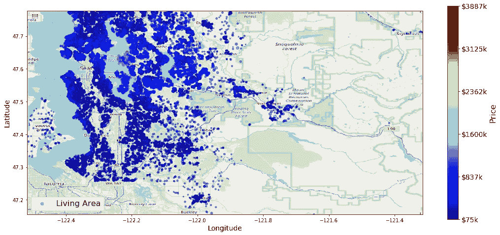
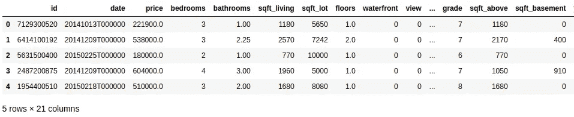
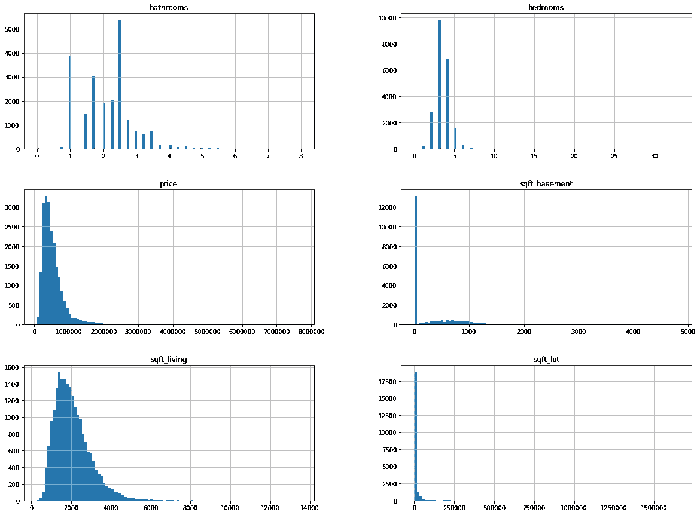
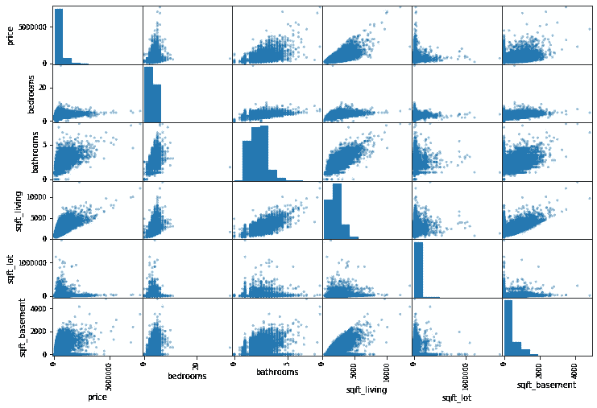

# 机器学习:模型构建的数据洞察

> 原文：<https://towardsdatascience.com/machine-learning-data-insights-for-model-building-b6bdea0ac092?source=collection_archive---------30----------------------->

## 一种数据驱动的增量式机器学习模型构建方法



在这篇文章中，我将以最简单的方式，展示一个人如何以一种递增的激情来解决一个问题。这种方法可以解释为数据驱动的方法，因为我们将依赖数据本身所寻求的信息来做出一些决策。该数据集将包含 2014 年 5 月至 2015 年 5 月期间西雅图出售的房屋价格。在本文中，我们将尝试找出价格和其他参数之间的关系。

# 获取和观察数据

数据可以来自任何来源，然而，对于这篇特定的文章，我将使用来自 [Kaggle](https://www.kaggle.com/harlfoxem/housesalesprediction) 的数据(在公共领域下可用)。我们的数据会像这样。



我们数据集中的几列

这个数据直接从 ***描述熊猫*** 的样子；

```
<class 'pandas.core.frame.DataFrame'>
RangeIndex: 21613 entries, 0 to 21612
Data columns (total 21 columns):
id               21613 non-null int64
date             21613 non-null object
price            21613 non-null float64
bedrooms         21613 non-null int64
bathrooms        21613 non-null float64
sqft_living      21613 non-null int64
sqft_lot         21613 non-null int64
floors           21613 non-null float64
waterfront       21613 non-null int64
view             21613 non-null int64
condition        21613 non-null int64
grade            21613 non-null int64
sqft_above       21613 non-null int64
sqft_basement    21613 non-null int64
yr_built         21613 non-null int64
yr_renovated     21613 non-null int64
zipcode          21613 non-null int64
lat              21613 non-null float64
long             21613 non-null float64
sqft_living15    21613 non-null int64
sqft_lot15       21613 non-null int64
dtypes: float64(5), int64(15), object(1)
memory usage: 3.5+ MB
```

# 分析数据

既然我们已经找到了数据集中的属性(或要素),我们可以绘制图表来查看可能分布的属性数量。一种方法是为每个属性绘制直方图。



直方图

查看一些属性的直方图，我们可以看到它们是分布的。事实上，这表示属性具有变化的值，从而导致预测属性(价格)的变化。为了看到我们将看到的相关性。俗称 ***皮尔逊相关系数*** 。



相关

我们可以看到 ***价格*** 多少会随着一套房子里几个地方的 ***号卧室******卫生间*** 和 ***平方英尺数字*** 而有所不同。这为我们提供了一个线索，因为这些属性作为我们模型的输入可能实际上是有意义的。请注意，我们是基于我们的数据而不是直觉做出这一决定的。很明显，价格会随着建筑面积的变化而变化。

您可能已经注意到，在我们的数据中，我们也给出了位置。我们不妨使用它们来看看位置作为输入是否有意义。对于该任务，我们可以将价格可视化为西雅图城市地图上的热图。


不同地点的价格

在上面的图中，价格以价格递增的顺序用蓝色到红色标出。虽然不是很明显，但是每个分散点的比例描述了房子覆盖的正方形区域。仅通过观察地块的颜色，我们可以说价格分布没有受到地理位置的显著影响(尽管在滨水区附近看到昂贵的房子是有意义的)。这让我们摆脱了位置信息，因为它不是决定价格的主要因素。

# 预处理数据

至于预处理步骤，我们对数据集进行标准化和缩放，使得每个属性都表示为范围 **[-1，1]** 内的一个数字。这对于使用神经网络训练模型非常有帮助。使用 **sci-kit-learn** 库本身可以很容易地逆转缩放转换。

# 建立模型

我尝试了几种使用**均方根误差(RMS)** 进行评估的模型。这是因为选择正确模型的决定可以通过选择报告最小 **RMS** 误差的模型来决定。

## 回归

回归几乎总是分析的首选。这是因为它能够为这种关系提供可靠的数学表达式。然而，在这个实验中，我的均方根误差为 0.71。虽然这个值可能没有意义，但是我们确实可以将这个值与其他模型进行比较。这里我使用了线性回归，它假设标签值和特征之间存在线性关系。

## 决策图表

决策树被训练为使用一个被遍历以估计目标值的树来挑选值。观察到的均方根误差为 0.87。这意味着模型在训练数据集中训练得太多了。我们称此为 ***过拟合*** 。这可以通过再次运行以预测返回 0.03 RMS 误差的训练数据集来确认。

## 随机森林

这可以被认为是对我们模型的改进。这是因为在随机森林中，随机的一组树被收集起来用于决策。树/估计器的数量可以预先设定。使用 100 个估值器得到的均方根误差为 0.68。我们对回归模型做了一点点改进。

## 人工神经网络

使用神经网络可以被认为是决策树的图形版本。然而，在神经网络中，我们将调整权重来估计最终输出。如果你有兴趣了解一些神经网络的基础知识，你可以阅读我以前的文章。

[](/introduction-to-neural-networks-ead8ec1dc4dd) [## 神经网络导论

### 神经网络基础

towardsdatascience.com](/introduction-to-neural-networks-ead8ec1dc4dd) 

我使用了一个非常简单的带有 Keras functional API 的架构。

```
i = tf.keras.layers.Input(8)
ix = tf.keras.layers.Dense(16, activation='relu')(i)
z = tf.keras.layers.Dense(1)(ix)model = tf.keras.Model(i, z)
model.compile(loss='mse', optimizer='sgd', metrics=['mse'])
model.summary()
tf.keras.utils.plot_model(model)
```

然而，我能够实现 0.64 的最低均方根误差。

# 结束语

*   重要的是先观察数据，而不是在整个数据集上尝试几种方法
*   有人可能会建议使用特征提取技术，如 PCA 或邻居嵌入。然而，具有除了真正相关的特征之外的特征可能会增加不必要的噪声，导致过度拟合。
*   虽然我在这篇文章中没有发现，最近邻回归可能表现良好。这是因为我们打算预测的数据很可能在训练数据的闭合范围内。

我相信这篇文章将有助于人们从可视化数据开始，并使用这些见解建立一个适当的机器学习模型。

感谢阅读。完整的 jupyter 笔记本附后。

干杯！！