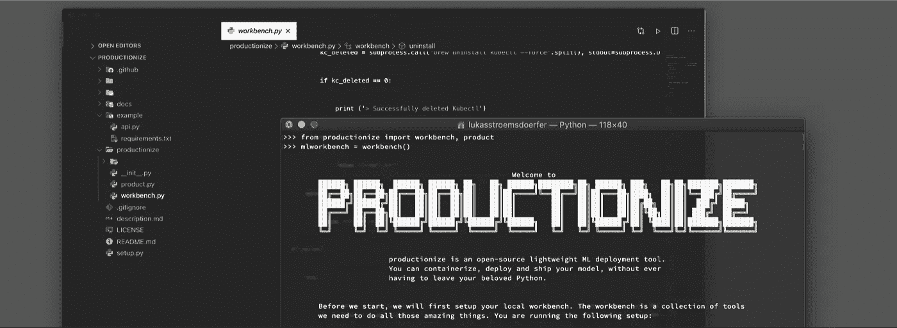
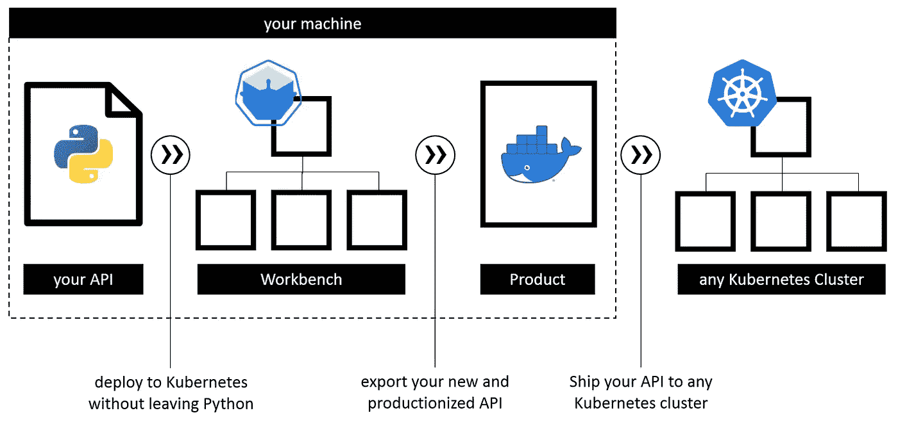
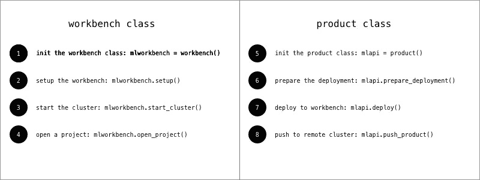

# 使用 Python 进行机器学习部署

> 原文：<https://towardsdatascience.com/machine-learning-deployment-with-python-e64a37c3155a?source=collection_archive---------58----------------------->

鸣谢:L.J. Stroemsdoerfer(无艺术家)

机器学习部署绝对是现在的热门话题。我正准备用时下最热门的模因来支持我的第一句话，然而，我觉得业内的每个人都同意我的观点。有许多很酷的方法来部署和操作 ML 模型。然而，他们大多引入新的工具，使用他们自己的生态系统。这增加了一层新的复杂性，最终可能会产生锁定效应，因为您需要调整代码以最佳地适应平台。

开源概念，比如 Docker 和 Kubernetes 在这个问题上给予了更多的自由，但是，使用起来非常复杂。因此，我构建了一个 Python 库，允许您在 Kubernetes 上专业化、测试和部署您的模型，但是您不必为此而离开 Python。听起来好得难以置信？好吧，让我们看看你是怎么想的。

# 生产化图书馆

除了这个糟糕的包名——建议是非常受欢迎的——这个包允许你做一些漂亮的事情来简化和加速你的部署体验。

我们先来看看名字朗朗上口的库是做什么的。

## 它是做什么的？

简单回答:它允许你在不离开 Python 的情况下容器化你的 ML 模型。最重要的是，它在您的机器上构建一个本地 Kubernetes 集群来测试容器化的模型是否工作正常。如果你在想，等等，我没有本地的 Kubernetes 集群，不要担心，我内置了一些函数来处理这个问题。让我们仔细看看。

要开始您的生产化之旅，您可以首先设置您的本地“工作台”,我称之为“工作台”。这是一个小型集群，带有 Docker 注册表，运行在您机器上的 VM 中。任何以前做过这种噱头的人都知道，这样做有点烦人。使用 productionize，这是两行 Python 代码。

生产化的工作流。

一旦这个“工作台”开始运行，productionize 库就需要一个已经内置在 API 结构中的 ML 模型。为此，您可以使用 Flask 等工具，也可以使用其他工具。然而，我肯定会推荐 Flask，因为我真的很喜欢它的轻量级方法。

有了几行 Python 代码，您就可以将 API 容器化，并将其部署到本地工作台中进行测试。如果一切正常，那么您可以将容器推送到您可能喜欢的任何 Kubernetes 集群。那么，让我们来看看代码。

## 你怎么能这样做？

首先，您需要安装托管在 PyPi 上的库。我目前不支持康达，请原谅我。

之后，就可以导入库了。请注意，该库目前不支持 Jupyter 笔记本电脑，因为我没有使用 Jupyter 内核来设置虚拟机，Minikube 集群和所有其他细节组件。

该库包含两个主要的类。第一个是`workbench()`类，它负责在您的机器上完成所有这些令人惊奇的事情所需的工具。第二个是`product()`类，它处理你的 API 和它的容器化。

让我们从设置工作台开始。`workbench()`类将为你安装、管理和卸载 Docker、VirtualBox、Kubectl 和 Minikube。首先，我们初始化这个类。这将检查您的本地机器上的上述组件，并标记那些要安装的组件。

现在，我们可以安装缺少的组件，并对它们进行配置，使它们能够很好地相互协作。在接下来的步骤中，您可能需要输入您的 sudo 密码。

如果这一步出错，我为此添加了一个调试方法。假设 Minikube 安装失败，您可以运行:

一旦设置步骤完成，您就可以启动工作台，这实际上启动了您机器上的 Minikube 集群。

接下来，您应该在工作台上创建一个项目，这会创建一个 Kubernetes 名称空间。我建议你这样做，这会在你的集群上产生一些秩序感。

如果您厌倦了您的工作台，您可以使用`stop_cluster()`方法轻松地停止集群，甚至可以使用`uninstall()`方法干净地删除所有不需要的组件。

现在让我们继续学习`product()`课程。这个类将您的 ML API 转换成一个容器，并将其部署到工作台。首先，我们必须初始化这个类:

您现在可以准备部署了，这实际上将创建一个 Dockerfile 文件。我添加了这个中间步骤，以便您可以根据需要编辑 Dockerfile 文件。

无论您是否编辑了 docker 文件，现在都可以使用`deploy()`方法将它部署到本地工作台。

这将在 Minikube 注册表上创建 Docker 映像，使用您的容器部署一个 pod，并将服务公开给外部。在`deploy()`方法的输出中，您会找到指向您的 API 的链接。你可以用它来测试你的模型是否工作正常。如果是的话，你可以把它推到任何你想要的 Kubernetes 集群。您可以使用`push_product()`方法并传递您的 Kubernetes 集群的注册表链接来实现。

好吧，那是很多。我知道这个结构有点复杂，所以又总结了一遍。

将工作流程生产化到最佳状态。

GitHub 和 PyPi 上有更多的信息和文档。你可以去看看。此外，当然还有一些有趣的复活节彩蛋。

## 下一步是什么？

正如你所看到的，这个库提供了一些不错的特性，但是，它还远远没有完成。目前，productionize 只在 macOS 上运行。这是因为我使用家酿作为主要的软件包管理器。我已经在为 Ubuntu 开发一个版本了。任何 linux 发行版都是可管理的，然而，Windows 将是一个相当大的挑战。因此，如果你有建议或想法，请让我知道。此外，如果你给我一个关于[https://github.com/LJStroemsdoerfer/productionize](https://github.com/LJStroemsdoerfer/productionize)的问题，我会非常乐意处理任何 bug。