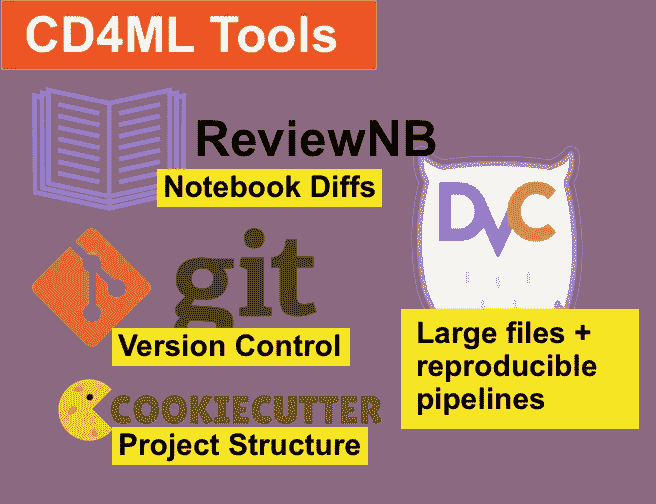
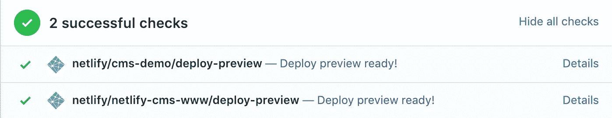

# 机器学习值得拥有自己的持续交付风格

> 原文：<https://towardsdatascience.com/machine-learning-deserves-its-own-flavor-of-continuous-delivery-f4d1e76e6b69?source=collection_archive---------47----------------------->


[mmmswan](https://www.flickr.com/photos/mmmswan/28748241471/in/photolist-KNofBH-tjN5d-briK-7zjGac-NeexZp-N6EigF-NbaaVm-NbabRj-9SKprC-mE6KX-6XXXb-5VCSSt-8xFSz7-22JiiTm-5m75xP-8JzGzD-TFwEtu-2cCPZ3u-cGuyWh-dEqo69-9Aifku-9Aio9E-9Aio9G-9AifkJ-9Aio9u-23fg5AV-9Afvxa-9AifkQ-9AifkA-vjAUUy-9Aio9w-c6am4u-f556iB-9AifkC-zdd9yh-9Aifkm-bqnHnV-bCBBGz-zfwfYU-kmTxiv-fa3gc-2iGAYQ8-9pi2rc-WZA3HP-Aia6cH-2iQ1qiU-yHgXj-KKSMeC-vFMGN-iwTqBo) via [flickr](https://www.flickr.com/search/?license=2%2C3%2C4%2C5%2C6%2C9&advanced=1&text=%22assembly%20line%20%22)

当作为一个美国人在加拿大旅行时，事情感觉略有不同，但却惊人地相似。例如，麦当劳吸管上的红色竖线要粗一些。这很像我作为一名软件工程师在数据科学领域的旅行。

**虽然数据科学世界很神奇，但我很怀念古典软件项目中** [**连续交付(CD)**](https://en.wikipedia.org/wiki/Continuous_delivery) **的精炼状态。**什么是持续交付？

马丁·福勒[说](https://www.martinfowler.com/bliki/ContinuousDelivery.html#footnote-when) **当**发生以下情况时，您正在进行连续交付:

1.  您的软件在其整个生命周期中都是可部署的
2.  你的团队优先考虑保持软件的可部署性，而不是开发新的特性
3.  任何人都可以在任何时候对他们的系统进行更改时获得快速、自动化的生产就绪性反馈
4.  您可以按需将任何版本的软件部署到任何环境中

对于一个部署到 [Heroku](http://heroku.com) 的小规模软件项目来说，持续交付(以及它的超级活跃的兄弟[持续*部署*](https://www.martinfowler.com/bliki/ContinuousDelivery.html#footnote-when) )是一幅轻松优雅的画面。您可以在几分钟内设置好 [CI](https://devcenter.heroku.com/articles/heroku-ci) ，这意味着您的单元测试会在每次推送 git repo 时运行。你让 [Review Apps](https://devcenter.heroku.com/articles/github-integration-review-apps) 预览来自 GitHub pull 请求的应用。最后，每个`git push` to master 都会自动部署你的 app。所有这一切只需要不到一个小时的时间来配置。

现在，为什么同样的过程不适用于我们缠绕在单个*`predict`函数上的纠结的纱线团呢？嗯，数据科学的世界不容易理解，除非你深入到它的内部省份。**让我们看看为什么我们需要**[**CD4ML**](https://martinfowler.com/articles/cd4ml.html)**以及你今天如何在你的机器学习项目中实现它。***

# *为什么经典 CD 不适用于机器学习*

*我在一个机器学习项目中看到了 6 个关键差异，它们使得经典软件 CD 系统难以应用:*

# *1.机器学习项目有多种可交付成果*

*不像传统的软件项目仅仅是为了交付应用程序而存在，机器学习项目有多种交付方式:*

*   *ML 模型——经过训练和序列化的模型，每个模型都有评估指标。*
*   *web 服务—通过 HTTP API 提供模型推理结果的应用程序。*
*   *报告—生成的分析结果(通常来自笔记本),总结了关键发现。这些可以是静态的，也可以是使用像 [Streamlit](https://www.streamlit.io) 这样的工具进行交互的。*

*拥有多个可交付成果——每个都有不同的构建过程和最终演示——比编译单个应用程序更复杂。因为其中的每一个都是彼此紧密耦合的——并且与数据紧密耦合——为每一个都创建单独的项目是没有意义的。*

# *2.笔记本很难复习*

*git 分支上的代码审查是如此普遍，它们被[烘烤到 GitHub](https://github.com/features/code-review/) 和其他托管版本控制系统中。GitHub 的代码审查系统对于`*.py`文件来说很棒，但是对于查看 JSON 格式文件的更改来说很糟糕。可惜笔记本文件(`*.ipynb`)就是这么存的。这尤其令人痛苦，因为笔记本——而不是将逻辑抽象成`*.py`文件——是几乎所有数据科学项目的起点。*

# *3.测试不是简单的通过/失败*

*Elle O'Brien 介绍了使用 CI 进行模型评估的模糊性。*

*通过对代码分支运行单元测试套件，很容易指出一个经典软件 git 分支是否可以合并。这些测试包含简单的真/假断言(例如:“用户可以注册吗？”).模型评估更加困难，通常需要数据科学家手动审查，因为评估指标通常会向不同的方向变化。这个阶段更像是经典软件项目中的代码审查。*

# *4.实验对比 git 分支*

*传统项目中的软件工程师在处理 bug 或增强时会创建小的、集中的 git 分支。虽然分支是轻量级的，但是它们不同于模型训练实验，因为它们通常最终被部署。模型实验？像鱼卵一样，绝大多数永远见不到开阔的水域。此外，与传统软件 git 分支相比，实验可能只有很少的代码更改(例如:调整一个超参数)。*

# *5.非常大的文件*

*大多数 web 应用程序不在它们的 git 存储库中存储大文件。大多数数据科学项目都是如此。数据几乎总是需要这样。模型可能也需要这样做(在 git 中保存二进制文件也没有什么意义)。*

# *6.可再现输出*

*对于传统软件项目的任何开发人员来说，重现应用程序在任何时间点的状态都很容易。该应用程序通常只在两个方面发生变化——代码和数据库的结构。在 ML 项目中很难达到一个可再现的状态，因为许多维度都可以改变(数据量、数据模式、特征提取和模型选择)。*

# *一个简单的 CD 系统如何寻找机器学习？*

**

*使 CD4ML 变得生动的一些工具。*

*在优秀的[机器学习](https://martinfowler.com/articles/cd4ml.html)连续交付中， [Thoughtworks](https://www.thoughtworks.com/) 团队提供了一个[示例 ML 应用](https://github.com/ThoughtWorksInc/cd4ml-workshop)，它展示了一个 CD4ML 实现。让它运行起来涉及到许多移动部件:GoCD、Kubernetes、DVC、Google Storage、MLFlow、Docker 和 EFK 堆栈(ElasticSearch、FluentD 和 Kibana)。对于 Throughworks 的企业客户来说，组装这 10 个部分是容易做到的，但是对于较小的组织来说就有些困难了。**精益组织如何实施 CD4ML？***

*以下是我的建议，按照我首先要做的事情排序。早期的项目更容易接近。后面的项目建立在基础之上，在适当的时候增加更多的自动化。*

# *1.从 Cookiecutter 数据科学开始*

> *在创建一个新的 Rails 项目之前，没有人会无所事事地去弄清楚他们想把自己的视图放在哪里；他们只是像其他人一样运行 rails new 来获得一个标准的项目框架。*

**via*[*Cookiecutter 数据科学*](https://drivendata.github.io/cookiecutter-data-science/)*

*当我查看现有 Ruby on Rails 应用程序的源代码时，我可以很容易地浏览，因为它们都遵循相同的结构。不幸的是，大多数数据科学项目不使用共享的项目框架。然而，事情并不一定是这样的:从《烹饪与数据科学》开始你的数据科学项目，而不是想象出你自己独特的结构。*

*Cookiecutter Data Science 建立了一个适用于大多数项目的项目结构，创建了像`data`、`models`、`notebooks`和`src`这样的目录(用于共享源代码)。*

# *2.nbdime 或 ReviewNB 获得更好的笔记本代码审查*

**

*nbdime 是一个 Python 包，使得查看笔记本文件中的更改更加容易。*

*很难在标准的比较工具中查看对`*.ipynb`的更改。对一个`*.py`脚本进行代码审查是微不足道的，但是对于一个 JSON 格式的笔记本来说几乎是不可能的。 [nbdime](https://nbdime.readthedocs.io/en/latest/) 和 [ReviewNB](https://www.reviewnb.com/) 让这个过程更容易。*

# *3.数据文件的 dvc*

```
*dvc add data/ git commit -ma "Storing data dir in DVC" git push dvc push*
```

*安装 dvc 并添加遥控器后，以上就是用 dvc 对您的`data/`目录进行版本控制所需的全部内容。*

*很容易提交大文件(esc。数据文件)复制到 git repo。Git 不能很好地处理大文件:它降低了速度，会导致回购文件的大小快速增长，而且无论如何你都不能真正地查看这些文件的差异。一个获得大量大文件版本控制的解决方案是[数据版本控制(dvc)](https://github.com/iterative/dvc) 。dvc 易于安装(只需使用`pip`)并且其命令结构模仿 git。*

***但是等等——您直接从数据仓库中查询数据，并且没有大型数据文件？这是不好的，因为它几乎保证了你的 ML 项目是不可复制的:数据和模式的数量几乎保证会随着时间而改变。相反，将这些查询结果转储到 CSV 文件中。存储很便宜，dvc 可以轻松处理这些大文件。***

# *4.用于可再生训练管道的 dvc*

*dvc 不仅仅适用于大文件。正如 Christopher Samiullah [在*数据科学版本控制(DVC)* 的第一印象](https://christophergs.com/machine%20learning/2019/05/13/first-impressions-of-dvc/#pipelines)中所说:*

> *管道是 DVC 区别于其他能够处理大数据文件的版本控制工具的真正开始。DVC 流水线是典型的机器学习工作流(例如，数据加载、清理、特征工程、训练等)中有效的版本控制步骤。)，以及预期的依赖项和输出。*

*您可以使用创建一个包含培训渠道的渠道阶段:*

```
*dvc run -f train.dvc \ -d src/train.py -d data/ \ -o model.pkl \ python src/train.py data/ model.pkl*
```

*`dvc run`命名这个阶段`train`，依赖`train.py`和`data/`目录，输出一个`model.pkl`模型。*

*稍后，您只需运行以下管道:*

```
*dvc repro train.dvc*
```

*这就是“可再生”的由来:*

*   *如果依赖关系没有改变，那么`dvc repo`只需从远程存储中获取`model.pkl`。没有必要再次运行整个培训管道。*
*   *如果依赖关系改变了，那么`dvc repo`会警告我们并重新运行这个步骤。*

*如果您想回到先前的状态(假设您有一个`v1.0` git 标签):*

```
*git checkout v1.0 dvc checkout*
```

*运行`dvc checkout`会将`data/`目录和`model.pkl`恢复到之前的状态。*

# *5.将慢速培训管道移至 CI 集群*

*在[重塑 DevOps](https://www.youtube.com/watch?v=0MDrZpO_7Q4&list=PLVeJCYrrCemgbA1cWYn3qzdgba20xJS8V&index=6) 中，Elle O’brien 为使用 CI 来运行模型训练做了一个优雅的案例。我认为这很棒——CI 已经被用于在云中运行经典的软件测试套件。为什么不使用云中可用的更大的资源来为您的模型培训管道做同样的事情呢？简而言之，用您想要的实验变更来推进一个分支，并让 CI 进行训练和报告结果。*

*Christopher Samiullah [还涵盖了将培训转移到 CI](https://booklet.ai/blog/continuous-delivery-machine-learning-cd4ml/Samiullah) 的内容，甚至提供了一个在 CI 流程中使用`dvc repo train.dvc`的 [GitHub PR](https://github.com/ChristopherGS/dvc_test/pull/1) 的链接。*

# *6.交付物特定的审核应用程序*

**

*Netlify 是一个针对静态站点的 PaaS，它允许您直接从 GitHub pull 请求中查看站点的当前版本。*

*像 Heroku 和 Netlify 这样的平台允许您直接从 GitHub pull 请求中查看应用程序的运行版本。这对于验证事情是否按预期运行是非常棒的。这对于向非技术团队成员展示工作非常有用。*

*使用 GitHub 动作做同样的事情，启动 Docker 容器来为您的交付服务。我会启动 web 服务和任何动态版本的报告(比如用 [Streamlit](http://www.streamlit.io) 构建的东西)。*

# *结论*

*就像健康饮食、刷牙、呼吸新鲜空气一样，在软件项目中实现持续交付没有任何负面影响。我们不能在机器学习项目上复制和粘贴经典的软件 CD 过程，因为 ML 项目将大型数据集联系在一起，这是一个缓慢的训练过程，不会生成明确的通过/失败验收测试，并且包含多种类型的可交付成果。相比之下，一个经典的软件项目只包含代码，并且只有一个可交付成果(一个应用程序)。*

*令人欣慰的是，现在有可能用现有的工具(git、Cookiecutter Data Science、nbdime、dvc 和 CI server)为非企业组织创建一个机器学习特定风格的连续交付( [CD4ML](https://martinfowler.com/articles/cd4ml.html) )。*

***CD4ML 在行动**？*我很想举一个机器学习项目的例子，它在 GitHub 上实现了一个精简的 CD4ML 堆栈，但是我在观众面前表现得更好。* [***订阅此处，在示例应用程序构建完成时收到通知！***](http://eepurl.com/gXANt5)*

# *在别处*

*   *[机器学习的持续交付](https://martinfowler.com/articles/cd4ml.html) —如果没有丹尼尔·佐藤(Daniel Sato)、阿里夫·布罗德(Arif Wider)和克里斯托弗·温德乌瑟(Christoph Windheuser)的原创作品，这篇博文(以及 CD4ML 的首字母缩写)就不会存在。*
*   *[数据科学版本控制(DVC)的第一印象](https://christophergs.com/machine%20learning/2019/05/13/first-impressions-of-dvc/#pipelines) —这是一个很好的技术演练，将现有的 ML 项目迁移到使用 DVC 来跟踪数据、创建管道、版本控制和 CI。*
*   *[Elle O ' brien 的《为 ML 重新想象 devo PS》](https://www.youtube.com/watch?v=0MDrZpO_7Q4&list=PLVeJCYrrCemgbA1cWYn3qzdgba20xJS8V&index=6)—一个简明的 8 分钟 YouTube 演讲，概述了一种使用 CI 为模型训练实验训练和记录指标的新方法。*
*   *[如何在 2020 年使用 Jupyter 笔记本电脑](https://ljvmiranda921.github.io/notebook/2020/03/06/jupyter-notebooks-in-2020/) —这是一个全面的三部分系列，介绍数据科学项目架构、最佳实践以及工具生态系统如何相互配合。*

**原载于 2020 年 4 月 17 日*[*https://booklet . ai*](https://booklet.ai/blog/continuous-delivery-machine-learning-cd4ml/)*。**