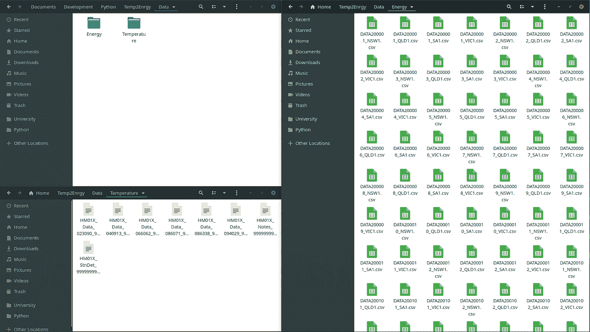
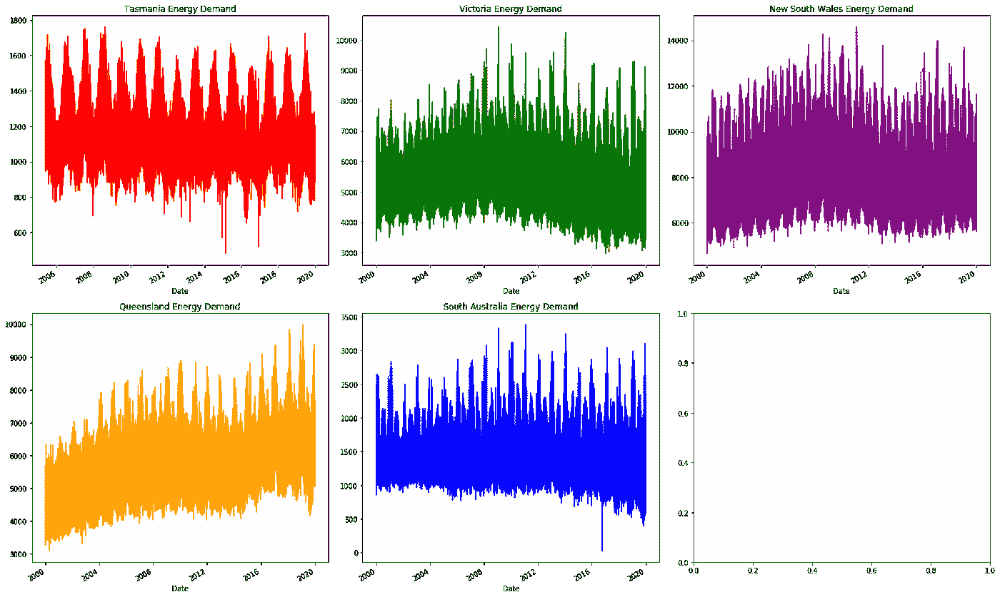
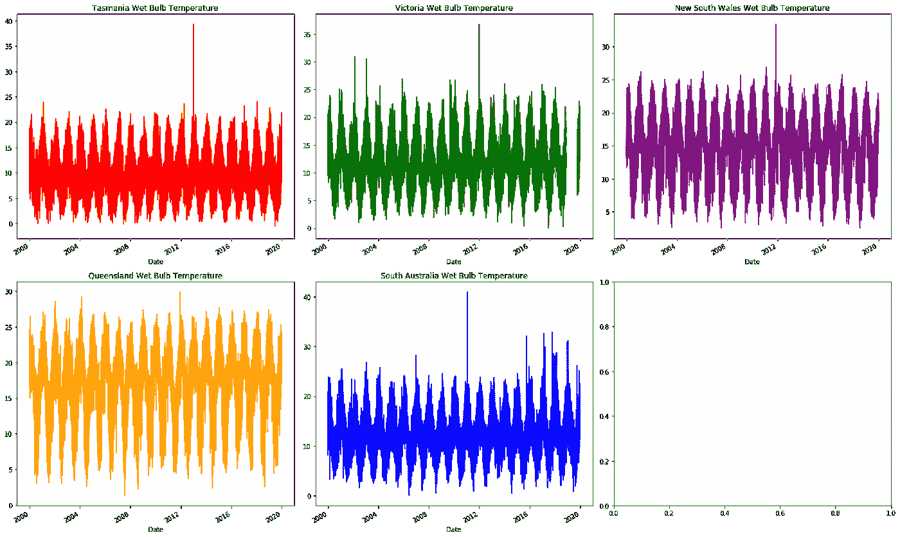
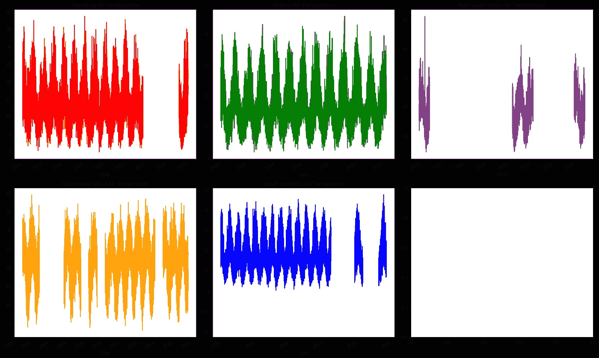

# 机器学习能源需求预测项目—第一部分数据清理

> 原文：<https://towardsdatascience.com/machine-learning-energy-demand-prediction-project-part-1-data-cleaning-841a7b657723?source=collection_archive---------45----------------------->

让我们看看我们的[机器学习](https://www.kamwithk.com/machine-learning-field-guide-ckbbqt0iv025u5ks1a7kgjckx)、[项目规划](https://www.kamwithk.com/insight-is-king-how-to-get-it-and-avoid-pitfalls-ckbjfohz201ujzqs1lwu5l7xd)和[基本编码工具](https://www.kamwithk.com/the-complete-coding-practitioners-handbook-ck9u1vmgv03kg7bs1e5zwit2z)如何在现实世界的项目中实现！今天，我们将讨论如何利用温度数据来预测我们每天消耗的能量。我们从**导入和清理数据开始，然后绘制和描述我们的能源使用情况，最后建模**。

这是三个中的第一部分。请随意编码，完整的项目在 [GitHub](https://github.com/KamWithK/Temp2Enrgy) 上。


马太·亨利在 [Unsplash](https://unsplash.com/photos/yETqkLnhsUI) 上的照片

我们早上醒来，打开加热器/空调，从冰箱里找到一些酸奶做早餐，刮胡子，打开电脑，打开音乐，最后开始工作。这些任务都有一个共同点——它们使用电力！我们对电力的严重依赖使得估算我们每天需要产生多少能量变得至关重要。

但是，如果这看起来很有挑战性，不要担心。我们会一步一步来。在每个阶段，链接回它与我们的 [ML 领域指南](https://www.kamwithk.com/machine-learning-field-guide-ckbbqt0iv025u5ks1a7kgjckx)的关系。

我们从寻找能量和温度数据开始(没有它我们做不了什么😊).我们的是从气象局和澳大利亚能源市场运营商，但请复制另一个国家(即美国)的过程。在快速而轻松的下载之后(幸运的我们)，我们可以简单地回顾一下我们的电子表格。但是看看这些数据就可以发现一个可怕的事实——要处理的事情实在是太多了！数字无情的细胞，更多的数字和类别，真的让人应接不暇。我们如何将一系列电子表格组合在一起，以及我们如何能够对其进行分析、学习或建模，都不是很清楚。

作为乐观的人，我们首先记下数据是如何组织的。包含文件的文件夹，它们在哪里，每个文件包含什么。将我们对数据结构的理解与[导入技术](https://www.kamwithk.com/machine-learning-field-guide-ckbbqt0iv025u5ks1a7kgjckx#chapter-1-importing-data)结合起来，自然会让我们克服第一个恐惧——用代码提供对数据的轻松访问。

接下来，我们寻求消除笨拙的混乱。我们需要*清理温度&能量数据*，确定哪些信息对我们的净能量使用有最大的影响！它又一次从对电子表格的简单观察开始，以粗略地掌握当前的数据类型。我们特别感兴趣的是发现奇怪的怪癖/重复出现的模式，这些模式 ***可以表明*有问题**。一旦我们跟踪了每一个预感，我们就能对问题的根源更加自信。这让我们能够自信地*决定直接删除、保留和快速修复什么*🤔(我们不想去兰博👹对一切)。简单的统计数据和图表构成了这一分析的基础！

此时，我们已经成功地完成了项目的第一个也是最重要的部分！在短暂的庆祝之后，我们可以继续合并两个独立的数据集(一个用于能量，一个用于温度)。这使我们能够将两者联系起来。最后，我们能够描绘出我们在每个令人羡慕的日子、月份和年份中如何使用能源的故事…借助于我们在图表中看到的趋势和模式！究竟什么会更令人满意？嗯，几件事…但我们不要忘记创建一个模型(这将是有趣的)炫耀给我们所有的朋友！让我们不要操之过急，虽然…这都将在未来两个教程。

# 第 1 章—导入数据

> *数据有各种各样的形状和大小，所以我们用来将所有东西编码的过程经常会有所不同。*

通过分析可用的文件，我们发现了**我们的数据是如何构成的**。我们从高层次开始，注意到有许多 CSV 格式的温度和能量电子表格。尽管数量惊人，但这只是因为数据被分成了小块。每个 CSV 都是上一个 CSV 的延续。实际温度电子表格包含日期，以及各种温度、湿度和降雨量的测量值。我们的能源文件要简单得多，只包含日期、能源需求历史、价格(RRP)以及数据是手动还是自动记录的。测量是在 30 分钟的基础上进行的。



> *各个击破！*

正如我们所见，所有这些信息汇集在一起，形成了对原始数据的直观理解。当然，我们*还不了解执行分析所需的一切，但我们有足够的东西从原始数据过渡到可用代码* 🥳！

为了转换成代码，我们将我们的发现与我们的[导入技术](https://www.kamwithk.com/machine-learning-field-guide-ckbbqt0iv025u5ks1a7kgjckx#chapter-1-importing-data)进行比较。我们知道我们有一个要合并的电子表格列表，所以我们可以首先形成列表，然后使用 Pandas `concat`将它们堆叠在一起。

```
energy_locations = os.listdir("../Data/Energy")
temperature_locations = os.listdir("../Data/Temperature")

energy_CSVs = [pd.read_csv("../Data/Energy/" + location) for location in energy_locations]
temperature_CSVs = [pd.read_csv("../Data/Temperature/" + location) for location in temperature_locations if "Data" in location]energy_data = pd.concat(energy_CSVs, ignore_index=True)
temperature_data = pd.concat(temperature_CSVs, ignore_index=True)
```

现在，信不信由你，我们已经完成了 90%的导入，唯一剩下的就是确保我们的特性(列)被简洁一致地命名。通过重命名我们的列(如下所示)，我们可以清楚地了解每列中的内容。未来的我们一定会感激不尽！

```
energy_data.columns
temperature_data.columnsIndex(['REGION', 'SETTLEMENTDATE', 'TOTALDEMAND', 'RRP', 'PERIODTYPE'], dtype='object')
Index(['hm', 'Station Number', 'Year Month Day Hour Minutes in YYYY', 'MM',
       'DD', 'HH24', 'MI format in Local time',
       'Year Month Day Hour Minutes in YYYY.1', 'MM.1', 'DD.1', 'HH24.1',
       'MI format in Local standard time',
       'Precipitation since 9am local time in mm',
       'Quality of precipitation since 9am local time',
       'Air Temperature in degrees C', 'Quality of air temperature',
       'Wet bulb temperature in degrees C', 'Quality of Wet bulb temperature',
       'Dew point temperature in degrees C',
       'Quality of dew point temperature', 'Relative humidity in percentage %',
       'Quality of relative humidity', 'Wind speed in km/h',
       'Wind speed quality', 'Wind direction in degrees true',
       'Wind direction quality',
       'Speed of maximum windgust in last 10 minutes in  km/h',
       'Quality of speed of maximum windgust in last 10 minutes',
       'Mean sea level pressure in hPa', 'Quality of mean sea level pressure',
       'Station level pressure in hPa', 'Quality of station level pressure',
       'AWS Flag', '#'],
      dtype='object')energy_data.columns = ["Region", "Date", "TotalDemand", "RRP", "PeriodType"]
temperature_data.columns = [
    "HM", "StationNumber", "Year1", "Month1", "Day1", "Hour1", "Minute1", "Year", "Month", "Day", "Hour", "Minute", "Precipitation", "PrecipitationQuality",
    "AirTemperature", "AirTemperatureQuality", "WetBulbTemperature", "WetBulbTemperatureQuality", "DewTemperature", "DewTemperatureQuality", "RelativeHumidity",
    "RelativeHumidityQuality", "WindSpeed", "WindSpeedQuality", "WindDirection", "WindDirectionQuality", "WindgustSpeed", "WindgustSpeedQuality", "SeaPressure",
    "SeaPressureQuality", "StationPressure", "StationPressureQuality", "AWSFlag", "#"
]
```

现在骄傲吧，因为我们刚刚完成了旅程的第一部分！现在我们已经开始行动了，从现在开始事情会变得更加顺利。

# 第 2 章—数据清理

# 格式化数据

> 每个人都会被丢失的数据逼疯，但隧道的尽头总会有一线光明。

有好消息也有坏消息，所以我先从好消息说起。我们已经经历了把所有东西都放在一起的初始阶段，所以我们现在对我们可以获得什么/如何获得它有一个基本的了解。我们可以使用`energy_data`和`temperature_data`数据框查看我们的数据！

现在是坏消息。虽然我们可能还没有注意到，但我们的数据远非完美。我们有大量缺失的(空的)单元格，以及重复的和格式错误的数据。但是不要灰心，因为这不是一场罕见的大灾难:它一直都在发生😎(有什么不喜欢的？)😎。

这个过程看起来很危险，因为一切看起来都…一团糟。现在洞察力和经验确实很有帮助，但是但是…这并不意味着对我们凡人来说这是不可能的！我们可以做一件事来克服这一点——像疯狂的科学家一样工作！我们可以识别数据集的怪癖/问题，然后测试我们想到的每一种技术🤯。我们的技术来自[现场指南](https://www.kamwithk.com/machine-learning-field-guide-ckbbqt0iv025u5ks1a7kgjckx#chapter-2-data-cleaning)(永远不要重新发明轮子)！

只是为了确保我们没有跑偏，下面是我们正在寻找的问题:

*   完全空的列/行
*   重复值
*   不准确/通用的数据类型

是的，现在只有三个，但是…别忘了我们不会稳健分析！因此，实际上以一种具体的方式处理这些问题确实需要一点努力(不要太狡猾，那是留给政治家的权利——无意冒犯)。

*最后声明——有很多东西需要理解，所以请深呼吸，喝点咖啡，慢慢寻找规律。*

```
energy_data
temperature_data
```

我们可以看到像`PrecipitationQuality`和`HM`这样的列似乎始终具有相同的值。为了修正这一点，我们可以删除具有两个或更少唯一元素的列。

```
def remove_non_uniques(dataframe: pd.DataFrame, filter = []):
    remove = [name for name, series in dataframe.items() if len(series.unique()) <= 2 and not name in filter]
    dataframe.drop(remove, axis=1, inplace=True)
    return remove

print("Removed:")
remove_non_uniques(energy_data)
remove_non_uniques(temperature_data)Removed:
['PeriodType']

['HM',
 'PrecipitationQuality',
 'AirTemperatureQuality',
 'WetBulbTemperatureQuality',
 'DewTemperatureQuality',
 'RelativeHumidityQuality',
 'WindSpeedQuality',
 'WindDirectionQuality',
 'WindgustSpeedQuality',
 'SeaPressureQuality',
 'StationPressureQuality',
 '#']
```

也可以删除重复的行。这简单多了！

```
energy_data.drop_duplicates(inplace=True)
temperature_data.drop_duplicates(inplace=True)
```

最后一件事是检查我们的数据类型。这在这里似乎没有必要，但是建模和图形库对数据类型非常敏感。

这个过程非常简单，查看列/它包含的内容，然后将其与实际的数据类型进行比较。对于大量的列，最好从查看日期和类别开始，因为它们几乎总是被误解(作为对象、浮点数或整数)。一般来说，`object`应该只用于字符串。

```
energy_data.dtypes
temperature_data.dtypesRegion          object
Date            object
TotalDemand    float64
RRP            float64
dtype: object

StationNumber          int64
Year1                  int64
Month1                 int64
Day1                   int64
Hour1                  int64
Minute1                int64
Year                   int64
Month                  int64
Day                    int64
Hour                   int64
Minute                 int64
Precipitation         object
AirTemperature        object
WetBulbTemperature    object
DewTemperature        object
RelativeHumidity      object
WindSpeed             object
WindDirection         object
WindgustSpeed         object
SeaPressure           object
StationPressure       object
AWSFlag               object
dtype: object
```

在我们的例子中，我们有不止一组日期，而是两个(该死的，BOM 数据收集团队需要冷静)🥴.正如我们预测的那样，日期是整数，分布在多个列中(一个表示年，一个表示月、日、小时和分钟)。

我们可以先去掉重复的日期集(第二个是因为夏令时)，然后我们可以解析剩余的日期列。这以我们期望的良好有序的方式格式化了我们的数据！

```
# Remove extra dates
temperature_data.drop(["Year1", "Month1", "Day1", "Hour1", "Minute1"], axis=1, inplace=True)

# Reformat dates into Pandas' datatime64 objects
# Replacing old format
temperature_data["Date"] = pd.to_datetime(temperature_data[["Year", "Month", "Day", "Hour", "Minute"]])
energy_data["Date"] = pd.to_datetime(energy_data["Date"])

temperature_data.drop(["Year", "Month", "Day", "Hour", "Minute"], axis=1, inplace=True)
```

现在，我们还可以看到一些关于站号(在哪里进行测量)、`AWSFlag`(是否手动收集数据)、温度、湿度、压力和降水测量的问题。我们确实需要改变这些数据类型，但是这样做我们需要稍微脱离书本，因为使用标准的`.astype("category")`转换数据类型会抛出一些错误。我们可以通过记下投诉的内容、解释投诉原因，然后尝试再次运行上述功能来解决这些问题。

为了确保我们都在同一页上，下面是我们正在处理的错误的简短摘要:

*   前导/尾随空格(因此“12”变成了“12”)
*   随机标签偶尔会出现(所以 99.99%的单元格会包含数字，但其中一个会包含“###”)
*   有少量缺失的分类数据

我们可以通过使用`.str.strip()`删除前导和尾随空格。接下来，要删除 rouge 标签，我们可以使用 Pandas 的`replace`函数用`np.NaN`(用于空数据的默认数据类型)覆盖它。最后，我们可以假设任何丢失的数据都是手工收集的(最坏的情况)。`fillna`和`replace`函数都是需要的，因为熊猫对`np.NaN`和空字符串("")的处理是不同的。

```
def to_object_columns(lambda_function):
    string_columns = temperature_data.select_dtypes("object").columns
    temperature_data[string_columns] = temperature_data[string_columns].apply(lambda_function)to_object_columns(lambda column: column.str.strip())

temperature_data["AWSFlag"] = temperature_data["AWSFlag"].replace("", 0).astype("category")
temperature_data["AWSFlag"].fillna(0, inplace=True)
temperature_data["RelativeHumidity"] = temperature_data["RelativeHumidity"].replace("###", np.NaN)

to_object_columns(lambda column: pd.to_numeric(column))temperature_data.dtypesStationNumber                  int64
Precipitation                float64
AirTemperature               float64
WetBulbTemperature           float64
DewTemperature               float64
RelativeHumidity             float64
WindSpeed                    float64
WindDirection                float64
WindgustSpeed                float64
SeaPressure                  float64
StationPressure              float64
AWSFlag                     category
Date                  datetime64[ns]
dtype: object
```

我们还可以做最后一件事来改进数据的格式。这是为了确保用于标识温度和能量测量位置的列使用相同的类别。

因为我们每个地区只有一个电台，所以我们可以用简短的地区代码来代替单独的地区代码。请注意，这些信息是在数据集注释中提供的(不要担心，我们不需要记住 94029 是指维多利亚)。要进行这些转换，我们只需创建两个字典。每个键-值对表示旧代码，以映射到新代码(因此将“SA1”映射到“SA”，将 23090 映射到“SA”)。Pandas `map`函数完成剩下的工作。

```
energy_data["Region"].unique()
temperature_data["StationNumber"].unique()array(['VIC1', 'SA1', 'TAS1', 'QLD1', 'NSW1'], dtype=object)
array([94029, 86071, 66062, 40913, 86338, 23090])region_remove_number_map = {"SA1": "SA", "QLD1": "QLD", "NSW1": "NSW", "VIC1": "VIC", "TAS1": "TAS"}
station_to_region_map = {23090: "SA", 40913: "QLD", 66062: "NSW", 86071: "VIC", 94029: "TAS", 86338: "VIC"}

temperature_data["Region"] = temperature_data["StationNumber"].map(station_to_region_map)
energy_data["Region"] = energy_data["Region"].map(region_remove_number_map)

temperature_data.drop("StationNumber", axis=1, inplace=True)
```

关于我们的数据格式化的最后一点需要注意的是(承诺)。我们目前没有以任何特定的方式索引/排序我们的数据，即使它是一个时间序列。所以我们可以用`set_index`来改变它。

```
energy_data.set_index("Date", inplace=True)
temperature_data.set_index("Date", inplace=True)
```

# 处理缺失数据

到目前为止，我们已经确保我们所有的数据都可以轻松访问，没有任何麻烦。我们已经确保所有东西的格式都是正确的，现在我们可以使用它了…嗯，算是吧。虽然我们的数据格式正确，但这并不意味着它是有意义的、有用的，甚至是存在的！

我们可以度过这个难关，我们只需要有战略眼光。这里要记住的关键是:

> 不要做不必要的工作！

**我们的最终目标不是修复一切，而是删除那些绝对无用的东西，提高那些可能特别有趣/有用的东西的质量**。这个过程有助于我们知道我们正在做出可靠的、概括的和合理的预测或解释(否则整个过程就没有什么意义了)。

一个很好的方法是使用图表。通过可视化我们的数据，我们可以很容易地发现哪里缺少数据，哪里存在异常值，哪里两个特征相关。当然，我们不能在一个图上做*所有这些，所以我们将从寻找缺失的数据开始。大间隙或频繁间隙的部分是我们正在寻找的潜在问题区域。如果这些不存在(即很少或没有丢失数据)，那么我们的工作就会减少。*

请记住，我们有两个数据集(不是一个)，按州分类！由于数据是以不同的状态记录的，因此将它们组合在一起并不能正确地表示数据。因此，对于我们想要分析的每个特征，我们将有一系列的图(每个州一个)。不过我们稍微幸运一些，因为只有一个有意义的能量特征(`TotalDemand`)，我们将看到它几乎没有丢失数据。

```
fig, axes = plt.subplots(nrows=2, ncols=3, figsize=(20, 12), tight_layout=True)

energy_data.groupby("Region").get_group("TAS")["TotalDemand"]["2000":"2019"].plot(color= "red",title="Tasmania Energy Demand",ax=axes[0,0])
energy_data.groupby("Region").get_group("VIC")["TotalDemand"]["2000":"2019"].plot(color= "green",title="Victoria Energy Demand",ax=axes[0,1])
energy_data.groupby("Region").get_group("NSW")["TotalDemand"]["2000":"2019"].plot(color= "purple",title="New South Wales Energy Demand",ax=axes[0,2])
energy_data.groupby("Region").get_group("QLD")["TotalDemand"]["2000":"2019"].plot(color= "orange",title="Queensland Energy Demand",ax=axes[1,0])
energy_data.groupby("Region").get_group("SA")["TotalDemand"]["2000":"2019"].plot(color="blue",title="South Australia Energy Demand",ax=axes[1,1])
```



正如我们所看到的，这些图都是连续的，这就是我们如何确认没有丢失数据的主要来源。这里有各种各样的其他趋势，但我们将这些留到以后！

现在转到天气数据。这就是我们将看到图表的用处的地方！虽然可以简单地找到丢失数据的百分比，但是图表很容易显示空值的性质。我们可以立即看到它在哪里丢失了，这本身就表明应该使用什么方法(例如，删除数据、重新采样等)。

我们从看`WetBulbTemperature`开始。我们会看到它很大程度上是完整的，就像我们的能源数据。然后我们会看到`AirTemperature`，这将是...粗糙破烂。

为了简洁起见，这里只包括几个关键的图表。然而，更多的负载可以用图表表示(请仔细研究代码，看看还能做些什么)！`AirTemperature`的问题类似于以下特征中的问题:

*   沉淀
*   空气温度
*   露点温度
*   相对湿度
*   风速
*   风向
*   风速

```
fig, axes = plt.subplots(nrows=2, ncols=3, figsize=(20, 12), tight_layout=True)

temperature_data.groupby("Region").get_group("TAS")["WetBulbTemperature"]["2000":"2019"].plot(color= "red",title="Tasmania Wet Bulb Temperature",ax=axes[0,0])
temperature_data.groupby("Region").get_group("VIC")["WetBulbTemperature"]["2000":"2019"].plot(color= "green",title="Victoria Wet Bulb Temperature",ax=axes[0,1])
temperature_data.groupby("Region").get_group("NSW")["WetBulbTemperature"]["2000":"2019"].plot(color= "purple",title="New South Wales Wet Bulb Temperature",ax=axes[0,2])
temperature_data.groupby("Region").get_group("QLD")["WetBulbTemperature"]["2000":"2019"].plot(color= "orange",title="Queensland Wet Bulb Temperature",ax=axes[1,0])
temperature_data.groupby("Region").get_group("SA")["WetBulbTemperature"]["2000":"2019"].plot(color= "blue",title="South Australia Wet Bulb Temperature",ax=axes[1,1])
```



```
fig, axes = plt.subplots(nrows=2, ncols=3, figsize=(20, 12), tight_layout=True)

temperature_data.groupby("Region").get_group("TAS")["AirTemperature"]["2000":"2019"].plot(color= "red",title="Tasmania Air Temperature",ax=axes[0,0])
temperature_data.groupby("Region").get_group("VIC")["AirTemperature"]["2000":"2019"].plot(color= "green",title="Victoria Air Temperature",ax=axes[0,1])
temperature_data.groupby("Region").get_group("NSW")["AirTemperature"]["2000":"2019"].plot(color= "purple",title="New South Wales Air Temperature",ax=axes[0,2])
temperature_data.groupby("Region").get_group("QLD")["AirTemperature"]["2000":"2019"].plot(color= "orange",title="Queensland Wind Air Temperatue",ax=axes[1,0])
temperature_data.groupby("Region").get_group("SA")["AirTemperature"]["2000":"2019"].plot(color= "blue",title="South Australia Air Tempeature",ax=axes[1,1])
```



图表中随机出现的几个月到几年的气温数据(空白部分)表明不值得进一步研究。这实际上**并不是一件坏事，它让我们更加关注现在的**:能量需求和湿球温度。

这些图表显示了大量或有规律的缺失数据，但是，它们没有显示随机分布的少量数据。为了安全起见，我们可以快速使用熊猫`DataFrame.isnull`来查找哪些值为空。它立即显示我们的能量数据处于完美的状态(没有任何遗漏)，而大多数温度列有很大比例的遗漏！

我们将删除大多数特性，因为它们需要我们牺牲大量的行。我们想要保留的(即`WetBulbTemperature`)可以对其缺失值进行插值(根据其周围的值推断出该值应该是什么)。

```
def get_null_counts(dataframe: pd.DataFrame):
    return dataframe.isnull().mean()[dataframe.isnull().mean() > 0]get_null_counts(energy_data)
get_null_counts(temperature_data)Series([], dtype: float64)

Precipitation         0.229916
AirTemperature        0.444437
WetBulbTemperature    0.011324
DewTemperature        0.375311
RelativeHumidity      0.375312
WindSpeed             0.532966
WindDirection         0.432305
WindgustSpeed         0.403183
SeaPressure           0.137730
StationPressure       0.011135
dtype: float64remove_columns = ["Precipitation", "AirTemperature", "DewTemperature", "RelativeHumidity", "WindSpeed", "WindDirection", "WindgustSpeed"]
temperature_data.drop(remove_columns, axis=1, inplace=True)

# Note that using inplace currently throws an error
# So interpolated columns must be manually overridden
missing_columns = list(get_null_counts(temperature_data).keys())
temperature_data[missing_columns] = temperature_data[missing_columns].interpolate(method="time")
```

# 组合能量和温度数据

现在，到了最后一步。将两个数据框架结合成一个，这样我们就可以将温度数据与能源需求联系起来。

我们可以使用`merge_asof`函数来合并这两个数据集。该功能将*最接近的值合并在一起*。因为我们有按地区分组的数据，所以我们用`by`参数来指定。我们可以选择只合并相隔 30 分钟或更短时间的能量和温度条目。

```
energy_data.sort_index(inplace=True)
temperature_data.sort_index(inplace=True)

data = pd.merge_asof(energy_data, temperature_data, left_index=True, right_index=True, by="Region", tolerance=pd.Timedelta("30 min"))
```

为了检查合并是否成功，我们可以检查有多少空值。这是因为不成对的行会导致空值。

```
get_null_counts(data)
data.dropna(inplace=True)WetBulbTemperature    0.001634
SeaPressure           0.001634
StationPressure       0.001634
AWSFlag               0.001634
dtype: float64
```

现在终于可以看到一些干净理智的数据了！这是我们看到的第一张不会对健康和安全造成巨大危害的桌子。既然我们已经到了这个阶段，我们应该庆祝一下…从这里开始只会变得更好👊。

```
data
```

# 保存最终数据

```
pd.to_pickle(data, "../Data/Data.pickle")
```

【https://www.kamwithk.com】最初发表于[](https://www.kamwithk.com/machine-learning-energy-demand-prediction-project-part-1-data-cleaning-ckc5nni0j00edkss13rgm75h4)**。**