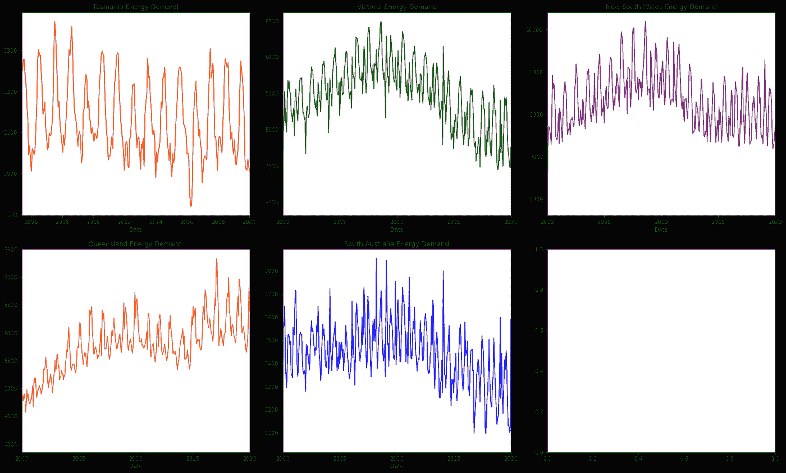
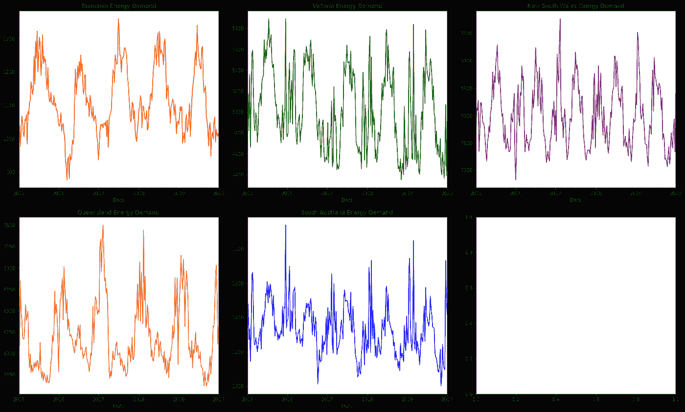
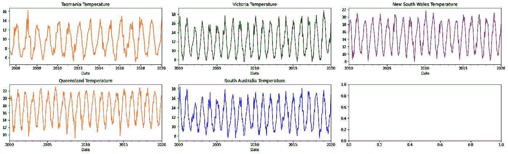
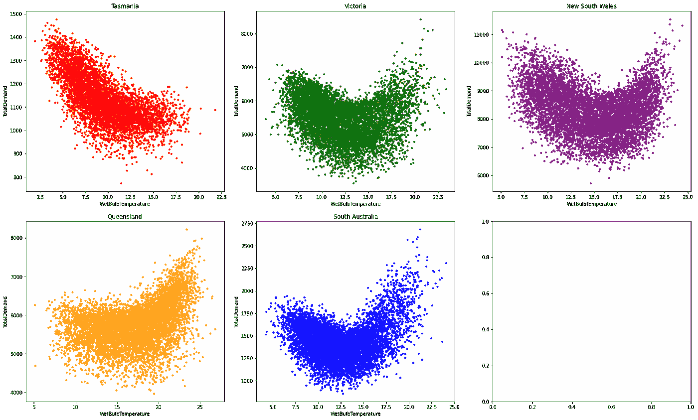
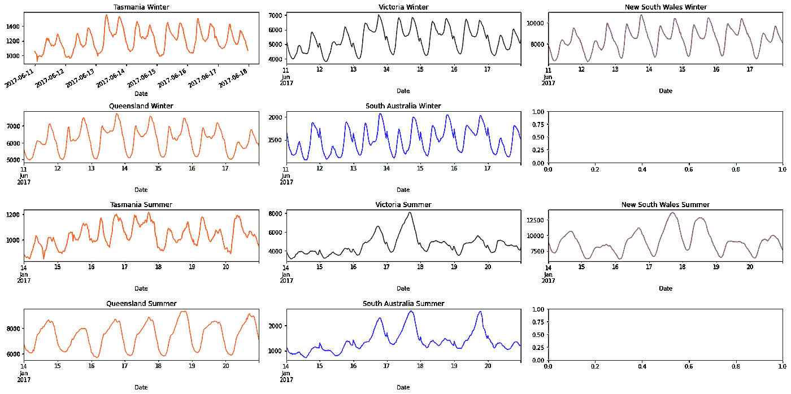
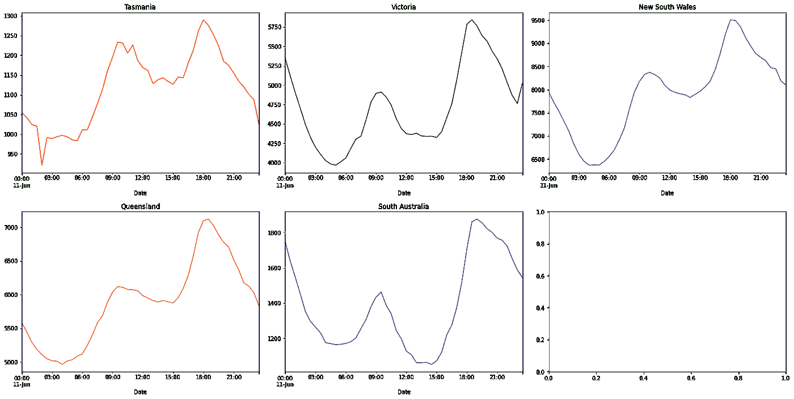

# 机器学习能源需求预测项目——第二部分使用图表讲故事

> 原文：<https://towardsdatascience.com/machine-learning-energy-demand-prediction-project-part-2-storytelling-using-graphs-9c62a7dfadd2?source=collection_archive---------54----------------------->

让我们看看我们的[机器学习](https://www.kamwithk.com/machine-learning-field-guide-ckbbqt0iv025u5ks1a7kgjckx)、[项目规划](https://www.kamwithk.com/insight-is-king-how-to-get-it-and-avoid-pitfalls-ckbjfohz201ujzqs1lwu5l7xd)和[基本编码工具](https://www.kamwithk.com/the-complete-coding-practitioners-handbook-ck9u1vmgv03kg7bs1e5zwit2z)如何在现实世界的项目中实现！今天，我们将讨论如何利用温度数据来预测我们每天消耗的能量。我们之前导入并清理了我们的数据，现在**将绘制并描述我们能源使用背后的故事**！。

这是三部曲的第二部([第一部在这里](https://www.kamwithk.com/machine-learning-energy-demand-prediction-project-part-1-data-cleaning-ckc5nni0j00edkss13rgm75h4))。请随意编码，完整的项目在 GitHub 上。

# 故事

我们早上醒来，打开加热器/空调，从冰箱里找到一些酸奶做早餐，刮胡子，打开电脑，打开音乐，最后开始工作。这些任务都有一个共同点——它们使用电力！我们对电力的严重依赖使得估算我们每天需要产生多少能量变得至关重要。

我们[已经找到、导入并清理了我们的数据](https://www.kamwithk.com/machine-learning-energy-demand-prediction-project-part-1-data-cleaning-ckc5nni0j00edkss13rgm75h4)(好员工)，所以我们可以继续讲述我们的用电情况。但是，如果这看起来很有挑战性，不要担心。我们会一步一步来。在每个阶段，链接回它与我们的 [ML 领域指南](https://www.kamwithk.com/machine-learning-field-guide-ckbbqt0iv025u5ks1a7kgjckx)的关系。


*斯科特·格雷厄姆摄于*[*Unsplash*](https://unsplash.com/photos/5fNmWej4tAA)

我们从[困难但必要的](https://www.kamwithk.com/insight-is-king-how-to-get-it-and-avoid-pitfalls-ckbjfohz201ujzqs1lwu5l7xd)任务开始，解释我们的数据。我们的第一个想法是一次绘制出整个时间序列，但该死的一个有 4 个特征的图，每个特征在 20 年内每 30 分钟有大约 5 次测量，这是不漂亮的，有意义的或快速的。在把头撞向砖墙一段时间后，我们当然意识到我们可以描绘出具体的特征和关系，而不是一次性描绘出一切*。由于损失不大，我们开始使用简单的汇总统计数据来查找最大值、最小值和平均值。这些给了我们每个专栏的大致概述，但是为了更进一步，我们来看看*我们的特征与*的相关性如何。*

*一旦我们理解了温度与能量需求高度相关(足够直观)，我们就可以开始绘制一些图表了😉！虽然我们不能一次描绘出所有的事情，但是我们仍然希望掌握全局——我们的数据是如何随时间变化的。我们首先确定我们的问题——当我们寻找 20 年来的变化时，每 30 分钟一次的运动实际上是没有意义的，只会模糊画面。幸运的是，我们的[字段指南](https://www.kamwithk.com/machine-learning-field-guide-ckbbqt0iv025u5ks1a7kgjckx#chapter-3-visualisation)解释说，我们可以通过*重采样*来绘制每周的平均值！现在我们知道了状态之间的一般增加和减少趋势。*

*在查看了能量和温度的单个数据后，我们继续寻找两者之间的关联。每个州的图表是不同的。趋势较大的州有更复杂的图形。这很复杂，我们没有数据来解释这些趋势，所以我们需要在以后删除它们。*

*现在我们只剩下一件事了——找出能源需求在一天和一周内是如何变化的。然后……很快，我们就成功地描述了每个令人振奋的日子、月份和年份的能源使用情况😎。此时，我们已经成功地完成了项目的大部分！在短暂的庆祝之后，我们可以开始建模了…但是不要操之过急，这将在下一个(最后的)教程中介绍。*

```
*import pandas as pd
import numpy as np
import seaborn as sns
import matplotlib.pyplot as plt

from IPython.core.interactiveshell import InteractiveShell

InteractiveShell.ast_node_interactivity = "all"
pd.options.display.max_columns = None

data = pd.read_pickle("../Data/Data.pickle")*
```

# *时代*

# *第 1 章—描述性统计*

*由于我们不能一次查看所有内容，所以我们希望对我们的数据有一个粗略的估计。自然的第一步是查看每一列的平均值、最小值和最大值。这些被称为描述性统计，Pandas 使用`describe`函数为我们计算它们。*

*因为我们想扩展这个来看看什么与能源需求相关(因为我们试图在以后预测它)，我们将找到*相关性*。为了找到特性之间的相关性，Pandas 提供了`corr`函数。*

*统计数据显示:*

*   *`TotalDemand`平均 4619MW，最小 22 mW，最大 14580 MW。*
*   *`WetBulbTemperature`最低气温为零下 9 摄氏度，最高气温为 41 摄氏度*
*   *`TotalDemand`与`WetBulbTemperature`最相关*

*尽管相关函数只考虑了线性关系(直线)，但它仍然有助于了解哪些要素值得绘制并包含在我们的模型中。这里主要是`WetBulbTemperature`，但`StationPressure`也可能有用。*

```
*data.describe()*
```

```
*data.corr()*
```

# *第 2 章——寻找长期趋势*

## *20 年的能源*

*我们想知道我们如何使用能源的故事。有一个简单的方法可以做到这一点——图表🤓。我们可以从大尺度上看发生了什么开始，然后慢慢放大。*

*我们将分别查看每个状态，因为它们的趋势可能不一样。*

```
*fig, axes  = plt.subplots(nrows=2, ncols=3, figsize=(20, 12), constrained_layout=True)

data.groupby("Region").resample("3W").mean()["TotalDemand"]["TAS"].plot(color="red", title="Tasmania Energy Demand", ax=axes[0,0])
data.groupby("Region").resample("3W").mean()["TotalDemand"]["VIC"].plot(color="green", title="Victoria Energy Demand", ax=axes[0,1])
data.groupby("Region").resample("3W").mean()["TotalDemand"]["NSW"].plot(color="purple", title="New South Wales Energy Demand", ax=axes[0,2])
data.groupby("Region").resample("3W").mean()["TotalDemand"]["QLD"].plot(color="orange", title="Queensland Energy Demand", ax=axes[1,0])
data.groupby("Region").resample("3W").mean()["TotalDemand"]["SA"].plot(color="blue", title="South Australia Energy Demand", ax=axes[1,1])*
```

**

*重新采样后，解释图表仍然很困难。所以让我们慢慢来，一步一步来。*

*第一个值得注意的模式是能量总是在高点和低点之间波动。高点和低点并不总是一样的。*

*   *塔斯马尼亚岛和南澳大利亚从大约 900 到 1400 不等*
*   *维多利亚从 4500 年到 6500 年*
*   *新南威尔士从 6000 到 10000*
*   *昆士兰从 4500 到 7500*

*但是我们可以说趋势并不是一成不变的。能源使用可能会快速增加(昆士兰州，直到 2010 年)，急剧下降(维多利亚州，2010 年后)，甚至持续稳定(塔斯马尼亚州)！这种模式显然不是有规律的，也不是直接由温度引起的(因此无法使用历史温度和能量数据进行预测)。*

*虽然我们没有这些趋势的数据，但我们可以给出一个有根据的猜测。我们知道人口不稳定，不同的州人口增长率不同。技术和能源效率也有了巨大的提高，经济状况影响着人们使用能源的意愿。除此之外，全球变暖促使越来越多的人安装太阳能电池板(太阳能电池板产生的电能没有被计算在内)。由于我们没有任何关于这些特征的数据，在开始建模之前，我们将尝试去除这些趋势。*

## *一年中的能量*

*现在让我们放大！我们将着眼于一年中发生的趋势。因为我们绘制的是 5 年而不是 20 年，我们当然*需要更少的重采样*。*

```
*fig, axes = plt.subplots(nrows=2, ncols=3, figsize=(20, 12), constrained_layout=True)

data.groupby("Region").resample("W").mean()["TotalDemand"]["TAS"]["2015":"2020"].plot(color="red", title="Tasmania Energy Demand", ax=axes[0,0])
data.groupby("Region").resample("W").mean()["TotalDemand"]["VIC"]["2015":"2020"].plot(color="green", title="Victoria Energy Demand", ax=axes[0,1])
data.groupby("Region").resample("W").mean()["TotalDemand"]["NSW"]["2015":"2020"].plot(color="purple", title="New South Wales Energy Demand", ax=axes[0,2])
data.groupby("Region").resample("W").mean()["TotalDemand"]["QLD"]["2015":"2020"].plot(color="orange", title="Queensland Energy Demand", ax=axes[1,0])
data.groupby("Region").resample("W").mean()["TotalDemand"]["SA"]["2015":"2020"].plot(color="blue", title="South Australia Energy Demand", ax=axes[1,1])*
```

**

*我们可以看出，能量需求通常在春季和秋季最低，而在冬季和/或夏季最高。塔斯马尼亚冬季的需求往往高于夏季。维多利亚州与此相似，但夏季的能源需求高峰更为频繁。另一方面，昆士兰州在夏季使用最多的能源。新南威尔士州和南澳大利亚州在夏天和冬天都有最大的能量！*

*塔斯马尼亚岛一直比较凉爽(作为一个小岛),不像炎热多汗的新南威尔士和南澳大利亚。这可以解释最大值/最小值出现的相对差异。*

## *超过 20 年的温度*

*不过，温度和能量一样重要。所以我们也来看看吧！*

```
*fig, axes = plt.subplots(nrows=2, ncols=3, figsize=(20, 6), constrained_layout=True)

data.groupby("Region").resample("3W").mean()["WetBulbTemperature"]["TAS"].plot(color= "red", title="Tasmania Temperature", ax=axes[0,0])
data.groupby("Region").resample("3W").mean()["WetBulbTemperature"]["VIC"].plot(color= "green", title="Victoria Temperature", ax=axes[0,1])
data.groupby("Region").resample("3W").mean()["WetBulbTemperature"]["NSW"].plot(color= "purple", title="New South Wales Temperature", ax=axes[0,2])
data.groupby("Region").resample("3W").mean()["WetBulbTemperature"]["QLD"].plot(color= "orange", title="Queensland Temperature", ax=axes[1,0])
data.groupby("Region").resample("3W").mean()["WetBulbTemperature"]["SA"].plot(color="blue", title="South Australia Temperature", ax=axes[1,1])*
```

**

*与能量图不同，温度图没有任何明显的趋势。然而，我们可以看到温度从最低 8 度左右到最高 22 度左右不等。虽然这张图没有显示各州之间温度的显著变化，但它们确实存在。塔斯马尼亚岛一直比较凉爽(作为一个小岛),不像炎热多汗的新南威尔士和南澳大利亚。*

## *温度和能量相关性*

*我们知道温度和能量高度相关，但我们还不知道如何相关。好吧，让我们来看看！*

```
*fig, axes = plt.subplots(nrows=2, ncols=3, figsize=(20, 12), constrained_layout=True)

data.groupby("Region").get_group("TAS").resample("D").mean().plot(kind="scatter",x="WetBulbTemperature", y="TotalDemand", s=10, color= "red", ax=axes[0,0], title="Tasmania")
data.groupby("Region").get_group("VIC").resample("D").mean().plot(kind="scatter",x="WetBulbTemperature", y="TotalDemand", s=10, color= "green", ax=axes[0,1], title="Victoria")
data.groupby("Region").get_group("NSW").resample("D").mean().plot(kind="scatter",x="WetBulbTemperature", y="TotalDemand", s=10, color= "purple", ax=axes[0,2], title="New South Wales")
data.groupby("Region").get_group("QLD").resample("D").mean().plot(kind="scatter",x="WetBulbTemperature", y="TotalDemand", s=10, color= "orange", ax=axes[1,0], title="Queensland")
data.groupby("Region").get_group("SA").resample("D").mean().plot(kind="scatter",x="WetBulbTemperature", y="TotalDemand", s=10, color= "blue", ax=axes[1,1], title="South Australia")*
```

**

*这些图表向我们展示了一件重要的事情，趋势越大，温度和能源需求之间的关系就变得越混乱(和复杂)。这就是为什么塔斯马尼亚岛的温度和能源需求曲线几乎是一条直线(尽管是一条粗线)，而其他地方是曲线。换句话说，趋势越大，曲线越宽越粗！*

*由于我们没有任何人口或经济数据，趋势必须被删除(在下一个教程中)。*

# *第 3 章——分析小时间框架*

*下图显示了冬季和夏季一天和一周内不同地区的能源需求对比。我们可以从一周(此处为 2017 年 11 月 6 日至 2017 年 6 月 17 日)开始，看看能源需求在一周内是如何波动的。我们*只测试了一个小时间段*，这是为了简洁(下面的相同模式也可以在其他地方看到)。*

```
*fig, axes = plt.subplots(nrows=4, ncols=3, figsize=(20, 10), tight_layout=True)

# Winter
data["2017-06-11":"2017-06-17"].groupby("Region").get_group("TAS")["TotalDemand"].plot(color="red", title="Tasmania Winter", ax=axes[0,0])
data["2017-06-11":"2017-06-17"].groupby("Region").get_group("VIC")["TotalDemand"].plot(color="green", title="Victoria Winter", ax=axes[0,1])
data["2017-06-11":"2017-06-17"].groupby("Region").get_group("NSW")["TotalDemand"].plot(color="purple", title="New South Wales Winter", ax=axes[0,2])
data["2017-06-11":"2017-06-17"].groupby("Region").get_group("QLD")["TotalDemand"].plot(color="orange", title="Queensland Winter", ax=axes[1,0])
data["2017-06-11":"2017-06-17"].groupby("Region").get_group("SA")["TotalDemand"].plot(color="blue", title="South Australia Winter", ax=axes[1,1])

# Summer
data["2017-1-14":"2017-1-20"].groupby("Region").get_group("TAS")["TotalDemand"].plot(color="red", title="Tasmania Summer", ax=axes[2,0])
data["2017-1-14":"2017-1-20"].groupby("Region").get_group("VIC")["TotalDemand"].plot(color="green", title="Victoria Summer", ax=axes[2,1])
data["2017-1-14":"2017-1-20"].groupby("Region").get_group("NSW")["TotalDemand"].plot(color="purple", title="New South Wales Summer", ax=axes[2,2])
data["2017-1-14":"2017-1-20"].groupby("Region").get_group("QLD")["TotalDemand"].plot(color="orange", title="Queensland Summer", ax=axes[3,0])
data["2017-1-14":"2017-1-20"].groupby("Region").get_group("SA")["TotalDemand"].plot(color="blue", title="South Australia Summer", ax=axes[3,1])*
```

**

*所有州每天的能源使用量都差不多。夏季和冬季有两个高峰。第一个较小，在白天(上午 5-9 点)，而第二个较大，在晚上(下午 4-7 点)。这些发生在人们在家最活跃的时候(工作前后)。虽然这里只能显示一些图表，但这些模式确实会持续存在(交换不同的日期会显示这一点)。*

*夏季一周内的能量需求与冬季相似，但需求在一周内增加得更多！*

*我们现在可以继续查看某一天(此处为 2017 年 11 月 6 日)。*

```
*fig, axes = plt.subplots(nrows=2, ncols=3, figsize=(20, 10), constrained_layout=True)

data["2017-06-11"].groupby("Region").get_group("TAS")["TotalDemand"].plot(title="Tasmania", ax=axes[0,0], color="red")
data["2017-06-11"].groupby("Region").get_group("VIC")["TotalDemand"].plot(title="Victoria", ax=axes[0,1], color="green")
data["2017-06-11"].groupby("Region").get_group("NSW")["TotalDemand"].plot(title="New South Wales", ax=axes[0,2], color="purple")
data["2017-06-11"].groupby("Region").get_group("QLD")["TotalDemand"].plot(title="Queensland", ax=axes[1,0], color="orange")
data["2017-06-11"].groupby("Region").get_group("SA")["TotalDemand"].plot(title="South Australia", ax=axes[1,1], color="blue")*
```

**

*从这些图表中，我们可以看到，从早上 6 点到 9 点，以及从下午 3 点到 6 点，能源使用量逐渐增加。在上午 12 点到下午 3 点，我们的能源使用保持稳定。它通常在一天开始和结束后下降(可能是在大多数人睡着的时候)。夏季和冬季的需求基本相似。*

**照片由斯科特·格雷厄姆在* [*上 Unsplash*](https://unsplash.com/photos/5fNmWej4tAA)*

**原载于*[*https://www.kamwithk.com*](https://www.kamwithk.com/machine-learning-energy-demand-prediction-project-part-2-storytelling-using-graphs-ckcecai0i006xbrs1hcase6f6)*。**