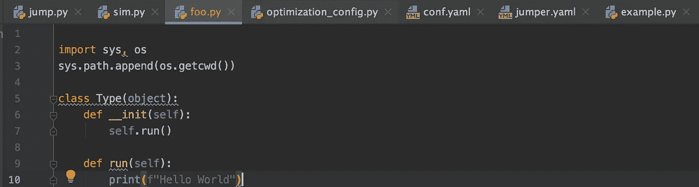
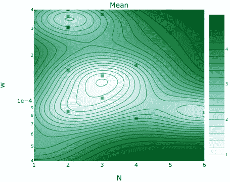
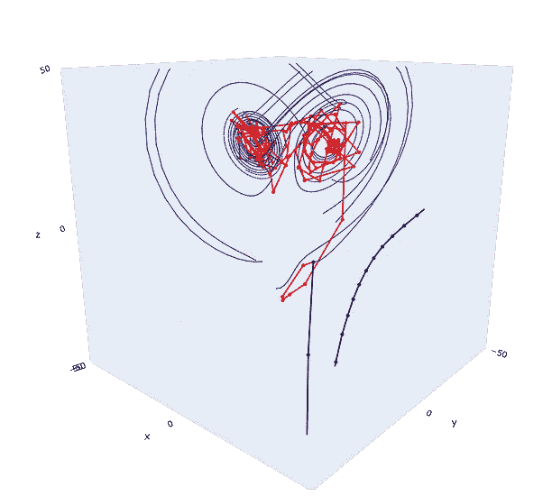
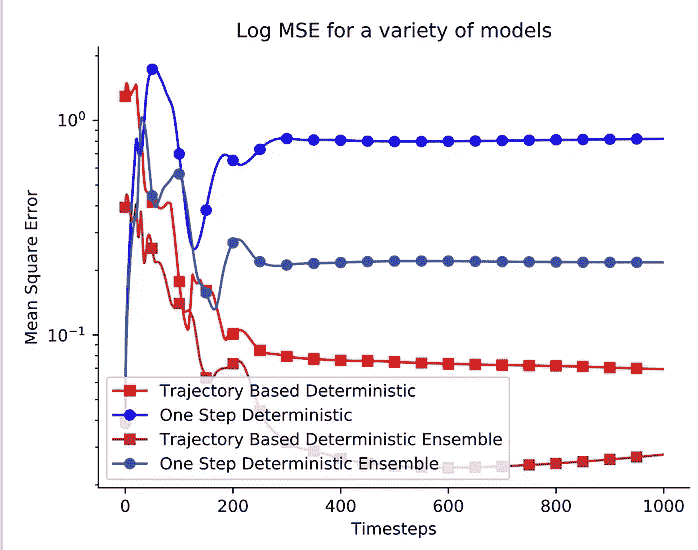

# 机器学习工程师对软件工程师

> 原文：<https://towardsdatascience.com/machine-learning-engineer-versus-software-engineer-fb59f8cba9dd?source=collection_archive---------7----------------------->

## 这两个角色有什么区别，他们是怎么想的？

截至 2018 年，软件工程已经发展到[在美国拥有超过 100 万](https://www.bls.gov/ooh/computer-and-information-technology/software-developers.htm) [员工](https://www.bls.gov/ooh/computer-and-information-technology/software-developers.htm)，并且预计增长不会放缓。接下来是机器学习工程师，他处理自动化或决策问题，并对其应用尖端工具。

> 机器学习是在不确定性下做出决策的研究:给定一个训练数据集，当我看到新的东西时，我应该如何行动。

照片由[希塔斯·贾达夫](https://www.pexels.com/@hitarth-jadhav-57415?utm_content=attributionCopyText&utm_medium=referral&utm_source=pexels)从[派克斯](https://www.pexels.com/photo/close-up-photo-of-keyboard-220357/?utm_content=attributionCopyText&utm_medium=referral&utm_source=pexels)拍摄。

随着机器学习(特别是[深度学习](/deep-learning-is-not-the-key-to-unlocking-the-singularity-913f960ac345))在整个行业的普及，越来越多的工程师在日常生活中部署这些工具。利用深度学习为公司带来巨大利润的工具实际上是无穷无尽的:搜索推荐、语音转文本、语音助手、面部识别、广告等等。

实现这些模型与构建大型分布式软件系统的角色有何不同？心态相似，但专攻不同。

加州海岸——作者。

## 软件工程—构建数据网络

数据流是任何大规模软件项目的关键。工程师必须选择在本地设备上部署的正确算法，用什么语言开发(以及编译成什么语言)，以及软件堆栈中有多少层。

软件工程师最终在语言、数据结构和算法领域工作。

*   **语言**:开发和测试语言是软件工程师的工作环境。他们对不同语言的能力有了深入的了解，并且权衡的尺度也很大。Python 是最受欢迎的，因为下游决策变得更加流畅(我同意 Python)。
*   **数据结构**:不同的数据结构决定了哪些计算机操作速度快——我们是想要快速访问数据(哈希表)吗？使用学习工具(张量)进行快速后处理？还是别的？不同的语言有不同的属性可以利用，最好的软件工程师对这些都像外语一样流利。
*   **算法**:标准*算法*是技术面试的基础——排序、搜索等等——因为它们在规模上确实很重要。“ [Big O](https://en.wikipedia.org/wiki/Big_O_notation) ”符号是一种古怪的学习工具，但是当在部署的系统上工作时，这种思想可以大规模地转化。

> 在这里，软件工程师可能会失败:爱上他们自己系统的复杂性。

热爱自己系统的复杂性，这样你就可以在其中创造更多的东西，并在别人试图使用它时炫耀指标，这是一个超级能干的工程师的失败。简单是王道，因为它可以扩展并支持公司范围的协作。

Python 开发者环境。

好的软件工程最终会让机器学习的任务变得更容易。数据将更加可用和统一，以便提炼为产品和**价值。**

## 机器学习工程——构建知识网络

学习工程师正在提取记录的知识(数据)并创建决策边界。决策边界通常是非线性的，并且通常难以解释(例如交易代理或机器人规划者)，但是它们是由数据通知的决策边界。

机器学习工程师在模型、部署和影响的空间中思考。

*   **模型**:我什么时候应该使用深度模型或者贝叶斯近似？对于机器学习工程师来说，知道哪些系统概括得更好，可以在设备上进行微调，并且可以解释是关键。此外，对模型的专业知识使 ML PhD 成为科技公司如此有价值的雇员。
*   **部署**:很多公司都在这个领域明确了自己的定位。设备级人工智能是消费电子公司(咳咳，苹果)目前的推动力，模型效率主导着数字巨人的成本。(脸书、谷歌等)。特斯拉凭借无与伦比的云汽车更新主宰着汽车自动化市场。接下来是单个工程师如何做出贡献— *针对特定任务的更多特定模型将在我们的生活中不断增加，模型的效率将改变互联网速度和电池寿命*。
*   **影响** : *伦理*。我正在部署的模型是否以牺牲另一个子群的利益为代价而使一个子群受益？这是 ML 工程师需要的，因为你选择和训练的数据集将反映在你的产品中。考虑一下，如果一个数据集是从 100 个前 alpha 用户的样本中收集的，当它触及数百万双不知情的眼睛时，将如何翻译？**数据透明度落后，个人需要承担责任。**

> 机器学习工程师的不足之处:将他们的贡献困在过多的层级和工具中。

当调查实现选项时，其他机器学习者希望能够以模块化的方式提取和镜像有用的代码，从而实现快速发展。我试图利用多个最先进的项目，这些项目*在内部陷入了太多的层次，以采取下一步措施，并使它们在现实世界中大规模产生影响*——这就是为什么简单是王道。

我博士期间训练的不同模型的集合。左)高斯过程拟合[物理优化](/design-optimization-with-ax-in-python-957b1fec776f)的设计变量，中)深度动力学模型预测[洛伦兹系统](https://en.wikipedia.org/wiki/Lorenz_system)(经典混沌系统)，右)不同类型的深度神经网络预测长期机器人轨迹。

# 主题——数码便宜，简单为王

这两个工程角色都利用了数字领域的迭代既便宜又快速的事实— **每个边缘用户都以低成本增加高价值**。这样，最简单的方法往往会占主导地位，因为它们可能非常普遍— **简单方法在学习中具有更好的通用性，在软件中具有更好的接口**。

> 就像最优秀的软件工程师一样，最优秀的机器学习工程师也会富有创造力和效率。

最优秀的工程学生不会在给他们的盒子里进行优化，他们会寻找会彻底改变游戏性质的漏洞。在软件工程中，这是使用新工具和数据结构的形式，在机器学习工程中，这将是调整新的模型类型或如何部署。我怀疑随着软件工程变得越来越自动化，机器学习工程师将推动最好的公司。

这篇文章的灵感来自于[人工智能播客](https://lexfridman.com/ai/)上的一段对话，莱克斯·弗里德曼主持了吴恩达，讨论了大规模在线开放课程的影响，计算机科学是如何教授的，以及大型科技公司如何主导市场。

更多？订阅我关于机器人、人工智能和社会的时事通讯！

 [## 自动化大众化

### 一个关于机器人和人工智能的博客，让它们对每个人都有益，以及即将到来的自动化浪潮…

robotic.substack.com](https://robotic.substack.com/)