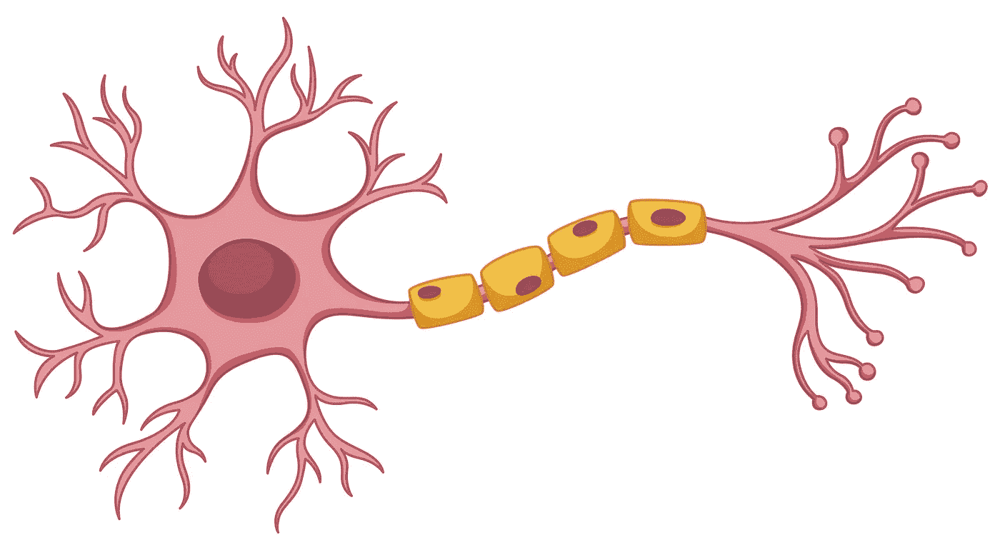
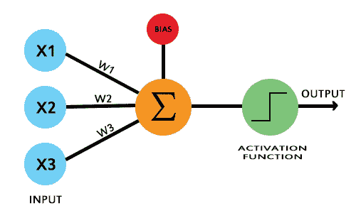
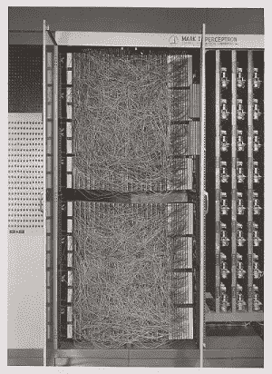
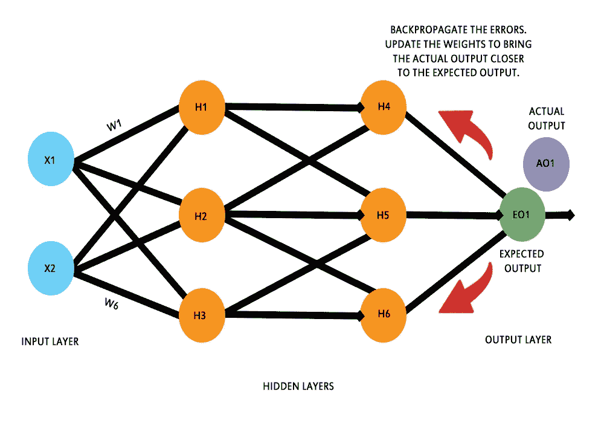
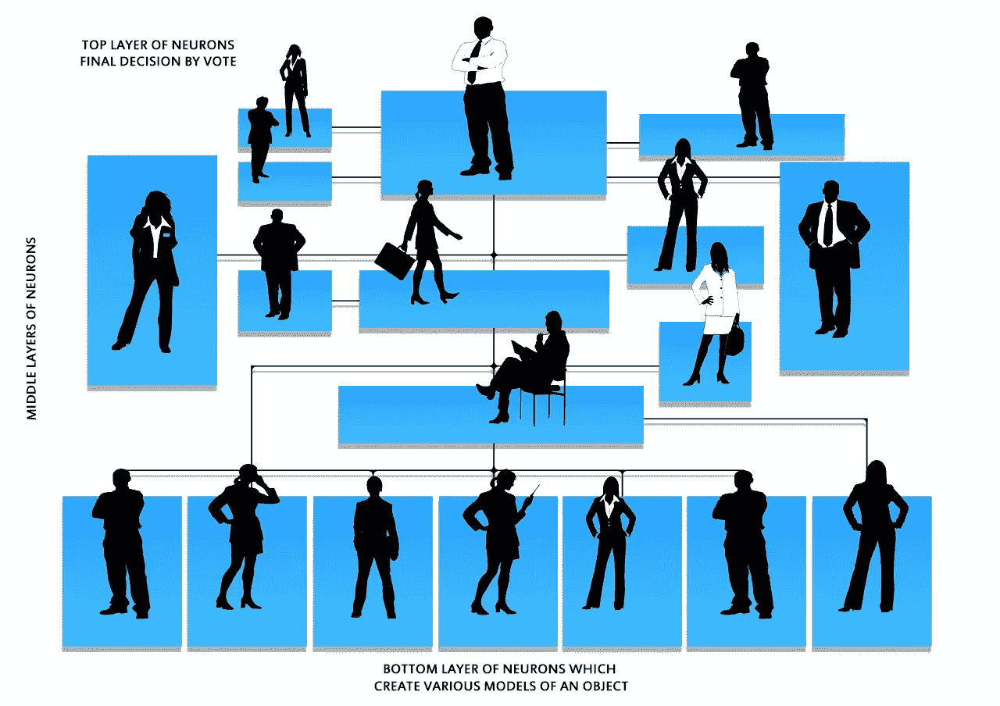

# 机器学习进化——感知机的故事

> 原文：<https://towardsdatascience.com/machine-learning-evolution-the-story-of-perceptron-b1de3f180ed6?source=collection_archive---------52----------------------->

## 这一切是如何开始到我们现在的位置

一个神经元细胞— [背景](https://www.freepik.com/vectors/background)向量由 brgfx 从 [freepik](http://www.freepik.com) 创建

A 人工智能(AI)是新的电。它已经成为镇上的话题。像机器学习(ML)和深度学习(DL)这样的花哨词汇现在是企业界提供的每个产品或解决方案的强制性部分，以激励他们的客户和最终用户。但在现实中，这些不再仅仅是花哨的术语。

在过去的几十年里，人工智能的众多应用已经出现，这些应用正在解决现实世界的问题，使其成为一种全球现象。吴恩达是成千上万像我一样有抱负的机器学习者的导师，他将人工智能称为新的电力，并说:

> 正如 100 年前电力几乎改变了一切一样，今天我实际上很难想到一个我认为人工智能在未来几年内不会改变的行业。

每一家主要的技术公司都已经适应了这场计算机革命，因为他们了解主要的技术趋势，不能冒被甩在后面的风险。ML 会在这里停留一段时间，如果你是一个寻求提升你的投资组合技能的开发者，我建议你开始学习。另外，报酬也更高。

人工智能已经颠覆了所有主要行业。今天，由于其在医疗保健、神经科学、农业、安全、监控等领域的跨领域应用，人工智能和人工智能已经成为我们生活中不可或缺的一部分。多年来，人工智能已经进化，现在它有能力帮助人类。但是这一切都是从大约五十年前感知器发明的时候开始的。

在我们继续我们大约有 65 年历史的感知机故事之前，让我们先非正式地定义一下感知机:

> 感知器是一种方便的生物神经元的人工模型。它是一种用于监督学习的单层神经网络算法。它由输入值、权重和偏差以及激活函数组成。

单个感知器单元—作者图片

我们不讨论技术细节，让我们继续我们的故事。

## 感知器的崛起

感知器是神经网络的基本构件，由 Frank Rosenblatt 于 1957 年 1 月在纽约布法罗的康奈尔航空实验室发明。这项发明是名为“感知机——一种感知和识别自动机”的研究成果

韦氏词典将自动机定义为:

> 一种机器或控制机构，设计成自动遵循预定的操作顺序或对编码指令作出反应。

这是为期五年的研究的一部分，旨在设计一种能够学习复杂模式、模式感知和归纳的电子大脑模型。这项研究背后的直觉是构建一种具有类似人类功能的设备，如感知、概念形成、从经验中归纳的能力、识别复杂的信息模式以及感知不同大小、形状和方向的类似对象。

然而，为了执行所有这些操作，传统的计算机系统将需要存储数千个(如果不是数百万个)图案，然后每当需要时，搜索这些过量的图案以识别看不见的图案，这在计算上非常昂贵，并且不是识别图案或物体的经济方式。

为了解决这个问题，Frank Rosenblatt 提出了一个系统，该系统可能会根据生物大脑的原理工作，并使用概率方法而不是确定性方法来识别模式之间的相似性。

他的感知机模型由三个主要部分组成:

*   感觉系统
*   联想系统
*   响应系统。

这三个主要系统中的每一个都将进一步包含相互连接的单元。可以根据正在识别的模式打开或关闭这些连接。感觉系统会接受输入模式。关联系统将打开或关闭特定的连接，并使用响应系统呈现输出。

感知器模型是通过构建名为 Mark 1 感知器的定制硬件来赋予生命的，它主要是为图像识别而设计的。它是一个黑匣子，很像当今的神经网络，有输入层、隐藏层和输出层。

Mark I Perceptron —康奈尔大学新闻服务记录，4–3–15 号。康奈尔大学图书馆珍本和手稿收藏部

## 反向传播到达现场

现在向前移动几十年，感知器的故事继续了 Geoffrey Hinton 在 1986 年提出的工作，当时他提出了一种新的学习程序，名为反向传播，后来成为现代神经网络模型的支柱。该技术通过调整神经网络模型的权重来最小化实际值和期望值之间的差异。它使神经网络学习或提取特征，并概括输入的模式或序列，以对看不见的数据表示做出相当准确的预测。

多层神经网络模型中的反向传播可视化—图片由作者提供

自那时以来，已经取得了许多进展。现在，我们已经有了 VGGNet、ResNet、Inception 等模型，可以快速准确地对对象进行分类。所有这些都是基于这样一个事实，即我们正试图模仿人脑。

但问题仍然存在，我们是否已经了解我们的大脑是如何识别我们日常生活中看到的物体的？随着每一天的过去，神经科学研究人员都在假设大脑理论，帮助我们理解我们的大脑如何学习、感知和记忆模式。

## 最先进的机器学习

杰夫·霍金斯提出了一个这样的理论，他称之为智力的千脑理论，它告诉我们大脑中被称为新皮层的部分是如何负责制作某个物体的各种模型，然后以分层的方式投票，以达成共识，告诉我们正在感觉、感知或看到什么。

该理论表明，当我们在现实生活中看到某个物体时，我们的新皮层中会有一组特定的神经元被激活。现在，如果我们面对一个不同大小和方向的相似物体，我们的新大脑皮层中会有一组相似的神经元被激活，这使我们能够概括我们在日常生活中看到的物体。事情没那么简单，但你可以大致了解一下。

这是一种不同于传统的 ML 或最先进的 DL 的方法，后者需要大量的输入表示来学习模式，然后进行预测。

可视化新大脑皮层中神经元的层次——图片由[格尔德·奥特曼](https://pixabay.com/users/geralt-9301/?utm_source=link-attribution&utm_medium=referral&utm_campaign=image&utm_content=81830)提供，来自[皮克斯巴伊](https://pixabay.com/?utm_source=link-attribution&utm_medium=referral&utm_campaign=image&utm_content=81830)，由作者编辑，灵感来自[努门塔·HTM](https://numenta.org/hierarchical-temporal-memory/)

杰夫·霍金斯创立了 Numenta，致力于将最先进的神经科学理论，如智能的千脑理论与人工智能相结合，以创造真正智能的机器，这些机器的工作原理与生物大脑相同。我们可能还有很长的路要走，但我们肯定正朝着正确的方向前进。我们已经取得了重大进展，而感知机是这一切的核心。

## 故事继续…

作为一名有抱负的数据科学研究人员，我觉得我们欠计算世界的早期思想家很多。从 1642 年[布莱士·帕斯卡](https://www.britannica.com/technology/Pascaline)发明第一台机械计算器开始。献给[阿达·洛芙莱斯](https://findingada.com/shop/a-passion-for-science-stories-of-discovery-and-invention/ada-lovelace-victorian-computing-visionary/)，他是第一个在 1842 年描述解决数学问题的一系列操作的人。艾伦·图灵，他在 1950 年创造了世界闻名的[图灵测试](https://www.britannica.com/technology/Turing-test)，以及历史上更多的人。

随着人工智能领域目前的进步，我们往往会忘记导致我们今天能够做的出色工作的卑微开端。对任何研究人员来说，研究直觉并使用有意识的推理来证明直觉的能力是最大的财富。所以，让你的直觉驱使你走向科学的伟大，成为这一进化的一部分。