# 机器学习实验跟踪

> 原文：<https://towardsdatascience.com/machine-learning-experiment-tracking-93b796e501b0?source=collection_archive---------6----------------------->

## **为什么实验跟踪对于进行真实世界的机器学习如此重要？**

乍一看，构建和部署机器学习模型看起来很像编写代码。但是有一些关键的差异使得机器学习更加困难:

1.  机器学习项目比典型的软件项目有更多的分支和实验。
2.  机器学习代码一般不会抛出错误，只是表现不佳，使得调试变得格外困难和耗时。
3.  训练数据、训练代码或超参数中的一个微小变化都会极大地改变模型的性能，因此重现早期的工作通常需要与之前的设置完全匹配。
4.  运行机器学习实验可能非常耗时，而且计算成本可能会变得非常昂贵。

有组织地跟踪实验有助于解决所有这些核心问题。weights and bias(wandb)是一个简单的工具，可以帮助个人跟踪他们的实验——我与不同规模团队的几位机器学习领导者谈论过他们如何使用 wandb 来跟踪他们的实验。

# **开始使用 wandb 进行实验跟踪**

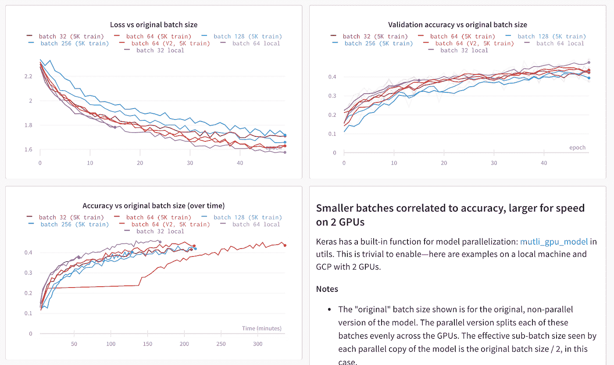

查看[现场仪表盘](https://app.wandb.ai/stacey/estuary/reports/Distributed-Training--Vmlldzo1MjEw)

ML 项目进展的基本单位是实验，所以大多数人以某种方式跟踪他们正在做的事情——通常我看到从业者从电子表格或文本文件开始跟踪他们正在做的事情。

电子表格和文档非常灵活——这种方法有什么问题？

这是几年前我在一个项目中使用的谷歌文档:

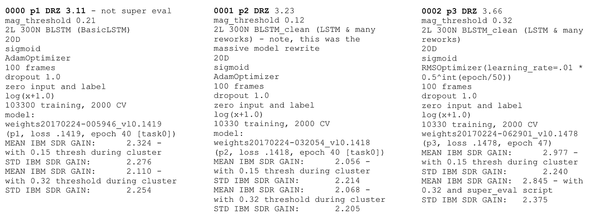

我确信这些笔记在当时很重要，但现在我不知道这些笔记是什么意思。

权重和偏差使得自动记录所有超参数(输入)和指标(输出)变得非常简单。

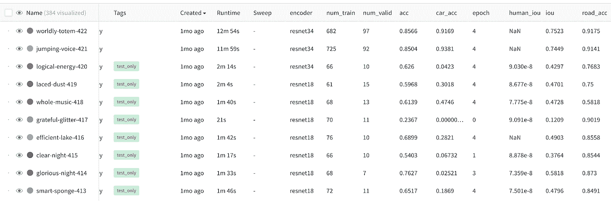

一个典型的项目在 [wandb](http://app.wandb.ai/l2k2/l2k) 。

这就是你如何在 pytorch 中[设置 wandb(你可以在](https://docs.wandb.com/library/frameworks/pytorch)[文档](https://docs.wandb.com/library/frameworks)中找到其他常见的 ML 框架)。

```
**import wandb****wandb.init(config=args)** # track hyperparameters
**wandb.watch(model)** # track model metricsmodel.train()
for batch_idx, (data, target) in enumerate(train_loader):
  output = model(data)
  loss = F.nll_loss(output, target)
  loss.backward()
  optimizer.step() **wandb.log({“loss”: loss})** # track a specific metric
```

一旦设置好，Weights and Biases 就会默认监控很多东西。任何命令行参数都成为保存的超参数。pytorch 提供的任何值都成为度量。实验可以自动链接到最新的 git 提交或训练代码的确切状态。被动地收集信息真的很重要，因为持续地写下你可能关心的所有事情几乎是不可能的。

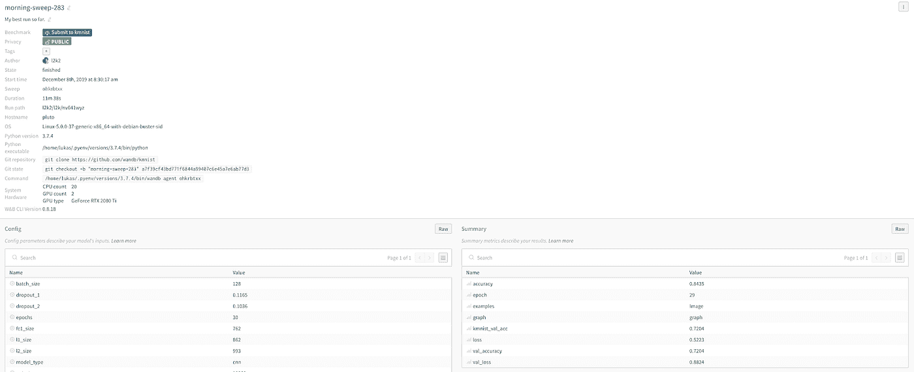

[实验概述](https://app.wandb.ai/l2k2/l2k/runs/nv641wyz/overview)权重&偏差

写下关于你稍后构建的模型的定性注释也是极其重要的。在 Weights and Biases 中，您可以创建报告来跟踪模型度量的注释，并与您的团队共享您的发现和进展。

**在后台收集系统指标**就是一个很好的例子。Wandb 在后台收集系统使用指标，如分配的 GPU 内存、网络流量和磁盘使用情况。大多数情况下，您不需要查看所有这些信息，但是在您不再使用大部分 GPU 内存的情况下进行更改是很容易的，并且很难跟踪您何时进行了更改。如果你[用 wandb 对你的训练代码](https://docs.wandb.com/quickstart)进行一次测试，你将能够回顾你所有的实验，并看到用法在哪里发生了变化。

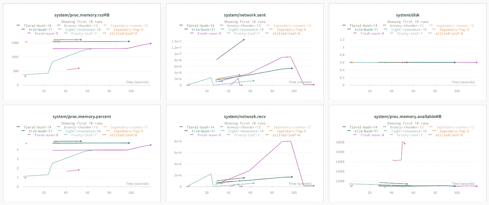

在[实时仪表盘](https://app.wandb.ai/l2k2/examples-prod_monitor)中查看

# **使用实验跟踪来比较不同实验的结果**

典型的 ML 工作流程包括运行大量实验。我们发现，在其他结果的背景下观察结果[比单独观察一个实验更有意义。](https://app.wandb.ai/sweep/simpsons)

同时查看大量实验很快就会变得混乱。有许多输入在变化，也有许多不同的可能输出。一些运行不可避免地会过早失败。

不同的实验风格导致不同的工作流程，但是我们发现记录下你可能关心的每一个指标，并用一些对你有意义的一致标签来标记实验，可以让事情在以后变得更有条理。

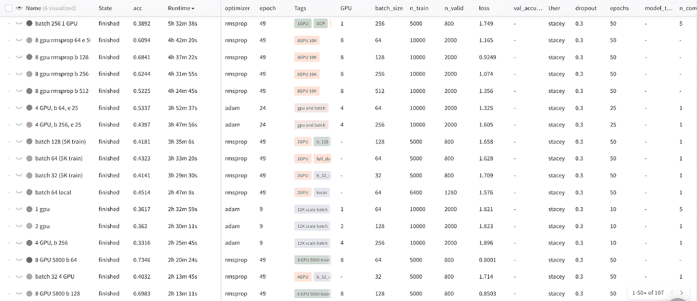

在[实时仪表盘](https://app.wandb.ai/stacey/estuary/table)中查看。

一旦你记录了大量的模型，你就有更多的维度需要检查，而不是一下子就能看到。我们发现的一个强大的可视化工具是平行坐标图。

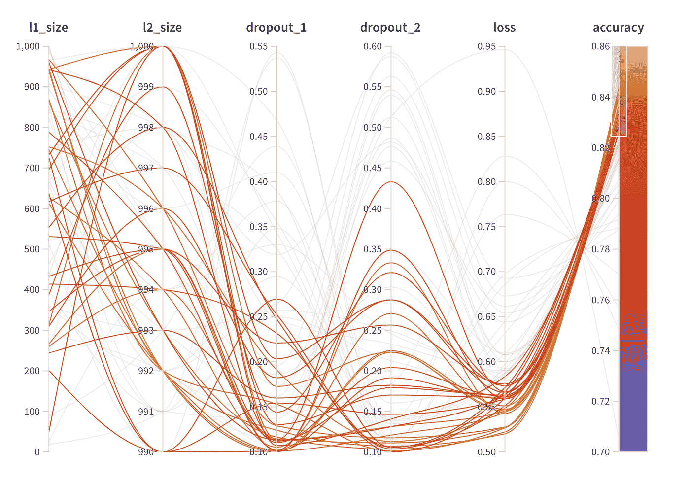

查看[实时仪表盘](https://app.wandb.ai/sweep/simpsons)

这里每行是一个单独的实验，每列是一个输入超参数或输出度量。我突出显示了最高精度运行，它非常清楚地表明，在我选择的所有实验中，高精度来自低压差值。

跨实验查看是如此重要，以至于 wandb 允许您构建工作空间，您可以在其中选择像散点图这样的可视化图形组，然后立即查看所选运行的比较

## **查看具体例子**

总的指标是好的，但是看具体的例子是必要的。函数 [wandb.log()](https://docs.wandb.com/library/log) 可以处理各种数据类型，并自动可视化。

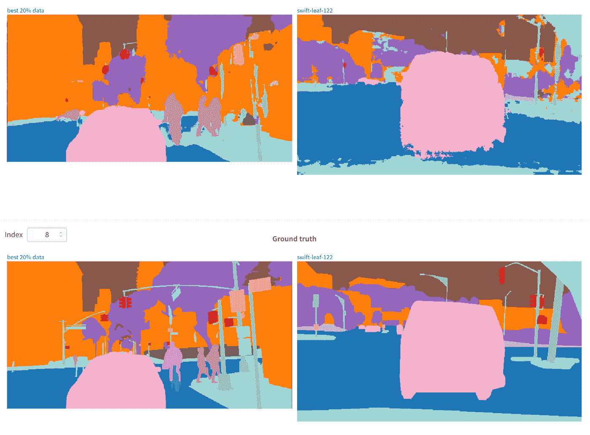

查看[现场报道](https://app.wandb.ai/stacey/deep-drive/reports/The-View-from-the-Driver's-Seat--Vmlldzo1MTg5NQ)

## **测井图像**

[记录图像](https://docs.wandb.com/library/log#logging-images)对于许多应用来说非常重要，可以在多次运行中查看图像。以下是构建 GAN 的不同方法以及不同规模和时间步长下的结果。

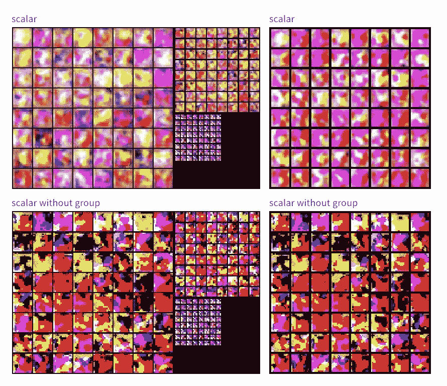

## **测井 Matplotlib 图**

通常代码已经在 matplotlib 中跟踪了一些东西——如果你[记录了图表](https://docs.wandb.com/library/log#logging-plots),它将被永久保存，并且很容易恢复。事实上，你可以为你的训练代码的每一步记录一个独特的图表。

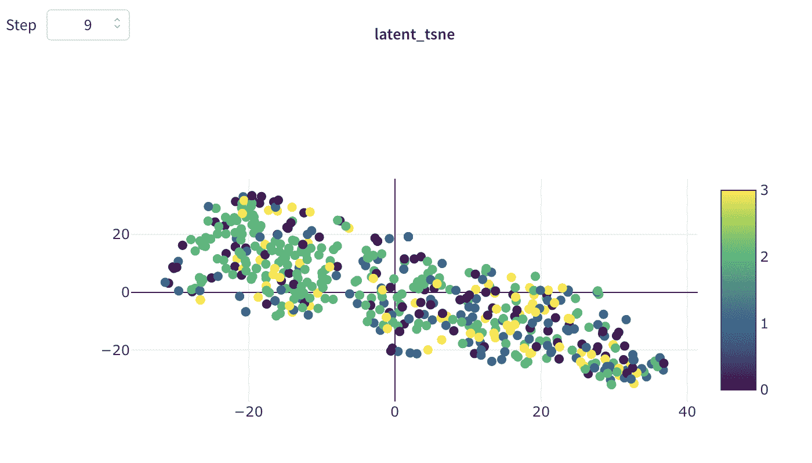

# **使用实验跟踪管理分布式培训**

当进行[分布式训练](https://app.wandb.ai/stacey/estuary/reports/Distributed-Training--Vmlldzo1MjEw)时，即使只是可视化结果也会变得更加困难。

在多台计算机上的分布式运行中，每个实例都可以调用 wandb init 并设置 group 和 job_type，如下所示:

```
wandb.init(group=”first-run”, job_type=”train”)
```

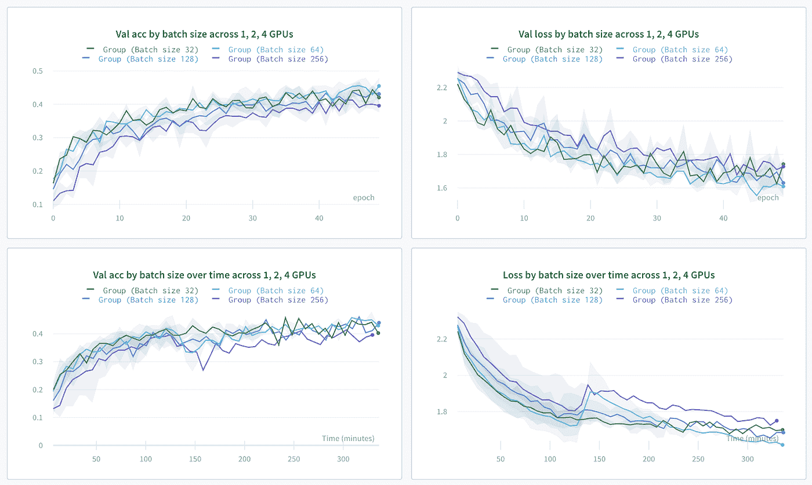

查看[实时仪表盘](https://app.wandb.ai/stacey/estuary/reports/Distributed-Training--Vmlldzo1MjEw)

Wandb 将显示集合在一起的组中所有运行的指标，但也可以查看单个流程，看看它们的表现如何。

# **使用实验跟踪报告管理团队协作**

随着团队的成长，跟踪一切变得越来越重要。Wandb 允许您构建[静态报告](https://app.wandb.ai/stacey/deep-drive/reports/The-View-from-the-Driver's-Seat--Vmlldzo1MTg5NQ),精确显示您使用聚合统计数据运行的实验，并具有深入挖掘的能力。

在 OpenAI 机器人团队中，wandb 报告是 ML 从业者记录他们所做工作并与同事分享的地方。当一个变化可能无意中损害了进展时，可视化是至关重要的。

在潜伏空间，每个团队项目会议都以审查最新的 wandb 实验报告开始，并围绕当前方法的效果以及下一步应该尝试什么实验进行讨论。

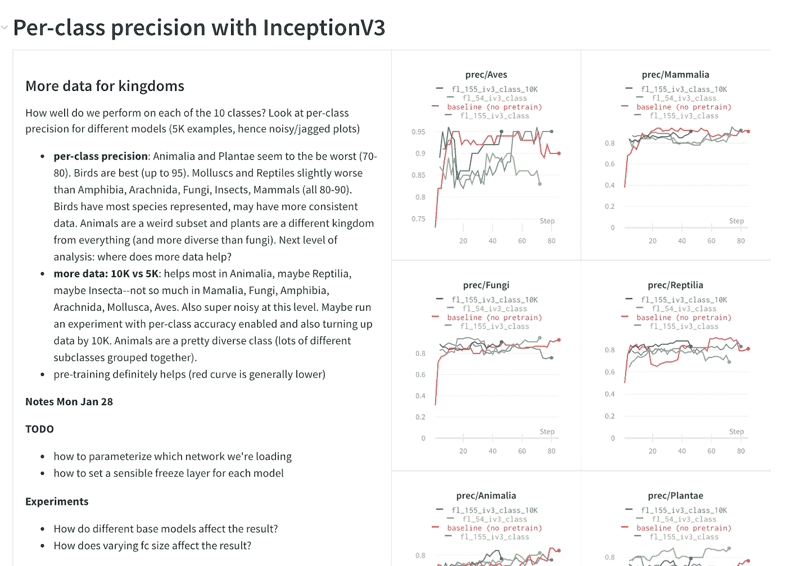

查看[现场报道](https://app.wandb.ai/stacey/curr_learn/reports/Layout%3A-Classify-Species--Vmlldzo0MDQ2NA)

# **使用实验跟踪作为模型的记录系统**

随着团队的成长和模型被部署到产品中，记录所发生的一切变得越来越重要。在丰田研究所，wandb 实验链接被用作每一款 ML 车型的官方记录。如果在模型构建的下游发生了一些事情，他们可以将问题追溯到 wandb 培训运行。从一组实验中构建一份报告意味着对所做的工作有一个永久的记录，团队可以很容易地回去回顾到底发生了什么。