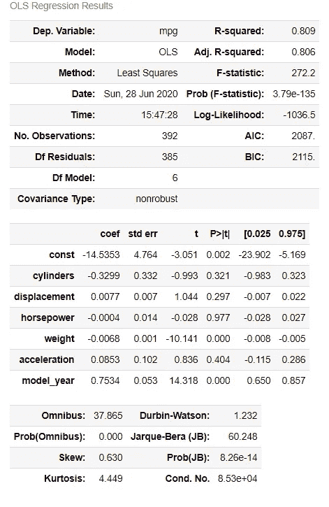
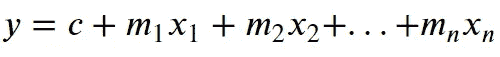
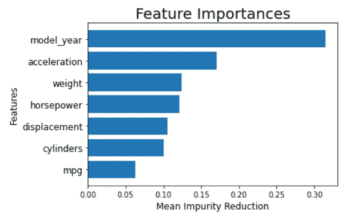
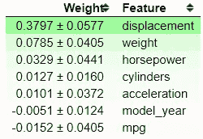
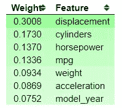
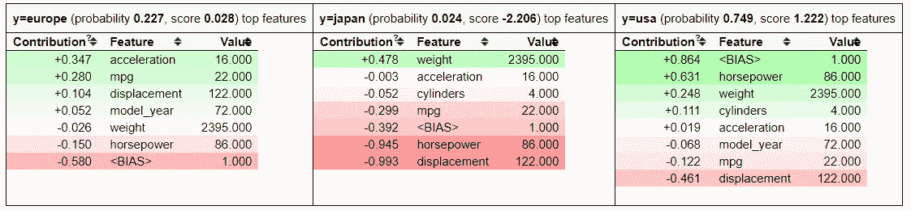

# 通过 eli5 的机器学习可解释性介绍

> 原文：<https://towardsdatascience.com/machine-learning-explainability-introduction-via-eli5-99c767f017e2?source=collection_archive---------38----------------------->

## 从您的机器学习模型中提取洞察力


照片由 [Unsplash](https://unsplash.com?utm_source=medium&utm_medium=referral) 上的 [h heyerlein](https://unsplash.com/@heyerlein?utm_source=medium&utm_medium=referral) 拍摄

# 介绍

根据我作为数据科学家的工作经验，大多数时候，你需要解释为什么你的模型有效，以及你的模型给出了什么样的洞察力。就洞察力而言，我指的不是模型准确性或任何指标，而是机器学习模型本身。这就是我们所说的机器学习的可解释性。

机器学习可解释性最直接的例子是带有[普通最小二乘](https://en.wikipedia.org/wiki/Ordinary_least_squares)估计方法的[线性回归模型](https://en.wikipedia.org/wiki/Linear_regression)。让我用一个数据集给你举个例子。请注意，我违反了一些普通的最小二乘假设，但我的观点不是创建最佳模型；我只是想有一个模型，可以提供一个洞察力。

```
#Importing the necessary package
import pandas as pd
import seaborn as sns
import statsmodels.api as sm
from statsmodels.api import OLS#Load the dataset and preparing the data
mpg = sns.load_dataset('mpg')
mpg.drop(['origin', 'name'], axis =1, inplace = True)
mpg.dropna(inplace = True)#Ordinary Least Square Linear Regression model Training
sm_lm = OLS(mpg['mpg'], sm.add_constant(mpg.drop('mpg', axis = 1)))
result = sm_lm.fit()result.summary()
```



我不会详细解释该模型，但线性模型假设在**自变量**(要预测的特征)和**因变量**(要预测的内容)之间存在**线性**。等式如下所示。



这里重要的是，每个自变量(x)都要乘以系数(m)。这意味着系数说明了自变量和因变量之间的关系。从上面的结果中，我们可以看到“model_year”变量的系数(coef)为 0.7534。这意味着‘model _ year’每增加 1，因变量‘mpg’值就会增加 0.7534。

线性回归模型及其系数是机器学习可解释性的一个例子。模型本身用于解释我们的数据发生了什么，并且洞察的提取是可能的。然而，并不是所有模型都能做到这一点。

# 黑盒模型的机器学习可解释性

## **基于树的特征重要性**

随机森林等机器学习模型通常被视为黑盒。为什么？一个森林由大量的深层树组成，其中每棵树都使用随机选择的特征对袋装数据进行训练。通过检查每一棵树来获得全面的理解几乎是不可能的。

例如，xgboost 包中著名的 XGBoost 分类器几乎是一个利用随机森林过程的黑盒模型。这个模型被认为是一个黑盒模型，因为我们不知道在模型学习过程中发生了什么。让我们以同一个数据集为例来尝试一下。

```
#Preparing the model and the datasetfrom xgboost import XGBClassifier
from sklearn.model_selection import train_test_split
mpg = sns.load_dataset('mpg')
mpg.drop('name', axis =1 , inplace = True)#Data splitting for xgboost
X_train, X_test, y_train, y_test = train_test_split(mpg.drop('origin', axis = 1), mpg['origin'], test_size = 0.2, random_state = 121)#Model Training
xgb_clf = XGBClassifier()
xgb_clf.fit(X_train, y_train)
```

就这样，我们有了模型，但是我们从数据中得到了什么启示吗？或者我们能知道依赖者和独立者之间的关系吗？。

你可能会说分类器拥有一个特征重要性方法，这是一个树模型，专门用来衡量特征的重要性。准确地说，它测量特征对模型的平均杂质减少的贡献。

```
tree_feature =  pd.Series(xgb_clf.feature_importances_, X_train.columns).sort_values(ascending = True)plt.barh(X_train.columns, tree_feature)
plt.xlabel('Mean Impurity Reduction', fontsize = 12)
plt.ylabel('Features', fontsize = 12)
plt.yticks(fontsize = 12)
plt.title('Feature Importances', fontsize = 20)
```



在一定程度上，这是一个机器学习可解释的例子。但是，您需要记住 xgboost 依赖于引导过程来创建模型。也就是说，这个特征的重要性可能会因为随机过程而发生。此外，该贡献仅表明该特征可以减少多高的总杂质(总的来说是所有产生的树的平均值)。

## 通过 eli5 的排列重要性

还有另一种方法可以从基于树的模型中获得洞察力，方法是逐个置换(改变位置)每个特征的值，并检查它如何改变模型性能。这就是我们所说的**排列重要性**方法。我们可以尝试使用 *eli5* 包将这种方法应用到我们的 xgboost 分类器中。首先，我们需要使用下面的代码来安装这个包。

```
#installing eli5pip install eli5
#or
conda install -c conda-forge eli5
```

安装后，我们将从现在开始使用 *eli5* 包进行机器学习解释。让我们从排列重要性开始。

```
#Importing the module
from eli5 import show_weights
from eli5.sklearn import PermutationImportance#Permutation Importance
perm = PermutationImportance(xgb_clf, scoring = 'accuracy' ,random_state=101).fit(X_test, y_test)
show_weights(perm, feature_names = list(X_test.columns))
```



排列重要性背后的思想是如何评分(准确度、精确度、召回率等。)shift 随特征存在与否，在上面的结果中我们可以看到，displacement 得分最高，为 0.3797。这意味着，当我们置换位移特征时，它将改变模型的精度高达 0.3797。正负符号后的值是不确定度值。排列重要性方法本质上是一个随机过程；这就是为什么我们有不确定值。

位置越高，这些特征对得分的影响越大。底部的一些特征显示了一个负值，这很有趣，因为这意味着当我们改变特征时，这个特征增加了得分。发生这种情况是因为偶然的特征排列实际上提高了分数。

通过测量杂质减少和排列重要性，我们已经知道了这两种方法。它们是有用的，但在某种意义上说，它们是粗糙的和静态的，很难理解个人对实际数据的决策。这就是为什么我们会使用基于[树决策路径](http://blog.datadive.net/interpreting-random-forests/)的 eli5 权重特征重要性计算。

## 通过 eli5 确定树特征的重要性

让我们使用 eli5 来检查 XGBoost 分类器特性的重要性。

```
show_weights(xgb_clf, importance_type = 'gain')
```



我们可以看到“位移”特征是最重要的特征，但我们还不明白我们是如何得到重量的。因此，让我们看看分类器如何尝试预测单个数据。

```
#Taking an example of test datafrom eli5 import show_prediction
show_prediction(xgb_clf, X_test.iloc[1], show_feature_values=True)
```



上表显示了我们的分类器如何根据给定的数据预测我们的数据。每个类别都有自己的概率，以及每个特征对概率和分数的贡献(分数计算基于[决策路径](http://blog.datadive.net/interpreting-random-forests/))。分类器还引入了`<BIAS>`特征，它是模型基于训练集的分布输出的期望平均得分。如果你想了解更多，你可以查看这里的。

上表中最重要的是每个特征都对预测结果有贡献，因此特征贡献影响权重结果。权重是所有树中对最终预测有贡献的每个特征的百分比(如果将权重相加，它将接近 1)。

有了这个软件包，我们不仅可以根据功能性能得分，还可以根据每个功能本身对决策过程的贡献来衡量功能的重要性。

# 结论

有了 eli5，我们能够将黑盒分类器转变为更易解释的模型。我们仍然有很多方法可以用于机器学习的解释目的，你可以在 [eli5](https://eli5.readthedocs.io/en/latest/index.html) 主页上查看。

# 如果您喜欢我的内容，并希望获得更多关于数据或数据科学家日常生活的深入知识，请考虑在此订阅我的[简讯。](https://cornellius.substack.com/welcome)

> 如果您没有订阅为中等会员，请考虑通过[我的推荐](https://cornelliusyudhawijaya.medium.com/membership)订阅。